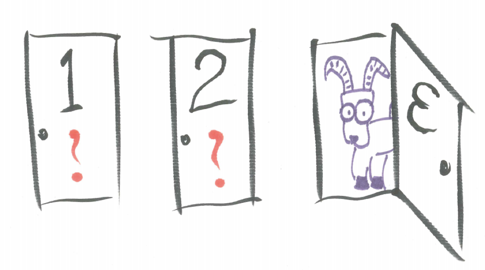

# Probability Basics {#basics}


```{r, message=FALSE, warning=FALSE, echo=FALSE}
library(mosaic)
set.seed(2018)
```

## Introduction {#introduction}

In this chapter, basic terminology and principles of probability are introduced. 

## Chapter Scenario - The Three-Spot Card Game {#chapter_scenario}

There are three cards – one with a blue dot on both sides, one with a red dot on both sides, and one with a blue dot on one side and a red dot on the other.  The cards are shuffled (both interspersed and randomly turned over) and you receive one of the three cards and it is placed face down on the table.  If the other side of the card has a different color dot, you win $\$1$ while if the other side of the card has the same color dot you lose $\$1$.  

```{r nice-fig-11, fig.cap='Three-Spot Card Game', out.width='30%', fig.asp=.75, fig.align='center', echo=FALSE}

```

Preconception: Does this game sound like a “fair” game, that is, one in which the payoffs and probabilities give neither you nor the “house” a systematic advantage? Explain.

## Terminology {#terminology}

Before getting back to resolve the Three-Spot Card Game question, let's develop some of the basic terminology of probability.

**Probability** is the measure of the likelihood of an event on a scale of 0 to 1 where a probability of 1 can be interpreted as certainty the event will occur and a probability of 0 interpreted as certainty the event will NOT occur. There are two main schools of thought regarding what probability is - the frequentist and the bayesian - but for our initial purposes we will think of the probability of an event as the relative frequency of its occurrence in the long run. In very informal shorthand, we think of probability as the ratio of successes to the total number of trials as shown below but must be careful to distinguish between exact theoretical probabilities and approximate empirical probabilities.

$$Probability = \frac{successes}{total}$$

A **probability experiment** is a process with a random element producing a well-defined outcome such as the tossing a die described above. 

Consider a die is tossed and we examine whether the outcome. We say it is a fair die if each of the six sides are equally likely.  In this case, the probability of the die landing on any particular side is $1/6$ which can also be approximated as $0.167$ or $16.7\%$ meaning that as the experiment is repeated the proportion of the time the die lands on that particular side ultimately approaches $1/6$. It does not mean that in any number of trials we will obtain that result exactly $1/6$ of the time as samples will vary. 

Running a simulation of tossing a die might be instructive here. The R code below performs 10,000 trials of tossing a die and recording the results in both a table and a histogram. At this point, focus on the output and don't worry so much about the R code.

```{r nice-tab-12, tidy=FALSE}
die <- sample(x=1:6, size=10000, replace = TRUE)
sim_die <- data.frame(die)
knitr::kable(
  table(sim_die), caption = 'Tossing One Die Simulation',
  booktabs = TRUE
)
```

Because samples vary, we do not get each face appearing exactly $1/6$ of the time but when we examine the data visually in a histogram we see how similar the outcomes are.

```{r nice-fig-13, fig.cap='Histogram for Tossing One Die', out.width='80%', fig.asp=.75, fig.align='center'}
ggplot(data=sim_die, aes(x=die)) + geom_histogram(aes(y=..density..), binwidth = 1)
```

An **event** is any well-defined outcome of the probability experiment, such as, the outcome of getting an even number when tossing a die.

We often use function notation when describing probabilities. For a well-defined event **A** in a probability experiment we will use **P(A)** to represent the probability event A occurs. We also informally use short descriptions of events combined with probability function notation as long as the context is clear. For example, when tossing a die it is understandable to indicate $P(1) = 1/6$. 

The **sample space** is a list of all possible outcomes of a probability experiment. One desirable property of a sample space description is that the simple events we use are **equally likely**, meaning all have the same probability of occurring. For example, with the experiment of tossing one die we can consider $\{1,2,3,4,5,6\}$ as the sample space.


## Simple Events {#simple_events}

To gain some experience using sample spaces to determine probabilities we look at some simple events.

For the experiment of tossing one die consider the following events:

* E: getting an even outcome
* S: getting a six
* L: getting a number less than three

By simply determining the ratio of successes to total members of the sample space $\{1,2,3,4,5,6\}$, the probability of event E is found to be $3/6$. In probability notation:

$$P(E) = 1/6$$

### Practice Exercise
For the experiment of tossing one die and the events defined above, what is the probability of event S occurring? What is the probability of event L occurring? Write using probability notation.

## The Complement {#the_complement}

We now consider compound events consisting of certain combinations of other events. We begin with the complement. The complement of an event E consists of all the outcomes that are NOT outcomes of E. We use the notation $\bar{E}$  or simply “not E” to represent the complement of E. (Note, this can be confusing because we also use the same symbol to represent the mean of a sample. Also, different textbooks use different notation for the complement including $E^c$.)

For example, when tossing one die the complement of obtaining an even number would be obtaining an odd number, the complement of obtaining a six would be obtaining anything other than a six. Be careful with inequalities. The complement of obtaining a die result less than three would be obtaining a die result greater than or equal to three.

### Practice Exercise
For the experiment of tossing one die and the events defined above, find the probabilities of the complements of events E, S, and L. In other words, find $P(not \ E)$, $P(not \ S)$, $P(not \ L)$.

### Practice Exercise
Observe the relationship between $P(E)$ and $P(not \ E)$ for different events above and formulate a principle. Write this formula verbally. 
<br/>
<br/>
We can describe the relationship between the probability of an event and its complement formally in **The Complement Principle** which will be a very important problem-solving tool.

$$For \ all \ events \ E, \ P(E) + P(not \ E) = 1$$.

An alternative version reads $P(E) = 1 - P(not \ E)$.

## Compound Events: And {#compound_events_and}

When we talk about the compound event $E \ and \ F$ we mean the event where both events E and F occur at the same time. As an example, if we were considering the sample space of students in class and we were interested in the event “Male and Sophomore” only individuals who are male sophomores would qualify. Again, different texts use different notation so don’t be surprised to see on different occasions $E \ and \ F$ as well as $E \ \& \ F$ or even $E∩F$ and sometimes $E \wedge F$.  We just can’t seem to agree on one symbol. 

### Practice Exercise
For the experiment of tossing one die and the events defined above, find the probability of $E \ and \ S$, $E \ and \ L$, as well as $S \ and \ L$.
<br/>
<br/>
When two events cannot occur at the same time we say they are **mutually exclusive** or, equivalently, **disjoint**. For example, the event of selecting a Sophomore student and a Junior student are mutually exclusive events.

### Practice Exercise
For the experiment of tossing one die and the events E, S, and L defined above, which pairs of events are mutually exclusive? 
<br/>
<br/>
Here is the precise definition of mutually exclusive events:

### Definition: Mutually Exclusive
Events E and F are mutually exclusive if and only if $P(E \ and \ F) =0$.

## Compound Events: Or {#compound_events_or}

We now consider the compound event $E \ or \ F$ meaning that either event E occurred or event F occurred or both occurred. We call this an inclusive or. As an example, if we were considering the sample space of students in class and we were interested in the event of selecting a “Male or Sophomore” then this includes all individuals who are male, who are sophomore, or who are both male and sophomore. 

### Practice Problem
For the experiment of tossing one die and the events defined above, find the probability of the event $E \ or \ S$, $E \ or \ L$, as well as $S \ or \ L$.

### Practice Problem
Suppose someone notices that $P(S \ or \ L) = P(S) + P(L)$. Discuss this interesting fact by determining exactly when, in general, it will be true.

## Compound Events: Conditional Probability {#compound_events_conditional_probability}

We consider one more way of “connecting” simple events to form a compound event. The conditional event $X|Y$ means the event X given we know event Y occurred and we pronounce it $X  \ given \ Y$. As an example, if we were considering the sample space of students in class and we were interested in the event $Male \ | \ Sophomore$ we would mean given Sophomores only, what is the probability of being Male. Note, this is different from $Sophomore \ | \ Male$ which is the probability you are Sophomore given you are Male. 

Tossing one die with the events as described above, $P(L \ | \ E)$ represents the probability of L given we know E occurred, that is, the probability of a number less than three given we know the number is even. Knowing it is even narrows down the sample space to three options and only one of those is less than three, thus, $P(L \ | \ E) = 1/3$.

### Practice Problem
Find the following probabilities: $P(E \ | \ L), \ P(E \ | \ S), \ P(S \ | \ E), \ P(S \ | \ L), \ and \ P(L \ | \ S)$.
<br/>
<br/>
Note that, in general, for events E and F, $P(E \ | \ F)$ means something very different from $P(F \ | \ E)$ and, consequently, the probabilities are different. 

In some cases, $P(E \ | \ F)$ is the same as $P(E)$. In this case, knowledge that F occurred did not change the probability of E occurring and we say these two events are **independent**. Here is the formal definition.


### Definition: Independent
Events E and F are independent if and only if $P(E \ | \ F) = P(E)$.
<br/>
<br/>
Note, that if $P(E \ | \ F) = P(E)$ it is also true that $P(F \ | \ E) = P(F)$.

### Practice Problem
For the experiment of tossing one die with the events E, S, and L as defined above, which pairs of events are independent? Explain.


## The Three-Spot Card Game Revisited {#three_spot_card_game_revisited}

We consider game described in the chapter scenario. There are three cards – one with a blue dot on both sides, one with a red dot on both sides, and one with a blue dot on one side and a red dot on the other.  The cards are shuffled (both interspersed and randomly turned over) and you receive one of the three cards and it is placed face down on the table.  If the other side of the card has a different color dot, you win $1 while if the other side of the card has the same color dot you lose $1.

Here is one common faulty analysis of this situation: Once you see the color of the dot that is showing this narrows down the possibilities to two - one, the card with the same color on the other side, and, two, the card with the other color on the other side - thus, mistakenly, we believe there is a 50/50 chance the other side has the same color. 

There is a subtle error in the above thinking. While we are correct in seeing there are only two possible cards we are incorrect in thinking they are equally likely. It turns out, we are more likely to have been shown the card with same color on both sides. Thus, the error is we selected a sample space in which the outcomes are not equally likely. 

In order to make sure we obtain a sample space with equally likely outcomes we might create an artificial distinction so we can tell similar events apart. Suppose we mark the two sides of the blue card as B1 and B2, the two sides of the red card as R1 and R2, and the two sides of the other card as B3 and R3. Then the sample space of which side we have been shown is $\{B1, B2, R1, R2, B3, R3\}$ and each of these are equally likely. 

Out of these six elements of the sample space, in four of the cases is the other side of the card the same color - B1, B2, R1, R2 - and in only two cases - B3, R3 - is the other side the opposite color. Thus, the probability the other card is the same color is $4/6$ and the probability the other card is a different color is $2/6$. Unfortunately, this means we are more likely to lose $\$1$ than to win $\$1$ and the game is not fair.

## Exercises {#exercises}

### Exercise - The Monty Hall Problem
You are shown three doors.  Behind one is a car, behind the other two are goats.  You are to choose one door.  Hopefully you get the car.  To spice it up, Let’s Make a Deal host, Monty Hall, who knows exactly what is behind each door, reveals a donkey behind one of the doors that you have not chosen.  Now, there remain two doors – the one you chose, and the other unopened door.  Monty asks you if you want to switch doors.  Should you?

```{r nice-fig-14, fig.cap='Monty Hall Problem', out.width='30%', fig.asp=.75, fig.align='center', echo=FALSE}

```

### Exercise - Twelve-sided Die
Consider the different probability experiment of tossing one 12-sided Dungeons and Dragons dice. Describe the sample space and identify several events and find the probabilities of these simple events as well as at least one complement, one AND, one OR, and one conditional probability. Use probability function notation where appropriate.

```{r nice-fig-15, fig.cap='Twelve-sided Die', out.width='30%', fig.asp=.75, fig.align='center', echo=FALSE}

```
