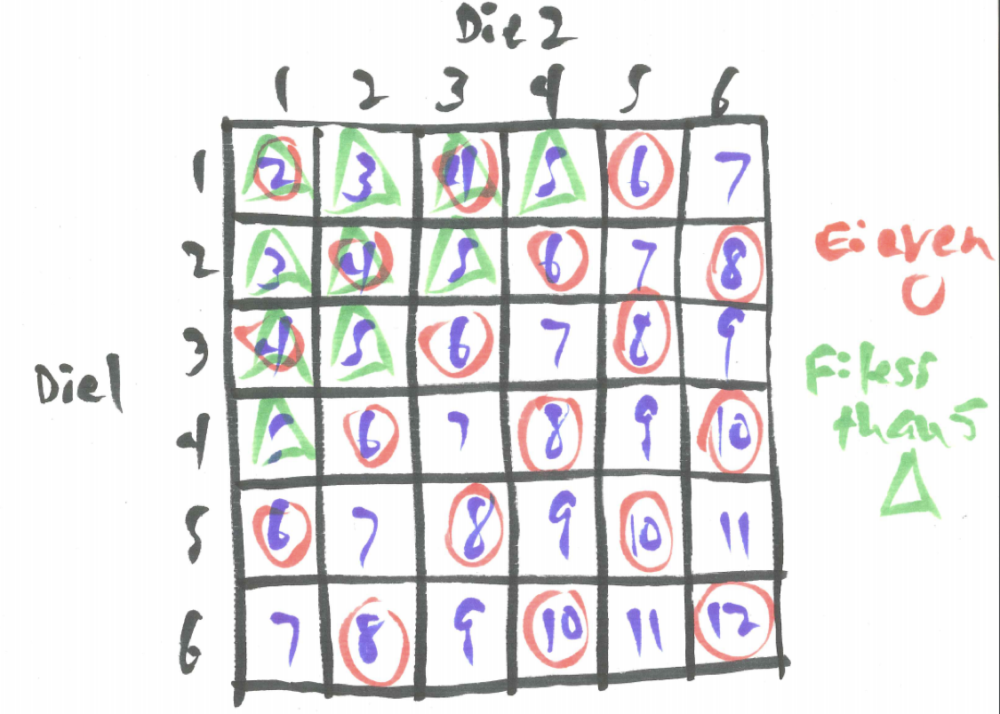
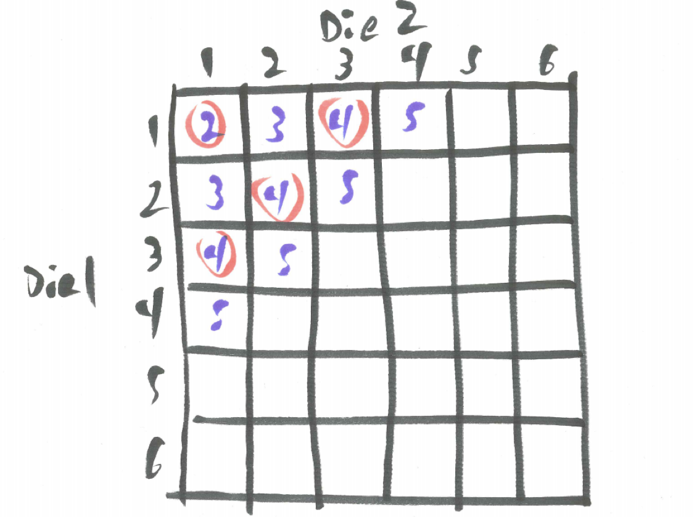
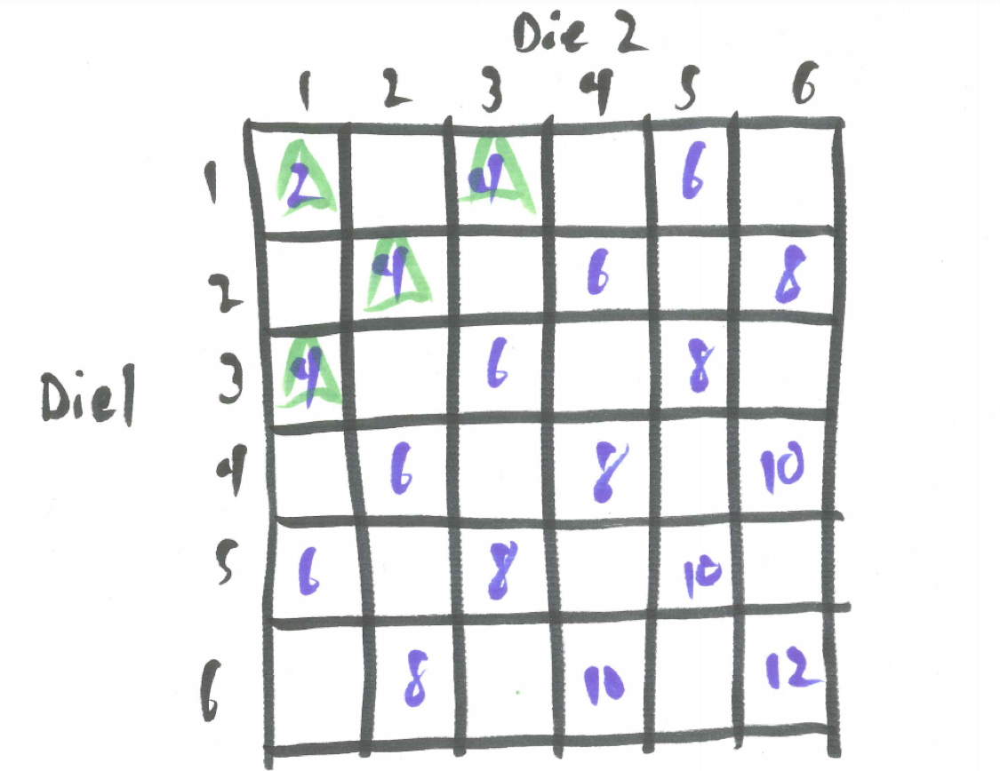

# Multiple Events {#multiple_events}


```{r, message=FALSE, warning=FALSE, echo=FALSE}
library(mosaic)
set.seed(2018)
```


## Introduction {#introduction_multiple_events}

After being introduced to the basic terminology of probability we want to see how it works with more complex situations and here we tackle dealing with multiple events and using the Fundamental Counting Principle.

## Chapter Scenario - Galileo's Dice Problem {#chapter_scenario_galileo_dice_problem}

In Galileo’s day, this clear understanding of probability was still being developed. While Galileo is well-known for his work on inventing the telescope and pointing it for the first time at the moon, his experimental approach to understanding the physics of motion dropping objects from the Tower of Pisa, and, most famously, his advocation of the Copernican planetary model and his subsequent condemnation by church authority, Galileo was also exploring the fundamental notions of chance.

The king approached Galileo for help with a mathematical problem. There was a gambling game involving tossing three dice. According to conventional reasoning a sum of nine should occur with the same frequency as a sum of ten because there were an equal number of ways to obtain each. There were six dice combinations to obtain a sum of 9 - 1+2+6, 1+3+5, 1+4+4, 2+2+5, 2+3+4, and 3+3+3. Similarly, there were six dice combinations to obtain a sum of 10 - 1+3+6, 1+4+5, 2+2+6, 2+3+5, 2+4+4, and 3+3+4.

However, it had been observed that a sum of ten occurred more frequently than a sum of nine. While not thrilled to divert his attention to solving the king’s problems, Galileo nevertheless looked into the issue and thereby advanced the theory of probability. Can you walk in Galileo's footsteps and discover why the theory of the time and the real-world experience did not agree?


## Example - Pair of Dice

After working with the toss of one die in the previous chapter, we examine the outcomes when tossing two dice to explore how to handle multiple events. 

Earlier you examined the experiment of tossing one die. The sample space for this experiment is the set of equally likely outcomes S={1,2,3,4,5,6} and the probability of different simple and compound events can be found using this sample space. 

When examining two dice, one might naively consider all the different outcomes one could get when summing the dice and proceed with a possible sample space of  S = {2,3,4,5,6,7,8,9,10,11,12}. You might suspect this is not a useful sample space based on experience. It seems like getting a sum of 2 or 12 is unusual but getting a sum of 7 occurs more frequently. 

The simulation below generates 10,000 tosses of two dice and their sum and helps us see that these sums are not equally likely and thus not a great sample space to work with.

```{r nice-tab-21, tidy=FALSE}
die1 <- sample(x=1:6, size=10000, replace = TRUE)
die2 <- sample(x=1:6, size=10000, replace = TRUE)
sum <- die1 + die2
sim_two_dice <- data.frame(die1, die2, sum)
knitr::kable(
  table(sum), caption = 'Tossing Two Dice Simulation',
  booktabs = TRUE
)
```


```{r nice-fig-22, fig.cap='Histogram for Tossing Two Dice', out.width='80%', fig.asp=.75, fig.align='center'}
ggplot(data=sim_two_dice, aes(x=sum)) + geom_histogram(aes(y=..density..), binwidth = 1)
```


It is often helpful to clarify a probability experiment and its sample space by making an artificial distinction. Pretend the dice are different colors, say, the first die white and the second die black. This allows us to distinguish between the individual outcomes on each die. Given that the six different outcomes on each side are equally likely, the resulting $6 \cdot 6 = 36$ outcomes illustrated in the table below provides a sample space of equally likely outcomes from which to find the probability of events you are interested in.

Since there are 6 ways to roll the first white die and 6 ways to roll the second black die there are $6 \cdot 6 = 36$ ways to roll both dice. This insight uses the Fundamental Counting Principle described below:

## Fundamental Counting Principle{#fundamental_counting_principle}
Consider a multi-step process requiring k steps. If Step1 can be done $n_{1}$ ways, Step2 done $n_{2} ways, and so on up to Step k being done $n_{k} ways, then the total number of ways the entire process can be done $n_{1} \cdot n_{2} \cdot ... \cdot n_{k}$ ways.

Furthermore, since all outcomes on each individual die are equally likely these 36 possibilities represent equally likely outcomes for the experiment of tossing two dice. We can use this sample space to answer some questions.

```{r nice-fig-23, fig.cap='Sample Space for Two Dice', out.width='30%', fig.asp=.75, fig.align='center', echo=FALSE}
knitr::include_graphics("01-basics-figures/two_dice_sample_space.png")
```

For example, there is only one combination of dice that yields a sum of 2 (that is 1+1) and there is only one combination of dice that yields a sum of 3 (that is 1+2) but a sum of 3 is twice as likely because when we distinguish the dice we see 1+2 and 2+1 as distinct options and we get $P(sum=2)=1/36$ while $P(sum=3)=2/36$. 

Let's try another one: which is more likely, a sum of 6 or a sum of 7? From the sample space we see five ways to obtain a 6 and six ways to obtain a 7 indicating a sum of 7 is more likely. Stated as probabilities, $P(sum=6)=5/36$ and $P(sum=7)=6/36$.

### Practice
Which is more likely when tossing two dice, a sum of 3 or a sum of 11? Explain.

Simply by counting successes in the sample space we find the probability of compound events. 

Let's define a few events for this experiment of tossing two dice and find the probabilities of related compound events.

E: The sum is even.
F: The sum is less than or equal to 5.

It is helpful to identify members of the sample space satisfying each event. 

```{r nice-fig-24, fig.cap='Sample Space for Two Dice with Events E and F', out.width='30%', fig.asp=.75, fig.align='center', echo=FALSE}

```

We see $P(E)=18/36=1/2=0.5$ and also note $P(not \ E)=18/36=1/2=0.5$.
From the sample space, $P(F)=10/36$ and $P(not \ F)=26/36$.

Looking at compound events, recall that **AND** refers to the overlap where both events are true so $P(E \ and \ F)=4/36$. 

We think of **OR** as an inclusive or representing the event one or the other or both occur. Counting unique elements of the sample space that are either an even sum or a sum less than or equal to five we see $P(E \ or \ F)=24/36$.

Conditional probability is trickier. $P(E \mid F)$ means the probability that the sum is even given we know the sum is less than or equal to five. To handle this, we assume the sum is less than or equal to five and this narrows down our sample space to 10 possibilities of which 4 have an even sum yielding $P(E \mid F)=4/10$. 

```{r nice-fig-25, fig.cap='Sample Space for Two Dice Given F', out.width='30%', fig.asp=.75, fig.align='center', echo=FALSE}

```

It means something quite different to consider $P(F \mid E)$, the probability the sum is less than or equal to five given it is even. Out of the 18 even sums, we find 4 of them are less than or equal to five yielding $P(F \mid E)=4/18$.

```{r nice-fig-26, fig.cap='Sample Space for Two Dice Given E', out.width='30%', fig.asp=.75, fig.align='center', echo=FALSE}

```

It is important to note we found all of the probabilities above by focusing on the meaning of the events rather than some fancy formula.

### Practice
For the experiment of tossing two dice with the event D being the sum is odd and the event T being at least one of the dice is a three find P(D), P(T), P(not D), P(not T), P(D and T), P(D or T), P(D|T), and P(T|D).

## Revisiting the Chapter Scenario - Galileo's Dice Problem {#revisiting_chapter_scenario_galileo_dice_problem}

Recall, three dice are tossed. Conventional reasoning indicated a sum of 9 and a sum of 10 should be equally likely as there are six different dice combinations for each but actual experience indicated the sum of 10 was more likely. To see how Galileo solved this problem we need to absorb the lesson of pretending we can tell the dice apart.

First of all, since there are 6 equally likely outcomes on each die, there are $6 \cdot 6 \cdot 6=216$ total equally likely outcomes in the sample space.

Let's examine the different combinations of 9 and 10 in the light of distinguishable dice where order matters.

Sum of Nine

* Combo 1+2+6 - Orderings 1+2+6, 1+6+2, 2+1+6, 2+6+1, 6+1+2, 6+2+1
* Combo 1+3+5 - Orderings 1+3+5, 1+5+3, 3+1+5, 3+5+1, 5+1+3, 5+3+1
* Combo 1+4+4 - Orderings 1+4+4, 4+1+4, 4+4+1
* Combo 2+2+5 - Orderings 2+2+5, 2+5+2, 5+2+2
* Combo 2+3+4 - Orderings 2+3+4, 2+4+3, 3+2+4, 3+4+2, 4+2+3, 4+3+2
* Combo 3+3+3 - Orderings 3+3+3

Sum of Ten

* Combo 1+3+6 - Orderings 1+3+6, 1+6+3, 3+1+6, 3+6+1, 6+1+3, 6+3+1
* Combo 1+4+5 - Orderings 1+4+5, 1+5+4, 4+1+5, 4+5+1, 5+1+4, 5+4+1
* Combo 2+2+6 - Orderings 2+2+6, 2+6+2, 6+2+2
* Combo 2+3+5 - Orderings 2+3+5, 2+5+3, 3+2+5, 3+5+2, 5+2+3, 5+3+2
* Combo 2+4+4 - Orderings 2+4+4, 4+2+4, 4+4+2
* Combo 3+3+4 - Orderings 3+3+4, 3+4+3, 4+3+3

Tallying the orderings we see there are 25 orderings yielding a sum of 9 and 27 yielding a sum of 10 thus $P(sum=9)=25/216$ while $P(sum=10)=27/216$ and this confirms the real-world experience that a sum of 10 is actually more likely than a sum of 9.

A simulation might confirm this.

```{r nice-tab-27, tidy=FALSE}
die1 <- sample(x=1:6, size=10000, replace = TRUE)
die2 <- sample(x=1:6, size=10000, replace = TRUE)
die3 <- sample(x=1:6, size=10000, replace = TRUE)
sum3 <- die1 + die2 + die3
sim_three_dice <- data.frame(die1, die2, die3, sum3)
knitr::kable(
  table(sum3), caption = 'Tossing Three Dice Simulation',
  booktabs = TRUE
)
```


```{r nice-fig-28, fig.cap='Histogram for Tossing Three Dice', out.width='80%', fig.asp=.75, fig.align='center'}
ggplot(data=sim_three_dice, aes(x=sum3)) + geom_histogram(aes(y=..density..), binwidth = 1)
```


