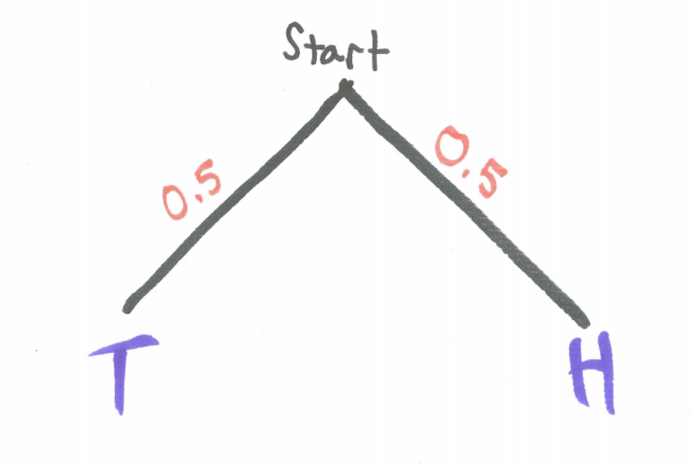
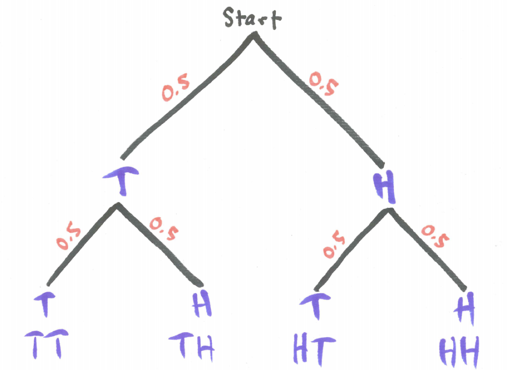
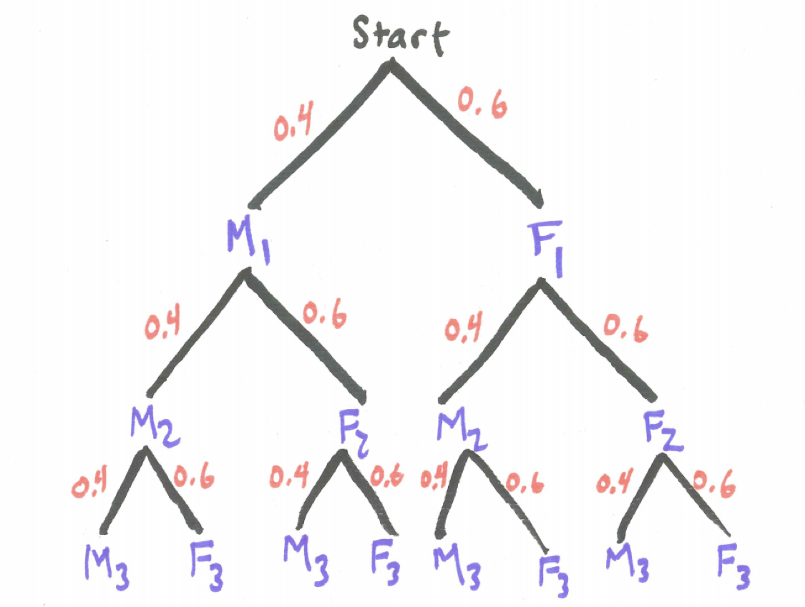
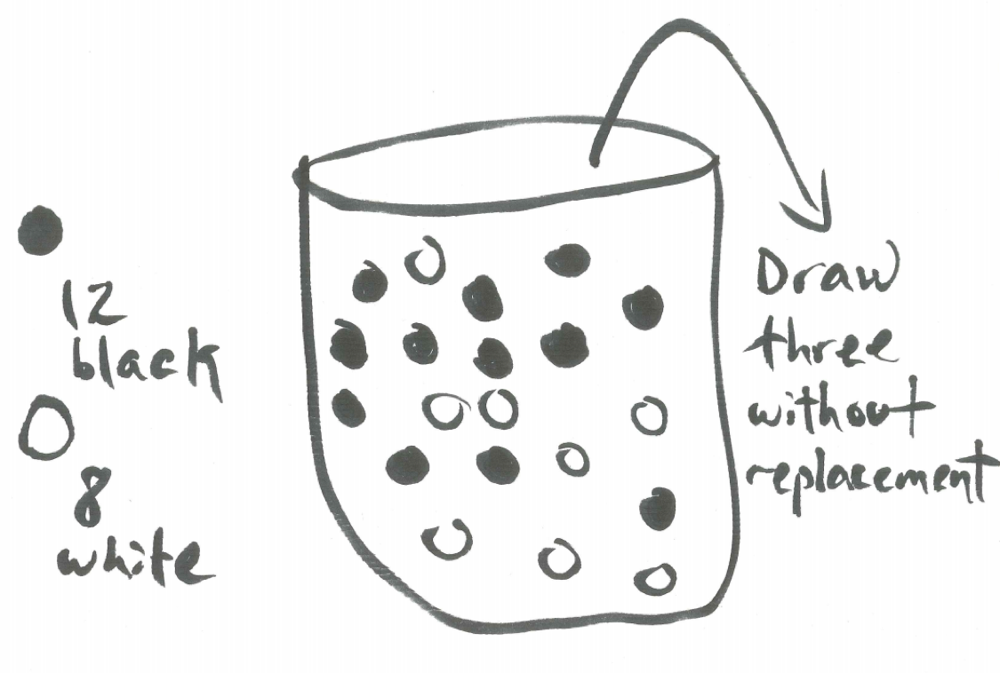
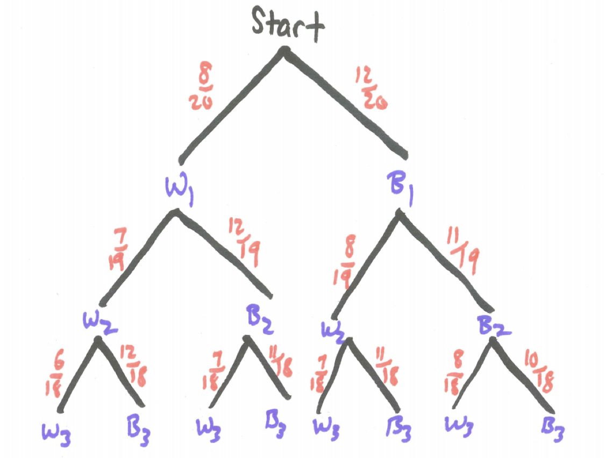

# Tree Diagrams {#trees}

```{r, message=FALSE, warning=FALSE, echo=FALSE}
library(mosaic)
set.seed(2018)
```

## Introduction {#introduction}

In this chapter,  tree diagrams are introduced as important tools to analyze probability questions. 

## Chapter Scenario - Flipping Two Coins {#chapter_scenario}

Imagine a simple situation where two coins are tossed and the number of heads is observed and the outcome has some relevance for you depending on whether the result yields 0, 1, or 2 heads. Do you think each of these outcomes is equally likely? What do you think is the probability of each of these outcomes?

We use this coin-flipping scenario as a primary example not because we have inherent interest flipping coins but because this scenario is an effective model for many real-world situations such as gene inheritance. 

## Terminology Review {#terminology_review}

We have described **probability** as the measure of the likelihood of an event on a scale of 0 to 1 with 0 meaning certain failure and 1 meaning certain success. 

$$Probability = \frac{successes}{total}$$

Consider a coin is flipped and we examine whether it lands on heads or tails. We say it is a fair coin if heads and tails are equally likely.  In this case, the probability of the coin landing on heads is $1/2$ which can also be expressed as $0.5$ or $50\%$ meaning that as the experiment is repeated the proportion of heads ultimately approaches $0.50$. Of course, sample vary so in any given number of trials the result may not be exact. 

The probability experiment of flipping a coin twice and counting the number of heads leads to three possible outcomes - 0 heads, 1 head, or 2 heads but this might not be a useful sample space because these three outcomes may not be equally likely. To explore this, we could gather data by performing the experiment many times and recording the outcome but in this case a simulation might be faster and provide a larger sample much more quickly. Besides, you may not have a coin in your pocket.

## Simulation {#simulation}

Simulation is often a helpful tool to explore probability questions like the question above regarding whether getting 0, 1, or 2 heads when flipping two coins are all equally likely. The code below simulates 10,000 trials of two coin flips keeping track of the number of heads, number of tails, and proportion of heads for each trial.

```{r nice-tab, tidy=FALSE}
sim_2 <- do(10000)*rflip(n=2, prob=1/2)
knitr::kable(
  head(sim_2), caption = 'Table 1: Two Coin Simulation',
  booktabs = TRUE
)
```

The result is visualized in a histogram of the `heads` variable showing the frequency of obtaining 0, 1, and 2 heads.

```{r nice-fig-21, fig.cap='Histogram for Number of Heads When Flipping Two Coins', out.width='80%', fig.asp=.75, fig.align='center'}
ggplot(data=sim_2, aes(x=heads)) + geom_histogram(aes(y=..density..), binwidth = 1)
```

Examining the histogram we see that obtaining one head is more likely than the other two options and, thus, getting 0, 1, and 2 heads when flipping two coins are not equally likely outcomes. Prompted by the results of the simulation, we want to know why getting one head is more likely and tree diagrams will help us.

## Tree Diagrams {#tree_diagrams}

The outcomes of a probability experiment can be catalogued with a tree diagram where at each node the different branches represent the different possible outcomes at each stage of the process. 

Consider the tree diagram for flipping a single coin where we label each node as either H for Heads or T for tails and label the probability along each branch.

```{r nice-fig-22, fig.cap='Tree Diagram for One Coin', out.width='30%', fig.asp=.75, fig.align='center', echo=FALSE}

```

Including the possible outcomes for a second coin results in a tree diagram with four branches. 

```{r nice-fig-23, fig.cap='Tree Diagram for Two Coins', out.width='60%', fig.asp=.75, fig.align='center', echo=FALSE}

```

Each path from the top of the tree to the bottom represents one possible outcome when tossing two coins. In this experiment, there is a 50/50 chance of getting heads or tails thus all four paths are equally likely each occurring with probability $0.5 \times 0.5 = 0.25$. If we think of the probability associated with each branch as the proportion of the time we travel down that branch then multiplying these probabilities makes perfect sense to determine the probability of traveling down sequential branches.

We can now understand why getting one head is more likely as there are two paths, HT and TH, compared to only one path generating zero heads, TT, and only one path generating two heads, HH, resulting in the following probabilities:

$$P(0\ heads) = P(TT) = (0.5)(0.5) = 0.25$$
$$\small P(1\ head) = P(TH\ or\ HT) = P(TH) + P(HT) = (0.5)(0.5) + (0.5)(0.5) = 0.25 + 0.25 = 0.5$$

$$P(2\ heads) = P(HH) = (0.5)(0.5) = 0.25$$

## An Example with Rats {#an_example_with_rats}

Now consider the experiment of choosing three rats at random from a large population of rats that is 40% male and 60% female. Just as we did for coins, we can draw a tree diagram with branches representing the sex of the first, second, and third rat chosen and label the associated probabilities on each branch. Selecting the rats and identifying gender would be equivalent to having a coin that lands on one side 40% of the time and on the other 60% of the time. In the tree diagram below, we have added subscripts to identify whether we are referring to the first, second, or third rat selected.

```{r nice-fig-24, fig.cap='Tree Diagram for Three Rats', out.width='60%', fig.asp=.75, fig.align='center', echo=FALSE}

```

What is the probability of selecting 0 female rats? Note that because the population is large at each stage of the process the probability of selecting a female rat remains for all practical purposes 0.60.

$$P(0\ female\ rats) = P(M_{1}\ and\ M_{2}\ and\ M_{3}) = (0.4) \times (0.4) \times (0.4) = 0.064$$

What is the probability of selecting 1 female rat? There are actually three distinct paths through the tree where 1 female rat and 2 male rats are selected and each one has the probability $(0.6) \times (0.4)^2$ thus the probability is 

$$P(1\ female\ rat) = 3 \times (0.6) (0.4)^2 = 0.288$$

### Practice Exercise
For the probability experiment described above, choosing three rats at random from a large population of rats that is 40% male and 60% female, what is the probability of getting 2 female rats? 3 female rats?


## The Urn Model {#the_urn_model}

When confronted with a question of personal importance to you where probabilistic concerns are relevant to getting an accurate answer, the ability to develop a model that captures important probability details is a key problem-solving tool. By **model** we mean a systematic description that shares all of the important characterics of the problem, be it a physical, visual, mathematical, or computational representation (http://www.dictionary.com/browse/model). 

For probability experiments two useful models are the coin-flipping model and the urn model. We have already looked briefly at a coin-flipping experiment. We will see throughout our probabilistic treatment of genetics that we will often use coin-flipping as a mental model to think about questions of genetic risk and reward. The urn model is another important way to think about probability questions. 

Consider an urn with some beads in it. Imagine the urn has 20 beads 12 of which are black and 8 white and we are to draw out three of these beads at random and we want to find the probability of ending up with 0, 1, 2, or 3 black beads. 

```{r nice-fig-25, fig.cap='The Urn Model', out.width='60%', fig.asp=.75, fig.align='center', echo=FALSE}

```

First, we need to be clear up one question: is the drawing out of beads to be done with replacement or without replacement? By **with replacement** we mean that after each draw of one bead, it is replaced, the beads thoroughly mixed, before another bead is selected at random. By **without replacement** we mean that after one bead is removed, it is not replaced before the next bead is selected. Note, if we are selecting three beads at once this could be viewed as equivalent to selecting the beads one at a time without replacement. 

```{r nice-fig-26, fig.cap='Tree Diagram for Three Beads', out.width='60%', fig.asp=.75, fig.align='center', echo=FALSE}

```

For this experiment with three beads drawn at random without replacement from an urn containing 12 black and 8 white beads, what is the probability of ending up with 0, 1, 2, or 3 black beads, respectively?

First, let's tackle the probability of getting 0 black beads. From examining the tree we see 

$$P(0\ blacks) = P(W_{1}\ and\ W_{2}\ and\ W_{3}) = \frac{8}{20} \times \frac{7}{19} \times \frac{6}{18}$$

Finding the probability of one black is more work. As we examine the tree we see there are three distinct paths resulting in one black. Check out their separate probabilities here.

$$P(B_{1}\ and\ W_{2}\ and\ W_{3}) = \frac{12}{20} \times \frac{8}{19} \times \frac{7}{18} = 0.098$$

$$P(W_{1}\ and\ B_{2}\ and\ W_{3}) = \frac{8}{20} \times \frac{12}{19} \times \frac{7}{18} = 0.098$$

$$P(W_{1}\ and\ W_{2}\ and\ B_{3}) = \frac{8}{20} \times \frac{7}{19} \times \frac{12}{18} = 0.098$$

In spite of the numerators being in different orders, we notice that these three separate probabilities are numerically equal. Thus, for the final probability we see

$$P(1\ black) = 3 \times \frac{12}{20} \times \frac{8}{19} \times \frac{7}{18} = 0.295$$

### Practice Exercise
For the urn described above containing 12 black and 8 white beads with three beads drawn at random without replacement, what is the probability of obtaining two black beads? What is the probability of obtaining three black beads?

## Exercises {#exercises}

### Exercise - Three Coins in the Fountain
A penny, a nickel, and a dime are all flipped at the same time. Draw an appropriate tree diagram with associated probabilities labeled on each branch and find the probabilities of the following events: obtaining no heads, obtaining exactly one head, exactly two heads, and exactly three heads.

### Exercise - More Coins
Draw a tree diagram for the probability experiment of flipping four coins. Label each node as either H for Heads or T for tails and label the probability along each branch. Find the probability of obtaining no heads and the probability of obtaining at least one head and describe the relationship between these two probabilities.

### Exercise - Class Committee
Consider the experiment of selecting a committee of three individuals from a class of 20 of which 8 are male and 12 are female. Draw a tree diagram with associated probabilities for the gender of the first, second, and third person chosen for the committee and find the probabilities the committee consists of 0 females, 1 female, 2 females, and 3 females, respectively.
