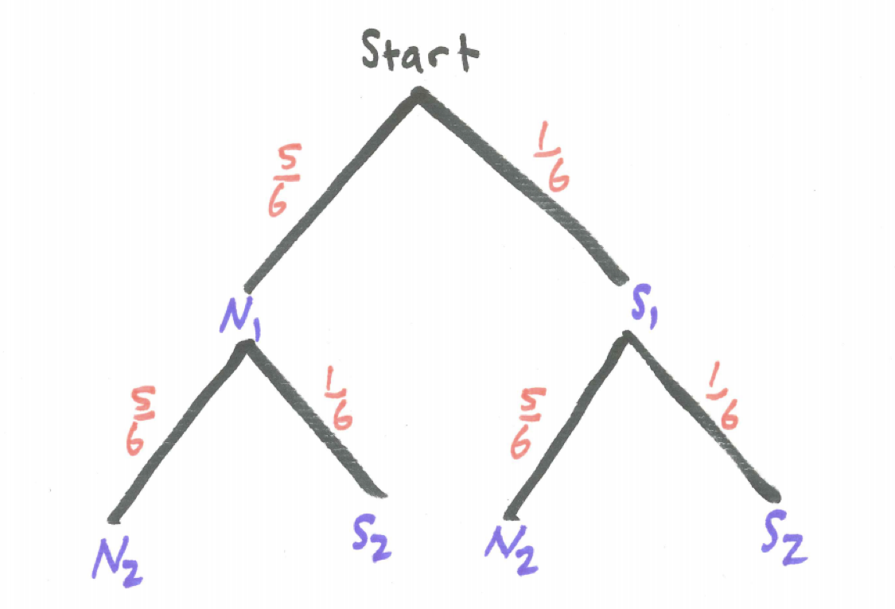

# The Complement, Addition, and Multiplication Principles {#complement_addition_multiplication_principles}

```{r, message=FALSE, warning=FALSE, echo=FALSE}
library(mosaic)
set.seed(2018)
```

## Introduction {#introduction}

Most of the interesting probability questions involve combinations of simple events. In this section we examine the probabilities of two events both occurring (**and**), at least one of two events occurring (**or**), as well as an event not occurring (**not**). In this chapter,  we describe the key probability principles related to **and**, **or**, and **not** statements, namely, the Multiplication Principle, Addition Principle, and Complement Principle, respectively. 


## Chapter Scenario - The Birthday Problem {#chapter_scenario_birthday_problem}

You may be sitting in a classroom right now. If not, imagine you are. Suppose there are a total of 20 people in class. What is the chance that two of you have the same birthday (meaning same day of the year but not necessarily the same year)? Which is it closer to - a 10%, 20%, 30%, 40%, or 50% chance, or possibly even higher chance?

## Working with **AND** and **NOT**

## The Chevalier de Mere

Aaah, the “Horseman of the Sea,” that famous gambler who had a horse and lived by the sea.  And who was, by the way, an acquaintance of Pascal, owner of famous triangle in the year 1654.  There were two games of chance that the Chevalier wanted some advice on and he wrote Pascal and letter and, viola, the theory of probability was born.  OK, it wasn’t that simple but the Chevalier’s question did stimulate a deeper understanding of probability intimating at what we now call the multiplication rule and the complement rule. Here are the two games under consideration -

Game One:	You could bet on the chance of getting at least one six on four rolls of a die.

Game Two:	For a longer game, you could bet on the chance of getting at least one double six on 24 rolls of two dice.

### Practice Exercise
Estimate the probability of winning Game One and the probability of winning Game Two. No formal computation necessary at this point.
<br/>
<br/>
Each of these games was an even-money game meaning the payoff ratio was 1:1 where you would either win or lose the exact amount bet. The Chevalier de Mere had a lot of experience and felt that the first game offered a better chance of winning than the second game but he could find no theoretical explanation as to why. In short, his mathematical reasoning was letting him down.

Enter Pascal, stage right.  Here we let you do a little play-acting and audition for the role of Pascal by analyzing the games and determining the chances of winning each. To do this, let’s explore what we now call the multiplication rule and the complement rule.

The Multiplication Rule shows us that to obtain the probability of two potentially consecutive events we multiply related probabilities:

### Theorem: The Multiplication Principle
$$For \ all \ events \ A \ and \ B, \ P(A \ and \ B)= P(A) \cdot P(B \mid A).$$

To understand the multiplication principle, examine the tree diagram below where branches are labeled with the events and the corresponding probabilities. We see that traveling the **A and B** branch happens with probability $P(A) \cdot P(B \mid A)$.

In the special case that events A and B are independent we note that $P(B \mid A) = P(B)$ resulting in the simplified tree diagram below.

This leads to a special case of the multiplication principle. 

### Theorem: Special Case of the Multiplication Principle
$$If \ the \ events \ A \ and \ B \ are \ independent \ then \ P(A \ and \ B) = P(A) \cdot P(B).$$

The Complement Rule confirms that the probability of an event occurring is one minus the probability the event does not occur:

### Theorem: Complement Principle

$$For \ all \ events \ A, \ P(A)= 1-P(not \ A)$$			

Remember this can also be written as $P(A) + P(not \ A) = 1$.

Tackling the Chevalier's problem one die at a time, consider the experiment of tossing just one die. Suppose we are interested in the event S of getting a six.

$$P(getting \ a \ six) = P(S) = 1/6$$

This is equivalent to the following version using the complement principle:

$$P(getting \ a \ six) = 1 – P(not \ getting \ a \ six) = 1 - P(not \ S) = 1 – 5/6 = 1/6$$

Now consider the experiment of tossing two dice. Let $S_{1}$ represent getting a six on the first die and $S_{2}$ getting a six on the second die. Note that whatever happens on the first die is independent of what happens on the second die. To find the probability of getting double sixes we can utilize the multiplication rule.

$$P(two \ sixes)= P(S_{1} \ and \ S_{2})=P(S_{1}) \cdot (S_{2})=  1/6 \cdot 1/6=1/36$$

There is a note of caution here; remember this technique only works with independent events like dice rolls and would not work for dependent event like drawing from an urn without replacement.

Similarly, we could now use independence and the Multiplication Rule to help us understand the event of not getting a six.

$$P(no \ sixes)= P(S_{1}^{c} \ and \ S_{2}^{c}) = P(S_{1}^{c}) \cdot P(S_{2}^{c}) =5/6 \cdot 5/6=25/36$$
	
We often use the complement rule when finding the probability of at least one occurrence of an event in multiple trials. To say “at least one success” and to say “no successes” are complements of each other. We can take advantage of this because it is often easy to find the probability of “no successes” directly. 

To illustrate, we can use the complement rule as one way of finding the probability at least one of the two dice is a six.

$$P(at \ least \ one \ six)= 1-P(no \ sixes)= 1-5/6 \cdot 5/6=1-25/36=11/36$$

Let’s put these pieces together – the Multiplication Rule and the Complement Rule – to solve the Chevalier de Mere’s dilemma first analyzing Game One then Game Two then making comparisons.

## Analysing Game One
The gambler bets on the chance of getting at least one six on four rolls of a die and if a six occurs wins the amount bet and if it does not occur then loses the amount bet.

Consider drawing a tree diagram for four tosses of the die including the probabilities along each branch. For each toss of the die we need only identify two branches – NOT SIX (1,2,3,4 or 5) or SIX (6). You can stop the branch whenever a six occurs since the gambler wins in this instance.

The tree diagram for four tosses of a die considering the two outcomes of success or failure of getting a six on each toss generates sixteen branches through the tree but only five branches if we terminate the tree whenever we get a success. These branches are not equally likely, though, so we need to be careful about calculating probabilities. When finding the probability of at least one success in an experiment like this we often utilize the Complement Rule because while there are many branches that end in a success there is only one branch of all failures so this one would be easier to calculate the probability of than adding together the other branches. 

Examine the tree diagram above and identify the one branch in the sample space in which the gambler loses by shading it and find the probability of this occurrence.

$$P(no \ sixes \ in \ four \ tosses)=P(S_{1}^{c} \ and \ S_{2}^{c} \ and \ S_{3}^{c} \ and \ S_{4}^{c}) = P(S_{1}^{c}) \cdot P(S_{2}^{c}) \cdot P(S_{3}^{c}) \cdot P(S_{4}^{c})=(5/6)^{4}$$
Thus, by the Complement Principle,

$$P(at \ least \ one \ six \ in \ four \ tosses) = 1 - P(no \ sixes \ in \ four \ tosses) = 1 - (5/6)^{4}$$


## In an Attempt to Kill the Student, the Authors Solve the Same Simple Problem Four Ways (One Bad and Three Good) {#kill_the_student}

By dissecting an easy problem we can gain insight into multiple problem-solving strategies that can be useful in other problems. Or we can kill motivation altogether. We will see.

In the game of Risk competitors resolve attacks by rolling dice. Suppose that you are rolling two dice and you are interested in whether or not we obtain a six. We consider the following compound events.

While there are six sides to each die, because we are primarily interested in whether or not we obtain a six, we will use the tree diagram below where event **S** represents getting a six and event **N** represents getting a non-six, ie., 1, 2, 3, 4, or 5.

```{r nice-fig-31, fig.cap='Tree Diagram for Sixes on Two Dice', out.width='60%', fig.asp=.75, fig.align='center', echo=FALSE}

```

Even if we are tossing identical dice simultaneously it is helpful to conceptualize the experiment as if we are tossing the dice sequentially. We have added subscripts to identify whether we are referring to the first die tossed or the second die tossed.

What is the probability of obtaining a six on both dice? Because the two events of getting a six on the first die and getting a six on the second die are **independent**, we can use **The Multiplication Rule for Independent Events** which says for any two independent events $E$ and $F$, $P(E\ and\ F) = P(E) \times P(F)$.

$$P(two\ sixes) = P(S_{1}\ and\ S_{2}) = P(S_{1}) \times P(S_{2}) =  \frac{1}{6} \times \frac{1}{6}$$

What is the probability of obtaining a six on at least one of the two dice? We examine this problem from four points of view - the wrong point of view, the addition rule, the partition technique, and the complement principle.

#### The Wrong Way

Here is a faulty answer:

$$P(at\ least\ one\ six) = P(S_{1}\ or\ S_{2}) = P(S_{1})+ P(S_{2}) = \frac{1}{6} + \frac{1}{6} = \frac{2}{6} = \frac{1}{3}\ \ WRONG!$$

Can you spot the problem? The issue is that one branch with a six on both dice, the overlap where both events $S_{1}$ and $S_{2}$ occur, was counted twice. 

#### The Addition Rule

Here is a correct version using what is called **The Addition Rule** where the overlap, since it was counted twice, is subtracted:

$$P(at\ least\ one\ six) = P(S_{1}\ or\ S_{2}) = P(S_{1})+ P(S_{2}) - P(S_{1}\ AND\ S_{2}) =\\ \frac{1}{6} + \frac{1}{6} - \frac{1}{6} \times \frac{1}{6}  = \frac{11}{36}$$

#### The Partition Approach

An alternative approach is to **partition** the event into mutually exclusive parts. We might informally describe this approach as *divide and conquer*. In this case, there are three distinct branches that satisfy at least one six occurring:

$$P(at\ least\ one\ six) = P(S_{1}\ and\ N_{2}) + P(N_{1}\ and\ S_{2}) + P(S_{1}\ and\ S_{2}) = \\  \frac{1}{6} \times \frac{5}{6} + \frac{5}{6} \times \frac{1}{6} + \frac{1}{6} \times \frac{1}{6} = \frac{11}{36}$$

#### The Complement Principle

A third correct approach uses **The Complement Principle** which observes that for any event $E$, $P(E) = 1 - P(not\ E)$. In this situation, we note $P(at\ least\ one) = 1 - P(none)$. Sometimes it is less work to find the complement of an event and subtract from one.

$$P(at\ least\ one\ six) = 1 - P(no\ sixes) = 1 - P(N_{1}\ and\ N_{2}) = \\  1 - \frac{5}{6} \times \frac{5}{6} = \frac{11}{36}$$

To summarize what we have learned about problem-solving here, there is more than one way to solve a probability problem (and some ways are wrong!). But several good strategies to use are the addition rule being careful not to double-count, divide and conquer by partitioning the event into mutually exclusive pieces, or use the complement principle to solve the opposite problem and subtract this from one. 

