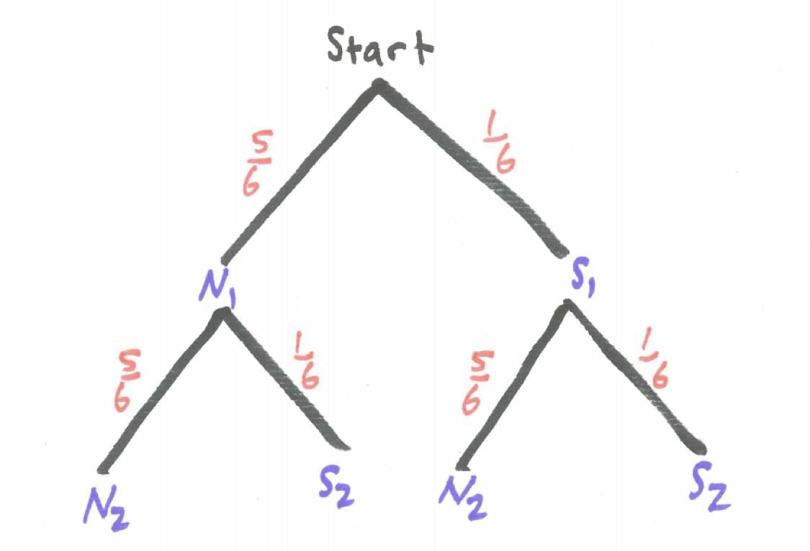

# Interlude - In an Attempt to Kill the Student, the Authors Solve the Same Simple Problem Four Ways (One Bad and Three Good) {#interlude_four_problems}

```{r, message=FALSE, warning=FALSE, echo=FALSE}
library(mosaic)
set.seed(2018)
```


By dissecting an easy problem we can gain insight into multiple problem-solving strategies that can be useful in other problems. Or we can kill motivation altogether. We will see. 

In this interlude, we see one example worked multiple ways. The specific problem-solving tools will be expounded upon in subsequent chapters.

## A Problem from the Game of Risk {#risk_problem}

In the game of Risk competitors resolve attacks by rolling dice. Suppose that you are rolling two dice and you are interested in whether or not we obtain a six. We consider the following compound events.

While there are six sides to each die, because we are primarily interested in whether or not we obtain a six, we will use the tree diagram below where event **S** represents getting a six and event **N** represents getting a non-six, ie., 1, 2, 3, 4, or 5.

```{r nice-fig-401, fig.cap='Tree Diagram for Sixes on Two Dice', out.width='60%', fig.asp=.75, fig.align='center', echo=FALSE}

```

Even if we are tossing identical dice simultaneously it is helpful to conceptualize the experiment as if we are tossing the dice sequentially. We have added subscripts to identify whether we are referring to the first die tossed or the second die tossed.

What is the probability of obtaining a six on both dice? Because the two events of getting a six on the first die and getting a six on the second die are **independent**, we can use **The Multiplication Rule for Independent Events** which says for any two independent events $E$ and $F$, $P(E\ and\ F) = P(E) \times P(F)$.

$$P(two\ sixes) = P(S_{1}\ and\ S_{2}) = P(S_{1}) \times P(S_{2}) =  \frac{1}{6} \times \frac{1}{6}$$

What is the probability of obtaining a six on at least one of the two dice? We examine this problem from four points of view - the wrong point of view, the addition rule, the partition technique, and the complement principle.

#### The Wrong Way

Here is a faulty answer:

$$P(at\ least\ one\ six) = P(S_{1}\ or\ S_{2}) = P(S_{1})+ P(S_{2}) = \frac{1}{6} + \frac{1}{6} = \frac{2}{6} = \frac{1}{3}\ \ WRONG!$$

Can you spot the problem? The issue is that one branch with a six on both dice, the overlap where both events $S_{1}$ and $S_{2}$ occur, was counted twice. 

#### The Addition Rule

Here is a correct version using what is called **The Addition Rule** where the overlap, since it was counted twice, is subtracted:

$$P(at\ least\ one\ six) = P(S_{1}\ or\ S_{2}) = P(S_{1})+ P(S_{2}) - P(S_{1}\ AND\ S_{2}) =\\ \frac{1}{6} + \frac{1}{6} - \frac{1}{6} \times \frac{1}{6}  = \frac{11}{36}$$

#### The Partition Approach

An alternative approach is to **partition** the event into mutually exclusive parts. We might informally describe this approach as *divide and conquer*. In this case, there are three distinct branches that satisfy at least one six occurring:

$$P(at\ least\ one\ six) = P(S_{1}\ and\ N_{2}) + P(N_{1}\ and\ S_{2}) + P(S_{1}\ and\ S_{2}) = \\  \frac{1}{6} \times \frac{5}{6} + \frac{5}{6} \times \frac{1}{6} + \frac{1}{6} \times \frac{1}{6} = \frac{11}{36}$$

#### The Complement Principle

A third correct approach uses **The Complement Principle** which observes that for any event $E$, $P(E) = 1 - P(not\ E)$. In this situation, we note $P(at\ least\ one) = 1 - P(none)$. Sometimes it is less work to find the complement of an event and subtract from one.

$$P(at\ least\ one\ six) = 1 - P(no\ sixes) = 1 - P(N_{1}\ and\ N_{2}) = \\  1 - \frac{5}{6} \times \frac{5}{6} = \frac{11}{36}$$

To summarize what we have learned about problem-solving here, there is more than one way to solve a probability problem (and some ways are wrong!). But several good strategies to use are the addition rule being careful not to double-count, divide and conquer by partitioning the event into mutually exclusive pieces, or use the complement principle to solve the opposite problem and subtract this from one. 

