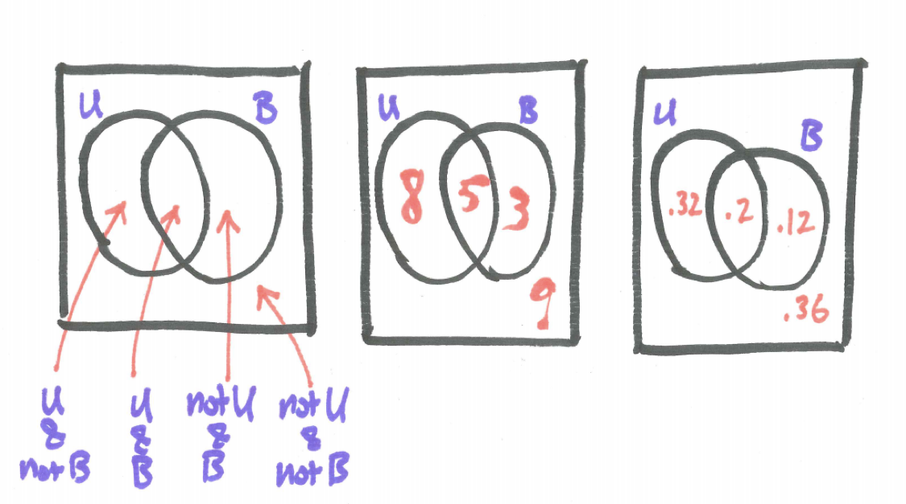
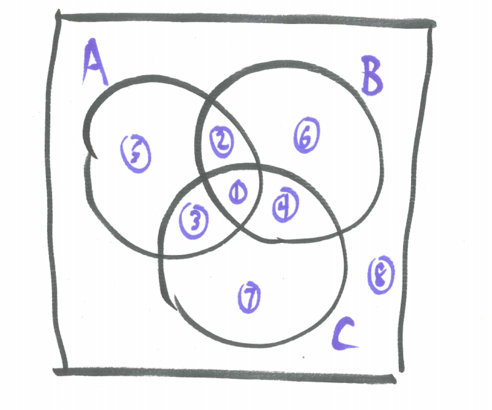
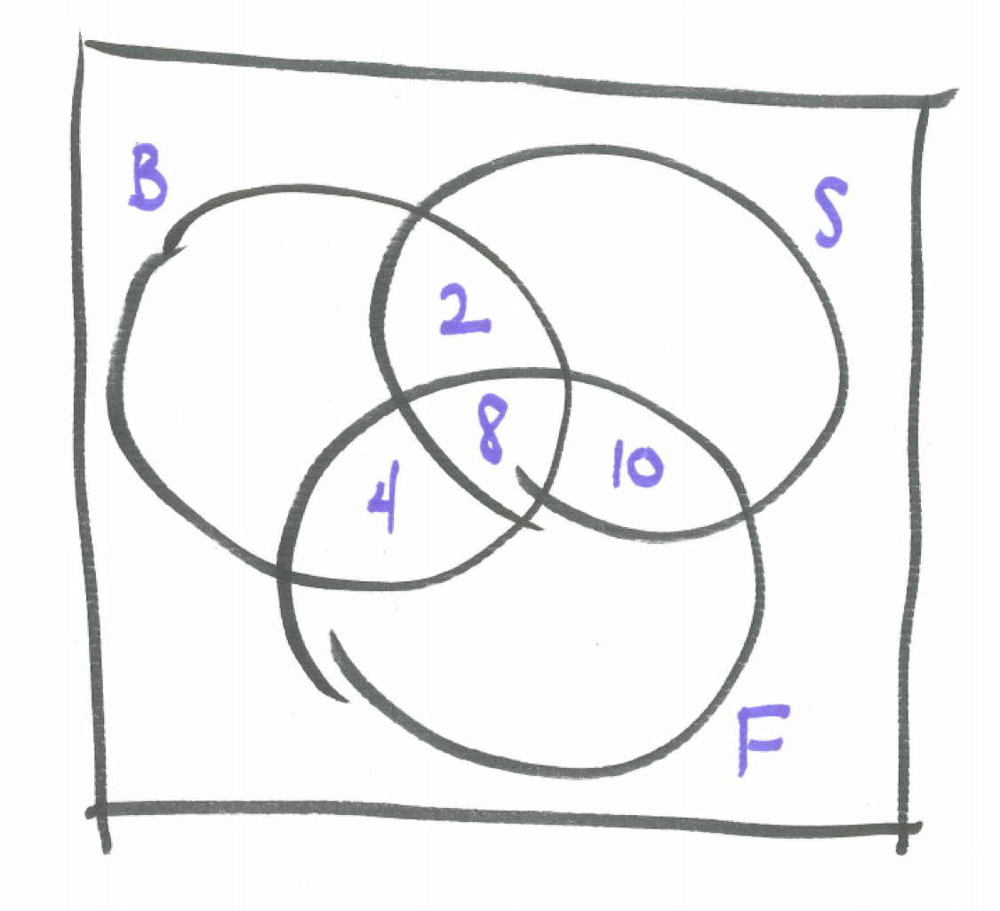
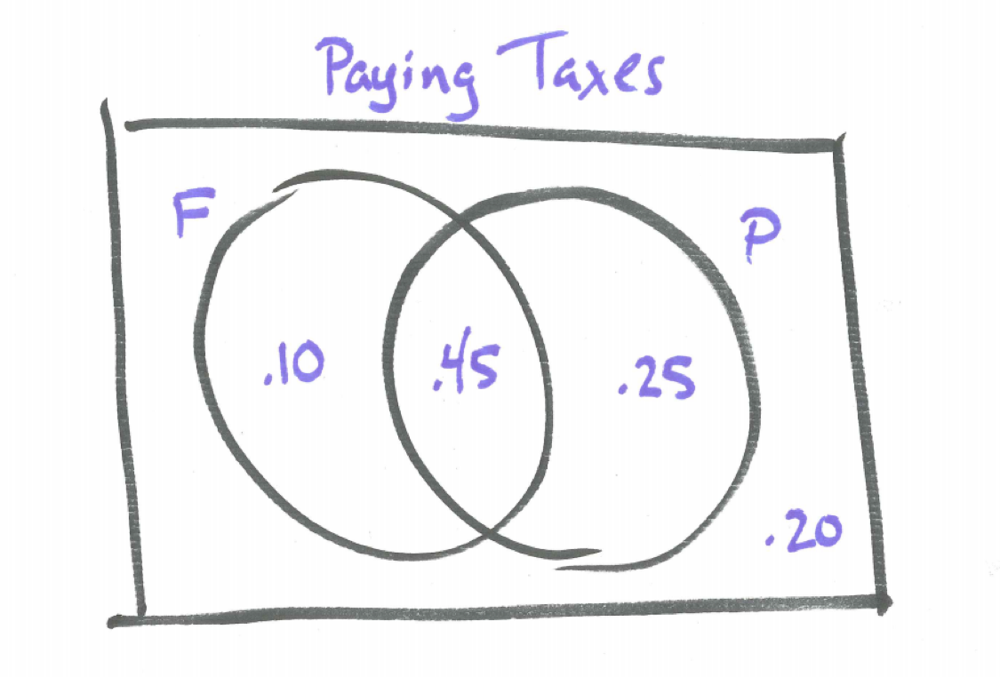

# Working with OR Statements {#working_with_or_statements}

```{r, message=FALSE, warning=FALSE, echo=FALSE}
library(mosaic)
set.seed(2018)
```


## Introduction {#introduction}

Most of the interesting probability questions involve combinations of simple events. In this section we examine the probabilities of at least one of two events occurring (**or**), and describe the key Addition Principle. Venn diagrams are introduced as useful tools for visualizing relationships between overlapping events.

## Chapter Scenario - Paying Taxes {#chapter_scenario_paying_taxes}

On the Diane Rehm show on Wednesday, September 28, 2016 a discussion of federal taxes occurred. Here is the link to the show: https://thedianerehmshow.org/. 

A claim something like the following was made: 55% of individuals pay federal income tax, 70% pay payroll taxes, and 80% pay at least one of the two. Can you determine the percentage of individuals that pay federal income tax but not payroll taxes and the percentage who pay payroll taxes but not federal income tax?

## Class Composition Example

Suppose we took a poll of all 25 students in class and asked them to identify whether or not they were from Utah and whether or not they are planning to major in a business-related field with the following results:

* 13 are from Utah
* 8 plan to major in a business-related field
* 5 are from Utah AND plan to major in a business-related field

If one student is chosen at random what is the probability they are from Utah OR plan to major in a business-related field?

Let's let U represent the event of being from Utah and B the event of planning to major in a buisness-related field.

### Practice 
What is wrong with the following approach?

$$P(U \ or \ B) = P(U)+P(B)= 13/25 + 8/25 = 21/25 \ WRONG!!!$$

You may have spotted the mistake that some individuals have been double-counted. The Addition Rule will take care of this.

$$P(U \ or \ B) = P(U)+P(B)-P(U \ and \ B) = 13/25 + 8/25 - 5/25 = 16/25$$

From the information above we can determine there are 9 individuals that are not from Utah and not planning on majoring in business-related field. Venn Diagrams are a helpful way to visualize the relationships between overlapping events like these. 

Two overlapping events may be represented in a Venn diagram with two overlapping circles. Think of the rectangle containing them as the entire sample space.

Examine the three Venn diagrams below. The first Venn diagram illustrates the compound event each region represents. The second Venn diagram identifies the number of individuals in each region. The third Venn diagram identifies the proportion of the population in each region, or, equivalently, the probability of selecting an individual in the given region if one person was chosen at random. 

```{r nice-fig-501, fig.cap='Venn Diagram of Class Composition', out.width='30%', fig.asp=.75, fig.align='center', echo=FALSE}

```

## Venn Diagrams for Three Events

A Venn diagram for three overlapping events is represented with three overlapping circles creating the eight regions all labeled in the diagram below. By the Fundamental Principle of Counting, to identify a region there are two choices for each event - out or in - leading to $2^{3}=8$ total regions. 

```{r nice-fig-502, fig.cap='Venn Diagram of Three Events', out.width='30%', fig.asp=.75, fig.align='center', echo=FALSE}

```

## Example - Watching Sports
A group of students was asked whether or not they like to watch basketball, soccer, and/or football. Here are the results of the survey.

* Total number surveyed: 78
* Number choosing basketball: 26
* Number choosing soccer: 30
* Number choosing football: 36
* Number choosing both basketball and soccer: 10
* Number choosing both basketball and football: 12
* Number choosing both soccer and football: 18
* Number choosing basketball and soccer and football: 8

We can draw a Venn Diagram by identifying with regions B for basketball, S for soccer, F for football, and T representing the total number surveyed. We want to determine how many individuals there are in each of the eight regions. As in the example with two overlapping events, the key problem-solving strategy is to start with the overlap. Here we see some of the overlapping regions described. Can you proceed outward to complete the Venn diagram?

```{r nice-fig-503, fig.cap='Venn Diagram for Three Sports', out.width='30%', fig.asp=.75, fig.align='center', echo=FALSE}

```

## Revisiting the Chapter Scenario - Paying Taxes {#revisit_chapter_scenario}

Remember in our example, 55% of individuals pay federal income tax, 70% pay payroll taxes, and 80% pay at least one of the two and we wish to determine the percentage of individuals that pay federal income tax but not payroll taxes and the percentage who pay payroll taxes but not federal income tax. A Venn diagram can help with F representing federal income tax and P payroll taxes.

From the Addition Principle, 

$$P(F \ or \ P)=P(F)+P(P)-P(F \ and \ P)$$
We know three of these quantities which may be substituted in.

$$0.80=0.55+0.70-P(F \ and \ P)$$

Solving we find $P(F \ and \ P)=0.55 + 0.70 - 0.80=0.45$ allowing us to complete the Venn diagram.

```{r nice-fig-504, fig.cap='Venn Diagram of Paying Taxes', out.width='30%', fig.asp=.75, fig.align='center', echo=FALSE}

```


## Exercises {#exercises}

### Exercise - Venn for Four
Create a Venn diagram template for four events {A, B, C, D} and accurately label each region.

### Exercise - Class Schedules
Suppose that a group of 100 first year students were given a survey indicating that 58 of them are registered for a math class and 40 of them are registered for a foreign language class. Can we safely assume that 98 of them are registered for either a math class or a foreign language class? Suppose we are told that 22 of them are registered for both a math class and a foreign language class, then determine how many are registered for a math class or a foreign language class.

### Exercise - Class Survey
Design and administer a short three-question class survey where each question is a yes or no answer and draw a Venn diagram of the results identifying the number of individuals in each of the eight regions. Questions could relate to almost anything but try to select questions where you will see different responses.

### Exercise - Minding the Gap
Suppose the probability of event A is 1/3 and the probability of event B is 1/2. What is the possible range of values for P(A or B), that is, what is the smallest possible value for P(A or B) and what is the largest possible value for P(A or B)?


