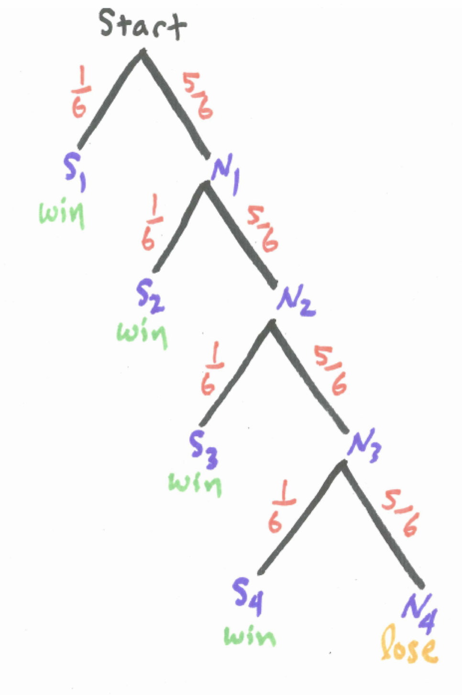
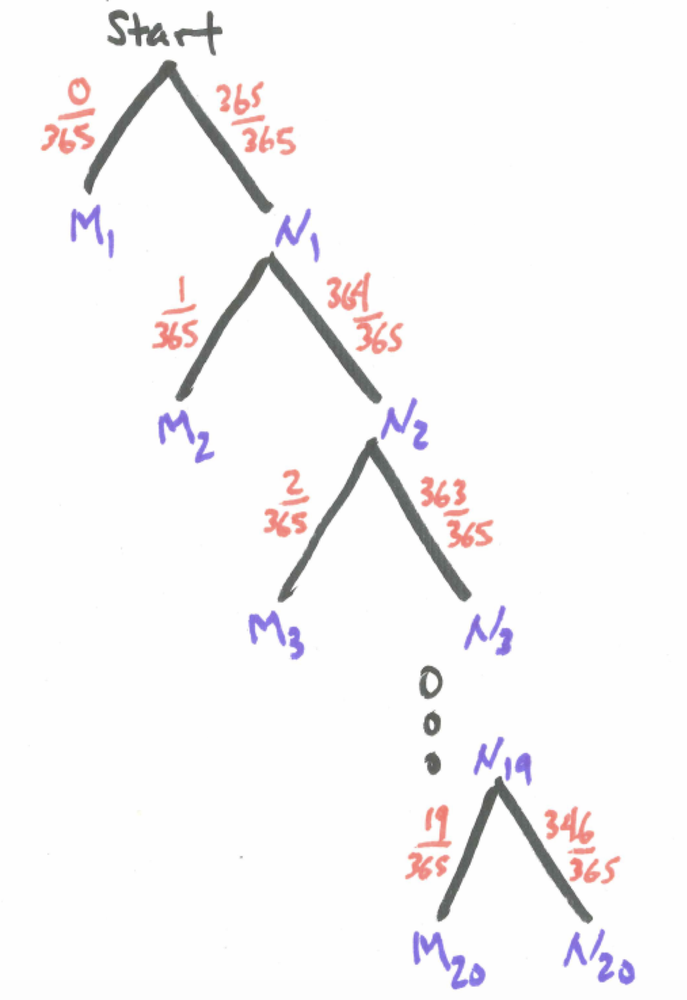

# Working with AND and NOT Statements {#working_with_and_and_not_statements}

```{r, message=FALSE, warning=FALSE, echo=FALSE}
library(mosaic)
set.seed(2018)
```


## Introduction {#introduction}

Most of the interesting probability questions involve combinations of simple events. In this section we examine the probabilities of two events both occurring (**and**) as well as an event not occurring (**not**). In this chapter,we describe the key probability principles related to **and**, and **not** statements, namely, the Multiplication Principle and Complement Principle, respectively. 


## Chapter Scenario - The Birthday Problem {#chapter_scenario_birthday_problem}

You may be sitting in a classroom right now. If not, imagine you are. Suppose there are a total of 20 people in class. What is the chance that two of you have the same birthday (meaning same day of the year but not necessarily the same year)? Which is it closer to - a 10%, 20%, 30%, 40%, or 50% chance, or possibly even higher chance?


## The Chevalier de Mere

Aaah, the “Horseman of the Sea,” that famous gambler who had a horse and lived by the sea.  And who was, by the way, an acquaintance of Pascal, owner of famous triangle in the year 1654.  There were two games of chance that the Chevalier wanted some advice on and he wrote Pascal and letter and, viola, the theory of probability was born.  OK, it wasn’t that simple but the Chevalier’s question did stimulate a deeper understanding of probability intimating at what we now call the multiplication rule and the complement rule. Here are the two games under consideration -

Game One:	You could bet on the chance of getting at least one six on four rolls of a die.

Game Two:	For a longer game, you could bet on the chance of getting at least one double six on 24 rolls of two dice.

### Practice 
Estimate the probability of winning Game One and the probability of winning Game Two. No formal computation necessary at this point.
<br/>
<br/>
Each of these games was an even-money game meaning the payoff ratio was 1:1 where you would either win or lose the exact amount bet. The Chevalier de Mere had a lot of experience and felt that the first game offered a better chance of winning than the second game but he could find no theoretical explanation as to why. In his mind, with the prevailing math at the time, the two games seemed comparable. If I am given 4 tries to get something that happens on average every 6 times then being given 24 tries at something that happens on average every 36 times should be comparable. But in reality it was not. In short, his mathematical reasoning was letting him down.

We can use simulation to recreate the Chevalier's experience. The code below simulates 10,000 trials of Game One and documents the number of wins and losses.

```{r nice-tab-601, tidy=FALSE}
die_tosses <- matrix(sample(1:6, 4*10000, replace=TRUE), ncol=4) #generate die tosses
sixes_logic <- die_tosses==6 #identify where there are sixes (TRUE=1, FALSE=0)
number_of_sixes <- apply(sixes_logic, 1, sum) #Tabulate the number of sixes in each game
game_one_winners <- number_of_sixes > 0 #Identify the winners - those with at least one six

 #Calculate the proportion of game one winners
knitr::kable(
  prop.table(table(game_one_winners)), caption = 'Game One Simulation',
  booktabs = TRUE
)
```

The simulated Chevalier in this simulation would notice winning $51.39\%$ of the time. Let's simulate 10,000 trials of Game Two for comparison sake.

```{r nice-tab-602, tidy=FALSE}

two_Die_tosses <- matrix(sample(1:6, 24*10000, replace=TRUE) + 
    sample(1:6, 24*10000, replace=TRUE), ncol=24) #generate 10000 trials of 24 two dice rolls
double_sixes_logic <- two_Die_tosses==12 #identify double sixes (TRUE=1, FALSE=0)
#head(double_sixes_logic, n=10) 
number_of_double_sixes <- apply(double_sixes_logic, 1, sum) #tabulate number of double sixes in each game
game_two_winners <- number_of_double_sixes > 0 #identify winners - those with at least one double six

#Calculate the proportion of game two winners
knitr::kable(
  prop.table(table(game_two_winners)), caption = 'Game Two Simulation',
  booktabs = TRUE
)
```

This time, our simulated Chevalier sees he is winning only $49.04\%$ of the time. Hence the rub. Why is Game One better than Game Two?  

Enter Pascal, stage right.  Here we let you do a little play-acting and audition for the role of Pascal by analyzing the games and determining the chances of winning each. To do this, let’s explore what we now call the multiplication rule and the complement rule.

The Multiplication Rule shows us that to obtain the probability of two potentially consecutive events we multiply related probabilities:

### Theorem: The Multiplication Rule
$$For \ all \ events \ A \ and \ B, \ P(A \ and \ B)= P(A) \cdot P(B \mid A).$$

To understand the Multiplication Rule, examine the tree diagram below where branches are labeled with the events and the corresponding probabilities. We see that traveling the **A and B** branch happens with probability $P(A) \cdot P(B \mid A)$.

In the special case that events A and B are independent we note that $P(B \mid A) = P(B)$ resulting in the simplified tree diagram below.

This leads to a special case of the multiplication principle. 

### Theorem: Special Case of the Multiplication Rule
$$If \ the \ events \ A \ and \ B \ are \ independent \ then \ P(A \ and \ B) = P(A) \cdot P(B).$$

The Complement Rule confirms that the probability of an event occurring is one minus the probability the event does not occur:

### Theorem: Complement Rule

$$For \ all \ events \ A, \ P(A)= 1-P(not \ A)$$			

Remember this can also be written as $P(A) + P(not \ A) = 1$.

Tackling the Chevalier's problem one die at a time, consider the experiment of tossing just one die. Suppose we are interested in the event S of getting a six.

$$P(getting \ a \ six) = P(S) = 1/6$$

This is equivalent to the following version using the complement principle:

$$P(getting \ a \ six) = 1 – P(not \ getting \ a \ six) = 1 - P(not \ S) = 1 – 5/6 = 1/6$$

Now consider the experiment of tossing two dice. Let $S_{1}$ represent getting a six on the first die and $S_{2}$ getting a six on the second die. Note that whatever happens on the first die is independent of what happens on the second die. To find the probability of getting double sixes we can utilize the multiplication rule.

$$P(two \ sixes)= P(S_{1} \ and \ S_{2})=P(S_{1}) \cdot (S_{2})=  1/6 \cdot 1/6=1/36$$

There is a note of caution here; remember this technique only works with independent events like dice rolls and would not work for dependent event like drawing from an urn without replacement.

Similarly, we could now use independence and the Multiplication Rule to help us understand the event of not getting a six.

$$P(no \ sixes)= P(S_{1}^{c} \ and \ S_{2}^{c}) = P(S_{1}^{c}) \cdot P(S_{2}^{c}) =5/6 \cdot 5/6=25/36$$
	
We often use the complement rule when finding the probability of at least one occurrence of an event in multiple trials. To say “at least one success” and to say “no successes” are complements of each other. We can take advantage of this because it is often easy to find the probability of “no successes” directly. 

To illustrate, we can use the complement rule as one way of finding the probability at least one of the two dice is a six.

$$P(at \ least \ one \ six)= 1-P(no \ sixes)= 1-5/6 \cdot 5/6=1-25/36=11/36$$

Let’s put these pieces together – the Multiplication Rule and the Complement Rule – to solve the Chevalier de Mere’s dilemma first analyzing Game One then Game Two then making comparisons.

## Analysing Game One
The gambler bets on the chance of getting at least one six on four rolls of a die and if a six occurs wins the amount bet and if it does not occur then loses the amount bet.

Consider drawing a tree diagram for four tosses of the die including the probabilities along each branch. For each toss of the die we need only identify two branches – NOT SIX (1,2,3,4 or 5) or SIX (6). You can stop the branch whenever a six occurs since the gambler wins in this instance.

```{r nice-fig-603, fig.cap='Tree Diagram for Game One', out.width='60%', fig.asp=.75, fig.align='center', echo=FALSE}

```

The tree diagram for four tosses of a die considering the two outcomes of success or failure of getting a six on each toss generates sixteen branches through the tree but only five branches if we terminate the tree whenever we get a success. These branches are not equally likely, though, so we need to be careful about calculating probabilities. When finding the probability of at least one success in an experiment like this we often utilize the Complement Rule because while there are many branches that end in a success there is only one branch of all failures so this one would be easier to calculate the probability of than adding together the other branches. 

Examine the tree diagram above and identify the one branch in the sample space in which the gambler loses by shading it and find the probability of this occurrence.

$$P(no \ sixes \ in \ four \ tosses)=P(S_{1}^{c} \ and \ S_{2}^{c} \ and \ S_{3}^{c} \ and \ S_{4}^{c}) = \\ P(S_{1}^{c}) \cdot P(S_{2}^{c}) \cdot P(S_{3}^{c}) \cdot P(S_{4}^{c})=(5/6)^{4}$$
Thus, by the Complement Principle,

$$P(at \ least \ one \ six \ in \ four \ tosses) = 1 - P(no \ sixes \ in \ four \ tosses) = \\ 1 - (5/6)^{4}$$

### Practice 
Are the probabilities you have found for losing or winning Game One consistent with the Chevalier de Mere’s observation that he found Game One to be a favorable game? Explain.

## Analyzing Game Two {#analyzing_game_two}
Recall, in this game the gambler rolls a pair of dice and has 24 chances to obtain double-six winning the amount bet if she does and losing the bet if she does not obtain a double-six in 24 rolls. The Chevalier did not like this game as much. We analyze the game here to see if his lack of enthusiasm is justified.

Consider what a tree diagram would look like for this game. If we let event $D_{i}$ represent getting a double six on the $i^{th}$ roll of the dice and $N_{i}$ represent its complement we can stop the branching as a win whenever we hit a double six. 

```{r nice-fig-604, fig.cap='Tree Diagram for Game Two', out.width='60%', fig.asp=.75, fig.align='center', echo=FALSE}
knitr::include_graphics("01-basics-figures/chevalier_game_two.png")
```

Would it be realistic to use this tree diagram to assist us find the probability of a win? The main issue is there are so many ways to win - on the first toss, the second toss,..., the 24th toss. Who wants to add up 24 separate probabilities? Maybe the complement principle can help us since there is only one way to lose - never get a double six in all 24 tosses. Follow the chain of reasoning:

$$P(win) = 1 - P(lose) = 1 -P(no \ sixes \ in \ 24 \ rolls) = 1 - P(N_{1} \ and \ N_{2} \ and \ ... \ N_{24}) = \\ 1 - P(N_{1}) \cdot P(N_{2}) \cdot ... \cdot P(N_{24}) = 1 - (35/36)^{24}$$

We are using the fact that the different tosses of the dice are all independent. 


### Practice 
Compare the probabilities of winning and losing Game One with the probabilities of winning and losing Game Two and whether the opinions of the Chevalier de Mere’s games obtained through the simulation in R are consistent with the theoretical conclusions of our probability analysis.

## Revisiting the Chapter Scenario - The Birthday Problem

Given 365 days of the year (We ignore Leap Day February 29 with apologies to the Pirate of Penzance) and only 20 people it may initially feel like there is not much chance of a match but we are being deceived. With our problem-solving tools of the Multiplication and Complement Principles, we can find out for sure.

Recall The Multiplication Rule shows us that to obtain the probability of two potentially consecutive events we multiply related probabilities:

$$P(A \ and \ B)= P(A) \cdot P(B \ \mid \ A)$$

If the events A and B are independent then $P(A \ and \ B)=P(A) \cdot P(B)$.

The Complement Rule confirms that the probability of an event occurring is one minus the probability the event does not occur:

$$P(A)= 1-P(not \ A)$$

Remember, this can also be written $P(A)=1-P(not \ A)$.

We will build up our way into solving this problem by imagining that individuals walk into the room one at a time and announce their birthday to see if it matches or not with anyone else who is in the room.

When the first person walks in the room, there is no one else there so their birthday can be any one of the 365 days without there being a match so the probability of no match is $365/365=1$. Suppose only this one person is in the room. The probability that the second person to enter the room has the different birthday is $364/365$.

Suppose that two people are in the room and do not have the same birthday. The probability that the third person to enter the room has a different birthday than these two is $363/365$. 

Now, suppose three people are in the room and do not have a birthday match. Then the probabillity that the fourth person to enter the room has a different birthday than these three is $362/365$.

For all of these events to occur we can use the multiplication principle. With four people the probability of no match is $(365/365) \cdot (364/365) \cdot (363/365) \cdot (362/365)$

Using the complement principle for this case with four people

$$P(match)=1-P(no \ match)=1-(365/365) \cdot (364/365) \cdot (363/365) \cdot (362/365)$$

### Practice
Extend this thinking to find the probability of no match with five people.

We want to describe the solution in general for any number of people n according to the tree diagram below. 

```{r nice-fig-605, fig.cap='Tree Diagram for Birthday Problem', out.width='60%', fig.asp=.75, fig.align='center', echo=FALSE}

```

A computational shortcut will help us calculate the result. 

Given n people, the probability of a birthday match is 

$$P(match)=1-P(no \ match)=1-\frac{365 \cdot 364 \cdot 363 \cdot ... \cdot (365-n+1)}{3655^{n}}= \\ 1-\frac{P(365,n)}{365^{n}}$$

where $P(365,n)$ represents the permutation of 365 days taken n at a time. We will discuss this in more detail in a later chapter.

To solve the Chapter Scenario problem, we let $n=20$ and see

$$P(match)=1-P(no \ match)=1-\frac{P(365,20)}{365^{20}}$$ 

We can use the `prod()` function in R for the computation.

```{r}
match_prob_20 <- 1- prod(1 - (0:19)/365)
match_prob_20
```

So the probability of a birthday match with 20 people is `r match_prob_20` which might surprise us.

## Exercises {#exercises}

### Exercise - Birthday Problem continued
Continue in like fashion finding the probability of a birthday match with 21, 22, 23, etc. people until you find the first value of n for which this probability is greater than 0.5.

### Exercise - Slips of Paper

Ten slips of paper numbered 1 to 10 and identical is all other respects are placed in a hat. The slips are drawn out one at a time with replacement. What is the minimum number of draws that must be made for the probability of a match to be at least 0.5? What is the minimum number of draws that must be made for the probability of a match to be at least 0.9?

### Exercise - Five Coins
Suppose that a fair coin is flipped five times. What is the probability there is at least one head? 

### Exercise - Random Phone Number
Suppose a local seven-digit phone number is chosen at random. What is the probability it will not contain a 9?

### Exercise - Knights of the Round Table
The famed Winchester Round Table of King Arthur shows places for 25 knights. Being a dangerous business, suppose that the probability of dying in a given year is 0.04. What is the probability that at least one of the 25 knights seated around the table will die within one year?

