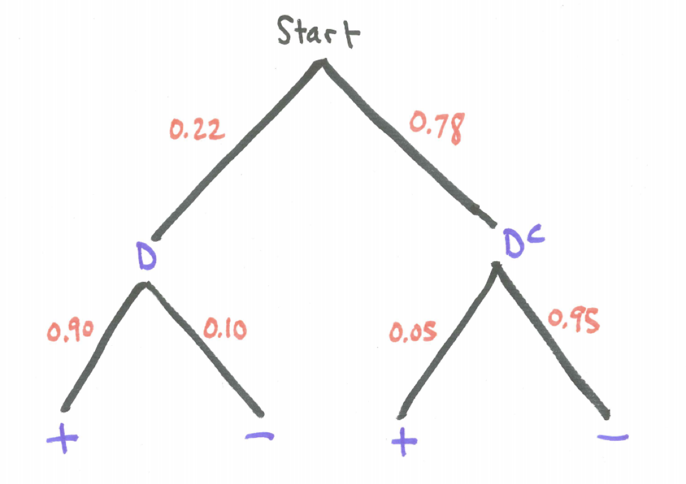

# Conditional Probability {#conditional}

## Introduction {#introduction}

## Chapter Scenario - Drug Testing {#chapter_scenario_drug_testing}

Imagine a proposal to test every United States university student for illicit drug use. Suppose the test has a sensitivity of 90% meaning that if a person is an illicit drug user the probability of a positive test result is 0.90. (A positive result indicates the individual does use drugs).  Suppose the test has a specificity of 95% meaning that if a person is not an illicit drug user the probability of a negative result is 0.95. (A negative result indicates the individual does not use drugs.) Further, suppose the percentage of illicit drug users on Westminster’s campus is 22%. (Note, this is just a hypothetical possibility but the National Survey on Drug Use and Health indicates that in 2012, the rate of current use of illicit drugs was 22.0 percent among full-time college students aged 18 to 22. http://www.samhsa.gov/data/NSDUH/2012SummNatFindDetTables/NationalFindings/NSDUHresults2012.htm)

Suppose that a student chosen at random tests positive for illicit drug use. Based on the information provided above, would you estimate the probability this student actually is an illicit drug user at closer to 0%, 20%, 40%, 60%, 80%, or 100%? Explain.

## Conditional Probability Basics {#condition_probability_basics}


## Chapter Scenario Revisited - Drug Testing {#chapter_scenario_revisited_drug_testing}

Recall the proposal to test every United States university student for illicit drug use with a test that has a sensitivity of 90% and a specificity of 95%. Thus, an illicit drug user will test positive 90% of the time and a non-illicit drug user will test negative 95% of the time. Further, suppose the percentage of illicit drug users on Westminster’s campus is 22%. 

Suppose a Westminster student chosen at random tests positive for illicit drug use. What is probability this student actually is an illicit drug user?

```{r nice-fig-71, fig.cap='Decision Table', out.width='30%', fig.asp=.75, fig.align='center', echo=FALSE}
knitr::include_graphics("01-basics-figures/error_types.png")
```

We can define the following events.

* D: the individual is an illicit drug user
* $D^{c}$: the individual is not an illicit drug user
* +: the test is positive
* -: the test is negative

Based on the provided information we know the following:

* $P(+ \mid D)=0.90$
* $P(- \mid D)=0.10$
* $P(+ \mid D^{c})=0.05$
* $P(- \mid D^{c})=0.95$
* $P(D)=0.22$
* $P(D^{c})=0.78$

A tree diagram visualizes the relationships between these probabilities.

```{r nice-fig-72, fig.cap='Drug Testing Tree Diagram', out.width='30%', fig.asp=.75, fig.align='center', echo=FALSE}

```

There are a lot of meaningful events to consider.

$$P(positive)=P(+)=P(+ \ and\  D \ or + and \ D^{c})=P(+ \ and \ D) + P(+ \ and \ D^{c}) = \\ P(D) \cdot P(+ \mid D) + P(D^{c}) \cdot P(+ \mid D^{c}) = (0.22) \cdot (0.90) + (0.78) \cdot (0.05) = 0.237$$

One of the most interesting probabilities is the probability that a person who tested positive actually does illicit drugs. 

$$P(D \mid +) = \frac{P(D \ and \ +)}{P(+)} = \frac{0.22 \cdot 0.90}{0.22 \cdot 0.90 + 0.78 \cdot 0.05} = \frac{0.198}{0.237}=0.835$$

That means the probability someone who tests positive does not do illicit drugs is $1 - 0.835=0.165$.

## Hypothetical 10,000 Table {#hypothetical_10000_table}

One additional way to better understand the probabilities is to imagine a hypothetical 10,000 people from the population who are tested and the results line up perfectly with the indicated probabilities. (Note, each actual sample of 10,000 would vary and results would most likely not line up perfectly with the probabilities.)

We can complete the “Hypothetical 10,000” table below using your understanding of probability and percentages and the following instructions:

* First, complete the marginal column totals according to the overall illicit drug use percentages. (Blue)
* Second, complete each interior cell by finding the designated percentage in each category. (Yellow)
* Third, complete the row totals by adding the interior table values. (Green)

Note: The Blue boxes should sum to 10,000. The Yellow boxes should also sum to 10,000. And the Green boxes should sum to 10,000.

```{r nice-fig-73, fig.cap='Hypothetical 10,000 Table', out.width='30%', fig.asp=.75, fig.align='center', echo=FALSE}
knitr::include_graphics("01-basics-figures/hypothetical_10000_table.png")
```

