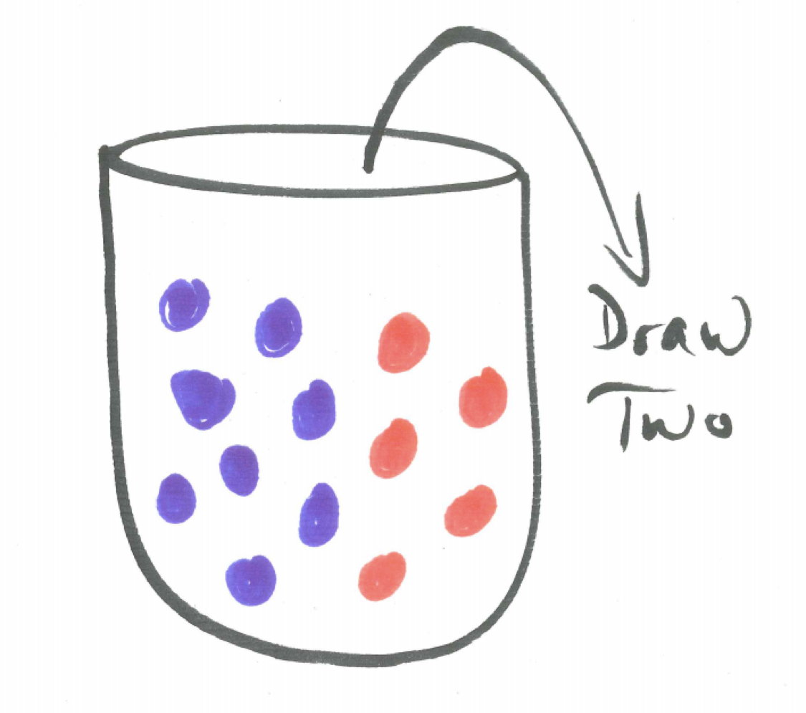
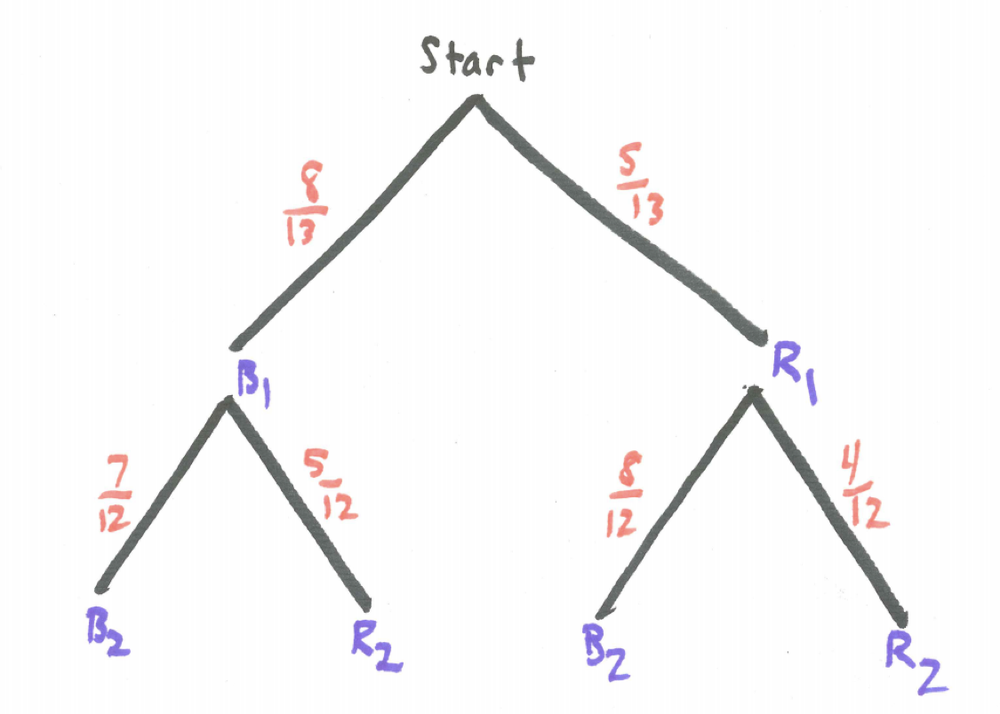
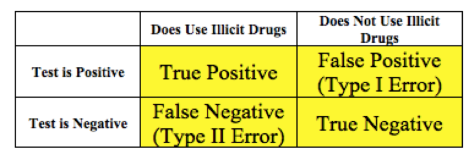
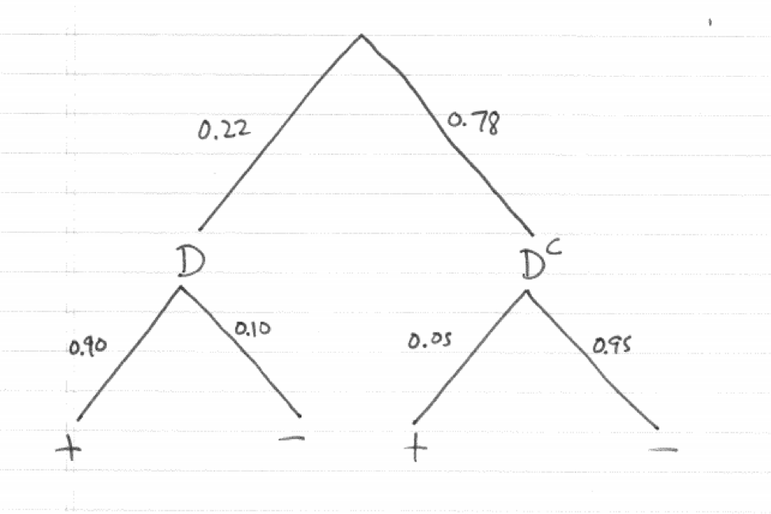
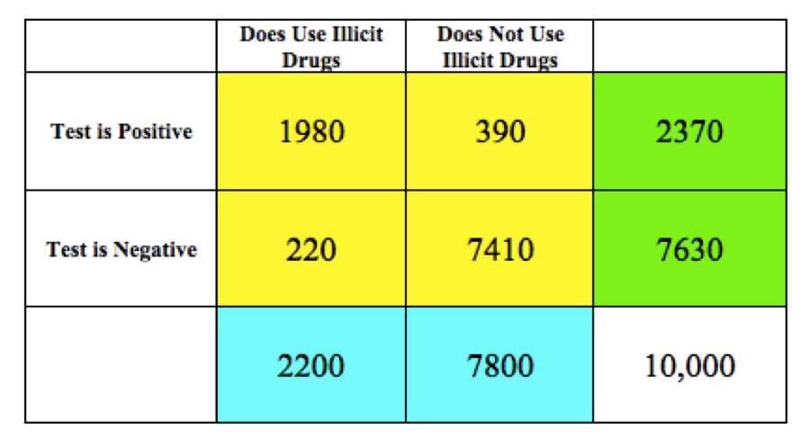

# Conditional Probability and Bayes' Theorem {#conditional_probability_and_bayes_theorem}

```{r, message=FALSE, warning=FALSE, echo=FALSE}
library(mosaic)
set.seed(2018)
```

## Introduction {#introduction}

Many probability questions provide relevant information about the context or prior events. Conditional probability provides tools to take this partial information into account. One of the most powerful theorem of conditional probability is Bayes' Theorem which shows us how we should modify the probability of an event occurring in light of relevant new information.

## Chapter Scenario - Drug Testing {#chapter_scenario_drug_testing}

Imagine a proposal to test every United States university student for illicit drug use. Suppose the test has a sensitivity of 90% meaning that if a person is an illicit drug user the probability of a positive test result is 0.90. (A positive result indicates the individual does use drugs).  Suppose the test has a specificity of 95% meaning that if a person is not an illicit drug user the probability of a negative result is 0.95. (A negative result indicates the individual does not use drugs.) Further, suppose the percentage of illicit drug users on Westminster’s campus is 22%. (Note, this is just a hypothetical possibility but the National Survey on Drug Use and Health indicates that in 2012, the rate of current use of illicit drugs was 22.0 percent among full-time college students aged 18 to 22. http://www.samhsa.gov/data/NSDUH/2012SummNatFindDetTables/NationalFindings/NSDUHresults2012.htm)

Suppose that a student chosen at random tests positive for illicit drug use. Based on the information provided above, would you estimate the probability this student actually is an illicit drug user at closer to 0%, 20%, 40%, 60%, 80%, or 100%? Explain.

## Conditional Probability Basics {#condition_probability_basics}

To review the basics of conditional probability recall that the event $A \mid B$ represents the event A occurring given that event B occurs. Thus, $P(A \mid B)$ could be interpreted as the proportion of the time A occurs under the circumstances that B has occurred. As a formal definition we have the following Conditional Probability Formula:

$$P(A \mid B) = \frac{P(A \ and \ B)}{P(B)}$$

To see this formula in action we can take another look at an earlier situation - the experiment of tossing one die with the following events:

* E: getting an even outcome
* S: getting a six
* L: getting a number less than three

Earlier, we determined $P(L \mid E)=1/3$ directly by noting that of the three cases of even numbers, {2,4,6}, only one of them, 2, is less than three so the probability is 1/3. Watch how the conditional probability formula gets this right:

$$P(L \mid E) = \frac{P(L \ and \ E)}{P(E)} = \frac{1/6}{3/6}=\frac{1}{3}$$

### Practice
For the events described above, use the conditional probability formula to confirm $P(E \mid L)=1/2$ and $P(S \mid E)=1/3$.

## Example - Kittens {#example_kittens}

Suppose a friend of yours has two kittens and indicates that at least one of them is a male. What, then, is the probability that both are male? Using the Conditional Probability Formula we reason as follows:

$$P(\text{both male} \mid \text{at least one male}) = \frac{P(\text{both male and at least one male})}{P(\text{at least one male})} = \\ \frac{P(\text{both male})}{P(\text{at least one male})}= \frac{1/4}{3/4}=\frac{1}{3}$$

A common error is to think that since one is male then the other has a 50/50 chance of being male so the probability is 1/2 but we see this overestimates the case as the probability is really 1/3. 

Conditional probability can be subtle. Watch how a slight change of information can change the analysis. Suppose your friend with two kittens indicates that the youngest one is a male. Now, what is the probability that both kittens are male?

$$P(\text{both male} \mid \text{first one is male}) = \frac{P(\text{both male and first one is male})}{P(\text{first one is male})} = \\ \frac{P(\text{both male})}{P(\text{first one is male})}= \frac{1/4}{2/4}=\frac{1}{2}$$

## Conditional Probability and Urn Models {#conditional_probability_and_urn_models}

As described earlier, one valuable model for thinking about probability questions is an urn model. When drawing from an urn without replacement we recognize that probabilities change depending on which balls were previously drawn and it is the tool of conditional probability that is required to determine this. 

Consider an urn containing 8 blue balls and 5 red balls. If two balls are drawn without replacement we can find the probabilities of the different possibilities.

```{r nice-fig-701, fig.cap='Urn Model', out.width='50%', fig.asp=.75, fig.align='center', echo=FALSE}

```

A tree diagram illustrates the possibilities where B represents drawing a blue ball and R represents drawing a red ball and a subscript of 1 or 2 identifies whether we are referring to the first or second ball, respectively. The probabilities on the branches for the second ball choice are all conditional probabilities.

```{r nice-fig-702, fig.cap='Decision Table', out.width='70%', fig.asp=.75, fig.align='center', echo=FALSE}

```

Multiplying down the branches works great. Watch how this translates into conditional probabilities.

$$P(\text{two blue})=P(B_{1} \ and \ B_{2})=P(B_{1}) \cdot P(B_{2} \mid B_{1}) = \frac{8}{13} \cdot \frac{7}{12}= 56/132$$

### Practice 
Drawing two balls without replacement from the urn described above, what is the probability of obtaining two red balls? Use appropriate conditional probability notation to explain your work.

## Bayes' Rule {#bayes_Rule}

Suppose we have an event A and we know its probability, P(A). If we know that event B occurred this may change the probability of A as we have seen in some of the examples above. Bayes' Theorem helps us determine how knowledge of event B occurring changes the probabilty of event A.

From the Conditional Probability Formula we have

$$P(A \mid B) = \frac{P(A \ and \ B)}{P(B)}$$

Using the Multiplication Rule we can replace $P(A \ and \ B)$ by $P(A) \cdot P(B \mid A)$ to get Bayes' Rule. 

$$P(A \mid B) = \frac{P(A \ and \ B)}{P(B)}=\frac{P(A) \cdot P(B \mid A)}{P(B)}$$

Bayes' Rule can also be written 

$$P(A \mid B) = \frac{P(B \mid A)}{P(B)} \cdot P(A)$$

We call $P(B \mid A)/P(B)$ the **support** since when it is greater than 1 the probability of A increases and when it is less than 1 the probability of A decreases.

It is often necessary in computing $P(B)$ to partition event B. If mutually exclusive events $A_{1},A_{2},...,A_{n}$ are a partition of the sample space then note

$$P(B)=P(B \ and \ A_{1} \ or \ B \ and \ A_{2} \ or \ ... \ or \ B \ and \ A_{n})$$

Let's look at an example of how Bayes' Rule can be used. 

## Example - Defective Fidget Spinners {#example_defective_fidget_spinners}

Remember fidget spinners? Suppose your retail store has received two shipments of fidget spinners. The two shipments look identical but you are told that in one of the shipments 10% of the fidget spinners are defective while in the other 25% are defective. For convenience let's call the 10% defective shipment Shipment A and the 25% defective shipment Shipment B.  If you check one of the fidget spinners from one of the shipments at random and you discover that it is defective, what is the probability that it is Shipment A and what is the probability it is Shipment B?

Consider the following events:

* D: the fidget spinner selected is defective
* A: 10% defective Shipment A
* B: 25% defective Shipment B

What we want to find is $P(A \mid D)$ as well as $P(B \mid D)$. Let's tackle one of them.

$$P(A \mid D) = \frac{P(A \ and \ D)}{P(D)}=\frac{P(A) \cdot P(D \mid A)}{P(D)}$$

Let's breakdown the denominator. The defective fidget spinner came either from shipment A or shipment B so we can partition event D into either D and A or D and B and work with it as follows.

$$P(D) = P(D \ and \ A \ or \ D \ and \ B) = P(D \ and \ A) + P(D \ and \ B) = \\ P(A) \cdot P(D \mid A) + P(B) \cdot P(D \mid B)= \\ (0.5) \cdot (0.10) + (0.5) \cdot (0.25) = 0.175$$

We can put these pieces together.

$$P(A \mid D) = \frac{P(A) \cdot P(D \mid A)}{P(D)} = \frac{(0.5) \cdot (0.10)}{0.175}=\frac{0.05}{0.175}=0.286$$

Without any information we would think there is a 50/50 chance of either shipment being Shipment A but after gathering this seemingly small amount of evidence we see the probability it is Shipment A has been reduced to 0.286. 


## Chapter Scenario Revisited - Drug Testing {#chapter_scenario_revisited_drug_testing}

Recall the proposal to test every United States university student for illicit drug use with a test that has a sensitivity of 90% and a specificity of 95%. Thus, an illicit drug user will test positive 90% of the time and a non-illicit drug user will test negative 95% of the time. Further, suppose the percentage of illicit drug users on Westminster’s campus is 22%. 

Suppose a Westminster student chosen at random tests positive for illicit drug use. What is probability this student actually is an illicit drug user?

```{r nice-fig-703, fig.cap='Decision Table', out.width='60%', fig.asp=.75, fig.align='center', echo=FALSE}

```

We can define the following events.

* D: the individual is an illicit drug user
* $D^{c}$: the individual is not an illicit drug user
* +: the test is positive
* -: the test is negative

Based on the provided information we know the following:

* $P(+ \mid D)=0.90$
* $P(- \mid D)=0.10$
* $P(+ \mid D^{c})=0.05$
* $P(- \mid D^{c})=0.95$
* $P(D)=0.22$
* $P(D^{c})=0.78$

A tree diagram visualizes the relationships between these probabilities.

```{r nice-fig-704, fig.cap='Drug Testing Tree Diagram', out.width='70%', fig.asp=.75, fig.align='center', echo=FALSE}

```

There are a lot of meaningful events to consider.

$$P(positive)=P(+)=P(+ \ and\  D \ or + and \ D^{c})=P(+ \ and \ D) + P(+ \ and \ D^{c}) = \\ P(D) \cdot P(+ \mid D) + P(D^{c}) \cdot P(+ \mid D^{c}) = (0.22) \cdot (0.90) + (0.78) \cdot (0.05) = 0.237$$

One of the most interesting probabilities is the probability that a person who tested positive actually does illicit drugs. 

$$P(D \mid +) = \frac{P(D \ and \ +)}{P(+)} = \frac{0.22 \cdot 0.90}{0.22 \cdot 0.90 + 0.78 \cdot 0.05} = \frac{0.198}{0.237}=0.835$$

That means the probability someone who tests positive does not do illicit drugs is $1 - 0.835=0.165$.

## Hypothetical 10,000 Table {#hypothetical_10000_table}

One additional way to better understand the probabilities is to imagine a hypothetical 10,000 people from the population who are tested and the results line up perfectly with the indicated probabilities. (Note, each actual sample of 10,000 would vary and results would most likely not line up perfectly with the probabilities.)

We can complete the “Hypothetical 10,000” table below using your understanding of probability and percentages and the following instructions:

* First, complete the marginal column totals according to the overall illicit drug use percentages. (Blue)
* Second, complete each interior cell by finding the designated percentage in each category. (Yellow)
* Third, complete the row totals by adding the interior table values. (Green)

Note: The Blue boxes should sum to 10,000. The Yellow boxes should also sum to 10,000. And the Green boxes should sum to 10,000.

```{r nice-fig-705, fig.cap='Hypothetical 10,000 Table', out.width='60%', fig.asp=.75, fig.align='center', echo=FALSE}

```

## Exercises {#exercises}

### Exercise - Three Kids
An old high school friend tells you she has three children and that they are not all boys. What is the probability they are all girls? 

### Exercise - Condemned Man
A bag contains 5 white and 8 black balls. A man is condemned to draw a ball and be executed if it is a black one. The man requests that he be allowed to arrange the balls in two bags according to his own preference and then, blindfolded, select one of the two bags and select one of the balls from this bag at random. What is, from the prisoner's point of view, the most favorable division of balls? Explain your answer.

(Source: Hans Freudenthal. Probability and Statistics)

### Exercise - Liberal and Conservative Urns
Suppose there are two urns, one liberal urn containing 70% blue beads and 30% red beads and the other conservative urn containing 20% blue beads and 80% red beads. Suppose one urn is chosen at random and one bead chosen at random from that urn.
(a) If the bead is blue what is the probability you have chosen the liberal urn?
(b) If the bead is red what is the probability you have chosen the liberal urn?

