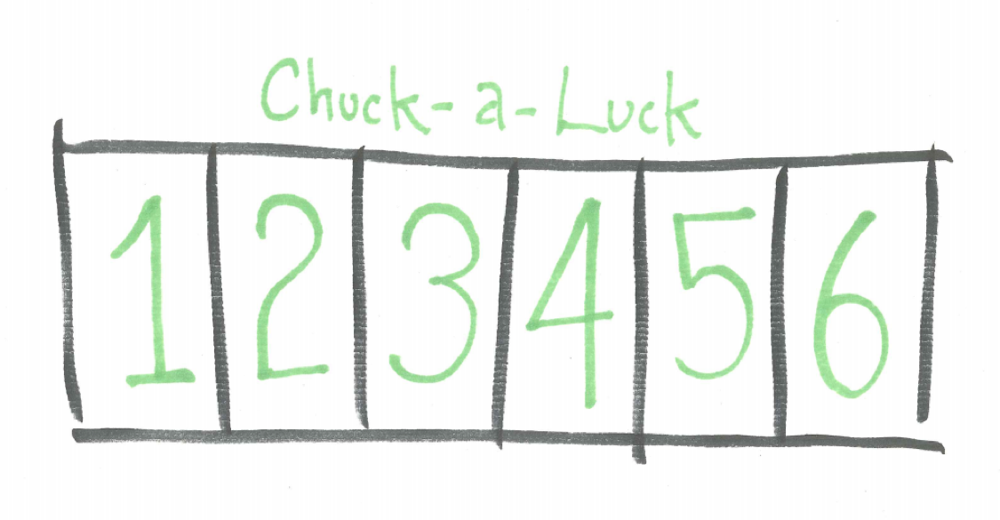
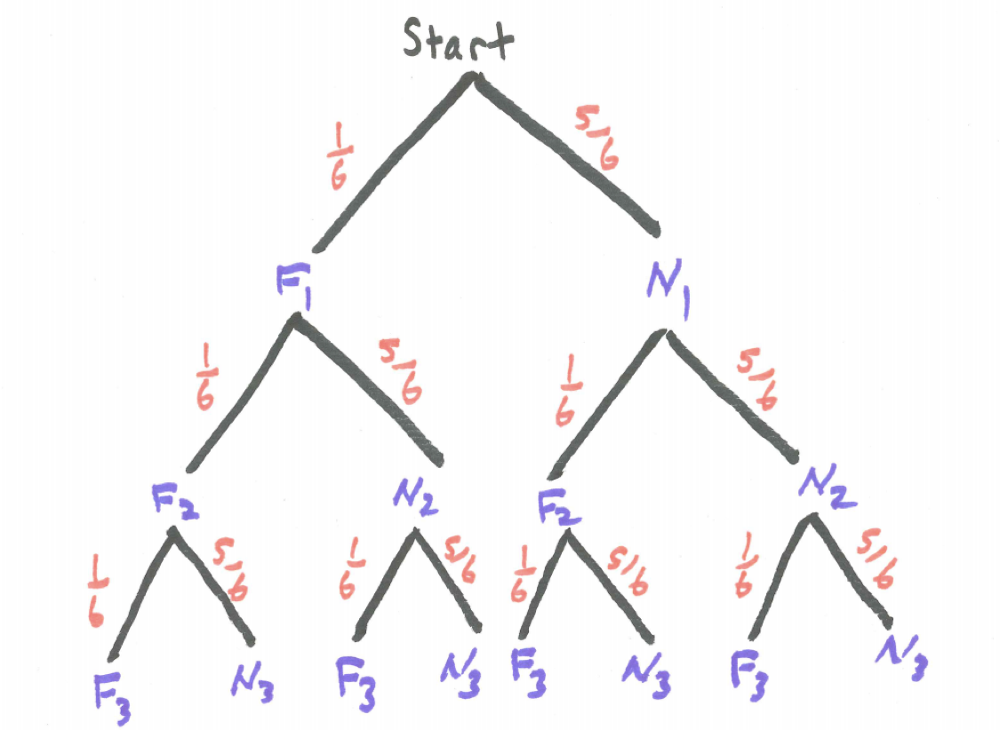

# Mathematical Expectation {#expectation}

## Introduction {#introduction}
We construct probability distributions and compute and interpret the mathematical expectation or expected value.

## Chapter Scenario - Chuck-a-Luck {#chapter_scenario_chuckaluck}
Chuck-A-Luck is a popular carnival game since it is easy to understand, easy to set-up, and easy to hide when the county-mounty shows up with a simple layout for betting as shown below. One bets on a number, one through six.  Three dice are rolled and you win the amount bet for each time that number shows. For example, if you bet $\$1$ on the number 5, if that number comes up once on the three dice you win $\$1$, if it comes up twice you win $\$2$, if it comes up three times you win $\$3$ but if it doesn't come up at all you lose $\$1$ (or we say your result is $\$1$). Is this game favorable to the players or to the house? In the long run, how much money per game would you expect to win or lose?

```{r nice-fig-81, fig.cap='Chuck-a-Luck Layout', out.width='30%', fig.asp=.75, fig.align='center', echo=FALSE}

```

## Example - Win Six

Let's start with a slightly simpler game we'll call Win Six. Suppose you bet $\$1$ then you roll a die. If a 1, 2, or 3 comes up you lose $\$1$. If a 4 or 5 comes up you win $\$1$. If a 6 comes up you win $\$6$. Hey, let’s call it Win Six!

Our goal is to analyze this game and determine the expected amount one would win. We call this the mathematical expectation whic is the theoretical mean or the weighted average of the outcomes weighted by their probabilities. We first want to describe the **probability distribution**, or the complete description of the different outcomes X and their associated probabilities, P(X).

* X P(X)
* -1 3/6
* 1 2/6
* 6 1/6


We get the mean/expected value by summing up the X times P(X) quantities. In formula form we say 

$$Mean = \sum_{x} x \cdot P(x)$$

We can determine this manually by adding the following column to the probability distribution and summing it.

* X P(X) XP(X)
* -1 3/6  -3/6
* 1 2/6   2/6
* 6 1/6   6/6

Sum = 5/6 = 0.833

Thus, the expected value for the game Win Six is $+\$0.83$. Note, since this number is positive that means this game is in the player's favor. (One reason you will not find this game in any casino!)


## Chapter Scenario Revisited - Chuck-a-Luck {#chapter_scenario_revisited_chuckaluck}

Recall that in the game of Chuck-a-Luck, three dice are rolled and you win the amount bet for each time that number shows. Let's assume $\$1$ is bet and, without loss of generality, let's assume we bet on the number 5. Using F to represent getting a 5 and N to represent not getting a five and using subscripts to denote the first, second, and third die yields the tree diagram below.

```{r nice-fig-82, fig.cap='Chuck-a-Luck Tree Diagram', out.width='30%', fig.asp=.75, fig.align='center', echo=FALSE}

```

Thus, $P(0 \ fives) = (5/6)^{3}$.
There are three different branches where the result is exactly one five thus, $P(1 \ five) = 3 \cdot (1/6) \cdot (5/6)^{2}$.
Similarly, three brances for exactly two fives so $P(2 \ fives) = 3 \cdot (1/6)^{2} \cdot (5/6)$.
Lastly, for three fives, $P(3 \ fives) = (1/6)^{3}.

If we let X represent the winnings in these circumstances we can write the probability distribution for X:

* X  P(X)
* -1  125/216
* +1   75/216
* +2   15/216
* +3    1/216

Calculating the mean/expected value shows 

$$Mean=\sum_{x} x \cdot P(x)= \\(-1) \cdot (125/216)+1 \cdot (75/216) +2 \cdot (15/216)+3 \cdot (1/216)=-17/216 $$

## Exercises {#exercises}

### Exercise - Slot Machine
Consider a dollar slot machine with three wheels each containing ten symbols. On each wheel there is one JACKPOT symbol and nine other non-jackpot symbols. You put $1 in the slot and the payoffs are as follows:
 
* If 3 JACKPOT symbols appear $487 is returned.
* If 2 JACKPOT symbols appear $10 is returned.
* If 1 JACKPOT symbol appears $1 is returned.

Find the expected value. Note, with slot machines you put in your $\$1$ so you start out $-\$1$. Make sure you take this into account in your calculations.


### Exercise - Fair Chuck-a-Luck
In the game of Chuck-a-Luck, if the $\$1$ payoff was increased to some higher payoff of d dollars per occurrence of the chosen number (so d for one occurrence, 2d dollars for two occurrences, and 3d dollars for three occurrences) find the value for d that would make the game fair (that is, make the expected value 0).

### Exercise - Chuck-a-Luck Big Prize
In the game of Chuck-a-Luck, if the payoff remained $\$1$ for the first occurrence of the chosen number and $\$2$ for two occurrences but changed to b dollars for three occurrences, find the value for b that would make the game fair (that is, make the expected value 0).

### Exercise - St. Petersburg Paradox
Here’s a game for you.  You flip a coin.  If it comes up tails on the first flip you win $1.  If it comes up heads on the first flip then tails you win $2.  If it comes up heads on the first two flips then tails you win $4.  If it comes up heads on the first three flips then tails you win $8.  And so on.  For example, if the first n flips are heads and the next one tails then you win 2n dollars.  How much would you be willing to pay to play this game?  Buffon played 2084 games.  His winnings for those games would have been $10,057.  Thus, what would you estimate the mathematical expectation to be based on his data? Now, complete the table below to calculate the mathematical expectaton. Does this answer sound reasonable to you? How does this theoretical probability match up with relative frequency.  

```{r nice-fig-83, fig.cap='St. Petersburg Paradox Probability Distribution Table', out.width='30%', fig.asp=.75, fig.align='center', echo=FALSE}
knitr::include_graphics("01-basics-figures/st_petersburg_table.png")
```


