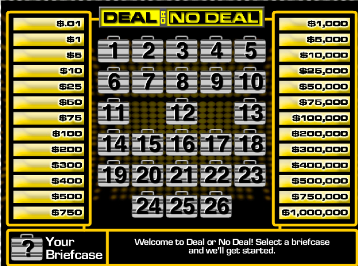
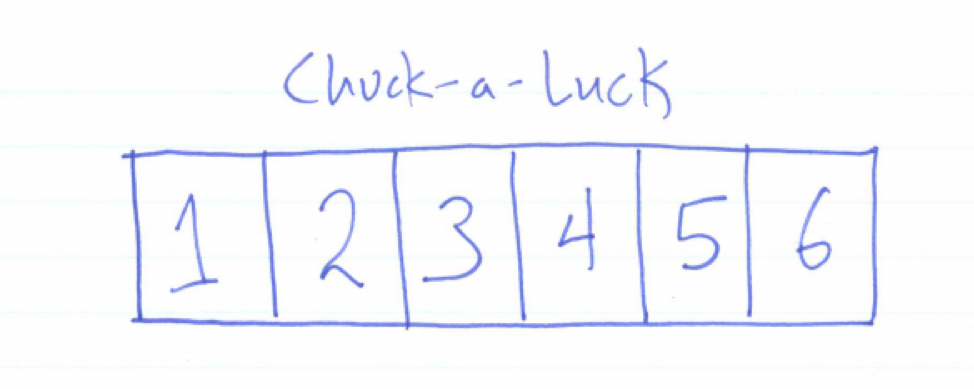
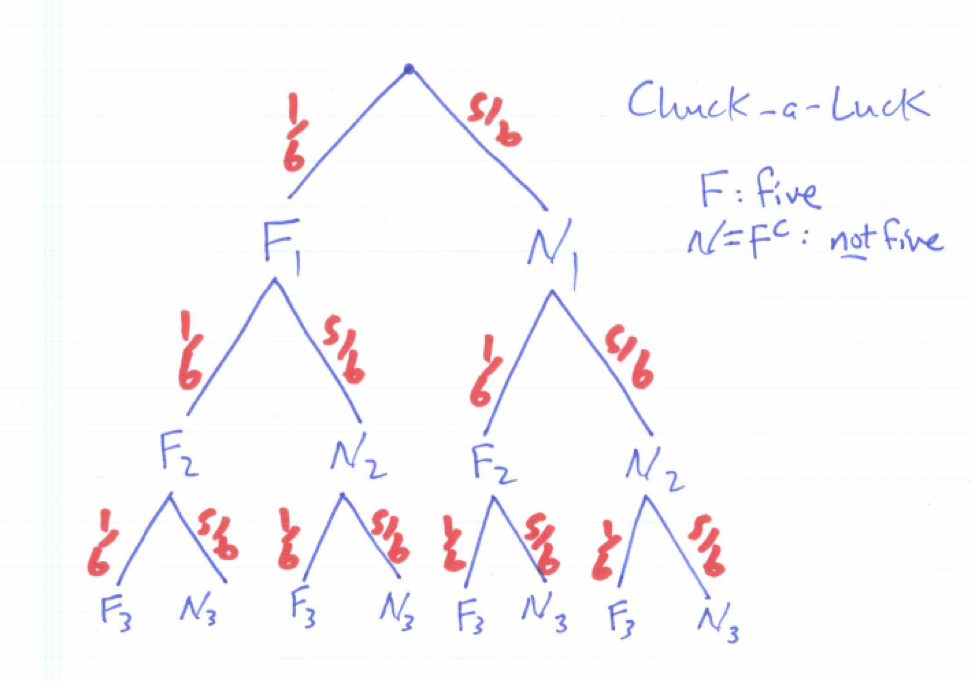
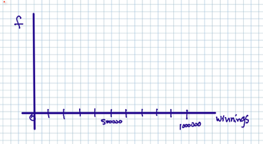
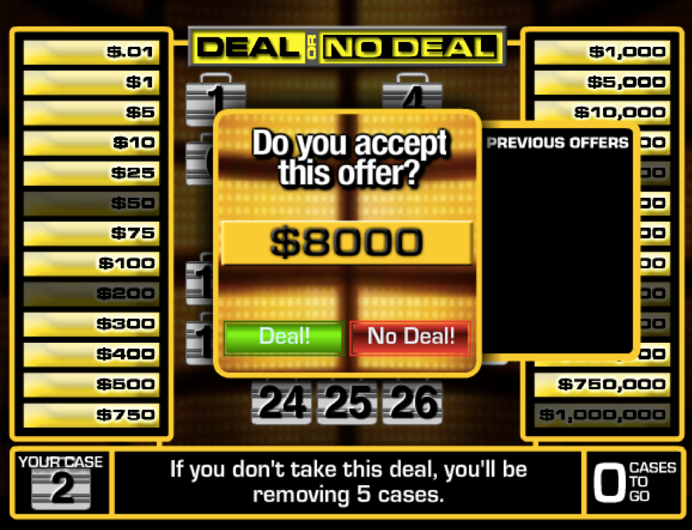
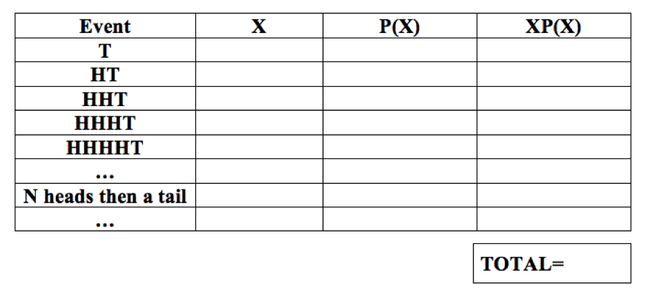

# Mathematical Expectation {#expectation}

```{r, message=FALSE, warning=FALSE, echo=FALSE}
library(mosaic)
set.seed(2018)
```

## Introduction {#introduction}
We construct probability distributions and compute and interpret the mathematical expectation or expected value.


## Chapter Scenario - Deal or No Deal {#chapter_scenario_deal_or_no_deal}

Have you ever seen the show Deal or No Deal? If so, I feel sorry for you! We can get a sense of Deal or No Deal by searching for an online version one of which can be found at 
http://www.gamesolo.com/flash-game/deal-or-no-deal.html .

```{r nice-fig-801, fig.cap='Howie Mandel and Deal or No Deal', out.width='40%', fig.asp=.75, fig.align='center', echo=FALSE}

```

A player chooses one of 26 suitcases each containing a different amount of money from $\$0.01$ to $\$1,000,000$. The values below show the dollar amounts of the 26 suitcases.

```{r nice-fig-802, fig.cap='Deal or No Deal Suitcases', out.width='60%', fig.asp=.75, fig.align='center', echo=FALSE}

```

Taking everything into account - your current financial situation, your philosophy of life, your personality, everything – what is the maximum amount you personally would be willing to pay for one chance to play Deal or No Deal and keep the amount in the suitcase you selected? What probability tools might help you make an informed decision? 

## Introducing Mathematical Expectation


## Example - Win Six

Let's start with a slightly simpler game we'll call Win Six. Suppose you bet $\$1$ then you roll a die. If a 1, 2, or 3 comes up you lose $\$1$. If a 4 or 5 comes up you win $\$1$. If a 6 comes up you win $\$6$. Hey, let’s call it Win Six!

Our goal is to analyze this game and determine the expected amount one would win. We call this the mathematical expectation whic is the theoretical mean or the weighted average of the outcomes weighted by their probabilities. We first want to describe the **probability distribution**, or the complete description of the different outcomes X and their associated probabilities, P(X).

* X P(X)
* -1 3/6
* 1 2/6
* 6 1/6


We get the mean/expected value by summing up the X times P(X) quantities. In formula form we say 

$$E[X] = \sum_{x} x \cdot P(x)$$

We can determine this manually by adding the following column to the probability distribution and summing it.

* X P(X) XP(X)
* -1 3/6  -3/6
* 1 2/6   2/6
* 6 1/6   6/6

Sum = 5/6 = 0.833

Thus, the expected value for the game Win Six is $+\$0.83$. Note, since this number is positive that means this game is in the player's favor. (One reason you will not find this game in any casino!)

## Example - Chuck-a-Luck {#example_chuckaluck}

Chuck-A-Luck is a popular carnival game since it is easy to understand, easy to set-up, and easy to hide when the county-mounty shows up with a simple layout for betting as shown below. One bets on a number, one through six.  Three dice are rolled and you win the amount bet for each time that number shows. For example, if you bet $\$1$ on the number 5, if that number comes up once on the three dice you win $\$1$, if it comes up twice you win $\$2$, if it comes up three times you win $\$3$ but if it doesn't come up at all you lose $\$1$ (or we say your result is $\$1$). Is this game favorable to the players or to the house? In the long run, how much money per game would you expect to win or lose?

```{r nice-fig-803, fig.cap='Chuck-a-Luck Layout', out.width='50%', fig.asp=.75, fig.align='center', echo=FALSE}

```

We can use the idea of mathematical expectation to analyze Chuck-a-Luck. Let's assume we bet on the number 5. We can do this without loss of generality because the analysis would be the same if we bet on other numbers. Using F to represent getting a 5 and N to represent not getting a five and using subscripts to denote the first, second, and third die yields the tree diagram below.

```{r nice-fig-804, fig.cap='Chuck-a-Luck Tree Diagram', out.width='70%', fig.asp=.75, fig.align='center', echo=FALSE}

```

Thus, $P(0 \ fives) = (5/6)^{3}$.
There are three different branches where the result is exactly one five thus, $P(1 \ five) = 3 \cdot (1/6) \cdot (5/6)^{2}$.
Similarly, three brances for exactly two fives so $P(2 \ fives) = 3 \cdot (1/6)^{2} \cdot (5/6)$.
Lastly, for three fives, $P(3 \ fives) = (1/6)^{3}.

If we let X represent the winnings in these circumstances we can write the probability distribution for X:

* X  P(X)
* -1  125/216
* +1   75/216
* +2   15/216
* +3    1/216

Calculating the mean/expected value shows 

$$E[X]=\sum_{x} x \cdot P(x)= \\(-1) \cdot (125/216)+1 \cdot (75/216) +2 \cdot (15/216)+3 \cdot (1/216)=-17/216=-0.0787 $$

This means we would lose on average close to 8 cents per dollar bet giving the carnival a $7.87\%$ house advantage.

## Chapter Scenario Revisited - Deal or No Deal {#chapter_scenario_revisited_deal_or_no_deal}

Recall that in Deal or No Deal a player chooses one of 26 suitcases each containing a different amount of money from $\$0.01$ to $\$1,000,000$. You were asked to determine the maximum amount you would be willing to pay for the privilege of selecting one suitcase and keeping the amount in this suitcase. Individual responses range widely. Some students would pay nothing or maybe $\$25$ while other students will pay as much as $\$500$. We can apply probability tools like simulation and mathematical expectation developed above to inform our decision. First, let's visualize the distribution of suitcase amounts. 

### Practice 
If a number of games of Deal or No Deal were played and the results recorded, what would you expect for shape, center, and spread of the data set? What might you expect for the average? To help you think about shape, note that the axes for a histogram would look something like the image below:

```{r nice-fig-805, fig.cap='Deal or No Deal Histogram Template', out.width='80%', fig.asp=.75, fig.align='center', echo=FALSE}

```

### Simulating Deal or No Deal

We can simulate a large number of trials of the game Deal or No Deal with the code below, first creating a vector with the suitcase amounts and then sampling from this vector. We'll simulate playing the game 10,000 times.

```{r}
suitcases <- c(0.01, 1, 5, 10, 25, 50, 75, 100, 200, 300, 400, 
       500, 750, 1000, 5000, 10000, 25000, 50000, 75000, 
       100000, 200000, 300000, 400000, 500000, 750000, 1000000)
amount <- sample(x=suitcases, size=10000, replace=TRUE)
deal_sim <- data.frame(amount)
head(deal_sim)
```

We can visualize the results and see if our preconception regarding the distribution was accurate or not. 

```{r nice-fig-806, fig.cap='Deal or No Deal Simulation Results', out.width='80%', fig.asp=.75, fig.align='center'}
ggplot(deal_sim, aes(amount))+geom_histogram()
```

And we can run the numbers.

```{r nice-fig-807, fig.cap='Deal or No Deal Simulation Stats', out.width='80%', fig.asp=.75, fig.align='center'}
deal_sim_stats <- favstats(deal_sim$amount)
deal_sim_stats
```

How similar or different are the simulation results for shape, center, and spread compared to your predictions above? 

### Practice
Discuss the two main measures of center – mean and median – for this data set. The mean is the arithmetical average while the median is the middle number of the data set when put in rank order. Were they close to one another or quite different? Explain.

While simulation is an effective tool to explore Deal or No Deal outcomes we can also analyze the probability distribution and find the expected mean value, the median, and the standard deviation. Below is the R code creating the outcome variable `suitcase` and the probability variable `probs` to begin this analysis. Note the probability of any given suitcase being selected is $1/26$. The `suitcases` variable code is duplicated from above for clarity.

```{r}
suitcases <- c(0.01, 1, 5, 10, 25, 50, 75, 100, 200, 300, 400, 
       500, 750, 1000, 5000, 10000, 25000, 50000, 75000, 
       100000, 200000, 300000, 400000, 500000, 750000, 1000000)
probs <- rep(1/26, 26)
```

The expectation is the sum of the suitcase amounts multiplied by their probabilities. This is easy to do by simply multiplying the `suitcase` vector by the `probs` vector.

```{r}
deal_expectation <- sum(suitcases*probs)
deal_expectation
```

It is suprising to many that the expectation is $\$131,477.50$. This is the amount the show would need to budget for for each game played. 

The median is quite different. With 26 different suitcase amounts, the median would be halfway between the 13th and the 14th ordered suitcase amounts. That means the theoretical median is $(750 + 1000)/2=875$. The median from our simulation is `r deal_sim_stats$median` with the median usually being either 750 or 1000 and only rarely being exactly 875.

Two other important measures are the variance and the standard deviation which both help describe the variablility of the outcomes which will be discussed in the next chapter. 

### Reflection 
To reflect on what we’ve just experienced think back on the personal maximum you were willing to invest to play one round of Deal or No Deal. Thinking about the opportunity to play one round of Deal or No Deal as an investment opportunity, describe how this information from the simulated sample and the theoretical analysis impacts your thinking about your own personal maximum. Would you now consider paying the same, more, or less than you earlier indicated? In what way were the probability tools including simulation and expected value helpful tools in analyzing Deal or No Deal?

## Deal or No Deal Extended

In the actual Deal or No Deal game, you open a few suitcases at a time to see what you missed out on and after each round the banker offers you a fixed amount. You can take this money and run or you can keep playing – it is up to you. We just played the first round of the Deal or No Deal flashgame (http://www.gamesolo.com/flash-game/deal-or-no-deal.html) and opened six of the suitcases. 

```{r nice-fig-808, fig.cap='Deal or No Deal First Offer', out.width='70%', fig.asp=.75, fig.align='center', echo=FALSE}

```


We lost out on 50, 200, 50000, 300000, 400000, and the big one, 1000000. Not so good. We are bad at this game. After this, the banker offers us 8000. Should we take the money and run? Let's calculate the expectation first. We do this by removing these suitcases, changing the probabilities and recomputing the expectation. How much does our expected value decrease?

```{r}
new_suitcases <- c(0.01, 1, 5, 10, 25, 75, 100, 300, 400, 
       500, 750, 1000, 5000, 10000, 25000, 75000, 
       100000, 200000, 500000, 750000)
new_probs <- rep(1/20, 20)
new_deal_expectation <- sum(suitcases*probs)
new_deal_expectation
```


## Exercises {#exercises}

### Exercise - Slot Machine
Consider a dollar slot machine with three wheels each containing ten symbols. On each wheel there is one JACKPOT symbol and nine other non-jackpot symbols. You put $1 in the slot and the payoffs are as follows:
 
* If 3 JACKPOT symbols appear $487 is returned.
* If 2 JACKPOT symbols appear $10 is returned.
* If 1 JACKPOT symbol appears $1 is returned.

Find the expected value. Note, with slot machines you put in your $\$1$ so you start out $-\$1$. Make sure you take this into account in your calculations.

### Exercise - Design Your Own Slot Machine
Consider a simple one dollar slot machine that has three identical wheels each of which has 10 symbols (not necessarily all distinct). Your job is to design an interesting slot machine giving the casino between a 10% and 15% house advantage (that is, the expected value is between -0.10 and -0.15). To do this you need to describe the symbols on each wheel, the combinations that receive a specific payoff, and analyze the slot machine by finding expected value.

### Exercise - Fair Chuck-a-Luck
In the game of Chuck-a-Luck, if the $\$1$ payoff was increased to some higher payoff of d dollars per occurrence of the chosen number (so d for one occurrence, 2d dollars for two occurrences, and 3d dollars for three occurrences) find the value for d that would make the game fair (that is, make the expected value 0).

### Exercise - Chuck-a-Luck Big Prize
In the game of Chuck-a-Luck, if the payoff remained $\$1$ for the first occurrence of the chosen number and $\$2$ for two occurrences but changed to b dollars for three occurrences, find the value for b that would make the game fair (that is, make the expected value 0).

### Exercise - St. Petersburg Paradox
Here’s a game for you.  You flip a coin.  If it comes up tails on the first flip you win $1.  If it comes up heads on the first flip then tails you win $2.  If it comes up heads on the first two flips then tails you win $4.  If it comes up heads on the first three flips then tails you win $8.  And so on.  For example, if the first n flips are heads and the next one tails then you win 2n dollars.  How much would you be willing to pay to play this game?  Buffon played 2084 games.  His winnings for those games would have been $10,057.  Thus, what would you estimate the mathematical expectation to be based on his data? Now, complete the table below to calculate the mathematical expectaton. Does this answer sound reasonable to you? How does this theoretical probability match up with relative frequency.  

```{r nice-fig-809, fig.cap='St. Petersburg Paradox Probability Distribution Table', out.width='70%', fig.asp=.75, fig.align='center', echo=FALSE}

```

### Exercise - Squared Dots
(a) Here is a simple game. Roll a die and receive as many dollars as dots that are showing. How much is this game worth?
(b) Suppose you play a second game where you roll one die, observe the number of dots, and receive the square of that number in dollars. How much is this game worth? 
(c) The payoff for the second game is always the square of the corresponding payoff for the first game. Is the expectation/mean for the second game the square of the expectation/mean of the first game, more, or less? Explain.

### Exercise - Raising the Stakes
You lay down a dollar and I lay down a dollar. Then we each roll a die. You roll first. The person with the highest result wins both dollars. If there is a tie the money is divided. 
(a) If you begin and roll a 3 then what is your expectation/mean?
(b) What is the expectation/mean for the other possible outcomes?
(c) Consider the following wrinkle. Suppose that right after you make your roll, you may immediately roll again but if you exercise this option you must put an additional dollar in the pot. When should you decide to exercise this option and take a second roll?
(Source: Freudenthal. Probability and Statistics.)

### Exercise - Deal or No Deal Revisited
When you play Deal or No Deal after each round the banker offers you a fixed amount. You can take this money and run or you can keep playing – it is up to you. Play the first round of the Deal or No Deal flashgame (http://www.gamesolo.com/flash-game/deal-or-no-deal.html) by opening six of the suitcases and determine your new expected value. Based on this information and amount the banker was willing to pay you to quit, determine whether or not you would take the banker’s offer.


