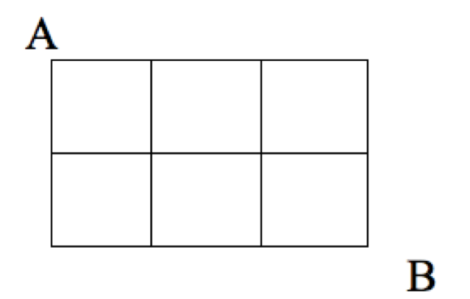

# Combinations {#combinations}

## Introduction {#introduction}

While permutations count ordered arrangements, combinations are unordered collections of items.


## Chapter Scenario - Three Counting Problems and an Algebra Problem {#chapter_scenario_three_counting_problems}

Below are three counting problems and one algebra problem. On the surface these appear to be unrelated problems but can you find a deep connection between them? It might help to team up with classmates to gain multiple perspectives. 

Problem 1: Write down all the possible birth orderings for a family of three boys and two girls (for example, BGBBG is one of them).

Problem 2: Find the number of ways that you can walk along the blocks from point A to point B by a path of shortest length.

```{r nice-fig-101, fig.cap='Block-walking Scenario', out.width='30%', fig.asp=.75, fig.align='center', echo=FALSE}

```

Problem 3: How many ways could two captains be chosen from the five starting members of a basketball team?

Problem 4: Expand the following: $(p + q)^{5}$.

## Example - From Class Line-up to Class Committee {#example_class_lineup_to_class_committee}

If we were to select four people from our class of 20 and line them up, this could be done $P(20,4)=20!/16!=20 \cdot 19 \cdot 18 \cdot 17$ ways. But if we are interested in the number of unordered committees of four rather than ordered line-ups we notice that for each selection of four people, there were $4!=4 \cdot 3 \cdot 2 \cdot 1$ line-ups counted so the number of unordered committees is $(20 \cdot 19 \cdot 18 \cdot 17)/(4 \cdot 3 \cdot 2 \cdot 1)$. 

We call an undordered collection of k objects selected from n distinct objects a combination and use the notation $\dbinom{n}{k}$. A simple way to think of this is to find the permutation of k objects selected from n objects, $P(n,k)=n!/(n-k)!$ and divide out the order, $k!$. Putting all this together we get the following formula.

## Combination Formula

The number of unordered collections of k objects selected from n distinct objects is 

$$\dbinom{n}{k}=\frac{P(n,k)}{k!}=\frac{n!}{(n-k)!k!}=
\frac{n(n-1)(n-2)...(n-k+1)}{k(k-1)(k-2)...3 \cdot 2 \cdot 1}$$

Using this notation to recap the number of unordered committees selected from 20 students we see

$$\dbinom{20}{4}=\frac{20!}{16! \cdot 4!}=\frac{20 \cdot 19 \cdot 18 \cdot 17}{4 \cdot 3 \cdot 2 \cdot 1}$$


## Exercises 

### Exercise - Alphabet
Consider the 26 letters in our alphabet.

(a) How many different three letter strings can we make if repetition of letters is allowed?

(b) How many different three letter strings can we make if repetition of letters is not allowed?

(c) How many ways could three different letters be chosen?

### Exercise - Facts about Combinations

(a) What is $\dbinom{n}{0}$ for all $n \geq 1$?
(b) What is $\dbinom{n}{1}$ for all $n \geq 1$?
(c) What is $\dbinom{n}{n}$ for all $n \geq 1$?
(d) What is the relationship between $\dbinom{n}{k}$ and $\dbinom{n}{n-k}$?

## The Problem of the Points {#problem_of_the_points}


## Chapter Scenario - The BART Series {#chapter_scenario_the_bart_series}

Suppose a game is stopped midway. How should the stakes be split if the game is not complete  but one player is ahead of the other? This famous problem is known as the “Problem of the Points” and stimulated Blaise Pascal to generate some new ideas early in the development of probability theory. In this application we see how our tool of drawing tree diagrams helps us think it through. 

Let’s use baseball as an example. In the Major League Baseball World Series, teams play a series of up to seven games and the first team to win four games wins the series and is declared “world champions” (even though it is just the U.S. and a few Canadian teams). 

An interesting thing happened in the 1989 World Series between the Oakland Athletics and the San Francisco Giants, often called the “Battle of the Bay” or the “BART Series” for the Bay Area Rapid Transit System one would take to the opposite sides of the San Francisco Bay. The Oakland A’s were ahead two games to nothing when the interesting thing happened - an earthquake. Here is how Wikipedia describes it:

"On October 17, just minutes before the start of Game 3, a magnitude 6.9 earthquake struck the Bay Area causing significant damage to both Oakland and San Francisco. Candlestick Park in San Francisco suffered damage to its upper deck as pieces of concrete fell from the baffle at the top of the stadium and the power was knocked out. The game was postponed out of concerns for the safety of everyone in the ballpark as well as the loss of power, with Vincent later saying that he did not know when play would resume." (https://en.wikipedia.org/wiki/1989_World_Series)

Suppose the series had to be permanently suspended at this point. How should the prize money be split? This is essentially an example of the famous “problem of the points.” What do you think would be a fair division of the prize money between the Oakland A’s and the San Francisco Giants? In other words, what percentage of the prize money should the Oakland A’s get and what percentage of the prize money should the San Francisco Giants get? We will use a tree diagram to solve this problem but let's start with a simpler case. 

## A Simpler Case - A Three-Two Split

Suppose the LA Dodgers and the Houston Astros are in the World Series and the Dodgers are ahead of the Astros 3-2. We can use a tree diagram to decide on the fair division of the prize money should the series be suspended at this point.

With five games already played, there are potentially two remaining games which can be described in a tree diagram where D represents a Dodger win and A represents an Astros win. Assuming each team has the same chance of winning a new game, the four branches are equally likely.  If the Dodgers win one more game, they win the series. Three of the four include at least one Dodger win and only one branch shows Houston winning the series, so a fair way to split the prize money would be a 3:1 split with the Dodgers receiving 75% of the prize money and Houston receiving 25%.

Once we are comfortable we can see a shortcut to solve the problem of the points. With two remaining games left and the Dodgers needing only one to win we can examine the second row of Pascal's triangle and identify the appropriate point in the row that represents at least on Dodger win.

$$ \dbinom{2}{0} : \dbinom{2}{1} + \dbinom{2}{2}$$

You may have noticed that if the Dodgers win the next game a seventh game is not played but is included in the tree diagram. The extra branches were included in the diagram so that we could examine equally likely cases. An alternative is to place probabilities on the branches and terminate the tree when the series is over as in the diagram below.

$$P(\text{Dodgers win})=0.5 + 0.5 \cdot 0.5 = 0.75$$
$$P(\text{Astros win})=0.5 \cdot 0.5=0.25$$

Thus, the split should be 75:25 or 3:1 in favor of the Dodgers.

## Chapter Scenario Revisited - The BART Series {#chapter_scenario_revisited_the_bart_series}

In the original problem the Dodgers are ahead of the Astros 2 games to 0 with a potential of 5 remaining games yielding a tree diagram with 32 equally likely outcomes. If the Dodgers win 2 of the games they win the series.

In the tree diagram, there are 26 brances in which the Dodgers win the series and 6 in which the Astros win the series meaning the prize money should be split 26:6 in favor of the Dodgers.

Solving using Pascal's triangle, for the five potential games, if the Dodgers win at least two they win the series.

$$\dbinom{5}{0} + \dbinom{5}{1} : \dbinom{5}{2} + \dbinom{5}{3} + \dbinom{5}{4} + \dbinom{5}{5}$$ 

$$1+5:10+10+5+1 = 6:26$$


### Exercise - A Three:One Split
Suppose the LA Dodgers and the Houston Astros are in the World Series and the Dodgers are ahead of the Astros 3-1. Use a tree diagram to decide on the fair division of the prize money should the series be suspended at this point.

### Exercise - A Three:Zero Split
Suppose the LA Dodgers and the Houston Astros are in the World Series and the Dodgers are ahead of the Astros 3-0. Use combinations and Pascal’s Triangle to decide on the fair division of the prize money should the series be suspended at this point.


