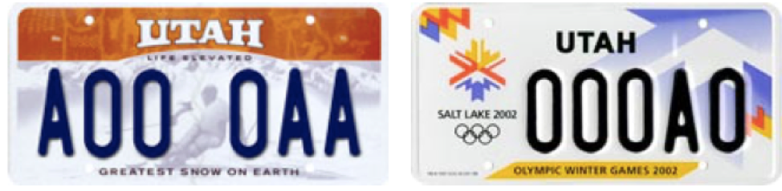

# Permutations {#permutations}

```{r, message=FALSE, warning=FALSE, echo=FALSE}
library(mosaic)
set.seed(2018)
```

## Introduction {#introduction}

Determine correct probabilities relies heavily on correct counting. Combinatorics is the mathematics of counting and in this chapter we learn how to count ordered arranements (permutations) and unordered collections (combinations) for the ultimate purpose of tracking the probabilities of repeated events.

## Chapter Scenario - GATC   {#chapter_scenario}


## Permutations {#permutations}

Permutations are ordered arrangements. If we are given n distinct objects and are to select k of them and place them in order, we call this the permutation of k objects taken from n and symbolize it as P(n,k). By looking at some examples we will determine how to calculate permutations.

One key to calculating permutations is using the Fundamental Principle of Counting. 

## Fundamental Counting Principle Principle{#fundamental_counting_principle}

Consider a multi-step process requiring k steps. If Step1 can be done $n_{1}$ ways, Step2 done $n_{2} ways, and so on up to Step k being done $n_{k} ways, then the total number of ways the entire process can be done $n_{1} \cdot n_{2} \cdot ... \cdot n_{k}$ ways.

Suppose you are playing scrabble and have four distinct letters, say A, S, N, and P. Not all of rearrangements are real words, of course, but how many total rearrangements of these four letters would we need to consider to check all the possible permuations? A tree diagram helps and shows there are 24 different orderings. Using the FPC there are four choices for the first letter, three for the second, two for the third, and only one choice left for the last letter making the total $4 \cdot 3 \cdot 2 \cdot 1=4!=24$. Thus, $P(4,4)=4!=24$.

Suppose you have seven distinct letters and you want to identify how many four-letter strings could be made. Using the Fundamental Counting Principle there are seven choices for the first letter, six for the second, and so on for a total of $P(7,4)=7 \cdot 6 \cdot 5 \cdot 4$ which is the same as $7!/3!$. We describe this as a general formula below.

## Permutation Formula

The number of orderings of k objects taken from n distinct objects is $P(n,k)=n!/(n-k)!=n \cdot (n-1) \cdot (n-2) \cdot ... \cdot (n-k+1)$.

## Example - The Line-up

Suppose that members of our class, all 20 of you, are to be seated in a row. How many ways can this be done? Ordering 20 people selected from 20 people is $P(20,20)=20!/0!=20!$. 

What if Alice and Bob refuse to sit beside one another? Using the Complement Principle, let's force them to sit together, count this, and subtract from the total. Think of putting a rubberband around them then we have only 19 things to order which can be done $19!$ ways and then there are 2 orders for Alice and Bob so seating orders with them together is $2! \cdot 19!$. Putting this together

$$(\# \text{ of ways with Alice and Bob apart}) = \\ 
(\text{Total}) - (\# \text{ of ways with Alice and Bob together}) = \\
20! - 2! \cdot 19!$$

What if there are 10 men and 10 women and we want no two men sitting together and no two women sitting together? Suppose we start with a man. Then alternating sex and using the Fundamental Counting Principle we see this can be done $10 \cdot 10 \cdot 9 \cdot 9 \cdot 8 \cdot ... \cdot 1 \cdot 1 = 10! \cdot 10!$. Since we could start either with a man or with a women, two choices, the total is $2 \cdot 10! \cdot 10!$.


## Example - The MISSISSIPPI Problem {#example_the_mississippi_problem}

How many arrangments are there of the word MISSISSIPPI? The issue we need to deal with is the repeated letters - there are four S's, four I's, and two P's. If the word was LUMBERJACKS the answer would be $11!$ because all the letters are unique.

Let's tackle a smaller problem, learn from it, and then ramp it up. Consider the word MISS. If the letters were all unique it would be $4!$ orderings but in reality there are only twelve. To see why pretend we could tell the P's apart with color or subscripts. Then each unique ordering of $MISS$ is duplicated in the orderings of $MIS_{1}S_{2}$ because of the $2!$ orderings of the S's. So, the total orderings of $MISS$ is $4!/2!$.

Orderings of $MISSI$ has to account for two S's and two I's so there are a total of $5!/(2! \cdot 2!)$.

Orderings of $MISSISS$ has to account for four S's and two I's. Imagining subscrips of four S's would yield $4!$ orderings. Taking care of everything, the total orderings of $MISSISS$ is $7!/(4! \cdot 2!)$.

Tackling MISSISSIPPI, the total number of orderings is $11!/(4! \cdot 4! \cdot 2!)$.

## Exercises {#exercises}

## Exercises - Scrabble
If you have six unique letters, how many total orderings are there of those six letters? How many total orderings are there including those not using all six letters?

### Exercise - The Name Game 
Find the number of possible rearrangements for the following names - JON, BRAN, TYRION, TORMUND, KERMIT, ARYA, SANSA, JOFFREY, ELLARIA, CERSEI, EDDARD, LITTLEFINGER, DAENERYS TARGARYEN (as one word), DAENERYS TARGARYEN (as two words keeping first name letters together and last name letters together).

### Exercise - License Plates

```{r nice-fig-1001, fig.cap='Utah License Plates', out.width='60%', fig.asp=.75, fig.align='center', echo=FALSE}

```

How many different license plates are there? See if you can determine the total number of license plates under the following schemes. 

(a) Life Elevated Skier or Arches
This plate contains six characters, consisting of one letter followed by three numbers followed by two letters. 

(b) Olympic
This plate was issued to commemorate the 2002 Olympic Winter Games held in Salt Lake City. As of July 1, 2002.It consists of three numbers followed by a letter followed by a number.

(c) Personalized Standard Life Elevated Skier or Arches plates
For Utah personalized license plates, the type of plate requested limits the number of characters that may be used on the plate, with the Life Elevated Skier or Arches plates allowing up to seven characters which may be either numbers or letters.

(d) Personalized Motorcycle Plates
These plates allow up to four characters which may be numbers or letters.

### Exercise - Facts about Permutions

(a) What does P(n,1) equal for all $n \geq 1$?
(b) What does P(n,n) equal for all $n \geq 1$?
(c) What is the relationship between P(n,n-1) and P(n,n)?
