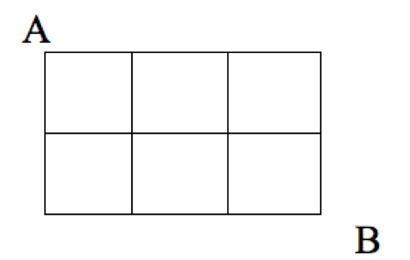

# Combinations {#combinations}

```{r, message=FALSE, warning=FALSE, echo=FALSE}
library(mosaic)
library(animation)
set.seed(2018)
```

## Introduction {#introduction}

While permutations count ordered arrangements, combinations are unordered collections of items.


## Chapter Scenario - Three Counting Problems and an Algebra Problem {#chapter_scenario_three_counting_problems}

Below are three counting problems and one algebra problem. On the surface these appear to be unrelated problems but can you find a deep connection between them? It might help to team up with classmates to gain multiple perspectives. 

Problem 1: Write down all the possible birth orderings for a family of three boys and two girls (for example, BGBBG is one of them).

Problem 2: Find the number of ways that you can walk along the blocks from point A to point B by a path of shortest length.

```{r nice-fig-1101, fig.cap='Block-walking Scenario', out.width='40%', fig.asp=.75, fig.align='center', echo=FALSE}

```

Problem 3: How many ways could two captains be chosen from the five starting members of a basketball team?

Problem 4: Expand the following: $(p + q)^{5}$.

## Example - From Class Line-up to Class Committee {#example_class_lineup_to_class_committee}

If we were to select four people from our class of 20 and line them up, this could be done $P(20,4)=20!/16!=20 \cdot 19 \cdot 18 \cdot 17$ ways. But if we are interested in the number of unordered committees of four rather than ordered line-ups we notice that for each selection of four people, there were $4!=4 \cdot 3 \cdot 2 \cdot 1$ line-ups counted so the number of unordered committees is $(20 \cdot 19 \cdot 18 \cdot 17)/(4 \cdot 3 \cdot 2 \cdot 1)$. 

We call an undordered collection of k objects selected from n distinct objects a combination and use the notation $\dbinom{n}{k}$. A simple way to think of this is to find the permutation of k objects selected from n objects, $P(n,k)=n!/(n-k)!$ and divide out the order, $k!$. Putting all this together we get the following formula.

## Combination Formula

The number of unordered collections of k objects selected from n distinct objects is 

$$\dbinom{n}{k}=\frac{P(n,k)}{k!}=\frac{n!}{(n-k)!k!}=
\frac{n(n-1)(n-2)...(n-k+1)}{k(k-1)(k-2)...3 \cdot 2 \cdot 1}$$

Using this notation to recap the number of unordered committees selected from 20 students we see

$$\dbinom{20}{4}=\frac{20!}{16! \cdot 4!}=\frac{20 \cdot 19 \cdot 18 \cdot 17}{4 \cdot 3 \cdot 2 \cdot 1}$$

## Chapter Scenario Revisited - Three Counting Problems and an Algebra Problem

After tackling these problems one at a time, we will search for underlying links between them.

### Problem 1 - Birth Orderings
Write down all the possible birth orderings for a family of three boys and two girls (for example, BGBBG is one of them).

#### Solution 1 - Brute Force
Letting B represent a boy birth and G a girl birth and putting two B's and three G's in a sequence allows us to list all the possible birth orderings. To do this in a systematic way we can list them in alphabetical order and see there are 10 different birth orderings of two boys and three girls.

* BBBGG
* BBGBG
* BBGGB
* BGBBG
* BGBGB
* BGBBG
* GBBBG
* GBBGB
* GBGBB
* GGBBB

#### Solution 2 - Combinations
We can view the problem of identifying a particular birth ordering of two boys and three girls as selecting the birth order position of the two boys or the birth order position of the three girls. Selecting the birth order position of the two boys is equivalent to selecting an unordered collection of two numbers from the set identifying the five birth order positions, {1,2,3,4,5}. This can be done $\dbinom{5}{2}=\frac{5!}{3! \cdot 2!}=10$ ways. Equivalently, selecting the birth order position of the three girls is equivalent to selecting an unordered collection of three numbers from the set {1,2,3,4,5} which can be done $\dbinom{5}{3}=\frac{5!}{2! \cdot 3!}=10$ ways, arriving at the same solution.


### Problem 2 - Block-walking 
Find the number of ways that you can walk along the blocks from point A to point B by a path of shortest length.

```{r nice-fig-1102, fig.cap='Block-walking Scenario', out.width='40%', fig.asp=.75, fig.align='center', echo=FALSE}

```

#### Solution 1 - Brute Force

We can illustrate the 10 different paths of shortest length from A to B.

```{r nice-fig-1103, fig.cap='Block-walking Solutions', out.width='30%', fig.asp=.75, fig.align='center', echo=FALSE}
#knitr::include_graphics("01-basics-figures/block_walking_solutions.png")
```

#### Solution 2 - Combinations

If we identify the directions one can travel as down (D) or across (A), then a path of shortest length from A to B is a five-block walk described as a sequence of two D's and three A's. Again, we could choose which of the five blocks are the two down blocks as the number of unordered collection of two objects chosen from {1,2,3,4,5} which is $\dbinom{5}{2}=\frac{5!}{3! \cdot 2!}=10$ or, equivalently, thinking about the across blocks, the number of unordered collection of three objects chosen from {1,2,3,4,5} which is $\dbinom{5}{3}=\frac{5!}{2! \cdot 3!}=10$.

In solving the problem using a combinations perspective we see that under the surface, Problems 1 and 2 are equivalent.

### Problem 3 - Team Captains 
How many ways could two captains be chosen from the five starting members of a basketball team?

#### Solution 1 - Brute Force

Numbering the players 1,2,3,4, and 5 and selecting two of them to be captains results in the following ten possibilities:

* 1,2
* 1,3
* 1,4
* 1,5
* 2,3
* 2,4
* 2,5
* 3,4
* 3,5
* 4,5

#### Solution 2 - Combinations

Given players as members of the set {1,2,3,4,5} we want to select two of them, order not mattering which can be done $\dbinom{5}{2}=\frac{5!}{3! \cdot 2!}=10$ ways. Note, this is equivalent to counting the number of ways we can choose the three non-captains, $\dbinom{5}{3}=\frac{5!}{2! \cdot 3!}=10$.

From this solution, we see that Problems 1, 2, and 3, although from very different real-world contexts, are combinatorially equivalent.

### Problem 4 - Binomial Expansion 
Expand the following: $(p + q)^{5}$.

#### Solution 1 - Brute Force

Traditionally, if we expand the binomial product above using the distributive property (often memorialized as the FOIL method) we arrive at the following terms. It's not fun, and not always safe to try this at home but here are the results.

```{r nice-fig-1104, fig.cap='Binomial Expansion', out.width='30%', fig.asp=.75, fig.align='center', echo=FALSE}
#knitr::include_graphics("01-basics-figures/binomial_expansion.png")
```


#### Solution 2 - Combinations

In using the distributive property to multiply out $(a+b)^{5}$, we essentially have to choose a's or b's in each of the five binomial terms. If we focus on the b's, we can choose zero b's which can be done $\dbinom{5}{0}$ ways, one b which can be done $\dbinom{5}{1}$ ways, two b's which can be done $\dbinom{5}{2}$ ways, three b's which can be done $\dbinom{5}{3}$ ways, four b's which can be done $\dbinom{5}{4}$ ways, or five b's which can be done $\dbinom{5}{5}$ ways. This results in the following terms.

$$(a+b)^{5}=\dbinom{5}{0}a^{5} + \dbinom{5}{1}a^{4}b +\dbinom{5}{2}a^{3}b^{2} +\dbinom{5}{3}a^{2}b^{3} +\dbinom{5}{4}ab^{4} +\dbinom{5}{5}b^{5}$$

In general, this result is known as the binomial theorem. The coefficient on the $a^{3}b^{2}$ term can be interpreted as the number of orderings of three a's and two b's, or as a combination $\dbinom{5}{2}$. What may not have been clear to us through all the years of learning algebra is that multiplying out a binomial product is really a combinatorial problem.

## Exercises 

### Exercise - Alphabet
Consider the 26 letters in our alphabet.

(a) How many different three letter strings can we make if repetition of letters is allowed?

(b) How many different three letter strings can we make if repetition of letters is not allowed?

(c) How many ways could three different letters be chosen?

### Exercise - Facts about Combinations

(a) What is $\dbinom{n}{0}$ for all $n \geq 1$?
(b) What is $\dbinom{n}{1}$ for all $n \geq 1$?
(c) What is $\dbinom{n}{n}$ for all $n \geq 1$?
(d) What is the relationship between $\dbinom{n}{k}$ and $\dbinom{n}{n-k}$?
