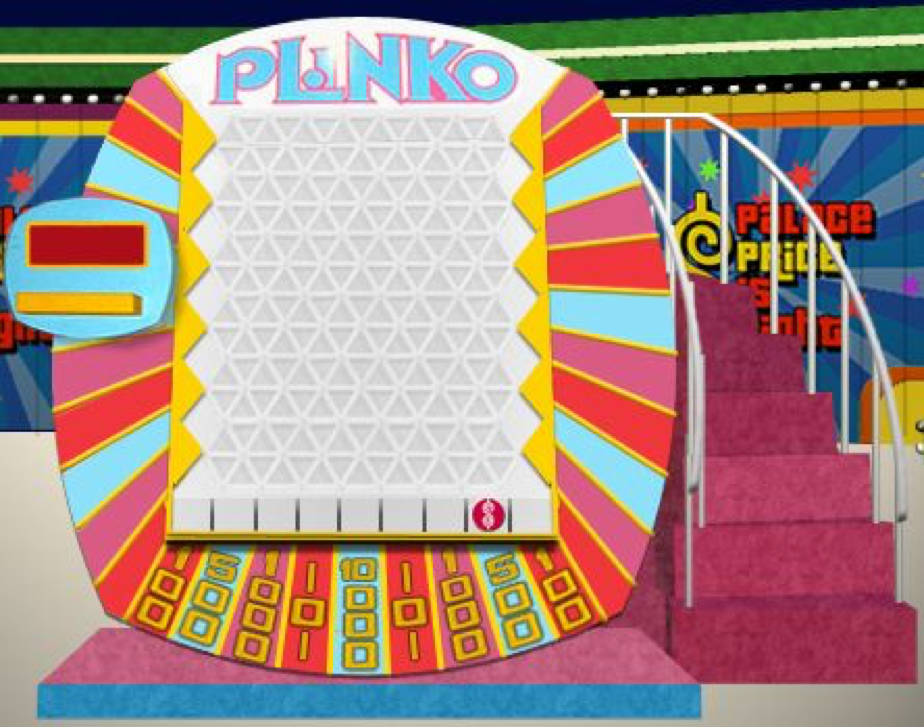

# Case Study - Block-walking, Tree Diagrams, and the Quincunx {#case_study_blockwalking}

```{r, message=FALSE, warning=FALSE, echo=FALSE}
library(mosaic)
library(animation)
set.seed(2018)
```


## Chapter Scenario - The Quincunx {#chapter_scenario_the_quincunx}

A Quincunx, (or Galton Board or Bean Machine), is a board with evenly spaced pegs laid out in a triangular grid as shown in the figure below. A ball is dropped onto the board from a funnel at the top center and bounces its way to the bottom in such a way that each time it hits a peg is has an equal chance of bouncing left or right. At the bottom the balls land in a bin. We want to examine the pattern when numerous balls are sent through the machine.

```{r nice-fig-1201, fig.cap='Quincunx or Galton Board', out.width='50%', fig.asp=.75, fig.align='center', echo=FALSE}
knitr::include_graphics("01-basics-figures/galton_board.png")
```

What pattern do you anticipate to see when a large number of balls are sent through the Quincunx? Explain why you think this pattern may emerge.

## The Block-walking Encyclopedia

Below is a diagram of some city blocks. How many ways can a person walk from the top corner to another corner B if she is restricted to paths of minimum length? To explore this question we document the answers at each intersection on the block-walking grid below.  So, imagine that you are starting at the peak and then count how many different paths of shortest length there are from the peak to each intersection and write that number at the intersection. Do you recognize a pattern to these numbers?

```{r nice-fig-1202, fig.cap='Block-walking Grid', out.width='60%', fig.asp=.75, fig.align='center', echo=FALSE}
knitr::include_graphics("01-basics-figures/block_walking.png")
```


## Chapter Scenario Revisited - The Quincunx {#chapter_scenario_revisited_the_quincunx}


## Simulation

Yihei Xie included a Quincunx simulation in the `animation` package. 


```{r}
#quincunx(balls = 200, layers = 15, pch.layers = 2, pch.balls = 19, col.balls = sample(colors(), balls, TRUE), cex.balls = 2)
```


### Exercise - Two-stage Quincunx
Suppose that after running 200 balls run through a 15 layer quincunx, they then, from there ending point of this first stage, run through a another second-stage with 15 layers. In what ways would you expect the first layer and second layer results to look similar and in what ways would you expect them to look different? After making your prediction, uncomment and run the R code below and describe ways your predictions were accurate and ways they were inaccurate.

```{r}
#quincunx2(balls = 200, layers = 15, pch.layers = 2, pch.balls = 19, col.balls = sample(colors(), balls, TRUE), cex.balls = 2)
```

### Exercise - Plinko
Plinko is a popular game on The Price is Right. It is similar to a Quincunx where round disk is dropped into the board and is deflected left or right by pegs. It is, however, bounded on each side resulting in some disks being redirected. In the image below you can see there are 12 levels but only 9 possible outcomes. How would you expect the results on this board to be similar or different from an actual 12 level Quincunx? After making your prediction, run the simulation below and describe ways your prediction was accurate and ways your prediction was inaccurate.

```{r nice-fig-1203, fig.cap='Price is Right Plinko', out.width='60%', fig.asp=.75, fig.align='center', echo=FALSE}

```


