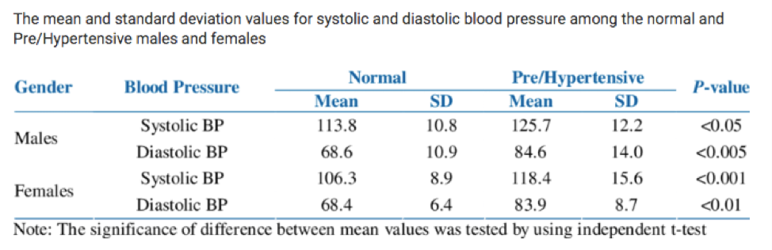
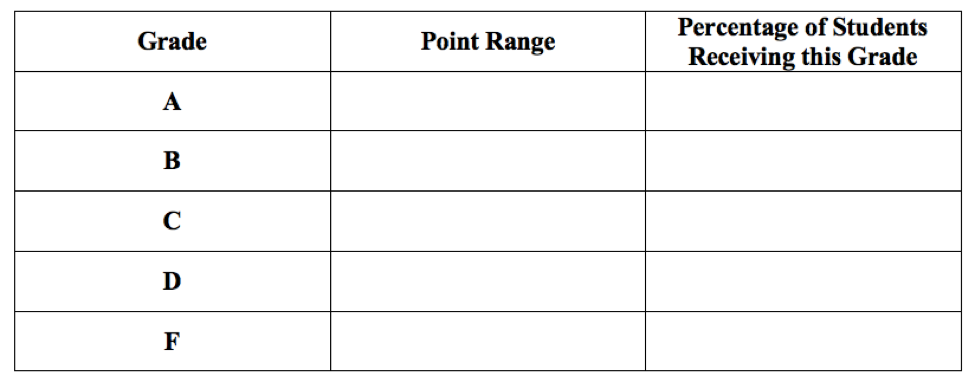
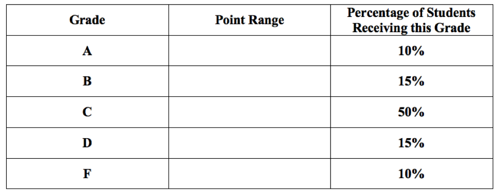
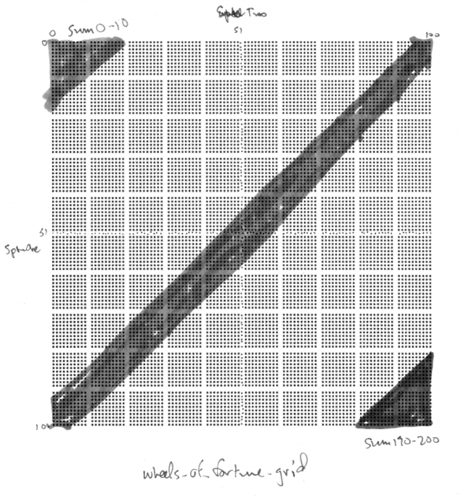

# Normal Distribution {#normal}

```{r, message=FALSE, warning=FALSE, echo=FALSE}
library(mosaic)
set.seed(2018)
```


## Introduction {#introduction}

Not everything is Normal (we certainly aren't), but it is useful to model data that is unimodal, symmetric, and without outliers. A statistical "model" is a simplification or an idealization. Reality is, of course, never perfectly bell-shaped. Real data is not exactly symmetric with one clear peak in the middle. Nevertheless, this abstract model can give us good answers if used properly.

## Chapter Scenario - Wanna be a Fighter Pilot {#chapter_scenario_wanna_be_a_fighter_pilot}

Adult males have an average height of 70 inches with a standard deviation of 4 inches. Adult females have a short average height of 65 inches and a slightly smaller standard deviation of 3.5 inches. It is known that the heights of males and females are both normally distributed. 

Source: http://www.usablestats.com/lessons/normal 

To be a pilot in the Air Force's you must be 64 to 77 inches tall when standing. What proportion of males and what proportion of females in the population qualify?

## The Normal Probability Distribution

Many natural phenomena appear to follow a bell-shaped distribution matching what is called a normal distribution. If the data is unimodal, symmetric, and without extreme outliers, a normal model might be appropriate. 

A normal random variable is a continuous random variable with probability density function given by 

$$f(x)=\frac{1}{\sqrt{2\pi}\sigma} \cdot e^{\frac{{(x - \mu)}^{2}}{2\sigma ^2}}$$

where the mean is $\mu$ and the standard deviation is $\sigma$. The normal distribution with mean 0 and standard deviation 1, called the standard normal, looks like this:

```{r}
ggplot(data.frame(x = c(-4, 4)), aes(x)) +
    stat_function(fun = dnorm) +
    scale_x_continuous(breaks = -3:3)
```

The probability density function, or pdf, is a function whose area under the curve on a particular region corresponds to the probability of the random variable falling in that region. The normal distribution was first discovered by Abraham DeMoivre when attempting to approximate binomial probabilities. 

The main reason that natural phenomena often are approximately normal is the Central Limit Theorem, discussed later, which proves that sums and means of random samples are increasingly normal as the sample size increases. 

## The Normal Distribution in R

Given normal random variable X with parameters $\mu$ and $\sigma$

To find the probability of X being less than q, $P(X < q)$, and visualize the region use `pnorm(q, mean, sd)`. 

To find the probability of X being greater than q, $P(X > q)$, and visualize the region use the complement principle and compute `1-pnorm(q, mean, sd)`.

To find the inverse probability, that is the value of x such that $P(X \leq x) = p$ and visualize the region use `qnorm(p, mean, sd)`.

In the commands above, to visualize the region and not report the probability include `invisible=TRUE`. To report the probability and not visualize the region include `plot=FALSE`.

To generate a random sample of size n from a uniform random variable use `rnorm(n, mean = 0, sd = 1)`.


## Example - Normal Blood Pressure

Blood pressure varies normally and the mean and standard deviation for males and females both with normal blood pressure and with pre/hypertension is described in the table below.

```{r nice-fig-121, fig.cap='Normal and Pre/Hypertensive Blood Pressure by Sex', out.width='30%', fig.asp=.75, fig.align='center', echo=FALSE}

```

For males with normal blood pressure, systolic blood pressure (SBP) is normally distributed with a mean of 113.8 and a standard deviation of 10.8.  

Source: https://www.researchgate.net/figure/The-mean-and-standard-deviation-values-for-systolic-and-diastolic-blood-pressure-among_tbl5_232742829

### Finding SBP Probabilities with `pdist`

If we are interested in finding the proportion or percentage of individuals within a particular range of values we use the `pdist` command.

To find the proportion of males with normal blood pressure who have SBP below 120:

```{r}
pdist("norm", q = 120, mean = 113.8, sd = 10.8)
```

To get the proportion only and not the plot:

```{r}
pdist("norm", q = 120, mean = 113.8, sd = 10.8, plot = FALSE)
```

To get the plot only and not the proportion:

```{r}
pdist("norm", q = 120, mean = 113.8, sd = 10.8, invisible = TRUE)
```

To find the proportion of males with normal blood pressure who have SBP above 130 we use the complement principle since $P(X>130)=1-P(X<130).

```{r}
1-pdist("norm", q = 120, mean = 113.8, sd = 10.8)
```

To find the proportion of males with normal blood pressure who have SBP between 120 and 130 we note that $P(120<X<130)=P(X<130)-P(X<120)$ and compute the following difference. To avoid getting two separate plots we include `plot=FALSE`.

```{r}
pdist("norm", q = 130, mean = 113.8, sd = 10.8, plot=FALSE) - pdist("norm", q = 120, mean = 113.8, sd = 10.8, plot=FALSE)
```

An alternative is to input the vector `q=c(120,130)` and visualize the region with the area shown on the plot but not as output.

```{r}
pdist("norm", q = c(120,130), mean = 113.8, sd = 10.8) 
```

We can use the `diff` command to subtract the two values:

```{r}
diff(pdist("norm", q = c(120,130), mean = 113.8, sd = 10.8)) 
```


### Finding SBP Percentiles with `qdist`

If we are interested in finding the particular cutoff value for which a certain percentage of individuals fall below or above, we use the `qdist` command.

To find the cutoff for the SBP at which $75\%$ of males with normal blood pressure fall below:

```{r}
qdist("norm", p = 0.75, mean = 113.8, sd = 10.8)
```

To get the percentile cutoff only and not the plot:

```{r}
qdist("norm", p = 0.75, mean = 113.8, sd = 10.8, plot = FALSE)
```

To get the plot only and not the percentile cutoff:

```{r}
qdist("norm", p = 0.75, mean = 113.8, sd = 10.8, invisible=TRUE)
```

To find the SBP cutoff at which $60\%$ of males with normal blood pressure fall above, we need to adapt our code since the `qdist` command interprets the input as the area below, ie., the left-tail area. The SBP cutoff at which $60\%$ of males with normal blood pressure fall above is exactly the cutoff at which $40\%$ of males fall below.

```{r}
qdist("norm", p = 0.4, mean = 113.8, sd = 10.8)
```

To find the SBP cutoffs that capture the middle $90\%$ of males with normal blood pressure is subtle. Note, that the middle $90\%$ would have $5\%$ below the lower cutoff and $95\%$ below the upper cutoff. So, to find cutoffs for the middle $90\%$, we need to find the $5\%$ and the $95\%$ percentiles. Again, we can input multiple values with the vector `p=c(0.05, 0.95)`. 

```{r}
qdist("norm", p = c(0.05, 0.95), mean = 113.8, sd = 10.8)
```


## The Standard Normal $Z \sim N(0,1)$

The standard normal distribution is a normal distribution with mean 0 and standard deviation 1. Probability tables are available for the standard normal and other normal distributions can be converted to standard normals so an understanding of how the standard normal works is useful. If $X \sim N(\mu, \sigma)$ then $Z=\frac{X-\mu}{\sigma} \sim N(0,1)$. 

The `pdist`, `qdist`, and `rnorm` commands use mean 0 and standard deviation 1 as default values.

## Example - Tides

Tides vary according to the weather, the time of year, and the phase of the moon but even taking all of these factors into account, the tide may be higher or lower than predicted and, according to M. T. Murray of the Liverpool Tidal Institute the prediction error, that is, the difference between the observed height of the tide and the predicted height of the tide, varies normally. This means that if we measure the prediction error in how many standard deviations above or below the expected hight, this variable, call it Z, will be a standard normal random variable with mean 0 and standard deviation 1, $Z \sim N(0,1)$.

Source: https://journals.lib.unb.ca/index.php/ihr/article/viewFile/24101/27886 

What proportion of the time is the actual tide more than one standard deviation below the mean?

```{r}
pdist("norm", q = -1) 
```

What proportion of the time is the actual tide within one standard deviation of the predicted tide? We want to find $P(-1<Z<1):

```{r}
pdist("norm", q = c(-1,1)) 
```

What proportion of the time is the actual tide within two standard deviations of the predicted tide? 

```{r}
pdist("norm", q = c(-2,2)) 
```

What is the 75th percentile for the number of standard deviations the actual tide deviates from the predicted tide? We want to find q such that $P(X<q)=0.95$.

```{r}
qdist("norm", p=0.95)
```


## The 68-95-99.7 Rule

Summarizing the distribution of probabilities, we know that for all normal distributions $68\%$ of the population is within 1 standard deviation of the mean, $95\%$ of the population is within 2 standard deviations of the mean, and $99.7\%$ of the population is withing 3 standard deviations of the mean as visualized below.

```{r}
pdist("norm", q = c(-3,-2,-1,0,1,2,3), invisible = TRUE)
```


## Exercises {#exercises}

### Exercise - Exercise, Exercise
Grace likes exercising and the amount of time she spends in aerobic exercise per week is normally distributed. If four hours per week is the 60th percentile and six hours per week is the 80th percentile, which would represent more exercise - the 70th percentile or 5 hours of exercise? 

### Exercise - Hello, Doggie!
Audrey, Marin, and Allison like dogs, especially Viszlas. Male Viszlas weigh on average 54 pounds with a standard deviation of 5 pounds and are normally distributed. A small male Viszla named "Sweet Pea" only weighs 40 pounds. What percentage of male Viszla's weigh less than "Sweet Pea"?

### Exercise - Is ICE Nice?
Luke is researching becoming an ICE agent and finds their salaries are normally distributed with a mean of $\$58,000$ with a standard deviation of $\$9,000$. What would the salary cutoff be for the top $10\%$ of ICE agent salaries?


### Exercise - Friday is Skiday
Jake, Nicole, Jamie, Niklas, Sarah, and Tegan like to go skiing and notice that on any given Friday during ski season about $33\%$ of their friends are headed up. If the percentage headed up skiing on a Friday is normally distributed with a mean of $33\%$ and a standard deviation of $9\%$, what is the probability $40\%$ or more will head up skiing on a randomly selected Friday?


### Exercise - Ballroom Burn
Ballroom dancing utilizes about 306 calories per hour. Assuming this is normally distributed with a standard deviation of 30 calories per hour, what is the probability that more than 350 calories will be burned in an hour?

### Exercise - Don't Search Pinterest During Probability Class
A MasterCraft X1 Trailer and Mooring Boat Cover sells for about $\$1500$ with a standard deviation of $\$300$. Assuming price is normally distributed what proportion of items will sell for less than $\$1200$ which is the max of Jordan's budget?

### Exercise - Normal Blood Pressure
Taylor is studying nursing and knows that systolic blood pressure (SBP) for women with normal blood pressure is normally distributed with a mean of 106.3 and a standard deviation of 8.9. 
(a) Find the $95\%$ middle range for SBP for women.
(b) What percentage of women with normal blood pressure have SBP less than 100?
(c) Use the 68-95-99.7 Rule to describe the $68\%$, $95\%$, and $99.7\%$ SBP ranges for women with normal blood pressure.

### Exercise - Ping Pong with the Dean
When playing against the Dean, Isaac scores on average 10 points with a standard deviation of 4. Assuming the data is approximately normally distributed what is the probability Isaac will score 18 or more points. 

### Exercise - Should I Take This to Antique Road Show?
Small sketches by old masters sell for about $\$500$ with a standard deviation of $\$125$. Marijke wants to find the middle range, that is, the lower and upper cutoffs within which $50\%$ of small old master sketches will sell. 

### Exercise - Should be Have Universal Health Care?
Medical expenses vary by household but according to Kennedy's research within one population, the annual deductible for individual plans was $\$4300$. If this is normally distributed with a standard deviation of $\$800$, what proportion of plans have annual deductibles greater than $\$5000$?

### Exercise - Movie Run Times
Sam is relaxing with a movie. Looking at popular movies over a period of time she notices that movie run time averages about 130 minutes but varies with a standard deviation she estimates to be 15 minutes. If the distribution of movie run times is normally distributed what is the probability a movie chosen at random will time in at under 100 minutes?

### Exercise - The Sloth Olympics
Jasmine likes sloths. During the sloth Olympics, the average time for the three meter dash is 46 seconds, normally distributed with a standard deviation of 5 seconds. For a sloth chosen at random, what is the probability their three meter dash time will be more than 50 seconds?


### Exercise (Group Project) - Analyzing Grading Systems
According to the Westminster College Catalog a letter grade of A represents “Excellent” work, a grade of B is “Above Average,” a grade of C is “Average,” a grade of D is “Poor,” and a grade of F is “Failure.” While grades vary significantly for different classes, different professors, and different disciplines, and there are an incredible number of relevant factors involved in grading procedures. 

(a) Preconception: Discuss from your own personal perspective what distribution of A’s, B’s, C’s and non-passing D’s and F’s you think would represent a healthy institution that truly attempts to distinguish between “Excellent” and “Average” work. Include the percentages you would expect for each grade. 

Suppose that scores in the math department historically follow a normal distribution with a mean of 79.2 and a standard deviation of 9.4.  Use this information throughout the rest of the project. You will compare and contrast the three grading schemas finding the point ranges and percentages of students getting an A, B, C, D, and F. Do this by completing the tables given and illustrating the distribution of scores on the normal curve provided. Note, each tick mark on the scale represents a length of one standard deviation.

(b) Consider the Traditional Grading System where a score of 90 or higher receives an A, 80 to less than 90 receives a B, 70 to less than 80 receives a C, 60 to less than 70 receives a D and below 60 receives an F. Complete the table below to determine the percentage of students obtaining each grade for this Traditional Grading System and visualize the A, B, C, D, and F regions on a plot of the normal probability density function.

```{r nice-fig-122, fig.cap='The Traditional Grading System', out.width='30%', fig.asp=.75, fig.align='center', echo=FALSE}
knitr::include_graphics("01-basics-figures/grading_system_traditional.png")
```

(c) Consider the Standardized Grading System where being more than 2 standard deviations above the mean receives an A, being between 1 and 2 standard deviations above the mean receives a B, being within 1 standard deviation on either side of the mean receives a C, being between 1 and 2 standard deviations below the mean receives a D, and being more than 2 standard deviations below the mean receives an F. Complete the table below identifying both the point range and percentage of students for each grade and visualize the A, B, C, D, and F regions on a plot of the normal probability density function.

```{r nice-fig-123, fig.cap='The Standardized Grading System', out.width='30%', fig.asp=.75, fig.align='center', echo=FALSE}

```

(d) Consider the Curved Grading System where the top 10% of students receive an A, the next 15% of students receive a B, the middle 50% of students receive a C, the next 15% of students receive a D, and the bottom 10% of students receive an F. (a)	Complete the table below finding the point range for each grade and visualize the A, B, C, D, and F regions on a plot of the normal probability density function.

```{r nice-fig-124, fig.cap='The Curved Grading System', out.width='30%', fig.asp=.75, fig.align='center', echo=FALSE}

```

(e) In your opinion, which system most closely matches the meaning of grades according to the Westminster College catalog? Please explain.

(f) Devise your own grading scheme completing the table below and explaining your rationale.

```{r nice-fig-125, fig.cap='Your Own Grading System', out.width='30%', fig.asp=.75, fig.align='center', echo=FALSE}
knitr::include_graphics("01-basics-figures/grading_system_blank.png")
```


## Sums of Random Variables {#sums_of_random_variables}

## Introduction {#introduction}

Our lives are made up of a combination of factors. Often we are add quantities from different buckets. We receive income from different sources. We add time spent in different pursuits. How tall we are is a sum of the length of each body part. These quantities vary. How do their sums vary. In this chapter, we examine what happens when two independent random variables are added. How does their shape change? How does the center change? How does their spread change? And then, we will see, how our minds can change.

## Chapter Scenario - Comparing Heights {#chapter_scenario_comparing_heights}

Adult males have an average height of 70 inches with a standard deviation of 4 inches. Adult females have a short average height of 65 inches and a slightly smaller standard deviation of 3.5 inches. It is known that the heights of males and females are both normally distributed. 

Source: http://www.usablestats.com/lessons/normal 

If a male and a female were chosen at random, what is the probability that the female would be taller than the male? 

## Example - Wheels of Fortune

Consider the two games described below.

**Game One**: A wheel has slots numbered 0 to 200 all of them equally likely and an individual spins the wheel one time and wins the dollar amount shown.

**Game Two**: A wheel has slots numbered 0 to 100 all of them equally likely and an individual gets to spin the wheel twice and win the combined dollar amount for his/her two spins.

How are these two games similar and how are they different?

### Practice - Preconceptions 
Suppose each of these games was played a number of times and the results tabulated. How do you think the two data sets for the two different games would compare in terms of shape, center, and spread?


### Simulating the Games 

We can run a simulation of each of these two games and compare results. To simulate Game One, generate 1000 random integers ranging from 0 to 200 in one vector and name this variable `game_one`. 

```{r}
game_one <- sample(x=0:200, size=1000, replace=TRUE)
```

To simulate Game Two, generate two vectors of 1000 random integers each ranging from 0 to 100 and add them naming this sum `game_two`. 

```{r}
spin_one <- sample(x=0:100, size=1000, replace=TRUE)
spin_two <- sample(x=0:100, size=1000, replace=TRUE)
game_two <- spin_one + spin_two
```

We can put these variables in a data frame.

```{r}
wheels_of_fortune <- data.frame(game_one, game_two)
```

And run summary statistics for `game_one` and `game_two`. 

```{r}
favstats(wheels_of_fortune$game_one)
```

```{r}
favstats(wheels_of_fortune$game_two)
```

Are the centers of `game_one` and `game_two` similar or different? Are the spreads of `game_one` and `game_two` similar or different? 

While both are centered around 100 as seen by the means and medians, we see that the spreads as measured by the standard deviations are not the same. Game Two is less variable than Game One. Visualizing the data with histograms might help explain this.

How do the two histograms compare in terms of shape?

```{r}
stacked_wheels <- stack(wheels_of_fortune)
ggplot(data=stacked_wheels, aes(x=values)) + 
  geom_histogram(binwidth=10) + 
  facet_grid(ind ~ .) 
```

Game One has what looks like a flat, uniform disribution while Game Two appears mound-shaped. Can we provide a reasonable explanation for WHY the two distributions have the different shapes that they do. 

An intuitive explanation might note that when playing Game One we are just as likely to get a small value from 0 to 10 as to get a middle value from 95 to 105 as to get a large value from 190 to 200. But when playing Game Two, there are many more ways to get a middle value than there is to get a small value and than there is to get a large value. For example, to get a small total in Game Two both spins must be small and, similarly, to get a large total in Game Two both spins must be large. But to get a middle value can happen many ways - by adding a small and a large or two medium-size values. There are many more combinations of numbers summing to a middle number than there are summing to either a small or a large number. 

Examine the sample space of equally likely outcomes for the two wheels in the 101 x 101 grid below where the rows represent the represent the result on the wheel one and the columns the result on wheel two. Shaded in green are the results with the sum from 0 to 10. Shaded in red are the results with the sum from 95 to 105. Shaded in blue are the results with the sum from 190 to 200. Which is more likely?

```{r nice-fig-126, fig.cap='Sample Space for Game Two', out.width='30%', fig.asp=.75, fig.align='center', echo=FALSE}

```

We see here the beginnings of important ideas about sampling distributions and how the shape, center, and spread change when summing independent random variables and the first hints of the Central Limit Theorem which reveals why the normal, bell-shaped distribution occurs when we gather sample data and examine sums or means. There is so much more to learn. Let's capture some theory.

## Expectation for the Sum of Two Random Variables

If the results of two random variables, X and Y, are added, the resulting expectation is the sum of the individual expectations.  

For example, in Wheels of Fortune Game Two, each wheel has equally likely outcomes from 0 to 100 so the expectation on each wheel is 50. When summing the results from these wheels, as expected, we see the distribution is centered around $50 + 50 = 100$. 

In general, for any two random variables X and Y with expectations E(X) and E(Y), respectively, the expectation of X + Y is their sum. 

$$\text{For any two random variables X and Y}, \ E(X+Y)=E(X)+E(Y).$$

## Variance and Standard Deviation for the Sum of Two Random Variables

While expectations add for the sum of two random variables, the story is more complicated for the variation of the sum of two random variables. First of all, if the two random variables are not independent, then we need to know the nature of their relationship to determine how the sum varies.

For two independent random variables, X and Y, with Var(X) and Var(Y), respectively, the variance of the sum, X + Y, is the sum of the variance.

$$\text{For any two independent random variables X and Y}, \ Var(X+Y)=Var(X)+Var(Y).$$
If we write this relationship in terms of standard deviation we see that the standard deviation for the sum of two independent random variables follows a Pythagorean relationship. 

$$\text{For any two independent random variables X and Y}, \ SD^{2}(X+Y)=SD^{2}(X)+SD^{2}(Y).$$

Solving for SD(X+Y),

$$\text{For any two independent random variables X and Y}, \ SD(X+Y)=\sqrt{SD^{2}(X)+SD^{2}(Y)}.$$

This result can be visualized as if SD(X) and SD(Y) were legs of a right triangle with hypotenuse SD(X+Y).

```{r nice-fig-127, fig.cap='The Pythagorean Theorem of Standard Deviations', out.width='30%', fig.asp=.75, fig.align='center', echo=FALSE}
#knitr::include_graphics("01-basics-figures/pythagorean_theorem_of_standard_deviations.png")
```

For example, we can use the Pythagorean Theorem of Standard Deviations and the fact that for one spin of the wheel with integers 0 to 100 the theoretical standard deviation is 29.15 to explain the standard deviation you received when you analyzed the data gathered in the simulation of Game Two. 

$$SD(\text{Game Two})=\sqrt{SD^2(\text{Wheel One}) + SD^2(\text{Wheel Two})}=\sqrt{29.15^{2}+29.15^{2}}=41.2243$$

This true value of 41.2243 closely matches our simulated standard deviation of `r sd(wheels_of_fortune$game_two)`.

It is also to be noted that the Pythagorean Theorem of Standard Deviations also holds for the difference of indpendent random variables leading to this generalization.

$$\text{For any two independent random variables X and Y}, \ SD(X \pm Y)=\sqrt{SD^{2}(X)+SD^{2}(Y)}.$$

## Summing Independent Identically Distributed Random Variables

Extending the above results to the case where we are summing n independent occurrences of identically distributed random variables yields the following theorems which are important for understanding random samples drawn from the same population:

$$\text{For any identically distributed random variables} X_{1}, X_{2}, ...,X_{n} \sim(\mu,\sigma) \\ E(X_{1} + X_{2} + ... + X_{n})=E(X_{1})+ E(X_{2})+ ...+E(X_{n})=\mu + \mu + ... + \mu=n\mu.$$
The above fact is true whether or not the random variables are independent while the fact below is only true when the random variables are independent.

$$\text{For independent, identically distributed random variables} \ X_{1}, X_{2}, ...,X_{n} \sim(\mu,\sigma), \\ SD(X_{1} + X_{2} + ... + X_{n})=\sqrt{SD^{2}(X_{1})+ SD^{2}(X_{2})+ ...+SD^{2}(X_{n})}= \\ \sqrt{\sigma^{2} + \sigma^{2} + ... + \sigma^{2}}=\sqrt{n} \cdot \sigma.$$
We will call this the $\sqrt{n}$ Rule.


## The Roots of the Normal {#the_roots_of_the_normal}

The normal bell-shaped curve is so ubiquitous it is almost taken for granted. It is helpful to see its origins by examining sums of independent random variables. We will use the experiment of tossing a die to illustrate how the normal distribution emerges. Consider the experiment of tossing one die and plotting the results in a histogram. What would you expect for the shape, center, and spread of this data?

Code below simulates the toss of one die and puts this data into an official R data frame to facilitate the analysis and visualizes the data in a histogram. The code the the histogram uses the `ggplot2` package, the standard for plotting data in R.

```{r nice-fig-128, fig.cap='Histogram for Saturday Tips', out.width='80%', fig.asp=.75, fig.align='center'}
Die1 <- sample(c(1,2,3,4,5,6), 10000, replace = TRUE)
Dice_data <- data.frame(Die1)
ggplot(data=Dice_data, aes(x=Die1)) + geom_histogram()
```

The theoretical expectation for the toss of one die is $E(X)=3.5$ and the theoretical standard deviation is $SD(X)=1.708$. Note how similar these theoretical values are to the sample values in the simulation.

The casino game craps revolves around the sum of the toss of two dice. If the experiment of tossing two dice and computing the sum was done many times and the results plotted in a histogram what would you expect for the shape, center, and spread?

### Simulating the Toss of Two Dice

Code below simulates the sum of two dice. We visualize with a histogram.

```{r nice-fig-129, fig.cap='Histogram for Saturday Tips', out.width='80%', fig.asp=.75, fig.align='center'}
Dice_data$Die2 <- sample(c(1,2,3,4,5,6), 10000, replace = TRUE)
Dice_data$Sum <- Dice_data$Die1 + Dice_data$Die2
ggplot(data=Dice_data, aes(x=Sum)) + geom_histogram()
```

Comparing with the results of the two simulations, while one die resulted in a flat, uniform distribution, we see that the distribution for the sum of two dice is a triangular distribution. Why is it that when summing two dice, we see a tendency towards a mound-shaped distribution?

The theoretical expectation for the sum of two dice is $3.5 + 3.5=7.0$. The theoretical standard deviation for the sum of two dice, according to the Pythagorean Theorem of Standard Deviations is $\sqrt{1.708^{2}+1.708^{2}}=2.4155$. Again, these values are very close to the sample values seen in the simulation.

Moving on, we adapt the code above to simulate the sum of three dice and visualize with a histogram.

```{r nice-fig-1210, fig.cap='Histogram for Saturday Tips', out.width='80%', fig.asp=.75, fig.align='center'}
Dice_data$Die3 <- sample(c(1,2,3,4,5,6), 10000, replace = TRUE)
Dice_data$Sum3 <- Dice_data$Die1 + Dice_data$Die2 + Dice_data$Die3
ggplot(data=Dice_data, aes(x=Sum)) + geom_histogram()
```

We observe that summing three dice, the distribution becomes increasingly mound-shaped.

Below is code crafted to illustrate the sum of 50 tosses of a die as well as the sample mean of these 50 tosses.

```{r nice-fig-1211, fig.cap='Histogram for Saturday Tips', out.width='80%', fig.asp=.75, fig.align='center'}
die_matrix <- data.frame(matrix(sample(1:6, 500000, replace=TRUE), ncol=50))
die_matrix$sum <- rowSums(die_matrix)
die_matrix$mean <- die_matrix$sum/50
head(die_matrix[,51:52])
```

Let's take a look at the histogram of the sum of 50 dice.

```{r nice-fig-1212, fig.cap='Histogram for Saturday Tips', out.width='80%', fig.asp=.75, fig.align='center'}
ggplot(data=die_matrix, aes(x=sum)) + geom_histogram()
```

The average is the sum divided by 50 and should be close to 3.5 but varies. Let's examine the histogram.

```{r nice-fig-1213, fig.cap='Histogram for Saturday Tips', out.width='80%', fig.asp=.75, fig.align='center'}
ggplot(data=die_matrix, aes(x=mean)) + geom_histogram()
```

The histograms of the sum of 50 dice and the mean of 50 dice have identical shapes, it is only the scale that changes.

## The Central Limit Theorem

The Central Limit Theorem indicates that the sum of independent random variables as well as the sample means converge to the normal distribution as the sample size increases. We present two versions here.

### The Central Limit for Sums

For any sample of size n gathered from a ditribution of random variable X with mean $\mu$ and standard deviation $\sigma$,  the distribution of the sum 
a) approaches the normal distribution as n approaches infinity
b) the theoretical expected value is $n \cdot \mu$
c) the theoretical standard deviation is $\sqrt{n} \cdot \sigma$.

### The Central Limit for Sample Means

For any sample of size n gathered from a ditribution of random variable X with mean $\mu$ and standard deviation $\sigma$,  the distribution of sample means 
a) approaches the normal distribution as n approaches infinity
b) the theoretical expected value is $\mu$
c) the theoretical standard deviation is $\frac{\sigma}{\sqrt{n}}$.


## Conclusion

Through simulating the toss of one die, the sum of two, three, and then more we see that sums of a random variable even if it is not originally from a mound-shaped distribution (note, the distribution for a single die is discrete uniform) we find the sums increasing become mound-shaped. And sample means are really sample sums just re-scaled by dividing by the sample size. This is the secret to why the normal distribution emerges when we examine sample means. 

## Adding Normals

What if we are adding or subtracting random variables that are normally distributed. Then we know the sum and difference are also normal. Here is the theory:

For independent $X \sim N(\mu_{X}, \sigma_{X})$ and $Y \sim N(\mu_{Y}, \sigma_{Y})$ then $X \pm Y \sim N(\mu_{X} + \mu_{Y}, \sqrt{\sigma_{X}^{2} +  \sigma_{X}^{2}})$.

## Example - Tips on the Weekend {#example_tips_on_the_weekend}

Suppose a friend of yours is working as a server. Suppose that on Fridays tips average $120 with a standard deviation of $30 and are normally distributed. With Friday tips, F, we denote this as $F \sim N(\mu = 120, \sigma = 30)$. The distribution would look like this:

```{r nice-fig-1214, fig.cap='Histogram for Friday Tips', out.width='80%', fig.asp=.75, fig.align='center'}
ggplot(data.frame(x = c(30, 210)), aes(x)) +
    stat_function(fun = dnorm, args = list(mean = 120, sd = 30)) +
    scale_x_continuous(breaks = c(30,60,90,120,150,180,210))
```

Suppose that Saturday tips, S, are a little different with tips normally distributed with a mean of $\$90$ and a standard deviation of $\$20$, so  $S \sim N(\mu = 90, \sigma = 20)$. Here we can visualize the distribution:

```{r nice-fig-1215, fig.cap='Histogram for Saturday Tips', out.width='80%', fig.asp=.75, fig.align='center'}
# Again, don't worry about the syntax here.
ggplot(data.frame(x = c(30, 150)), aes(x)) +
    stat_function(fun = dnorm, args = list(mean = 90, sd = 20)) +
    scale_x_continuous(breaks = c(30, 50, 70, 90, 110, 130, 150))
```

Suppose your friend really needs $\$200$ in tips this weekend. Rent is due. The broader question before us is what the distribution of total tips on the weekend, Friday plus Saturday (F + S), looks like. Is it normal? What is the mean? What is the standard deviation? As a simplifying assumption we will assume that based on past experience Friday tips and Saturday tips are independent.

Let's run a simulation to get an idea of what to expect.

The code below simulates 1000 Friday tips calling the variable `friday` rounded to the nearest dollar and, similarly, 1000 Saturday night tips, then their sum, `weekend`, and put them into a dataframe for ease of analysis.

```{r}
friday <- round(rnorm(1000, mean = 120, sd = 30), 0)
saturday <- round(rnorm(1000, mean=90, sd=20), 0)
weekend <- friday + saturday
tips_data <- data.frame(friday, saturday, weekend)
```

Let's visualize the `weekend` variable in a histogram.

```{r nice-fig-1216, fig.cap='Histogram for Saturday Tips', out.width='80%', fig.asp=.75, fig.align='center'}
ggplot(data=tips_data, aes(x=weekend)) + geom_histogram(binwidth=10)
```

It appears that adding these two independent normal random variables generated another normal. Let's examine summary statistics to see the mean and standard deviation.

```{r}
favstats(tips_data$weekend)
```

Note that the mean is around $\$210$ which we might expect since the mean of Friday tips was $\$120$ and the mean of Saturday night tips was $\$90$. The standard deviation of weekend tips is bigger than the individual standard deviations of $\$30$ and $\$20$ but smaller their sum. 

What really happens when adding independent normal random variables is that the shape is normal, the mean is the sum of the individual means but the standard deviation is the square root of the sum of the squares of the individual standard deviations, a result akin to our familiar Pythagorean Theorem of Standard Deviations. In summary, given independent normal distributions X and Y with $X \sim N(\mu_{X}, \sigma_{X})$ and $Y \sim N(\mu_{Y}, \sigma_{Y})$ we know $X+Y \sim N(\mu_{X}+\mu_{Y}, \sqrt{\sigma_{X}^{2}+\sigma_{Y}^{2}})$.

For our example where Friday tips are $N(\mu = 120, \sigma = 30)$ and Saturday tips are $N(\mu = 90, \sigma = 20)$ we know that the sum of these is normal with mean $120 + 90$ with a standard deviation of $\sqrt{30^2 + 20^2}$ which equals `r (30^2 + 20^2)^(.5)`. Observe how close the simulated mean and SD are to what the theory says.

Now, knowing tips on the weekend are normally distributed with a mean of $\$210$ and a standard deviation of $\$36.06$ we can find the probability of getting more than $\$200$.

```{r}
1-pdist("norm", q = 200, mean = 210, sd = 36.06)
```

## Chapter Scenario Revisited - Comparing Heights {#chapter_scenario_revisited_comparing_heights}

Recall, we know dult males have an average height of 70 inches with a standard deviation of 4 inches and adult females have an average height of 65 inches and a standard deviation of 3.5 inches, both normally distributed. Letting M represent male height and F represent female height, we have $M \sim N(70,4)$ and $F \sim N(65,3.5)$. We want to find the probability that if a male and a female were chosen at random the female would be taller than the male. Mathematically, we want to know when $F > M$ which is equivalent to finding when $M - F < 0$.

We know how $M - F$ is distributed. Because M and F are both normal we know $M - F$ is normal. The expectation is $E(M - F) = E(M) - E(F)=70 - 65 = 5$. Using the Pythagorean Theorem for Standard Deviations, $SD(M-F)=\sqrt{SD^{2}(M) + SD^{2}(F)}=\sqrt{4^2 + 3.5^2}=5.315$. Thus, $M-F \sim N(5, 5.315)$.

To find the probability $P(M-F<0)$ we can use `pdist`.

```{r}
pdist(dist="norm", q=0, mean=5, sd=5.315)
```

The chance that a female chosen at random is taller than a male chosen at random is `r pdist(dist="norm", q=0, mean=5, sd=5.315, plot=FALSE)`.

## Exercises {#exercises}

### Exercise (Group Project) - Zombie Apocalypse

It may not be the Zombie Apocalypse but we want to be ready just in case. There are Gender Alpha Zombies and Gender Beta Zombies. Different Zombies have different Power identified on a scale of 1 to 6 with 6 being the most powerful and 1 being not at all powerful, in fact, pathetic. When two Zombies meet they compare their Zombie Power Index (ZPI) to see who gets first dibs on that tender living human flesh. The highest ZPI wins.

If you are an Alpha Zombie your ZPI comes from a single chromosome so you roll one die. For example, if an Alpha rolls a 2 that is their power. If you are a Beta Zombie your ZPI comes from two chromosomes so you roll two dice and find the average. If a Beta rolled a 3 and a 6 their ZPI is 4.5, the average of 3 and 6.

```{r nice-fig-1217, fig.cap='Zombie Apocalypse Characters', out.width='30%', fig.asp=.75, fig.align='center', echo=FALSE}
knitr::include_graphics("01-basics-figures/zombie_apocalypse_characters.png")
```

(a) To get a feel for this game, play the game with friends or classmates at least 10 times recording results in the table provided on the hardcopy page distributed in class.

```{r nice-fig-1218, fig.cap='Zombie Apocalypse Data Table', out.width='30%', fig.asp=.75, fig.align='center', echo=FALSE}
knitr::include_graphics("01-basics-figures/zombie_apocalypse_table.png")
```

(c) Class Data: In class, examine a small sample of Alpha ZPIs and a small sample of Beta ZPI’s and make comparisons of shape, center, and spread.

(d) Simulating ZPI: Get a clearer picture of Alpha and Beta ZPIs by constructing a simulation using the `sample()` command. Analyze the simulated Alpha ZPIs and Beta ZPIs by constructing histograms and running summary statistics. How are they similar and how are they different in terms of shape, center, and spread?

(e) Theory: Construct the theoretical probability distributions for Alpha ZPIs and Beta ZPIs and find the expectation and the standard deviation. 

(f) Conjecture: Assume you have a class of size 32 with equal numbers of Alphas and Betas. Consider a single-elimination tournament created with random seedings. Who is more likely to be eliminated in the first round - more Alphas eliminated or more Betas eliminated or no difference? Who is more likely to win, an Alpha or a Beta or equal chances? 

### Exercise - Dungeons and Dragons Dice
In Dungeons and Dragons there are a number of different types of die including a traditional six-sided die and a 12-sided die. 

```{r nice-fig-1219, fig.cap='Dungeons and Dragons Dice', out.width='30%', fig.asp=.75, fig.align='center', echo=FALSE}
knitr::include_graphics("01-basics-figures/dungeons_and_dragons_dice.png")
```

Suppose the Dungeon Master says, “Ye are in a tavern to celebrate GrogFest, and it’s time to roll to see how many rounds of ale ye must buy. Thus, either roll the 12-sided die once or roll the six-sided die twice to find the total as these be equivalent in terms of shape, center, and spread.” 
Use knowledge gained from the chapter to critique the Dungeon Master’s reasoning for the results of tossing one 12-sided die compared with tossing a six-sided die twice. Regarding shape, center, and spread, how are they the same and how are they different? 


### Exercise - Difference of Wheels 
Suppose the wheel of fortune wheel with slots numbered 0 to 100 all equally likely is spun twice and rather than summing the two spins you win (or lose) the difference between the first spin and the second spin. Simulate this data, run summary statistics of the result, and create a histogram. How does theory help explain this result?

### Exercise - Comparing Blood Pressure

The chart below shows the mean and standard deviation for the blood pressure of individuals with normal blood pressure. If two individuals with normal blood pressure are chosen at random, what is the probability the male has the higher blood pressure?

```{r nice-fig-1220, fig.cap='Normal and Pre/Hypertensive Blood Pressure by Sex', out.width='30%', fig.asp=.75, fig.align='center', echo=FALSE}

```

Source: https://www.researchgate.net/figure/The-mean-and-standard-deviation-values-for-systolic-and-diastolic-blood-pressure-among_tbl5_232742829


