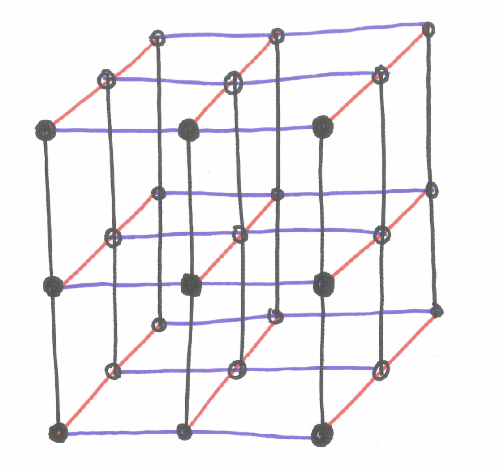
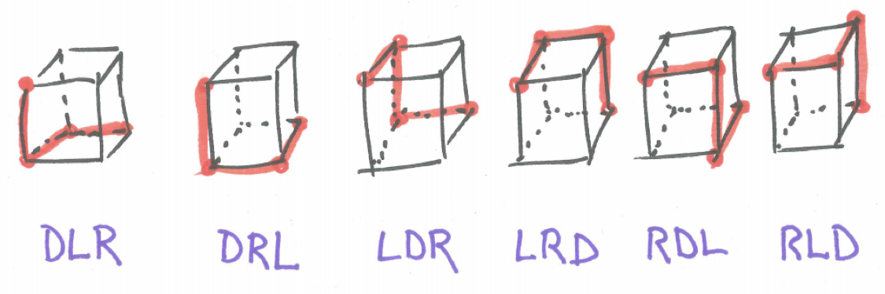

# Multinomial Distribution {#multinom}

## Chapter Scenario - 3D Ant Walking {#chapter_scenario_3D_ant_walking}

Recall the ways can a person walk from corner X to another corner by a path of shortest length is $\dbinom{n}{r}$ where n is the total number of blocks walked and r is the number of East blocks. If E is the number of blocks East and S is the blocks south then $\dbinom{L+R}{L}$  or $\dbinom{L+R}{R}$ nicely names the number of paths.

We now consider a similar three-dimensional structure called a lattice. How many ways are there for an ant to walk from one diagonal corner to the other in a path of shortest length for the situation pictured below?

```{r nice-fig-131, fig.cap='3D Ant-walking Grid', out.width='30%', fig.asp=.75, fig.align='center', echo=FALSE}

```


## Chapter Scenario Revisited - 3D Ant Walking {#chapter_scenario_revisited_3D_ant_walking}

### A Simpler Example 

How many ways are there for an ant to walk from one diagonal corner to the other in a path of shortest length for the simpler situation pictured below?

```{r nice-fig-132, fig.cap='Simpler Ant-walking Grid', out.width='30%', fig.asp=.75, fig.align='center', echo=FALSE}
knitr::include_graphics("01-basics-figures/3D_grid_1_1_1.png")
```

The example is small enough we could illustrate the solutions. Turns out there are six of them.

```{r nice-fig-133, fig.cap='Simpler Ant-walking Grid Solutions', out.width='30%', fig.asp=.75, fig.align='center', echo=FALSE}
#knitr::include_graphics("01-basics-figures/3D_grid_1_1_1_solutions.png")
```

We can translate this ant-walking problem into a different context by labeling the directions the ant may walk. In addition to moving Left (L) or Right (R) the ant may travel Down (D). In moving from the top corner to the diagonally opposite bottom corner we recognize the ant make make one Left move, one Right move, and one Down move and the different paths can be described as the different orderings of one L, one R, and one D as written below.

```{r nice-fig-134, fig.cap='Simpler Ant-walking Grid Solutions with Orderings', out.width='30%', fig.asp=.75, fig.align='center', echo=FALSE}
#
```

### The Original Problem

In the 2 x 2 x 2 grid the ant must travel two blocks to the left, two to the right, and two down. A particular path can be represented as a sequence of two L's, two R's, and two D's. This can be done a total of $\frac{6!}{2! \cdot 2! \cdot 2!}$ ways.


### General Situation

We may describe the general situation in a 3-D lattice with width W units, length L units, and height H units. How many paths are there from one corner to the diagonally opposite corner? This would be equivalent to the number of orderings of so many W's, L's, and H's resulting in $\frac{(W+L+H)!}{W! \cdot L! \cdot H!}$ unique paths.

