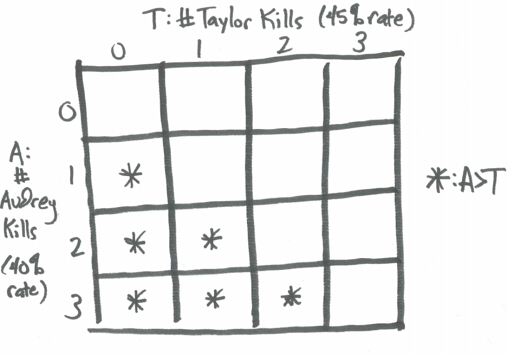
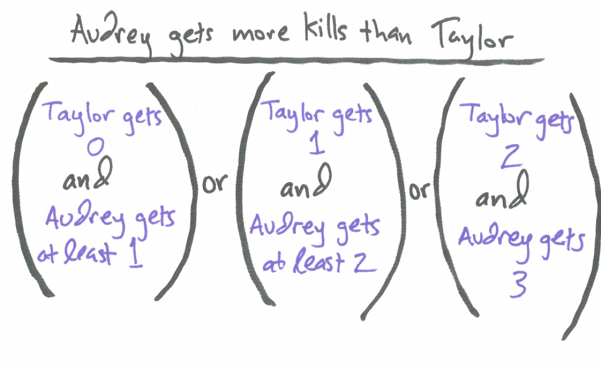

# The Binomial Distribution

```{r, message=FALSE, warning=FALSE, echo=FALSE}
library(mosaic)
set.seed(2018)
```

## Introduction {#introduction}

If we run an experiment where each trial has the same probability of success and failure, we can use the binomial distribution to determine the probability of any particular number of successes on a given number of trials.

## Chapter Scenario - Pounding Pennies {#chapter_scenario_pounding_pennies}

A random sample of pennies are set on edge and knocked over by gently pounding on the table. It may seem totally weird, but someone conjectures that this process we will call “pounding pennies” is significantly different from flipping a fair coin where the percentage of heads is 50%. In an experiment, we obtained 182 heads and 142 tails. Would this be considered an unusual event if the true percentage of heads was really 50%? Explain. (Note, we often consider as "unusual" an event that happens less than 5% of the time.)


## The Binomial Distribution

The binomial distribution is a discrete probability distribution describing the outcome of n independent trials in an experiment where each trial has only two outcomes identified as success and failure. Given n independent trials and the probability of a successful trial p, the probability of having X successful outcomes is a binomial denoted $X \sim BIN(n,p)$ with the probability density function as follows.

$$P(x)=\binom{n}{x}p^x(1-p)^{n-x}$$

Examining the three key pieces of the binomial distribution,  the initial combination, $\binom{n}{x}$, counts the arrangements of $x$ successes and $n-x$ failures, $p^x$ is the probability of x successes and $p^{n-x}$ is the probability of $n-x$ failures.

The expected value for $X \sim BIN(n,p)$ is $E(X)=np$. The variance is $Var(X)=np(1-p)$ and the standard deviation is $SD(X)=\sqrt{np(1-p)}$.

As an illustration of the shape of a binomial distribution, here is the probability distribution for the number of sixes when rolling a die 10 times which is a binomial random variable with n=10 independent trials with a probability of success of $p=1/6=0.167$.

```{r}
xpbinom(q=0:10, size = 10, prob = 1/6)
```

When the expected number of successes, np, and the expected number of failures, n(1-p), are both at least 10 then the binomial distribution is approximately normal. As an illustration, here is the probability distribution for the number of sixes when rolling a die 100 times which is a binomial random variable with n=100 independent trials with a probability of success of $p=1/6=0.167$.

```{r}
xpbinom(q=10:25, size = 100, prob = 1/6)
```

## The Binomial Distribution in R

Assume we have a binomial random variabl of size n independent trials with probability of success p. 

To find the individual probability of x successes, $P(X=x)$, use `dbinom(x, size, prob)`.

To find the cumulative probability of less than or equal to q successes, $P(X \leq q)$, use `pbinom(q, size, prob)`.

To visualize the cumulative probability of less than or equal to q successes, $P(X \leq q)$, use `xpbinom(q, size, prob)`.

To find the cumulative probability of at least q successes, $P(X \geq q)$, use the complement principle to find `1-pbinom(q, size, prob)`, or include `lower.tail=FALSE` and find `pbinom(q, size, prob, lower.tail=FALSE)`.

To find the inverse probability, that is the value of q such that $P(X \leq q) = p$ use `qbinom(p, size, prob)`. 

To visualize the inverse probablity, use `xqbinom(p, size, prob)`.

To generate a random sample of size n from this geometric random variable use `rbinom(n, size, prob)`.

## Example - Throwing Darts

Suppose that a very good dart player hits the bulls-eye 15% of the time. Suppose she makes 25 throws. If X is the number of bulls-eyes we know $X \sim BIN(25,0.15)$. 

### Individual Probabilities

Here is the probability she makes exactly 5 bulls-eyes in 25 throws.

```{r}
dbinom(x=5, size=25, prob=0.15) 
```

We can find the probabilities she makes 0, 1, 2, 3, 4, and 5 bulls-eyes in 25 trials with the following code.

```{r}
dbinom(x=c(0,1,2,3,4,5), size=25, prob=0.15) 
```


### Cumulative Probabilities

Suppose we want to find the cumulative probability she makes less than or equal to 5 bulls-eyes in 25 trials, $P(X \leq 5)$. Try this.

```{r}
pbinom(q=5, size=25, prob=0.15) 
```

Here is a visualization showing $P(X \leq 5)$.

```{r}
xpbinom(q=5, size = 25, prob = 0.15)
```


Be careful regarding endpoints. If we want to find the cumulative probability she makes less than 5 bulls-eyes in 25 trials, note this is different.

```{r}
pbinom(q=4, size=25, prob=0.15) 
```

Again, we can find cumulative probabilities for multiple values.

```{r}
pbinom(q=c(0,1,2,3,4,5), size=25, prob=0.15) 
```

To find the probability she makes between 3 and 7, inclusive, check out the following. It is tricky.

```{r}
pbinom(q=7, size=25, prob=0.15) - pbinom(q=2, size=25, prob=0.15)
```

An alternative is to use the `diff` function.

```{r}
diff(pbinom(q=c(2,7), size=25, prob=0.15))
```

We often need to use the complement property to find the probability we seek. For example, if we want to find the cumulative probability she makes more than 5 bulls-eyes in 25 trials, $P(X > 5)$, try this.

```{r}
1 - pbinom(q=5, size=25, prob=0.15) 
```

An alternative is the include `lower.tail=FALSE`.

```{r}
pbinom(q=5, size=25, prob=0.15, lower.tail=FALSE)
```

To reiterate, be careful with endpoints. If we want to find the cumulative probability she makes at least 5 bulls-eyes in 25 trials, $P(X \geq 5)$ then...

```{r}
1 - pbinom(q=4, size=25, prob=0.15) 
```

Here is a visualization showing some individual probabilities. 

```{r}
xpbinom(q=c(0,1,2,3,4,5), size = 25, prob = 0.15)
```

### Inverse Probabilities

Suppose we want to find the number of bulls-eyes in 25 throws that she will make at least $75\%$ of the time. To find the value of q such that $P(X \leq q) = 0.75$ use

```{r}
qbinom(p=0.75, size=25, prob=0.15)
```

To visualize this inverse probability:

```{r}
xqbinom(p=0.75, size=25, prob=0.15)
```

To find the middle $95\%$ for the number of bulls-eyes we can expect her to make, we note there will be $2.5\%$ in each tail. We can find the range by obtaining the 2.5th and 97.5th percentiles.

```{r}
qbinom(p=c(0.025,0.975), size=25, prob=0.15)
```

Visualizing:

```{r}
xqbinom(p=c(0.025,0.975), size=25, prob=0.15)
```


## Example - Tennis First Serve Percentage {#example_tennis_first_serve_percentage}

Sara Errani get about $79\%$ of her first serves in. How unusual would it be for her to make $95\%$ or more of her first serves on the next 20 tries?

We can model the number of serves Errani makes on her next 20 tries, X, as a binomial random variable with n=20 independent trials and probability of success p=0.79. In summary, $X \sim (20, 0.79)$.

To find the probability she makes $95\%$ or more on her next 20 tries, Errani must make 19 or 20. There are several ways we can solve all shown below.

```{r}
dbinom(x=19, size=20, prob=0.79) + dbinom(x=20, size=20, prob=0.79) 
```

```{r}
1-pbinom(q=18, size=20, prob=0.79)
```

Visualizing the result:

```{r}
xpbinom(q=18, size = 20, prob = 0.79)
```

There is a `1-pbinom(q=18, size=20, prob=0.79)` probability Errani could make $95\%$ or more of her first serves on the next 20 tries.

## Example - Set, Spike, Kill {#example_set_spike_kill}

Audrey and Taylor like playing volleyball. When spiking the ball, Audrey gets a kill 40% of the time and Taylor gets a kill 45% of the time. If in the next game each of them get three chances to spike the ball, what is the probability Audrey gets more kills than Taylor? 

If we let A represent the number of kills for Audrey and T the number of kills for Taylor then we want to find $P(A>T)$.

To explore the possibilities we look at all the different cases and be careful with our ANDs and ORs. The table below shows the different possible combinations of kills for Audrey and kills for Taylor with the cells highlighted where Audrey has more kills than Taylor.

```{r nice-fig-111, fig.cap='Table for Number of Volleyball Kills by Audrey and Taylor', out.width='70%', fig.asp=.75, fig.align='center', echo=FALSE}

```

The verbal model below describes the cases where Audrey has more kills than Taylor.

```{r nice-fig-112, fig.cap='Verbal Model for Audrey Having More Kills Than Taylor', out.width='80%', fig.asp=.75, fig.align='center', echo=FALSE}

```

To find $P(A>T)$ we find the following:

$$P(A>T)=P(T=0) \cdot P(A \geq 1) + P(T=1) \cdot P(A \geq 2) + P(T=2) \cdot P(A=3)$$

Using `dbinom` and `pbinom`:

```{r}
case1 <- dbinom(x=0, size=3, prob=0.45)*(1-dbinom(x=0, size=3, prob=0.4))
case2 <- dbinom(x=1, size=3, prob=0.45)*(1-pbinom(q=1, size=3, prob=0.4))
case3 <-dbinom(x=2, size=3, prob=0.45)*dbinom(x=3, size=3, prob=0.4)
total_prob <- case1 + case2 + case3
total_prob
```

Would you expect the probability that Audrey has more kills than Taylor to be lower, the same, or higher? 

## Chapter Scenario Revisited - Pounding Pennies {#chaper_scenario_revisited_pounding_pennies}

So, a random sample of pennies were set on edge and knocked over by gently pounding on the table and this “pounding pennies” experiment resulted in 182 heads and 142 tails. If we were expecting heads and tails to be equally likely, how unusual is an event like this?

If "pounding pennies" resulted in a 50/50 chance of heads, then the probability of getting heads is 0.50. We performed 324 independent trials of this experiment so the total number of heads we see would be a binomial random variable, X, with n=324 trials and probability of success 0.50. 

Given this many trials, the probability of exactly 182 heads would be small as would the probability of any particular number of heads. To see how unusual our result is we want to examine the probability of getting this many heads or more. Note $P(X \geq 182) = 1 - P(X \leq 181)$.

The expected number of heads would be $np=324 \cdot 0.50 = 162$. How unusual is it to be 20 above this? Note, the standard deviation is $\sqrt{324 \cdot 0.50 \cdot 0.50}=$ `r sqrt(324*.5*.5)` we we are actually more than two standard deviations away from the mean.

To compute the exact probaility of this many heads or more we note $P(X \geq 182) = 1 - P(X \leq 181)$.

```{r}
1-pbinom(q=181, size=324, prob=0.5)
```

If we set our standard for an ususual event as anything with less than a $5\%$ chance, a common standard, we see that getting 182 heads out of 324 trials would be unusual if the probability really was 0.50.

In fact, the probability of being this far on either side of the mean is twice the above probability.

```{r}
2*(1-pbinom(q=181, size=324, prob=0.5))
```

Based on this analysis, this is evidence that pounding pennies is not a 50/50 proposition. We would have sufficient evidence to conclude the proportion of heads when pounding pennies is not 0.50.


## Exercises {#exercises}

### Exercises - Birth Orderings
Consider the potential birth orderings by gender – boy or girl - for a family with four children. Assume getting a girl and getting a boy are equally likely.

(a) Given that a family has four children which sequence of boy and girl births is most likely:  BBBB, BGGB, or GGGG? Explain.

(b) Find the probability distribution for the number of girls in the family.

(c) In fact, births are more likely to be boys than girls.  In the United States in 1981, for example, there were 1,860,000 boy births and 1,769,000 girl births.  In other words, 51.3% of all births were boys and 48.7% girls.  Using these as estimates for the probabilities of a boy birth and girl birth, and assuming sexes of births are independent, recalculate the probabilities for the different gender compositions in a family of four. 

### Exercise - Slot Machine
Consider a slot machine with five wheels where each wheel contains ten symbols. On each wheel there is one JACKPOT symbol and nine other non-jackpot symbols, thus, there is binary outcome - either a success (Jackpot) or a failure (non-Jackpot). Counting the number of Jackpot symbols follows a binomial distribution. A prize is won if three or more jackpot symbols are showing. Find the probability of this happening.

### Exercise - Jasmine Recommends
According to Sam nothing is more relaxing than a movie and some popcorn. Suppose she rates 75% of the movies Jasmine recommends to her with a “thumbs up.” What is the probability she will rate all four of the next movies Jasmine recommends with a “thumbs up”?

### Exercise - Cancer Indicence
Marijke enjoys thinking about diseases. She knows the number of new cases of cancer (cancer incidence) is 454.8 per 100,000 men and women per year (based on 2008-2012 cases). Given this rate, what is the probability that out of 100 people selected at random, none of them will get cancer?

### Exercise - Famous Places
Nicole likes to travel. Assume she has been to 70% of famous locations. If five famous locations are chosen at random, what is the probability she has already visited fewer than four of them?

### Exercise - Stealing Dogs
When Kennedy sees a dog there is a 90% chance she will try to steal that dog for her own. What is the probability that she will want to steal at least 5 of the next 6 dogs she sees?

### Exercise - Please Read this Book!
Sarah is a reader. She likes most of the novels she reads. Last year she liked 17 of the 20 novels she read. Assuming this proportion is approximately the true proportion of novels she likes, what is the probability she will like at least 90% of the next 10 novels she reads?

### Exercise - The Animal Pictionary
In a picture book of animals, Allison can identify 80% of the species. Suppose 100 animals are chosen at random to test her knowledge. What is the probability she can name at least 75 of them?

### Exercise - Not that Funny!
When Jake tells a joke, approximately 40% of the people laugh. If Jake tells a joke to our class of 21 people, what is the probability a majority will laugh?

### Exercise - Beat the Dean
Isaac beats the dean at ping pong approximately 1 time in a 100. What is the probability he will win at least one of the next 10 games?

### Exercise - Perro No Habla Espanol
Marin often tries to speak Spanish with dogs. Only 35% of the dogs she speaks with understand her. What is the probability that between seis y ocho of the next diez dogs will understand what she is saying?

### Exercise - The Kitty Genovese Case
Kayla likes insights from psychology. In one famous situation, it was reported that 38 bystanders neglected to intervene when Kitty Genovese was murdered. Find the probability of this occurring if we assume 1% of people will intervene. Find the probability of this occurring if we assume 5% of people will intervene. Find the probability of this occurring if we think 10% of people will intervene.

### Exercise - Sweeping Three
Jamie likes lacrosse. Suppose two teams of equal strength play three games. What is the probability of one team winning all three games?

### Exercise - Stop Browsing Pinterest During Class
Jordan can only afford to buy 2% of the boats he sees on Pinterest. What is the probability he cannot afford to buy any of the next 20 boats he views?

### Exercise - To Sweat or Not to Sweat
Assuming each day is a new day, Grace wakes up and makes a decision about whether or not to exercise. Historically she chooses to exercise on about 2/3 of the days and not exercise on about 1/3 of the days. In a given week, what is the probability she will not exercise all seven days?

### Exercise - I Lift Things Up, I Set Things Down
Luke can pretty well spot when a fellow weight lifter is using steroids and thinks about 20% of the gym rats he sees do. If a dozen of these individuals are selected at random at the gym to receive a free pound of liquid protein, what is the probability at least one of them uses steroids?

### Exercise - Liking Probability
Tegan likes learning and enjoys what she learns in probability class at least half of the time. Suppose there are 28 class sessions over the course of the semester. What is the probability she enjoys what she learns on at least 16 of the sessions?

### Exercise - Swimming in the Ocean
Emily swims in the ocean when the sun is shining. Suppose that on her favorite beach the sun shines 80% of the time. What is the probability she will go there four days in a row and not get to swim at least one day?

### Exercise - Biking the Double Black Diamond
When riding a double black diamond trail, Niklas crashes his mountain bike 6 out of every 10 times on average. Suppose he rides five trails in one day. Find and visualize the probabilities he crashes 0 times, 1 time, 2 times, 3 times, 4 times, and 5 times.

### Exercise - Sloth-lore
Jasmine like sloths. According to Wikipedia, “Currently living sloths belong largely to two families,Megalonychidae ("two-toed" sloths) and Bradypodidae (three-toed sloths). All living sloths have in fact three toes; the "two-toed" sloths, however, have only two fingers. Two-toed sloths generally move faster than three-toed sloths. Both types tend to occupy the same forests; in most areas, one species of three-toed sloth and one species of the larger two-toed sloth will jointly predominate.” Suppose that 61% of the population are three-toed sloths and 39% of the population are larger two-toed sloths. If 10 sloths are chosen at random to participate in a focus group screening the movie Zootopia (Jasmine also like movies), what is the probability less than half of the sloths chosen are three-toed sloths?

### Exercise - DIY Binomial
Make up your own binomial problem. Then solve it.


