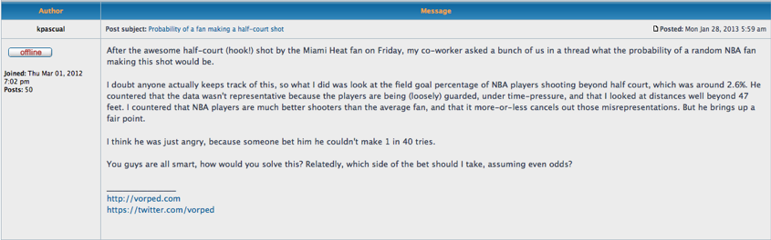

# Fancier Distributions {#fancy}

```{r, message=FALSE, warning=FALSE, echo=FALSE}
library(mosaic)
set.seed(2018)
```

## Introduction {#introduction}

We have learned about important discrete random variables such as the binomial and about important continuous random variables such as the normal. In this chapter we add to our repertoire some other useful distributions including the geometric, negative binomial, and poisson discrete random variables and the uniform and exponential continuous random variables. 

## Chapter Scenario - {#chapter_scenario}


## The Geometric Random Variable {#the_geometric_random_variable}

### Example - Waiting for Lucky Number 7

Suppose you are playing roulette betting on the single number seven and you are going to stay at the table until a seven occurs. How long should you expect to wait? How variable is the waiting time? If you follow this strategy, what is the probability you will leave a winner? An understanding of what is called a geometric random variable is helpful to answer these questions. 

Since the roulette wheel has 38 slots we know the probability of getting a seven is $1/38$ and the probability of not getting a seven is $37/38$. Letting S represent the event of getting a seven and N represent the event of not getting a seven we have $P(S)=1/38$ and $P(N)=37/38. Using subscripts to keep track of the first, second, third spin and so on we can visualize the experiment of waiting for the first seven in a tree diagram. 

```{r nice-fig-141, fig.cap='Tree Diagram - Waiting for Lucky Number 7', out.width='30%', fig.asp=.75, fig.align='center', echo=FALSE}
#knitr::include_graphics("01-basics-figures/roulette_tree_diagram_lucky_number_7.png")
```

What we are really interested in is how long it takes to get our first number seven. To help us think about this distribution, let X count the number of rolls needed to get our first seven. Building up one step at a time we can find the probability X = 1, 2, 3, ... and find the general pattern. We can calculate a few probabilities to get a feel.

$$P(\text{get first 7 on first spin})=P(X=1)=\frac{1}{38}$$
$$P(\text{get first 7 on second spin})=P(X=2)=\frac{37}{38} \cdot \frac{1}{38}$$

$$P(\text{get first 7 on third spin})=P(X=3)=\frac{37}{38} \cdot \frac{37}{38} \cdot \frac{1}{38}$$

In general, for the first seven to occur on the $x^{th}$ spin, we need $x-1$ failures and then success. Finding an expression to represent the probability that $x$ spins are needed yields

$$P(X=x)=(\frac{37}{38})^{x-1} \cdot \frac{1}{38}$$ 

In this situation, we have independent trials and the same probability of success on each trial and we are interested in how long it takes to get our first success. We call this situation a geometric random variable.

### The Geometric Random Variable Probability Distribution

Given independent trials with a constant probability of success, p, on each trial the number failures before the first success, X, is a geometric random variable with probability density function

$$\text{For all positive integers n}, P(X=x)=(1-p)^{x-1} \cdot p$$

To determine the expected value of the geometric random variable requires an infinite sum and some calculus but we will examine it intuitively. 

When spinning the roulette wheel and counting the number of trials until our first seven occurs, this is a geometric random variable with probability of success $p=1/38$. Getting the lucky number seven happens 1 out of every 38 spins on average so, intuitively, we anticpate the expected number of trials until our first success is 38. And we would be right. It turns out the expected number of trials for the first success is the reciprocal of the probability since $1/(1/38)=38$.

In general, for a geometric random variable with probability of success p, the expectation, that is, the expected number of trials until the first success is $1/p$.

### The Geometric Random Variable in R

Assume we have a geometric random variable with probability of success parameter p. We can use R functions from the `mosaic` package but there is a wrinkle. These functions count the number of failures before the first success, not the total number of trials. Consequently, we need to adjust the input by adjusting by 1. It is a little tricky.

* To find the individual probability of x trials needed to obtain the first success, $P(X=x)$, use `dgeom(x-1, prob)`.
* To find the cumulative probability of less than or equal to x trials needed to obtain the first success, $P(X \leq x)$, use `pgeom(q=x-1, prob=p, lower.tail = TRUE)`.
* To visualize the cumulative probability $P(X \leq x)$ use `pdist(dist="geom", prob=p, q=x-1)`.
* To find the inverse probability, that is the value of x such that $P(X \leq x) = p$ use `qgeom(p, prob=p, lower.tail = TRUE)+1`.
* To generate a random sample of size n from this geometric random variable use `rgeom(n, prob=p)+1`.

For example, in waiting in roulette for our lucky number seven, the probability of getting a seven on any spin is $p=1/38$ and, as we have seen, the number of rolls needed is a geometric random variable.

To find the probability exactly 20 spins are needed:

```{r}
dgeom(x=19, prob=1/38)
```

While the `dgeom()` command provides individual probabilities, one may input multiple values in a vector and see all of their individual probabilities. For example, the code below shows all the probabilities for X=1,2,3,...,20 by inputing the vector `0:19`:

```{r}
dgeom(x=0:19, prob=1/38)
```

Note the last value in the list, `r dgeom(x=19, prob=1/38)`, matches the probability that exactly 20 spins are needed.

To find the cumulative probability twenty or fewer rolls are needed:

```{r}
pgeom(q=19, prob=1/38, lower.tail = TRUE)
```

To visualize the cumulative probability twenty or fewer rolls are needed:

```{r}
pdist(dist="geom", prob=1/38, q=19)
```

To find the probability more than twenty rolls are needed we use the complement principle or change the lower.tail value:

```{r}
1 - pgeom(q=19, prob=1/38, lower.tail = TRUE)
pgeom(q=19, prob=1/38, lower.tail = FALSE)
```

To find the number of trials needed to insure a 90% chance of obtaining a seven:

```{r}
qgeom(p=0.90, prob=1/38, lower.tail = TRUE)+1
```

To generate a random sample of 100 such experiments waiting for the first seven:

```{r}
rgeom(n=20, prob=1/38)+1
```

The important thing to remember is that these R commands count the number of failures before the first success instead of the total number of trials including the first success. 

## The Poisson Distribution {#the_poisson_distribution}

### Poisson Basics

The Poisson distribution is often used to model real-world phenomena related to the number of certain events that occur over a specified period of time such as the number of math errors made in a typical math class, the number of text messages received during class, or even the chance of an earthquake occurring sometime this semester.

A discrete random variable X is said to have a Poisson distribution with parameter $\lambda>0$, if, for $k=0,1,2,...$, the probability mass function of X is given by

$$P(X=k)=\frac{\lambda^{k}*e^{-\lambda}}{k!}$$
This formula would determine the probability of $k$ events occurring. The expected value is $\lambda$, the variance is also $\lambda$, and the standard deviation is $\sqrt{\lambda}$.

### The Poisson Random Variable in R

Assume we have a poisson random variable with parameter $\lambda$. We often determine $\lambda$ by finding the sample mean from data since the expectation of a poisson is $\lambda$.

* To find the individual probability of x occurrences, $P(X=x)$, use `dpois(x, lambda)`.
* To find the cumulative probability of less than or equal to x successes, $P(X \leq x)$, use `ppois(q, lambda, lower.tail = TRUE)`.
* To visualize the cumulative probability $P(X \leq x)$ use `pdist(dist="pois", lambda, q=x)`.
* To find the inverse probability, that is the value of x such that $P(X \leq x) = p$ use `qpois(p, lambda, lower.tail = TRUE)`.
* To generate a random sample of size n from a poisson random variable use `rpois(n, lambda)`.

### Modeling Number of Earthquakes with the Poisson

Consider how the Poisson can be used to model different phenomena. One key is that the parameter $\lambda$ equals the expected value. Thus, if you know the expected value you can use this value for $\lambda$ to find probabilities. Here we apply this technique to examine earthquake frequency along the Wasatch Front. The earthquake frequency table below is from the University of Utah Seismic Station’s website - [http://www.seis.utah.edu/edservices/EES/WsatchFrontClock.shtml](http://www.seis.utah.edu/edservices/EES/WsatchFrontClock.shtml).

```{r nice-fig-142, fig.cap='Earthquake Table', out.width='30%', fig.asp=.75, fig.align='center', echo=FALSE}
#knitr::include_graphics("01-basics-figures/earthquake_table.png")
```

Suppose that we make the simplifying assumption that the number of earthquakes of a given magnitude that occur in a given time period is a Poisson distribution and that the estimate of the recurrence interval can be used to determine the parameter .

Suppose that we are interested in the occurrence of earthquakes of magnitude greater than 3.0 during a two-semester period of 8 months. Since the estimate of the recurrence interval is 4 months we would expect approximately two earthquakes in eight months thus we would model the number of earthquakes with parameter $\lambda=2$.

To find the probability of 0 eartquakes in a two-semester period:

```{r}
dpois(x=0,lambda=2)
```

To find the probability of 1 eartquake in a two-semester period:

```{r}
dpois(x=1, lambda=2)
```

For cumulative probabilities of 2 or fewer earthquakes in a two-semester period:

```{r}
ppois(q=2, lambda=2) 
```

Using the complement principle we can find the probability of more than 2 earthquakes in a two-semester period:

```{r}
1 - ppois(q=2, lambda=2) 
```

The ‘mosaic’ package in R creates fantastic visualizations of probability distributions. Examine the code below showing the probability of two or fewer earthquakes.

```{r}
pdist("pois", q=2, lambda=2)
```

Thus, there is a `r 100*pdist("pois", q=2, lambda=2)` percent chance of two or fewer earthquakes in a two-semester period.

To find the 90th percentile:

```{r}
qdist("pois", p=0.9, lambda=2)
```

Thus, we can say that according to our model, there is a 90% chance of `r qdist("pois", p=0.9, lambda=2)` or fewer earthquakes in a given two-semester period.


## Exercises {#exercises}

### Exercise - The Geometric Dice Game

Two players, called Alpha and Beta, play against each other in what we'll call the Geometric Dice Game. The players each choose a different number from 1 to 6. The die is then rolled until one of these two numbers comes up. The player whose number comes up first is the winner. Fun, huh! First, let's think about each player's chances. What is the probability Alpha will win? What is the probability Beta will win? Suppose we are interested in how long we would expect this game to go on. On average, how many rolls do you think are needed to resolve this game? What is the probability it will take five or more rolls to resolve this game?

### Exercise - NBA Halfcourt Shot

In the following web posting (http://apbr.org/metrics/viewtopic.php?f=2&t=8167) it is claimed NBA players make 2.6% of shots beyond half court. Assuming this claim is true, on average how many shots would it take from beyond half court to make one? If an NBA player was ready to take a shot from beyond half court and a buddy offers you 20 to 1 odds on the player making it would this be a better bet for your buddy or for you? Explain. (Note, if the shot is made you win $\$20$ and if the shot is not made you lose $\$1$.)

```{r nice-fig-143, fig.cap='NBA Blog Posting', out.width='30%', fig.asp=.75, fig.align='center', echo=FALSE}

```

### Exercise - The Chevalier de Mere Revisited

In one of the games the Chevalier was interested, a die is tossed and the player has four chances to roll a six. If she does, she is a winner. If she doesn't, she is a loser. Let geometric random variable X represent the number of rolls needed to roll a six. 
(a) Use the probability we found earlier when solving this game with the complement principle?
(b) On average, how long does it take to roll a six?

### Exercise - Counting Earthquakes

Earthquakes of magnitude greater than 3.0 along the Wasatch front occur on average every four months. Considering a two-semester period of 8 months we expect approximately two earthquakes and can model the number of earthquakes as a poisson distribution with parameter $\lambda=2$.
(a) Determine the probability of three or fewer earthquakes of magnitude greater than 3.0 in the next 8 months and llustrate this probability with a plot of the probability distribution.
(b) Find the 75th percentile for the number of earthquakes of magnitude greater than 3.0 in the next 8 months and illustrate the 75th percentile with a plot of the probability distribution.
(c) If we were to explore the number of earthquakes of magnitude greater than 3.0 in the next two-year period instead of the next 8 months explain what value for $\lambda$ would be appropriate in a Poisson model.

### Exercise - Growth Mindset and Math Errors
Psychologist Carol Dweck, in her book *Mindset: The New Psychology of Success*, advocated that students focus on the learning process to develop their intelligence rather than to think intelligence is fixed. In math this might mean we need to embrace making mistakes as mistakes provide the main context for exploring effective and ineffective approaches to a problem. Suppose that in an active and engaged college math class, an average of 8 math mistakes are made on the whiteboard per class session. Use a Poisson model to find the following.
(a) What is the probability that in an active and engaged math class there will be 0 math mistakes made on the whiteboard in a class session?
(b) Is it more likely that there will be fewer than 8 or more than 8 math mistakes made on the whiteboard in a class session?
(c) One particularly productive session had 10 great mistakes from which to learn. What is the probability of 10 or more mistakes on the whiteboard in a class session?

