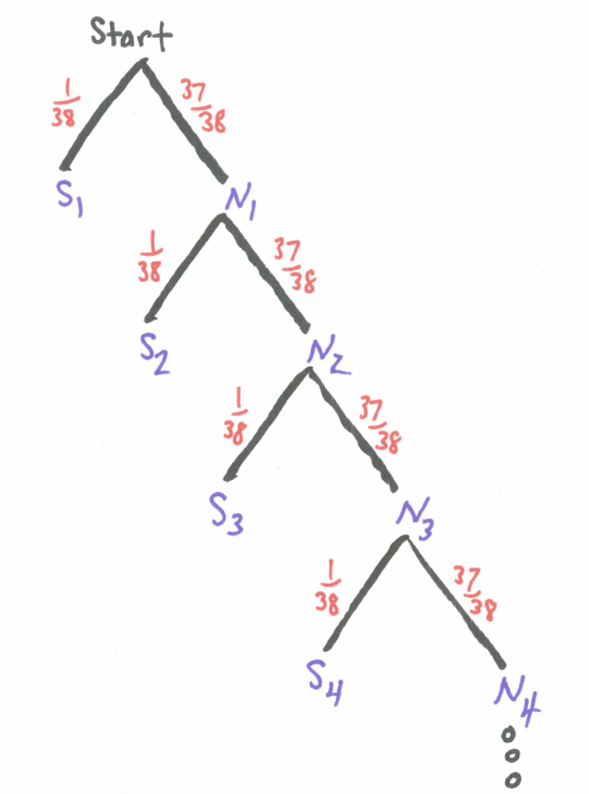

# Fancier Distributions {#fancy}

```{r, message=FALSE, warning=FALSE, echo=FALSE}
library(mosaic)
set.seed(2018)
```

## Introduction {#introduction}

We have learned about important discrete random variables such as the binomial and about important continuous random variables such as the normal. In this chapter we add to our repertoire some other useful distributions including the geometric, negative binomial, and poisson discrete random variables and the uniform and exponential continuous random variables. 

## Chapter Scenario - Lovin' the Airport {#chapter_scenario_lovin_the_airport}

Suppose a domestic flight leaves at 5:00pm and has 50 passengers who show up independently at the airport at uniformly random times between 3:15pm and 4:30pm. How many passengers can we expect to have arrived at the airport by 4:00pm, one hour before takeoff? How confident can we be in this answer?


## The Geometric Random Variable {#the_geometric_random_variable}

### Example - Waiting for Lucky Number 7

Suppose you are playing roulette betting on the single number seven and you are going to stay at the table until a seven occurs. How long should you expect to wait? How variable is the waiting time? If you follow this strategy, what is the probability you will leave a winner? An understanding of what is called a geometric random variable is helpful to answer these questions. 

Since the roulette wheel has 38 slots we know the probability of getting a seven is $1/38$ and the probability of not getting a seven is $37/38$. Letting S represent the event of getting a seven and N represent the event of not getting a seven we have $P(S)=1/38$ and $P(N)=37/38. Using subscripts to keep track of the first, second, third spin and so on we can visualize the experiment of waiting for the first seven in a tree diagram. 

```{r nice-fig-141, fig.cap='Tree Diagram - Waiting for Lucky Number 7', out.width='30%', fig.asp=.75, fig.align='center', echo=FALSE}

```

What we are really interested in is how long it takes to get our first number seven. To help us think about this distribution, let X count the number of rolls needed to get our first seven. Building up one step at a time we can find the probability X = 1, 2, 3, ... and find the general pattern. We can calculate a few probabilities to get a feel.

$$P(\text{get first 7 on first spin})=P(X=1)=\frac{1}{38}$$
$$P(\text{get first 7 on second spin})=P(X=2)=\frac{37}{38} \cdot \frac{1}{38}$$

$$P(\text{get first 7 on third spin})=P(X=3)=\frac{37}{38} \cdot \frac{37}{38} \cdot \frac{1}{38}$$

In general, for the first seven to occur on the $x^{th}$ spin, we need $x-1$ failures and then success. Finding an expression to represent the probability that $x$ spins are needed yields

$$P(X=x)=(\frac{37}{38})^{x-1} \cdot \frac{1}{38}$$ 

In this situation, we have independent trials and the same probability of success on each trial and we are interested in how long it takes to get our first success. We call this situation a geometric random variable.

### The Geometric Distribution

Given independent trials with a constant probability of success, p, on each trial the number failures before the first success, X, is a geometric random variable with probability density function

$$\text{For all positive integers n}, P(X=x)=(1-p)^{x-1} \cdot p$$

To determine the expected value of the geometric random variable requires an infinite sum and some calculus but we will examine it intuitively. 

When spinning the roulette wheel and counting the number of trials until our first seven occurs, this is a geometric random variable with probability of success $p=1/38$. Getting the lucky number seven happens 1 out of every 38 spins on average so, intuitively, we anticpate the expected number of trials until our first success is 38. And we would be right. It turns out the expected number of trials for the first success is the reciprocal of the probability since $1/(1/38)=38$.

In general, for a geometric random variable with probability of success p, the expectation, that is, the expected number of trials until the first success is $1/p$.

### The Geometric Random Variable in R

Assume we have a geometric random variable with probability of success parameter p. We can use R functions from the `mosaic` package but there is a wrinkle. These functions count the number of failures before the first success, not the total number of trials. Consequently, we need to adjust the input by adjusting by 1. It is a little tricky.

To find the individual probability of x trials needed to obtain the first success, $P(X=x)$, use `dgeom(x-1, prob)`.

To find the cumulative probability of less than or equal to x trials needed to obtain the first success, $P(X \leq x)$, use `pgeom(q=x-1, prob=p, lower.tail = TRUE)`.

To visualize the cumulative probability $P(X \leq x)$ use `pdist(dist="geom", prob=p, q=x-1)`.

To find the inverse probability, that is the value of x such that $P(X \leq x) = p$ use `qgeom(p, prob=p, lower.tail = TRUE)+1`.

To generate a random sample of size n from this geometric random variable use `rgeom(n, prob=p)+1`.

For example, in waiting in roulette for our lucky number seven, the probability of getting a seven on any spin is $p=1/38$ and, as we have seen, the number of rolls needed is a geometric random variable.

To find the probability exactly 20 spins are needed:

```{r}
dgeom(x=19, prob=1/38)
```

While the `dgeom()` command provides individual probabilities, one may input multiple values in a vector and see all of their individual probabilities. For example, the code below shows all the probabilities for X=1,2,3,...,20 by inputing the vector `0:19`:

```{r}
dgeom(x=0:19, prob=1/38)
```

Note the last value in the list, `r dgeom(x=19, prob=1/38)`, matches the probability that exactly 20 spins are needed.

To find the cumulative probability twenty or fewer rolls are needed:

```{r}
pgeom(q=19, prob=1/38, lower.tail = TRUE)
```

To visualize the cumulative probability twenty or fewer rolls are needed:

```{r}
pdist(dist="geom", prob=1/38, q=19)
```

To find the probability more than twenty rolls are needed we use the complement principle or change the lower.tail value:

```{r}
1 - pgeom(q=19, prob=1/38, lower.tail = TRUE)
pgeom(q=19, prob=1/38, lower.tail = FALSE)
```

To find the number of trials needed to insure a 90% chance of obtaining a seven:

```{r}
qgeom(p=0.90, prob=1/38, lower.tail = TRUE)+1
```

To generate a random sample of 100 such experiments waiting for the first seven:

```{r}
rgeom(n=20, prob=1/38)+1
```

The important thing to remember is that these R commands count the number of failures before the first success instead of the total number of trials including the first success. 

## The Poisson Random Variable {#the_poisson_random_variable}

### The Poisson Distribution

The Poisson distribution is often used to model real-world phenomena related to the number of certain events that occur over a specified period of time such as the number of math errors made in a typical math class, the number of text messages received during class, or even the chance of an earthquake occurring sometime this semester.

A discrete random variable X is said to have a Poisson distribution with parameter $\lambda>0$, if, for $k=0,1,2,...$, the probability mass function of X is given by

$$P(X=k)=\frac{\lambda^{k}*e^{-\lambda}}{k!}$$
This formula would determine the probability of $k$ events occurring. The expected value is $\lambda$, the variance is also $\lambda$, and the standard deviation is $\sqrt{\lambda}$.

### The Poisson Random Variable in R

Assume we have a Poisson random variable with parameter $\lambda$. We often determine $\lambda$ by finding the sample mean from data since the expectation of a Poisson is $\lambda$.

To find the individual probability of x occurrences, $P(X=x)$, use `dpois(x, lambda)`.

To find the cumulative probability of less than or equal to x successes, $P(X \leq x)$, use `ppois(q, lambda, lower.tail = TRUE)`.

To visualize the cumulative probability $P(X \leq x)$ use `pdist(dist="pois", lambda, q=x)`.

To find the inverse probability, that is the value of x such that $P(X \leq x) = p$ use `qpois(p, lambda, lower.tail = TRUE)`.

To generate a random sample of size n from a poisson random variable use `rpois(n, lambda)`.

### Modeling Number of Earthquakes with the Poisson

Consider how the Poisson can be used to model different phenomena. One key is that the parameter $\lambda$ equals the expected value. Thus, if you know the expected value you can use this value for $\lambda$ to find probabilities. Here we apply this technique to examine earthquake frequency along the Wasatch Front. The earthquake frequency table below is from the University of Utah Seismic Station’s website - [http://www.seis.utah.edu/edservices/EES/WsatchFrontClock.shtml](http://www.seis.utah.edu/edservices/EES/WsatchFrontClock.shtml).

```{r nice-fig-142, fig.cap='Earthquake Table', out.width='30%', fig.asp=.75, fig.align='center', echo=FALSE}
#knitr::include_graphics("01-basics-figures/earthquake_table.png")
```

Suppose that we make the simplifying assumption that the number of earthquakes of a given magnitude that occur in a given time period is a Poisson distribution and that the estimate of the recurrence interval can be used to determine the parameter .

Suppose that we are interested in the occurrence of earthquakes of magnitude greater than 3.0 during a two-semester period of 8 months. Since the estimate of the recurrence interval is 4 months we would expect approximately two earthquakes in eight months thus we would model the number of earthquakes with parameter $\lambda=2$.

To find the probability of 0 earthquakes in a two-semester period:

```{r}
dpois(x=0,lambda=2)
```

To find the probability of 1 earthquake in a two-semester period:

```{r}
dpois(x=1, lambda=2)
```

For cumulative probabilities of 2 or fewer earthquakes in a two-semester period:

```{r}
ppois(q=2, lambda=2) 
```

Using the complement principle we can find the probability of more than 2 earthquakes in a two-semester period:

```{r}
1 - ppois(q=2, lambda=2) 
```

The ‘mosaic’ package in R creates fantastic visualizations of probability distributions. Examine the code below showing the probability of two or fewer earthquakes.

```{r}
pdist("pois", q=2, lambda=2)
```

Thus, there is a `r 100*pdist("pois", q=2, lambda=2)` percent chance of two or fewer earthquakes in a two-semester period.

To find the 90th percentile:

```{r}
qdist("pois", p=0.9, lambda=2)
```

Thus, we can say that according to our model, there is a 90% chance of `r qdist("pois", p=0.9, lambda=2)` or fewer earthquakes in a given two-semester period.

## The Hypergeometric Random Variable {#hypergeometric_random_variable}

### Example - A Class Controversy

A political science class has 12 liberal students and 8 conservative students. Four students are selected at random to organize a class debate on the presidential election. It so happens that three of the individuals are liberal and only one of the students is conservative. Some students cry foul. A relevant question is how likely is the committee to have such a composition. Which committee composition is more likely - a committee with two liberal and two conservative students or a committee with three liberal and one conservative?

We can envision a class with 12 liberal students and 8 conservative students in an urn model. Imagine 20 balls in an urn that are otherwise identical except that 12 balls are white representing liberal students and 8 balls are black representing conservative students. Concerning the political leanings of four students selected at random from the class, drawing four balls without replacement from this urn is equivalent. 

We can determine the probability of any particular committee composition. For example, to find the probability all four are liberal we note there are $\binom{12}{4}$ ways to select four liberals compared with $\dbinom{20}{4}$ ways total to select four committee members.

$$P(\text{4 are liberal and 0 are conservative})=\frac{\dbinom{12}{4} \cdot \dbinom{8}{0}}{\dbinom{20}{4}}=0.102$$ 

The number of ways to select three liberals and select one conservative is $\dbinom{12}{3} \cdot \dbinom{8}{1}$ yielding the following probability.

$$P(\text{3 are liberal and 1 is conservative})=\frac{\dbinom{12}{3} \cdot \dbinom{8}{1}}{\dbinom{20}{4}}=0.363$$ 

Following similar thinking, 

$$P(\text{2 are liberal and 2 are conservative})=\frac{\dbinom{12}{2} \cdot \dbinom{8}{2}}{\dbinom{20}{4}}=0.381$$ 

$$P(\text{1 is liberal and 3 are conservative})=\frac{\dbinom{12}{1} \cdot \dbinom{8}{3}}{\dbinom{20}{4}}=0.139$$ 

$$P(\text{0 are liberal and 4 are conservative})=\frac{\dbinom{12}{0} \cdot \dbinom{8}{4}}{\dbinom{20}{4}}=0.014$$ 

Comparing these probabilities we see the probability of randomly selecting three liberals and one conservative is 0.363 while the probability of selecting two liberals and two conservatives is 0.381. While the second possibility has a slightly higher probability, they occur at very close to the same rate and it is not at all unusual for the committee to be composed of three liberals and one conservative. In fact, $13.9\%$ of the time the committee would consist of only one liberal and three conservatives.

Situations similar to this which we can understand as equivalent to having an urn with two different color balls and selecting a random sample of them without replacement is called a hypergeometric distribution.

### The Hypergeometric Distribution

Drawing a sample without replacement from a population and counting the number of successes is modeled by the hypergeometric distribution. Such a situation can be conceived as drawing without replacement $k$ balls from an urn containing $m$ white balls and $n$ black balls where the hypergeometric random variable $X$ counts the number of white balls selected. The total number of balls we call $N$ and $N=m+n$. If $k$ balls total are selected and $x$ of them are white then $k-x$ of them are black. $X$ can take on values from $0$ to the minimum of $k$ and $m$ and has the following probability distribution

$$P(X=x)=\frac{\dbinom{m}{x} \cdot \dbinom{n}{k-x}}{\dbinom{m+n}{k}}$$

Since the proportion of white balls is $m/N$ and $k$ are selected, the expectation of the number of white balls selected is $(m \cdot k)/N$. The variance is $\frac{N-k}{N-1} \cdot n \cdot p \cdot (1-p)$.

Note, that when the sample is large, the hypergeometric distribution is approximated by a binomial distribution.


### The Hypergeometric Random Variable in R

We can use R to calculate probabilities for the hypergeometric random variable X representing the number of white balls drawn given the following parameters:

* m: the number of white balls in the urn
* n: the number of black balls in the urn
* k: the number of balls drawn without replacement

To find the individual probability of x white balls, $P(X=x)$, use `dhyper(x, m, n, k)`.

To find the cumulative probability of less than or equal to x successes, $P(X \leq x)$, use `phyper(q=x, m, n, k, lower.tail = TRUE)`.

To find the inverse probability, that is the value of x such that $P(X \leq x) = p$ use `qhyper(p, m, n, k, lower.tail = TRUE)`.

To generate a random sample of size nn from a poisson random variable use `rhyper(nn, m, n, k)`.

Illustrating these commands with the situation above we note the following:

* x: the number of liberal students selected (or white balls selected)
* m=12: the number of liberals in class (or white balls in urn)
* n=8: the number of conservatives in class (or black balls in urn)
* k: the number of students selected (or balls drawn without replacement)

Here we find the probability of three liberal students (and one conservative) being selected is `r dhyper(x=3, m=12, n=8, k=4)`:

```{r}
dhyper(x=3, m=12, n=8, k=4)
```

Now, the probability of two liberal (and two conservative) students being selected is `r dhyper(x=2, m=12, n=8, k=4)`:

```{r}
dhyper(x=2, m=12, n=8, k=4)
```

The probability of two or fewer liberal students being selected is `r phyper(q=2, m=12, n=8, k=4, lower.tail = TRUE)`:

```{r}
phyper(q=2, m=12, n=8, k=4, lower.tail = TRUE)
```

The probability of more than two liberal students being selected can be found in different ways.

First, using the complement principle:

```{r}
1 - phyper(q=2, m=12, n=8, k=4, lower.tail = TRUE)
```

Second, adding up separate individual probabilities:

```{r}
dhyper(x=3, m=12, n=8, k=4) + dhyper(x=4, m=12, n=8, k=4)
```

Third, changing the command to pick up the upper tail of the distribution:

```{r}
phyper(q=2, m=12, n=8, k=4, lower.tail = FALSE)
```

We see all three computations are equal showing that the probability of more than two liberal students being selected is `r 1-phyper(q=2, m=12, n=8, k=4, lower.tail = FALSE)`.

To find a particular quartile, such as the 50th percentile:

```{r}
qhyper(p=0.50, m=12, n=8, k=4, lower.tail = TRUE)
```

We can conclude that at least 50% of the time, two or fewer liberal students will be selected.

To generate a random sample of 10 such selections from this hypergeometric distribution:

```{r}
rhyper(nn=10, m=12, n=8, k=4)
```

Drawing from an urn without selection is a model that usefully describes many real-world situations and the hypergeometric random variable captures the key features of this situation.


## The Uniform Distribution {#the_uniform_distribution}

The uniform random variable is a continuous random variable that is equally likely along its entire range of possible values. Like the normal distribution, the area under the curve between two values is the probability of the random variable being in the interval but unlike the normal bell-shaped curve, the uniform probability density function is a flat, horizontal line. If the uniform random variable X ranges from a minimum of $a$ to a maximum of $b$, we abbreviate this $X \sim UNIF(a,b)$.


### The Uniform Probability Density Function {#the_uniform_probability_density_function}

The uniform probability density function is flat and the area under the curve equals the probability. For X, a uniformly distributed random variable with a minimum of a and a maximum of b, $X \sim UNIF(a,b)$, so that the total area under the curve is 1, the height of the curve must be $1/(b-a)$ between a and b and 0 elsewhere. The code below creates a function to plot different uniform random variables

```{r}
uniform_Plot <- function(a, b){
  xvals <- data.frame(x = c(a, b)) #Range for x-values
  ggplot(data.frame(x = xvals),aes(x = x)) + xlim(c(a, b)) + 
    ylim(0, 1/(b - a)) +
    stat_function(fun=dunif, args=list(min=a, max=b), geom = "area", 
                  fill="green", alpha=0.35) + 
    stat_function(fun = dunif, args = list(min = a, max = b)) +
    labs(x="\n u", y="f(u) \n", 
         title=paste0("Uniform Distribution \n With Min = ", a, " & Max = ", b, " \n")) +
    theme(plot.title=element_text(hjust = 0.5),
          axis.title.x=element_text(face="bold", color="blue", size=12),
          axis.title.y=element_text(face="bold", color="blue", size=12)) +
    geom_vline(xintercept=a, linetype="dashed", color="red") +
    geom_vline(xintercept=b, linetype="dashed", color="red")
}
```

Source: http://dkmathstats.com/plotting-uniform-distributions-in-r-with-ggplot2/ 

Here is the plot of UNIF(4,12).

```{r}
uniform_Plot(4,12)
```


### The Uniform Random Variable in R

For X a uniform random variable we use the following. Since by default `min=0` and `max=1`, for X that is uniformly distributed between a and b, $X \sim UNIF(a,b)$, we must replace 0 and 1 by a and b, respectively.
 
To find the probability of X being less than q, $P(X < q)$, use `punif(q, min = 0, max = 1, lower.tail = TRUE)`.

To find the probability of X being greater than q, $P(X > q)$, use `punif(q, min = 0, max = 1, lower.tail = FALSE)` or `1-punif(q, min = 0, max = 1, lower.tail = TRUE)`.

To find the inverse probability, that is the value of x such that $P(X \leq x) = p$ use `qunif(p, min = 0, max = 1, lower.tail = TRUE)`.

To generate a random sample of size n from a uniform random variable use `runif(n, min = 0, max = 1)`.


### Example - The UNIF(0,1) Random Variable

The basis for most random number generator schemes is a uniform random variable X with a minimum of 0 and a maximum of 1, $X \sim UNIF(0,1)$. The probability density function is visualized below.

```{r}
uniform_Plot(0,1)
```

Because the default `min=0` and `max=1` we could leave these parameters out when using `punif()`, `qunif()`, or `runif()`. For example, we can use `runif(n)` to generate a sample of size n. Here is a sample of twenty random UNIF(0,1):

```{r}
runif(n=20)
```

Variations on UNIF(0,1) is how other random numbers are generated. Watch what happens when we multiply `runif(n=20)` by 4.

```{r}
4*runif(n=20)
```

In this case, we stretched the range so that the values are now UNIF(0,4).

Suppose in addition to stretching by a factor of 4 we subtract 2.

```{r}
4*runif(n=20) - 2
```

This generates random uniform numbers UNIF(-2,2).

And if we had added 2 instead:

```{r}
4*runif(n=20) + 2
```

Now we are generating random uniform numbers UNIF(2,6).

Of course, we could generate all of these directly using `runif(0,4)`, `runif(-2,2)`, and `runif(2,6)` but now we know a little more about how R does it under the hood.

### Example - Catch a Flight

Suppose that the time check in at the airport for a 5:00pm flight is uniformly distributed from 3:15pm to 4:30pm. If we let X represent the amount of time in minutes after 3:15pm that a person shows up then $X \sim UNIF(0,75)$.

To find the probability a person chosen at random shows up before 4:15pm:

```{r}
punif(60, min = 0, max = 75, lower.tail = TRUE)
```

To find the probability a person chosen at random shows up after 4:15pm we have options:

```{r}
1-punif(60, min = 0, max = 75, lower.tail = TRUE)
punif(60, min = 0, max = 75, lower.tail = FALSE)
```

To find the 66th percentile, that is the amount of time after 3:15pm that $66\%$ of people show up:

```{r}
qunif(0.66, min = 0, max = 75, lower.tail = TRUE)
```

As a time, this would translate into 3:15pm plus `r qunif(0.66, min = 0, max = 75, lower.tail = TRUE)` minutes which would be 4:04:30pm.

To generate a random sample of 50 passengers and the number of minutes after 3:15pm that they show up:

```{r}
runif(n=50, min = 0, max = 75)
```

Doesn't this give you a feeling of power? It would be easy for this go to our head.

## Chapter Scenario Revisited - Lovin' the Airport {#chapter_scenario_revisited_lovin_the_airport}

Recall, a domestic flight leaves at 5:00pm, has 50 passengers who show up independently at uniformly random times between 3:15pm and 4:30pm and we want to know how many passengers we can expect to have arrived by 4:00pm and how confident can we be in this answer?

As we have seen, the time in minutes after 3:15pm that a passenger arrives can be modeled with a uniform random variable, $X \sim UNIF(0,75)$.

The probability an individual passenger chosen at random will have arrived by 4:00pm is

```{r}
punif(45, min = 0, max = 75, lower.tail = TRUE)
```

We have 50 passengers and the probability any one of them arrives by 4:00pm is `r punif(45, min = 0, max = 75, lower.tail = TRUE)`. The total number of passengers who have arrived by 4:00pm is thus like a binomial random variable with n=50 and p=`r punif(45, min = 0, max = 75, lower.tail = TRUE)`. The expected number of passengers to have arrived is `r 50*punif(45, min = 0, max = 75, lower.tail = TRUE)` but this could vary. Check out this distribution:

```{r}
xpbinom(20:40, size = 50, prob = 45/75)
```

While we expect around `r 50*punif(45, min = 0, max = 75, lower.tail = TRUE)` there is only an `r 100*dbinom(30, size=50, prob=45/75)` $\%$ chance of exactly `r 50*punif(45, min = 0, max = 75, lower.tail = TRUE)`. This kind of knowledge could help us know how to more effectively manage airport traffic.

## The Exponential Distribution

Recall, the Poisson distribution is models the number of events that occur over a specified period of time. A related variable of interest is the time we need to wait for the next event. In a real-world situation, if the number of events in a certain period of time - be it math errors in class, earthquakes in a school year, etc. - then the time until the next occurrence can be modeled with the continuous random variable called the exponential distribution. 

### The Exponential Probability Density Function

If the average rate of an event is $\lambda$ occurrences per period of time then wait time until the next occurrence can be modeled with an exponential random variable T with probability density function

$$f(t)=\lambda \cdot c^{\lambda \cdot t}$$

for $t > 0$.

Using base graphics, here is the probability density function for an exponential random variable with $\lambda=2$.

```{r}
curve(dexp(x, rate=2), from=0, to=10)
```


The expected value of an exponential random variable is $1/\lambda$ and the variance is $2/\lambda^{2}$, and standard deviation $\sqrt{2/\lambda^{2}}$.

The exponential random variable can be shown to be *memoryless*, meaning that if a certain amount of time has passed without an occurrence this doesn't change the expected amount of time we still need to wait.

### The Exponential Random Variable in R

Given exponential random variable T with parameter $\lambda$

To find the probability of T being less than q, $P(T < q)$, use `pexp(q, rate=lambda, lower.tail=TRUE)`.

To find the probability of X being greater than q, $P(X > q)$, use `pexp(q, rate=lambda, lower.tail = FALSE)` or `1-pexp(q, rate=lambda, lower.tail = TRUE)`.

To find the inverse probability, that is the value of x such that $P(T \leq x) = p$ use `qexp(p, rate=lambda, lower.tail = TRUE)`.

To generate a random sample of size n from a uniform random variable use `rexp(n, rate=lambda)`.


### Example - Soccer Wait Times

The average number of soccer goals per game in the 2014 World Cup in Brazil was 2.7 meaning the goal rate was $2.7/90=0.03$ goals per minute. To model the time in minutes until the next goal occurs in a soccer match we can use the exponential random variable T with $\lambda=0.03$.

The expected value or average time until the next goal is $1/\lambda=1/0.03=33.33$ minutes. 

What is the chance there will be a goal in the next 15 minutes? We want to find $P(T < 15)$. 

```{r}
pexp(15, rate=.03, lower.tail=TRUE)
```

According to our model, there is a `r 100*pexp(15, rate=.03, lower.tail=TRUE)` $\%$ chance of a goal in the next 15 minutes.

What are the chances there will be no goal in the next game is $P(T > 90)$?

```{r}
1-pexp(90, rate=.03, lower.tail=TRUE)
```

Thus, the chance of no goal for the entire game is `r 1-pexp(90, rate=.03, lower.tail=TRUE)`, a small probability but not that unusual.

### Example - The Computer Help Desk

According to the latest stats, Westminster's computer help desk receives about 20 calls per 8 hour shift for a rate of $20/8=2.5$ calls per hour. The time T in hours until the next support call can be modeled with an exponential function with parameter $\lambda=2.5$.

The average time until the next call is $1/2.5=0.4$ hours or 24 minutes. 

What is the probability the next call will occur sometime between 30 and 60 minutes from now. To find this probability, we need to find $P(T < 60)$ and subtract off the unwanted region, $P(T < 30)$.

```{r}
pexp(60, rate=2.5, lower.tail=TRUE) - pexp(30, rate=2.5, lower.tail=TRUE)
```

The probability of a wait of between 30 and 60 minutes is `r pexp(60, rate=2.5, lower.tail=TRUE) - pexp(30, rate=2.5, lower.tail=TRUE)`. Do you think I have time to run down to 7-11?

## Exercises {#exercises}

### Exercise - The Geometric Dice Game

Two players, called Alpha and Beta, play against each other in what we'll call the Geometric Dice Game. The players each choose a different number from 1 to 6. The die is then rolled until one of these two numbers comes up. The player whose number comes up first is the winner. Fun, huh! First, let's think about each player's chances. What is the probability Alpha will win? What is the probability Beta will win? Suppose we are interested in how long we would expect this game to go on. On average, how many rolls do you think are needed to resolve this game? What is the probability it will take five or more rolls to resolve this game?

### Exercise - NBA Halfcourt Shot

In the following web posting (http://apbr.org/metrics/viewtopic.php?f=2&t=8167) it is claimed NBA players make 2.6% of shots beyond half court. Assuming this claim is true, on average how many shots would it take from beyond half court to make one? If an NBA player was ready to take a shot from beyond half court and a buddy offers you 20 to 1 odds on the player making it would this be a better bet for your buddy or for you? Explain. (Note, if the shot is made you win $\$20$ and if the shot is not made you lose $\$1$.)

```{r nice-fig-143, fig.cap='NBA Blog Posting', out.width='30%', fig.asp=.75, fig.align='center', echo=FALSE}
knitr::include_graphics("01-basics-figures/nba_blog_posting.png")
```

### Exercise - The Chevalier de Mere Revisited

In one of the games the Chevalier was interested, a die is tossed and the player has four chances to roll a six. If she does, she is a winner. If she doesn't, she is a loser. Let geometric random variable X represent the number of rolls needed to roll a six. 
(a) Use the probability we found earlier when solving this game with the complement principle?
(b) On average, how long does it take to roll a six?

### Exercise - Counting Earthquakes

Earthquakes of magnitude greater than 3.0 along the Wasatch front occur on average every four months. Considering a two-semester period of 8 months we expect approximately two earthquakes and can model the number of earthquakes as a poisson distribution with parameter $\lambda=2$.
(a) Determine the probability of three or fewer earthquakes of magnitude greater than 3.0 in the next 8 months and llustrate this probability with a plot of the probability distribution.
(b) Find the 75th percentile for the number of earthquakes of magnitude greater than 3.0 in the next 8 months and illustrate the 75th percentile with a plot of the probability distribution.
(c) If we were to explore the number of earthquakes of magnitude greater than 3.0 in the next two-year period instead of the next 8 months explain what value for $\lambda$ would be appropriate in a Poisson model.

### Exercise - Growth Mindset and Math Errors

Psychologist Carol Dweck, in her book *Mindset: The New Psychology of Success*, advocated that students focus on the learning process to develop their intelligence rather than to think intelligence is fixed. In math this might mean we need to embrace making mistakes as mistakes provide the main context for exploring effective and ineffective approaches to a problem. Suppose that in an active and engaged college math class, an average of 8 math mistakes are made on the whiteboard per class session. Use a Poisson model to find the following.
(a) What is the probability that in an active and engaged math class there will be 0 math mistakes made on the whiteboard in a class session?
(b) Is it more likely that there will be fewer than 8 or more than 8 math mistakes made on the whiteboard in a class session?
(c) One particularly productive session had 10 great mistakes from which to learn. What is the probability of 10 or more mistakes on the whiteboard in a class session?

### Exercise - Transforming UNIF(0,1)

(a) Describe a transformation on `runif(0,1)` that generates uniform random numbers with a min=0 and max=3.
(b) Describe a transformation on `runif(0,1)` that generates uniform random numbers with a min=-3 and max=3.
(c) Describe a transformation on `runif(0,1)` that generates uniform random numbers with a min=4 and max=12.

### Exercise - Showing Up for Class

Suppose that in a class of 20 students that begins at 2:00pm, the time each student shows up is independent of other students and is uniformly distributed from 1:55pm to 2:10pm.
(a) What is the probability a student chosen at random will arrive on time?
(b) At what time can we be 90% certain a student chosen at random has arrived?
(c) What is the probability student A shows up before student B?
(d) What is the probability that a majority of students will show up on time?

### Exercise - Waiting on that Earthquake

Earthquakes of magnitude greater than 3.0 along the Wasatch front occur on average every four months. Considering a two-semester period of 8 months we expect approximately two earthquakes. While we can model the number of earthquakes per school year as a poisson distribution with parameter $\lambda=2$, this might be an unusual time period to use to model the waiting time until the next one. If we used months as our unit of time, what value of the parameter $\lambda$ would we use to model the time until the next earthquake of magnitude greater than 3.0? What would be the probability we would wait three or more months for the next earthquake of magnitude greater than 3.0?

### Exercise - NHL Hockey Goals

During the 2017-2018 season, the home team scored on average 2.97 goals. Hockey games consist of three 20 minute periods so each game is 60 minutes. Model the time until the next goal with an exponential random variable. Find the probability that in one period, 20 minutes, there will not be a goal. Find the probability that the next goal will occur between 10 and 20 minutes from now.


Source: hockey-reference.com

