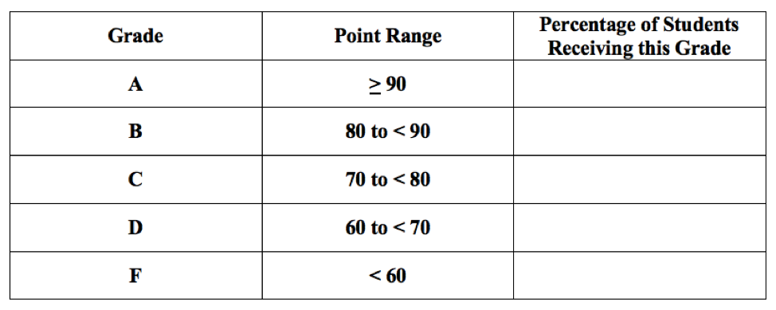
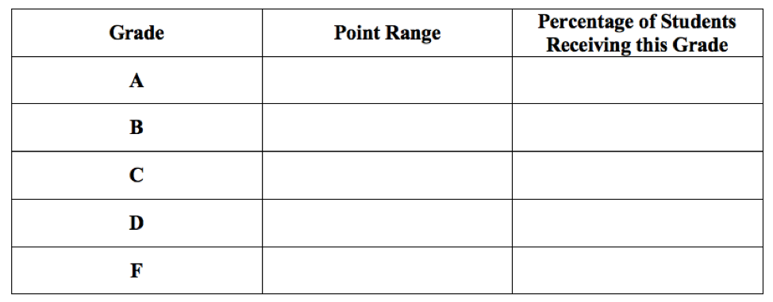
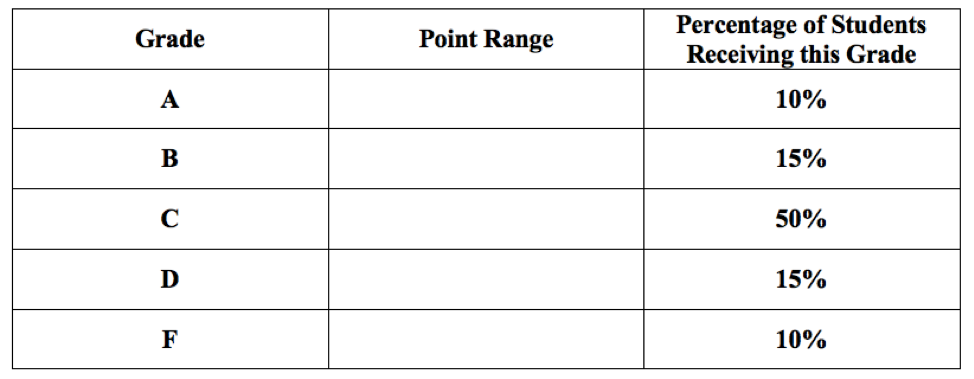
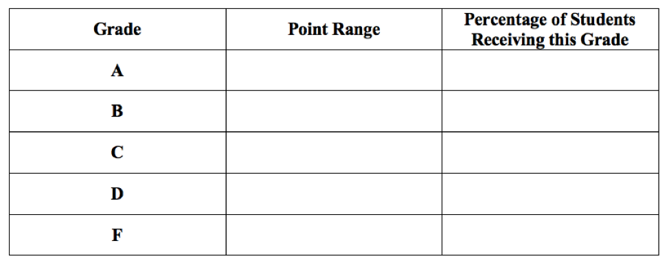

# Normal Distribution {#normal}

```{r, message=FALSE, warning=FALSE, echo=FALSE}
library(mosaic)
set.seed(2018)
```


## Introduction {#introduction}

Not everything is Normal (we certainly aren't), but it is useful to model data that is unimodal, symmetric, and without outliers. A statistical "model" is a simplification or an idealization. Reality is, of course, never perfectly bell-shaped. Real data is not exactly symmetric with one clear peak in the middle. Nevertheless, this abstract model can give us good answers if used properly.

## Chapter Scenario - Wanna be a Fighter Pilot {#chapter_scenario_wanna_be_a_fighter_pilot}

Adult males have an average height of 70 inches with a standard deviation of 4 inches. Adult females have a short average height of 65 inches and a slightly smaller standard deviation of 3.5 inches. It is known that the heights of males and females are both normally distributed. 

Source: http://www.usablestats.com/lessons/normal 

To be a pilot in the Air Force's you must be 64 to 77 inches tall when standing. What proportion of males and what proportion of females in the population qualify?

## The Normal Probability Distribution

Many natural phenomena appear to follow a bell-shaped distribution matching what is called a normal distribution. If the data is unimodal, symmetric, and without extreme outliers, a normal model might be appropriate. 

A normal random variable is a continuous random variable with probability density function given by 

$$f(x)=\frac{1}{\sqrt{2\pi}\sigma} \cdot e^{\frac{{(x - \mu)}^{2}}{2\sigma ^2}}$$

where the mean is $\mu$ and the standard deviation is $\sigma$. The normal distribution with mean 0 and standard deviation 1, called the standard normal, looks like this:

```{r}
ggplot(data.frame(x = c(-4, 4)), aes(x)) +
    stat_function(fun = dnorm) +
    scale_x_continuous(breaks = -3:3)
```

The probability density function, or pdf, is a function whose area under the curve on a particular region corresponds to the probability of the random variable falling in that region. The normal distribution was first discovered by Abraham DeMoivre when attempting to approximate binomial probabilities. 

The main reason that natural phenomena often are approximately normal is the Central Limit Theorem, discussed later, which proves that sums and means of random samples are increasingly normal as the sample size increases. 

## The Normal Distribution in R

Given normal random variable X with parameters $\mu$ and $\sigma$:

To find the probability of X being less than q, $P(X < q)$, use `pnorm(q, mean, sd)` or use `pdist("norm", q, mean, sd, plot = FALSE)`. To visualize the region and report the probability of X being less than q, $P(X < q)$, use `pdist(dist="norm", q, mean, sd)`. To visualize the region and not report the probability use `pdist(dist="norm", q, mean, sd, invisible=TRUE)`.

To find the probability of X being greater than q, $P(X > q)$, use the complement principle and compute `1-pnorm(q, mean, sd)` or include `lower.tail=FALSE` and find `pnorm(q, mean, sd, lower.tail=FALSE)` .

To find the inverse probability, that is the value of x such that $P(X \leq x) = p$ use `qnorm(p, mean, sd)`. To visualize the region and report the value of x such that $P(X \leq x) = p$ use `qdist(dist="norm", p, mean, sd)`. To visualize the region and not report the value use `$P(X \leq x) = p$ use `qnorm(p, mean, sd, plot=FALSE)`.

To generate a random sample of size n from a uniform random variable use `rnorm(n, mean, sd)`.

For all of the commands above the default value for the mean is 0 and the default value for the standard deviation is 1 generating results for the standard normal.


## Example - Normal Blood Pressure

Blood pressure varies normally and the mean and standard deviation for males and females both with normal blood pressure and with pre/hypertension is described in the table below.

```{r nice-fig-1501, fig.cap='Normal and Pre/Hypertensive Blood Pressure by Sex', out.width='70%', fig.asp=.75, fig.align='center', echo=FALSE}
knitr::include_graphics("01-basics-figures/normal_blood_pressure.png")
```

For males with normal blood pressure, systolic blood pressure (SBP) is normally distributed with a mean of 113.8 and a standard deviation of 10.8.  

Source: https://www.researchgate.net/figure/The-mean-and-standard-deviation-values-for-systolic-and-diastolic-blood-pressure-among_tbl5_232742829

### Finding SBP Probabilities with `pdist`

If we are interested in finding the proportion or percentage of individuals within a particular range of values we use the `pdist` command.

To find the proportion of males with normal blood pressure who have SBP below 120:

```{r}
pnorm(q=120, mean=113.8, sd=10.8)
```

To get the proportion only and not the plot:

```{r}
pdist("norm", q = 120, mean = 113.8, sd = 10.8, plot = FALSE)
```

To get the plot only and not the proportion:

```{r}
pdist("norm", q = 120, mean = 113.8, sd = 10.8, invisible = TRUE)
```

To find the proportion of males with normal blood pressure who have SBP above 130 we use the complement principle since $P(X>130)=1-P(X<130).

```{r}
1-pdist("norm", q = 120, mean = 113.8, sd = 10.8)
```

To find the proportion of males with normal blood pressure who have SBP between 120 and 130 we note that $P(120<X<130)=P(X<130)-P(X<120)$ and compute the following difference. To avoid getting two separate plots we include `plot=FALSE`.

```{r}
pdist("norm", q = 130, mean = 113.8, sd = 10.8, plot=FALSE) - pdist("norm", q = 120, mean = 113.8, sd = 10.8, plot=FALSE)
```

An alternative is to input the vector `q=c(120,130)` and visualize the region with the area shown on the plot but not as output.

```{r}
pdist("norm", q = c(120,130), mean = 113.8, sd = 10.8) 
```

We can use the `diff` command to subtract the two values:

```{r}
diff(pdist("norm", q = c(120,130), mean = 113.8, sd = 10.8)) 
```


### Finding SBP Percentiles with `qdist`

If we are interested in finding the particular cutoff value for which a certain percentage of individuals fall below or above, we use the `qdist` command.

To find the cutoff for the SBP at which $75\%$ of males with normal blood pressure fall below:

```{r}
qdist("norm", p = 0.75, mean = 113.8, sd = 10.8)
```

To get the percentile cutoff only and not the plot:

```{r}
qdist("norm", p = 0.75, mean = 113.8, sd = 10.8, plot = FALSE)
```

To get the plot only and not the percentile cutoff:

```{r}
qdist("norm", p = 0.75, mean = 113.8, sd = 10.8, invisible=TRUE)
```

To find the SBP cutoff at which $60\%$ of males with normal blood pressure fall above, we need to adapt our code since the `qdist` command interprets the input as the area below, ie., the left-tail area. The SBP cutoff at which $60\%$ of males with normal blood pressure fall above is exactly the cutoff at which $40\%$ of males fall below.

```{r}
qdist("norm", p = 0.4, mean = 113.8, sd = 10.8)
```

To find the SBP cutoffs that capture the middle $90\%$ of males with normal blood pressure is subtle. Note, that the middle $90\%$ would have $5\%$ below the lower cutoff and $95\%$ below the upper cutoff. So, to find cutoffs for the middle $90\%$, we need to find the $5\%$ and the $95\%$ percentiles. Again, we can input multiple values with the vector `p=c(0.05, 0.95)`. 

```{r}
qdist("norm", p = c(0.05, 0.95), mean = 113.8, sd = 10.8)
```


## The Standard Normal $Z \sim N(0,1)$

The standard normal distribution is a normal distribution with mean 0 and standard deviation 1. Probability tables are available for the standard normal and other normal distributions can be converted to standard normals so an understanding of how the standard normal works is useful. If $X \sim N(\mu, \sigma)$ then $Z=\frac{X-\mu}{\sigma} \sim N(0,1)$. 

The `pdist`, `qdist`, and `rnorm` commands use mean 0 and standard deviation 1 as default values.

## Example - Tides

Tides vary according to the weather, the time of year, and the phase of the moon but even taking all of these factors into account, the tide may be higher or lower than predicted and, according to M. T. Murray of the Liverpool Tidal Institute the prediction error, that is, the difference between the observed height of the tide and the predicted height of the tide, varies normally. This means that if we measure the prediction error in how many standard deviations above or below the expected hight, this variable, call it Z, will be a standard normal random variable with mean 0 and standard deviation 1, $Z \sim N(0,1)$.

Source: https://journals.lib.unb.ca/index.php/ihr/article/viewFile/24101/27886 

What proportion of the time is the actual tide more than one standard deviation below the mean?

```{r}
pdist("norm", q = -1) 
```

What proportion of the time is the actual tide within one standard deviation of the predicted tide? We want to find $P(-1<Z<1):

```{r}
pdist("norm", q = c(-1,1)) 
```

What proportion of the time is the actual tide within two standard deviations of the predicted tide? 

```{r}
pdist("norm", q = c(-2,2)) 
```

What is the 75th percentile for the number of standard deviations the actual tide deviates from the predicted tide? We want to find q such that $P(X<q)=0.95$.

```{r}
qdist("norm", p=0.95)
```


## The 68-95-99.7 Rule

Summarizing the distribution of probabilities, we know that for all normal distributions $68\%$ of the population is within 1 standard deviation of the mean, $95\%$ of the population is within 2 standard deviations of the mean, and $99.7\%$ of the population is withing 3 standard deviations of the mean as visualized below.

```{r}
pdist("norm", q = c(-3,-2,-1,0,1,2,3), invisible = TRUE)
```


## Exercises {#exercises}

### Exercise - Exercise, Exercise
Grace likes exercising and the amount of time she spends in aerobic exercise per week is normally distributed. If four hours per week is the 60th percentile and six hours per week is the 80th percentile, which would represent more exercise - the 70th percentile or 5 hours of exercise? 

### Exercise - Hello, Doggie!
Audrey, Marin, and Allison like dogs, especially Viszlas. Male Viszlas weigh on average 54 pounds with a standard deviation of 5 pounds and are normally distributed. A small male Viszla named "Sweet Pea" only weighs 40 pounds. What percentage of male Viszla's weigh less than "Sweet Pea"?

### Exercise - Is ICE Nice?
Luke is researching becoming an ICE agent and finds their salaries are normally distributed with a mean of $\$58,000$ with a standard deviation of $\$9,000$. What would the salary cutoff be for the top $10\%$ of ICE agent salaries?


### Exercise - Friday is Skiday
Jake, Nicole, Jamie, Niklas, Sarah, and Tegan like to go skiing and notice that on any given Friday during ski season about $33\%$ of their friends are headed up. If the percentage headed up skiing on a Friday is normally distributed with a mean of $33\%$ and a standard deviation of $9\%$, what is the probability $40\%$ or more will head up skiing on a randomly selected Friday?


### Exercise - Ballroom Burn
Ballroom dancing utilizes about 306 calories per hour. Assuming this is normally distributed with a standard deviation of 30 calories per hour, what is the probability that more than 350 calories will be burned in an hour?

### Exercise - Don't Search Pinterest During Probability Class
A MasterCraft X1 Trailer and Mooring Boat Cover sells for about $\$1500$ with a standard deviation of $\$300$. Assuming price is normally distributed what proportion of items will sell for less than $\$1200$ which is the max of Jordan's budget?

### Exercise - Normal Blood Pressure
Taylor is studying nursing and knows that systolic blood pressure (SBP) for women with normal blood pressure is normally distributed with a mean of 106.3 and a standard deviation of 8.9. 
(a) Find the $95\%$ middle range for SBP for women.
(b) What percentage of women with normal blood pressure have SBP less than 100?
(c) Use the 68-95-99.7 Rule to describe the $68\%$, $95\%$, and $99.7\%$ SBP ranges for women with normal blood pressure.

### Exercise - Ping Pong with the Dean
When playing against the Dean, Isaac scores on average 10 points with a standard deviation of 4. Assuming the data is approximately normally distributed what is the probability Isaac will score 18 or more points. 

### Exercise - Should I Take This to Antique Road Show?
Small sketches by old masters sell for about $\$500$ with a standard deviation of $\$125$. Marijke wants to find the middle range, that is, the lower and upper cutoffs within which $50\%$ of small old master sketches will sell. 

### Exercise - Should be Have Universal Health Care?
Medical expenses vary by household but according to Kennedy's research within one population, the annual deductible for individual plans was $\$4300$. If this is normally distributed with a standard deviation of $\$800$, what proportion of plans have annual deductibles greater than $\$5000$?

### Exercise - Movie Run Times
Sam is relaxing with a movie. Looking at popular movies over a period of time she notices that movie run time averages about 130 minutes but varies with a standard deviation she estimates to be 15 minutes. If the distribution of movie run times is normally distributed what is the probability a movie chosen at random will time in at under 100 minutes?

### Exercise - The Sloth Olympics
Jasmine likes sloths. During the sloth Olympics, the average time for the three meter dash is 46 seconds, normally distributed with a standard deviation of 5 seconds. For a sloth chosen at random, what is the probability their three meter dash time will be more than 50 seconds?


### Exercise (Group Project) - Analyzing Grading Systems
According to the Westminster College Catalog a letter grade of A represents “Excellent” work, a grade of B is “Above Average,” a grade of C is “Average,” a grade of D is “Poor,” and a grade of F is “Failure.” While grades vary significantly for different classes, different professors, and different disciplines, and there are an incredible number of relevant factors involved in grading procedures. 

(a) Preconception: Discuss from your own personal perspective what distribution of A’s, B’s, C’s and non-passing D’s and F’s you think would represent a healthy institution that truly attempts to distinguish between “Excellent” and “Average” work. Include the percentages you would expect for each grade. 

Suppose that scores in the math department historically follow a normal distribution with a mean of 79.2 and a standard deviation of 9.4.  Use this information throughout the rest of the project. You will compare and contrast the three grading schemas finding the point ranges and percentages of students getting an A, B, C, D, and F. Do this by completing the tables given and illustrating the distribution of scores on the normal curve provided. Note, each tick mark on the scale represents a length of one standard deviation.

(b) Consider the Traditional Grading System where a score of 90 or higher receives an A, 80 to less than 90 receives a B, 70 to less than 80 receives a C, 60 to less than 70 receives a D and below 60 receives an F. Complete the table below to determine the percentage of students obtaining each grade for this Traditional Grading System and visualize the A, B, C, D, and F regions on a plot of the normal probability density function.

```{r nice-fig-1502, fig.cap='The Traditional Grading System', out.width='70%', fig.asp=.75, fig.align='center', echo=FALSE}

```

(c) Consider the Standardized Grading System where being more than 2 standard deviations above the mean receives an A, being between 1 and 2 standard deviations above the mean receives a B, being within 1 standard deviation on either side of the mean receives a C, being between 1 and 2 standard deviations below the mean receives a D, and being more than 2 standard deviations below the mean receives an F. Complete the table below identifying both the point range and percentage of students for each grade and visualize the A, B, C, D, and F regions on a plot of the normal probability density function.

```{r nice-fig-1503, fig.cap='The Standardized Grading System', out.width='70%', fig.asp=.75, fig.align='center', echo=FALSE}

```

(d) Consider the Curved Grading System where the top 10% of students receive an A, the next 15% of students receive a B, the middle 50% of students receive a C, the next 15% of students receive a D, and the bottom 10% of students receive an F. (a)	Complete the table below finding the point range for each grade and visualize the A, B, C, D, and F regions on a plot of the normal probability density function.

```{r nice-fig-1504, fig.cap='The Curved Grading System', out.width='70%', fig.asp=.75, fig.align='center', echo=FALSE}

```

(e) In your opinion, which system most closely matches the meaning of grades according to the Westminster College catalog? Please explain.

(f) Devise your own grading scheme completing the table below and explaining your rationale.

```{r nice-fig-1505, fig.cap='Your Own Grading System', out.width='70%', fig.asp=.75, fig.align='center', echo=FALSE}

```


