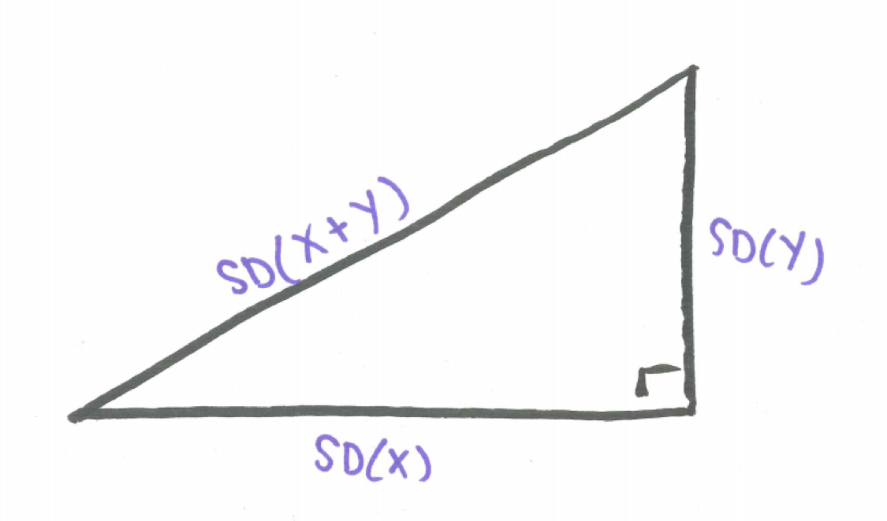

# Sums of Random Variables {#sums_of_random_variables}

```{r, message=FALSE, warning=FALSE, echo=FALSE}
library(mosaic)
set.seed(2018)
```


## Introduction {#introduction}

Our lives are made up of a combination of factors. Often we are add quantities from different buckets. We receive income from different sources. We add time spent in different pursuits. How tall we are is a sum of the length of each body part. These quantities vary. How do their sums vary. In this chapter, we examine what happens when two independent random variables are added. How does their shape change? How does the center change? How does their spread change? And then, we will see, how our minds can change.

## Chapter Scenario - Comparing Heights {#chapter_scenario_comparing_heights}

Adult males have an average height of 70 inches with a standard deviation of 4 inches. Adult females have a short average height of 65 inches and a slightly smaller standard deviation of 3.5 inches. It is known that the heights of males and females are both normally distributed. 

Source: http://www.usablestats.com/lessons/normal 

If a male and a female were chosen at random, what is the probability that the female would be taller than the male? 

## Example - Wheels of Fortune

Consider the two games described below.

**Game One**: A wheel has slots numbered 0 to 200 all of them equally likely and an individual spins the wheel one time and wins the dollar amount shown.

**Game Two**: A wheel has slots numbered 0 to 100 all of them equally likely and an individual gets to spin the wheel twice and win the combined dollar amount for his/her two spins.

How are these two games similar and how are they different?

### Practice - Preconceptions 
Suppose each of these games was played a number of times and the results tabulated. How do you think the two data sets for the two different games would compare in terms of shape, center, and spread?


### Simulating the Games 

We can run a simulation of each of these two games and compare results. To simulate Game One, generate 1000 random integers ranging from 0 to 200 in one vector and name this variable `game_one`. 

```{r}
game_one <- sample(x=0:200, size=1000, replace=TRUE)
```

To simulate Game Two, generate two vectors of 1000 random integers each ranging from 0 to 100 and add them naming this sum `game_two`. 

```{r}
spin_one <- sample(x=0:100, size=1000, replace=TRUE)
spin_two <- sample(x=0:100, size=1000, replace=TRUE)
game_two <- spin_one + spin_two
```

We can put these variables in a data frame.

```{r}
wheels_of_fortune <- data.frame(game_one, game_two)
```

And run summary statistics for `game_one` and `game_two`. 

```{r}
favstats(wheels_of_fortune$game_one)
```

```{r}
favstats(wheels_of_fortune$game_two)
```

Are the centers of `game_one` and `game_two` similar or different? Are the spreads of `game_one` and `game_two` similar or different? 

While both are centered around 100 as seen by the means and medians, we see that the spreads as measured by the standard deviations are not the same. Game Two is less variable than Game One. Visualizing the data with histograms might help explain this.

How do the two histograms compare in terms of shape?

```{r}
stacked_wheels <- stack(wheels_of_fortune)
ggplot(data=stacked_wheels, aes(x=values)) + 
  geom_histogram(binwidth=10) + 
  facet_grid(ind ~ .) 
```

Game One has what looks like a flat, uniform disribution while Game Two appears mound-shaped. Can we provide a reasonable explanation for WHY the two distributions have the different shapes that they do? Consider the grid below showing one dot for each combination of a result from the first spin from 0 to 100 and a result from the second spin from 0 to 100.

```{r nice-fig-1601, fig.cap='Sample Space for Game Two', out.width='80%', fig.asp=.75, fig.align='center', echo=FALSE}
knitr::include_graphics("01-basics-figures/wheels_of_fortune_grid.png")
```

An intuitive explanation might note that when playing Game One we are just as likely to get a small value from 0 to 10 as to get a middle value from 95 to 105 as to get a large value from 190 to 200. But when playing Game Two, there are many more ways to get a middle value than there is to get a small value and than there is to get a large value. For example, to get a small total in Game Two both spins must be small and, similarly, to get a large total in Game Two both spins must be large. But to get a middle value can happen many ways - by adding a small and a large or two medium-size values. There are many more combinations of numbers summing to a middle number than there are summing to either a small or a large number. 

Examine the sample space of equally likely outcomes for the two wheels in the 101 x 101 grid below where the rows represent the represent the result on the wheel one and the columns the result on wheel two. Shaded in green are the results with the sum from 0 to 10. Shaded in red are the results with the sum from 95 to 105. Shaded in blue are the results with the sum from 190 to 200. Which is more likely?

```{r nice-fig-1602, fig.cap='Small, Medium, and Large Game Two Results', out.width='80%', fig.asp=.75, fig.align='center', echo=FALSE}
#
```

We see here the beginnings of important ideas about sampling distributions and how the shape, center, and spread change when summing independent random variables and the first hints of the Central Limit Theorem which reveals why the normal, bell-shaped distribution occurs when we gather sample data and examine sums or means. There is so much more to learn. Let's capture some theory.

## Expectation for the Sum of Two Random Variables

If the results of two random variables, X and Y, are added, the resulting expectation is the sum of the individual expectations.  

For example, in Wheels of Fortune Game Two, each wheel has equally likely outcomes from 0 to 100 so the expectation on each wheel is 50. When summing the results from these wheels, as expected, we see the distribution is centered around $50 + 50 = 100$. 

In general, for any two random variables X and Y with expectations E(X) and E(Y), respectively, the expectation of X + Y is their sum. 

$$\text{For any two random variables X and Y}, \ E(X+Y)=E(X)+E(Y).$$

## Variance and Standard Deviation for the Sum of Two Random Variables

While expectations add for the sum of two random variables, the story is more complicated for the variation of the sum of two random variables. First of all, if the two random variables are not independent, then we need to know the nature of their relationship to determine how the sum varies.

For two independent random variables, X and Y, with Var(X) and Var(Y), respectively, the variance of the sum, X + Y, is the sum of the variance.

$$\text{For any two independent random variables X and Y}, \ Var(X+Y)=Var(X)+Var(Y).$$
If we write this relationship in terms of standard deviation we see that the standard deviation for the sum of two independent random variables follows a Pythagorean relationship. 

$$\text{For any two independent random variables X and Y}, \ SD^{2}(X+Y)=SD^{2}(X)+SD^{2}(Y).$$

Solving for SD(X+Y),

$$\text{For any two independent random variables X and Y}, \ SD(X+Y)=\sqrt{SD^{2}(X)+SD^{2}(Y)}.$$

This result can be visualized as if SD(X) and SD(Y) were legs of a right triangle with hypotenuse SD(X+Y).

```{r nice-fig-1603, fig.cap='The Pythagorean Theorem of Standard Deviations', out.width='60%', fig.asp=.75, fig.align='center', echo=FALSE}

```

For example, we can use the Pythagorean Theorem of Standard Deviations and the fact that for one spin of the wheel with integers 0 to 100 the theoretical standard deviation is 29.15 to explain the standard deviation you received when you analyzed the data gathered in the simulation of Game Two. 

$$SD(\text{Game Two})=\sqrt{SD^2(\text{Wheel One}) + SD^2(\text{Wheel Two})}=\sqrt{29.15^{2}+29.15^{2}}=41.2243$$

This true value of 41.2243 closely matches our simulated standard deviation of `r sd(wheels_of_fortune$game_two)`.

It is also to be noted that the Pythagorean Theorem of Standard Deviations also holds for the difference of indpendent random variables leading to this generalization.

$$\text{For any two independent random variables X and Y}, \ SD(X \pm Y)=\sqrt{SD^{2}(X)+SD^{2}(Y)}.$$

## Summing Independent Identically Distributed Random Variables

Extending the above results to the case where we are summing n independent occurrences of identically distributed random variables yields the following theorems which are important for understanding random samples drawn from the same population:

$$\text{For any identically distributed random variables} X_{1}, X_{2}, ...,X_{n} \sim(\mu,\sigma) \\ E(X_{1} + X_{2} + ... + X_{n})=E(X_{1})+ E(X_{2})+ ...+E(X_{n})=\mu + \mu + ... + \mu=n\mu.$$
The above fact is true whether or not the random variables are independent while the fact below is only true when the random variables are independent.

$$\text{For independent, identically distributed random variables} \ X_{1}, X_{2}, ...,X_{n} \sim(\mu,\sigma), \\ SD(X_{1} + X_{2} + ... + X_{n})=\sqrt{SD^{2}(X_{1})+ SD^{2}(X_{2})+ ...+SD^{2}(X_{n})}= \\ \sqrt{\sigma^{2} + \sigma^{2} + ... + \sigma^{2}}=\sqrt{n} \cdot \sigma.$$
We will call this the $\sqrt{n}$ Rule.


## The Roots of the Normal {#the_roots_of_the_normal}

The normal bell-shaped curve is so ubiquitous it is almost taken for granted. It is helpful to see its origins by examining sums of independent random variables. We will use the experiment of tossing a die to illustrate how the normal distribution emerges. Consider the experiment of tossing one die and plotting the results in a histogram. What would you expect for the shape, center, and spread of this data?

Code below simulates the toss of one die and puts this data into an official R data frame to facilitate the analysis and visualizes the data in a histogram. The code the the histogram uses the `ggplot2` package, the standard for plotting data in R.

```{r nice-fig-1604, fig.cap='Histogram for Saturday Tips', out.width='80%', fig.asp=.75, fig.align='center'}
Die1 <- sample(c(1,2,3,4,5,6), 10000, replace = TRUE)
Dice_data <- data.frame(Die1)
ggplot(data=Dice_data, aes(x=Die1)) + geom_histogram()
```

The theoretical expectation for the toss of one die is $E(X)=3.5$ and the theoretical standard deviation is $SD(X)=1.708$. Note how similar these theoretical values are to the sample values in the simulation.

The casino game craps revolves around the sum of the toss of two dice. If the experiment of tossing two dice and computing the sum was done many times and the results plotted in a histogram what would you expect for the shape, center, and spread?

### Simulating the Toss of Two Dice

Code below simulates the sum of two dice. We visualize with a histogram.

```{r nice-fig-1605, fig.cap='Histogram for Saturday Tips', out.width='80%', fig.asp=.75, fig.align='center'}
Dice_data$Die2 <- sample(c(1,2,3,4,5,6), 10000, replace = TRUE)
Dice_data$Sum <- Dice_data$Die1 + Dice_data$Die2
ggplot(data=Dice_data, aes(x=Sum)) + geom_histogram()
```

Comparing with the results of the two simulations, while one die resulted in a flat, uniform distribution, we see that the distribution for the sum of two dice is a triangular distribution. Why is it that when summing two dice, we see a tendency towards a mound-shaped distribution?

The theoretical expectation for the sum of two dice is $3.5 + 3.5=7.0$. The theoretical standard deviation for the sum of two dice, according to the Pythagorean Theorem of Standard Deviations is $\sqrt{1.708^{2}+1.708^{2}}=2.4155$. Again, these values are very close to the sample values seen in the simulation.

Moving on, we adapt the code above to simulate the sum of three dice and visualize with a histogram.

```{r nice-fig-1606, fig.cap='Histogram for Saturday Tips', out.width='80%', fig.asp=.75, fig.align='center'}
Dice_data$Die3 <- sample(c(1,2,3,4,5,6), 10000, replace = TRUE)
Dice_data$Sum3 <- Dice_data$Die1 + Dice_data$Die2 + Dice_data$Die3
ggplot(data=Dice_data, aes(x=Sum)) + geom_histogram()
```

We observe that summing three dice, the distribution becomes increasingly mound-shaped.

Below is code crafted to illustrate the sum of 50 tosses of a die as well as the sample mean of these 50 tosses.

```{r nice-fig-1607, fig.cap='Histogram for Saturday Tips', out.width='80%', fig.asp=.75, fig.align='center'}
die_matrix <- data.frame(matrix(sample(1:6, 500000, replace=TRUE), ncol=50))
die_matrix$sum <- rowSums(die_matrix)
die_matrix$mean <- die_matrix$sum/50
head(die_matrix[,51:52])
```

Let's take a look at the histogram of the sum of 50 dice.

```{r nice-fig-1608, fig.cap='Histogram for Saturday Tips', out.width='80%', fig.asp=.75, fig.align='center'}
ggplot(data=die_matrix, aes(x=sum)) + geom_histogram()
```

The average is the sum divided by 50 and should be close to 3.5 but varies. Let's examine the histogram.

```{r nice-fig-1609, fig.cap='Histogram for Saturday Tips', out.width='80%', fig.asp=.75, fig.align='center'}
ggplot(data=die_matrix, aes(x=mean)) + geom_histogram()
```

The histograms of the sum of 50 dice and the mean of 50 dice have identical shapes, it is only the scale that changes.

## The Central Limit Theorem

The Central Limit Theorem indicates that the sum of independent random variables as well as the sample means converge to the normal distribution as the sample size increases. We present two versions here.

### The Central Limit for Sums

For any sample of size n gathered from a ditribution of random variable X with mean $\mu$ and standard deviation $\sigma$,  the distribution of the sum 
a) approaches the normal distribution as n approaches infinity
b) the theoretical expected value is $n \cdot \mu$
c) the theoretical standard deviation is $\sqrt{n} \cdot \sigma$.

### The Central Limit for Sample Means

For any sample of size n gathered from a ditribution of random variable X with mean $\mu$ and standard deviation $\sigma$,  the distribution of sample means 
a) approaches the normal distribution as n approaches infinity
b) the theoretical expected value is $\mu$
c) the theoretical standard deviation is $\frac{\sigma}{\sqrt{n}}$.


## Conclusion

Through simulating the toss of one die, the sum of two, three, and then more we see that sums of a random variable even if it is not originally from a mound-shaped distribution (note, the distribution for a single die is discrete uniform) we find the sums increasing become mound-shaped. And sample means are really sample sums just re-scaled by dividing by the sample size. This is the secret to why the normal distribution emerges when we examine sample means. 

## Adding Normals

What if we are adding or subtracting random variables that are normally distributed. Then we know the sum and difference are also normal. Here is the theory:

For independent $X \sim N(\mu_{X}, \sigma_{X})$ and $Y \sim N(\mu_{Y}, \sigma_{Y})$ then $X \pm Y \sim N(\mu_{X} + \mu_{Y}, \sqrt{\sigma_{X}^{2} +  \sigma_{X}^{2}})$.

## Example - Tips on the Weekend {#example_tips_on_the_weekend}

Suppose a friend of yours is working as a server. Suppose that on Fridays tips average $120 with a standard deviation of $30 and are normally distributed. With Friday tips, F, we denote this as $F \sim N(\mu = 120, \sigma = 30)$. The distribution would look like this:

```{r nice-fig-1610, fig.cap='Histogram for Friday Tips', out.width='80%', fig.asp=.75, fig.align='center'}
ggplot(data.frame(x = c(30, 210)), aes(x)) +
    stat_function(fun = dnorm, args = list(mean = 120, sd = 30)) +
    scale_x_continuous(breaks = c(30,60,90,120,150,180,210))
```

Suppose that Saturday tips, S, are a little different with tips normally distributed with a mean of $\$90$ and a standard deviation of $\$20$, so  $S \sim N(\mu = 90, \sigma = 20)$. Here we can visualize the distribution:

```{r nice-fig-1611, fig.cap='Histogram for Saturday Tips', out.width='80%', fig.asp=.75, fig.align='center'}
# Again, don't worry about the syntax here.
ggplot(data.frame(x = c(30, 150)), aes(x)) +
    stat_function(fun = dnorm, args = list(mean = 90, sd = 20)) +
    scale_x_continuous(breaks = c(30, 50, 70, 90, 110, 130, 150))
```

Suppose your friend really needs $\$200$ in tips this weekend. Rent is due. The broader question before us is what the distribution of total tips on the weekend, Friday plus Saturday (F + S), looks like. Is it normal? What is the mean? What is the standard deviation? As a simplifying assumption we will assume that based on past experience Friday tips and Saturday tips are independent.

Let's run a simulation to get an idea of what to expect.

The code below simulates 1000 Friday tips calling the variable `friday` rounded to the nearest dollar and, similarly, 1000 Saturday night tips, then their sum, `weekend`, and put them into a dataframe for ease of analysis.

```{r}
friday <- round(rnorm(1000, mean = 120, sd = 30), 0)
saturday <- round(rnorm(1000, mean=90, sd=20), 0)
weekend <- friday + saturday
tips_data <- data.frame(friday, saturday, weekend)
```

Let's visualize the `weekend` variable in a histogram.

```{r nice-fig-1612, fig.cap='Histogram for Saturday Tips', out.width='80%', fig.asp=.75, fig.align='center'}
ggplot(data=tips_data, aes(x=weekend)) + geom_histogram(binwidth=10)
```

It appears that adding these two independent normal random variables generated another normal. Let's examine summary statistics to see the mean and standard deviation.

```{r}
favstats(tips_data$weekend)
```

Note that the mean is around $\$210$ which we might expect since the mean of Friday tips was $\$120$ and the mean of Saturday night tips was $\$90$. The standard deviation of weekend tips is bigger than the individual standard deviations of $\$30$ and $\$20$ but smaller their sum. 

What really happens when adding independent normal random variables is that the shape is normal, the mean is the sum of the individual means but the standard deviation is the square root of the sum of the squares of the individual standard deviations, a result akin to our familiar Pythagorean Theorem of Standard Deviations. In summary, given independent normal distributions X and Y with $X \sim N(\mu_{X}, \sigma_{X})$ and $Y \sim N(\mu_{Y}, \sigma_{Y})$ we know $X+Y \sim N(\mu_{X}+\mu_{Y}, \sqrt{\sigma_{X}^{2}+\sigma_{Y}^{2}})$.

For our example where Friday tips are $N(\mu = 120, \sigma = 30)$ and Saturday tips are $N(\mu = 90, \sigma = 20)$ we know that the sum of these is normal with mean $120 + 90$ with a standard deviation of $\sqrt{30^2 + 20^2}$ which equals `r (30^2 + 20^2)^(.5)`. Observe how close the simulated mean and SD are to what the theory says.

Now, knowing tips on the weekend are normally distributed with a mean of $\$210$ and a standard deviation of $\$36.06$ we can find the probability of getting more than $\$200$.

```{r}
1-pdist("norm", q = 200, mean = 210, sd = 36.06)
```

## Chapter Scenario Revisited - Comparing Heights {#chapter_scenario_revisited_comparing_heights}

Recall, we know dult males have an average height of 70 inches with a standard deviation of 4 inches and adult females have an average height of 65 inches and a standard deviation of 3.5 inches, both normally distributed. Letting M represent male height and F represent female height, we have $M \sim N(70,4)$ and $F \sim N(65,3.5)$. We want to find the probability that if a male and a female were chosen at random the female would be taller than the male. Mathematically, we want to know when $F > M$ which is equivalent to finding when $M - F < 0$.

We know how $M - F$ is distributed. Because M and F are both normal we know $M - F$ is normal. The expectation is $E(M - F) = E(M) - E(F)=70 - 65 = 5$. Using the Pythagorean Theorem for Standard Deviations, $SD(M-F)=\sqrt{SD^{2}(M) + SD^{2}(F)}=\sqrt{4^2 + 3.5^2}=5.315$. Thus, $M-F \sim N(5, 5.315)$.

To find the probability $P(M-F<0)$ we can use `pdist`.

```{r}
pdist(dist="norm", q=0, mean=5, sd=5.315)
```

The chance that a female chosen at random is taller than a male chosen at random is `r pdist(dist="norm", q=0, mean=5, sd=5.315, plot=FALSE)`.

## Exercises {#exercises}

### Exercise (Group Project) - Zombie Apocalypse

It may not be the Zombie Apocalypse but we want to be ready just in case. There are Gender Alpha Zombies and Gender Beta Zombies. Different Zombies have different Power identified on a scale of 1 to 6 with 6 being the most powerful and 1 being not at all powerful, in fact, pathetic. When two Zombies meet they compare their Zombie Power Index (ZPI) to see who gets first dibs on that tender living human flesh. The highest ZPI wins.

If you are an Alpha Zombie your ZPI comes from a single chromosome so you roll one die. For example, if an Alpha rolls a 2 that is their power. If you are a Beta Zombie your ZPI comes from two chromosomes so you roll two dice and find the average. If a Beta rolled a 3 and a 6 their ZPI is 4.5, the average of 3 and 6.

```{r nice-fig-1613, fig.cap='Zombie Apocalypse Characters', out.width='60%', fig.asp=.75, fig.align='center', echo=FALSE}

```

(a) To get a feel for this game, play the game with friends or classmates at least 10 times recording results in the table provided on the hardcopy page distributed in class.

```{r nice-fig-1614, fig.cap='Zombie Apocalypse Data Table', out.width='80%', fig.asp=.75, fig.align='center', echo=FALSE}

```

(c) Class Data: In class, examine a small sample of Alpha ZPIs and a small sample of Beta ZPI’s and make comparisons of shape, center, and spread.

(d) Simulating ZPI: Get a clearer picture of Alpha and Beta ZPIs by constructing a simulation using the `sample()` command. Analyze the simulated Alpha ZPIs and Beta ZPIs by constructing histograms and running summary statistics. How are they similar and how are they different in terms of shape, center, and spread?

(e) Theory: Construct the theoretical probability distributions for Alpha ZPIs and Beta ZPIs and find the expectation and the standard deviation. 

(f) Conjecture: Assume you have a class of size 32 with equal numbers of Alphas and Betas. Consider a single-elimination tournament created with random seedings. Who is more likely to be eliminated in the first round - more Alphas eliminated or more Betas eliminated or no difference? Who is more likely to win, an Alpha or a Beta or equal chances? 

### Exercise - Dungeons and Dragons Dice
In Dungeons and Dragons there are a number of different types of die including a traditional six-sided die and a 12-sided die. 

```{r nice-fig-1615, fig.cap='Dungeons and Dragons Dice', out.width='50%', fig.asp=.75, fig.align='center', echo=FALSE}

```

Suppose the Dungeon Master says, “Ye are in a tavern to celebrate GrogFest, and it’s time to roll to see how many rounds of ale ye must buy. Thus, either roll the 12-sided die once or roll the six-sided die twice to find the total as these be equivalent in terms of shape, center, and spread.” 
Use knowledge gained from the chapter to critique the Dungeon Master’s reasoning for the results of tossing one 12-sided die compared with tossing a six-sided die twice. Regarding shape, center, and spread, how are they the same and how are they different? 


### Exercise - Difference of Wheels 
Suppose the wheel of fortune wheel with slots numbered 0 to 100 all equally likely is spun twice and rather than summing the two spins you win (or lose) the difference between the first spin and the second spin. Simulate this data, run summary statistics of the result, and create a histogram. How does theory help explain this result?

### Exercise - Comparing Blood Pressure

The chart below shows the mean and standard deviation for the blood pressure of individuals with normal blood pressure. If two individuals with normal blood pressure are chosen at random, what is the probability the male has the higher blood pressure?

```{r nice-fig-1616, fig.cap='Normal and Pre/Hypertensive Blood Pressure by Sex', out.width='80%', fig.asp=.75, fig.align='center', echo=FALSE}
knitr::include_graphics("01-basics-figures/normal_blood_pressure.png")
```

Source: https://www.researchgate.net/figure/The-mean-and-standard-deviation-values-for-systolic-and-diastolic-blood-pressure-among_tbl5_232742829


