# Case Studies {#case_studies}

This chapter will later be split into separate chapters and relocated.

```{r, message=FALSE, warning=FALSE, echo=FALSE}
library(mosaic)
set.seed(2018)
```

## Roulette {#roulette}

## Chapter Scenario - Conservative or Playa? {#chapter_scenario_conservative_or_playa}

Suppose that you have $100 to make one bet. Would you make an even money bet, like a bet on red that pays 1 to 1 or a single number bet, say on the lucky number 7, that pays off at 35 to 1 if a seven comes up? Discuss which bet appeals most to you and why.

## The Rules of Roulette {#the_rules_of_roulette}

To play roulette you place a bet and spin the wheel. If the wheel matches your bet you win; if not, you lose. Remember that a roulette wheel contains slots numbered 1 through 36, half of them red, half black and green 0 and 00 slots.  The table layout and payout schedule are below.

```{r nice-fig-171, fig.cap='American Roulette Wheel and Layout', out.width='30%', fig.asp=.75, fig.align='center', echo=FALSE}
knitr::include_graphics("01-basics-figures/roulette_american_layout.png")
```

For fun, view a simulation of roulette at 
http://www.flash-game.net/game/534/flash-roulette.html 

Note that European roulette as played in Monte Carlo only has the green zero and not the green double zero and thus the probabilities and expectations are different. There are also some minor differences in the rules. See the exercise at the end of the chapter. 

The payoff odds vary depending on your bet. The harder it is to win your bet, the greater the payoff odds. The payoff odds are shown in the table 

```{r nice-fig-172, fig.cap='Roulette Payoff Odds', out.width='30%', fig.asp=.75, fig.align='center', echo=FALSE}

```

Each player at the table will have different color chips and may make several bets at once by placing their chips in the right location as shown below.

```{r nice-fig-173, fig.cap='Roulette Bet Positions', out.width='30%', fig.asp=.75, fig.align='center', echo=FALSE}
knitr::include_graphics("01-basics-figures/roulette_bet_positions.png")
```

## Analyzing the Even-Money Bets {#analyzing_the_even_money_bets}

First, examine an even money bet, such as a $\$100$ bet on Red. The payout for Red bet is 1 to 1 meaning if you win you win $\$1$ for every $\$1$ bet. The probability distribution describing this bet is as follows. Since there are 18 red slots on the wheel the probability of winning a red bet is 18/38 while the probability of winning a single number bet is 1/38. If we let X represent the winnings the list of all the possible outcomes matched with their associated probabilities P(X) is called the probability distribution.

```{r nice-fig-174, fig.cap='Roulette Even Money Disribution', out.width='30%', fig.asp=.75, fig.align='center', echo=FALSE}
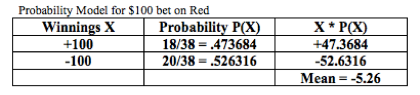
```

The sum of the X*P(X) is  - 5.26 thus the expected payoff for a $100 bet on Red is to lose about five dollars and a quarter.

## Roulette Simulation {#roulette_simulation}

Considering a $\$100$ even-money roulette bet, such as a red bet, we can simulate a large number of trials noting the two outcomes or $-\$100$ or $+\$100$ with probabilities $20/38$ and $18/38$, respectively.

```{r}
red_bet <- sample(x=c(-100,100), prob=c(20/38,18/38),size=10000, replace = TRUE)
red_bet_df <- data.frame(red_bet)
head(red_bet)
```

We can examine the histogram.

```{r nice-fig-175, fig.cap='Histogram for Tossing One Die', out.width='80%', fig.asp=.75, fig.align='center'}
ggplot(data=red_bet_df, aes(x=red_bet)) + geom_histogram(aes(y=..density..), binwidth = 10)
```

It is not very interesting but we can identify whether we won more often or lost more often. In this case, we lost more often than we won and summary statistics can tell us the average amount lost.

```{r}
favstats(red_bet, data=red_bet_df)
```

For our simulation of 10,000 trials of $\$100$ red bet, our mean was $-\$6.52$, a little worse than our theoretical expectation of $-\$5.26$. Note also the standard deviation is $99.79$ which makes sense given the typical deviation on either side of the mean is around $100$.

## Analyzing the Single Number Bet {#analyzing_the_single_number_bet}

Consider a long shot single number bet, such as a $\$100$ bet on the number 7. The single number bet (called a “straight”) has a payout of 35 to 1 meaning if you win you win $\$35$ for every $\$1$ bet. There is only one way to win so the probability of winning is 1/38. We complete the table below to find the probability distribution and expected value for $\$100$ bet on a single number.

```{r nice-fig-176, fig.cap='Roulette Single Number Disribution', out.width='30%', fig.asp=.75, fig.align='center', echo=FALSE}
knitr::include_graphics("01-basics-figures/roulette_single_number_distribution.png")
```

The expectation is $-\$5.26$. Let's see how a simulation compares modifying the distribution values and probabilities. 

```{r}
single_bet <- sample(x=c(-100,3500), prob=c(37/38,1/38),size=10000, replace = TRUE)
single_bet_df <- data.frame(single_bet)
head(single_bet)
```

Examining the histogram we see that wins are few and far between (but remember the payoff is awesome when it happens).

```{r nice-fig-177, fig.cap='Histogram for Tossing One Die', out.width='80%', fig.asp=.75, fig.align='center'}
ggplot(data=single_bet_df, aes(x=single_bet)) + geom_histogram(aes(y=..density..), binwidth = 50)
```

We really need to run summary statistics to find the mean amount won or lost in our simulation

```{r}
favstats(single_bet, data=single_bet_df)
```

For our simulation of 10,000 trials of $\$100$ bet on a single number, our mean was $+\$8.36$. Wow. We came out a winner and actually won $10000 \cdot 8.63=86,300$ dollars though may not be as lucky next time. Note, also the standard deviation is $615.14$ which is more than six times larger than the standard deviation for a $\$100$ even-money bet.


## Exercises {#exercises}

### Exercise - Four and Five Number Bets

(a) Determine the expectation for a $\$100$ bet on four numbers.
(b) Determine the expectation for a $\$100$ bet on five numbers.
(c) Which of these bets has the more favorable expectation?

### Exercise - Simulating a Roulette Bet
Select one of the roulette bets not yet analyzed and consider a $\$100$ bet. 
(a) Determine the expectation for this bet.
(b) Run a simulation of at least 1000 trials of this bet, visualize the results with a histogram, and find the mean amount won/lost.
(c) How similar or different was the theoretical expectation from the simulated mean?


### Exercise - The Rule of 36
One nice rule for determining the roulette payoffs is the following formula we’ll call the Rule of 36: **The payoff ratio plus one all multiplied by the number of ways you can win the bet always equals 36.**

(a) Write the Rule of 36 symbolically letting N be the number of ways to win your bet and X being the payoff ratio.
(b) Use the Rule of 36 to confirm the payoff odds for following bets - single number (straight up), two number (split), three number (street), four number (corner), five number (basket) NB: round down!, six number (line), and twelve number (column, dozen). 


### Exercise - European Roulette
European roulette as played in Monte Carlo, for example, is different than American roulette. In European roulette there is only a single zero…no double zero. In addition, in an even money bet such as a bet on red, if the ball lands on the green 0 on the first spin, then your bet is put “in prison” and gets to stay there one more round. In such a case, on the second round, if one of your spots comes up, instead of losing you get your bet back and on any other spot you lose. Here we examine the difference the single zero and the “in prison” rule has on the expectation.

```{r nice-fig-178, fig.cap='European Roulette Wheel and Layout', out.width='30%', fig.asp=.75, fig.align='center', echo=FALSE}

```

(a) Suppose that you have $\$100$ to make one bet. Calculate the expected value for a $\$100$ bet on Red on a single-zero wheel with the “in prison” rule. To do so, you need to find the probabilities associated with three possible outcomes - you lose $\$100$ if you get black, you break even if you get 0 and then a red, you win $\$100$ if you get red.
(b) Recall the expected payoff on an even-money bet American double-zero wheel is $-\$5.26$. Is the expectation on a European single-zero wheel the same, more negative, or less negative? 
(c) Determine the expectation for one of the other bets (there is no in prison rule for the non-even-money bets). Is it the same, more negative, or less negative than the corresponding bet in American roulette?

## Craps {#craps}

```{r, message=FALSE, warning=FALSE, echo=FALSE}
library(mosaic)
set.seed(2018)
```

## Chapter Scenario - Getting Six the Hard Way {#chapter_scenario_getting_six_the_hard_way}

In the game of craps, players can make a plethora of bets on the outcome of two dice. See the craps layout below.

```{r nice-fig-179, fig.cap='Craps Layout', out.width='30%', fig.asp=.75, fig.align='center', echo=FALSE}
knitr::include_graphics("01-basics-figures/craps_layout.png")
```

Some bets are single-roll bets, resolved with one toss of the dice, and others are multi-roll bets, where it may take many rolls before the bet is decided. One of the multi-roll bets is the Hardway 6. To win this bet you have to roll a sum of six the hard way, that is, with double-threes, before rolling a sum of six the easy way (1,5 or 2,4) or before rolling a sum of seven. This bet has a payoff of 9:1. What is the probability of winning this bet and what is the expectation?

## Single Roll Craps Bets {#single_roll_craps_bets}

Some craps bets are single roll bets, resolved in one toss of the dice. For example, one can make the Eleven or Five Six bet. If a sum of 11 comes up you win. Otherwise, you lose. The payoff is 15:1. Examining the sample space for dice there are 2 ways to win and 34 ways to lose, thus, $P(win \ eleven \ bet)=2/36$ and $P(lose \ eleven \ bet)=34/36$. We can calculate the expectation of winnings on the eleven bet, X, assuming a $\$1$ bet.

$$E(X)= 15 \cdot \frac{2}{36}+(-1) \cdot \frac{34}{36}=\frac{-4}{36}=-0.111$$

Thus, we expect to lose 11.1 cents on average for every 1 dollar bet on the eleven bet, an $11.1\%$ house advantage.

## The Craps Passline Bet Explained {#the_craps_passline_bet_explained}

The heart of craps is the passline bet. The player rolling the dice must make this bet and other players around the table may join her (or, to be contrary, may bet against her). The passline bet pays off at even money, 1:1, and is potentially a multi-roll bet. The first roll of the dice on the passline bet is called the come out roll and you win on this first roll if you roll a sum of 7 or 11 (this is called a natural) and you lose on the first roll if you roll a sum of 2, 3, or 12 (this is called craps). It helps to have an image of the sample space for rolling two dice handy. 

```{r nice-fig-1710, fig.cap='Sample Space for Two Dice', out.width='30%', fig.asp=.75, fig.align='center', echo=FALSE}
knitr::include_graphics("01-basics-figures/sample_space_two_dice.png")
```

$$P(natural)=P(7 \ or \ 11)=P(7)+P(11)=6/36+2/36=8/36$$
$$P(craps)=P(2 \ or \ 3 \ or \ 12)=P(2)+P(3)+P(12)=1/36+2/36+1/36=4/36$$
You are twice as likely to win on the come out roll as to lose but notice most of the time (1-8/36-4/36=24/36) you neither win nor lose. In these cases, the sum you roll on the come out roll is established as the "point", thus, the sum you roll (4, 5, 6, 8, 9, or 10) is the point and now to win you must roll this sum again before rolling a sum of seven. If you do, this is called passing. If you roll the sum of seven before you roll your first sum again, then you lose.

We need to determine the probability of winning (ie., passing) in all of these different cases. Let's start with the case you roll a sum of 4. In the original two dice sample space below we have circled the outcomes that resolve this bet. 

```{r nice-fig-1711, fig.cap='Sample Space for Two Dice for a Point of Four', out.width='30%', fig.asp=.75, fig.align='center', echo=FALSE}

```

Since these 9 outcomes are the only ones that resolve the bet, we will ignore all occurrences of other sums and use these 9 outcomes as our new sample space as shown below. 

```{r nice-fig-1712, fig.cap='Sample Space for a Point of Four', out.width='30%', fig.asp=.75, fig.align='center', echo=FALSE}
knitr::include_graphics("01-basics-figures/craps_sample_space_point_of_four.png")
```

Since there are three ways to win and six ways to lose, 

$$P(passing \mid point \ of \ four) = 3/9$$ 
and 
$$P(not \ passing \mid point \ of \ four) = 6/9$$

With a similar analysis, we can determine the probability of passing and of not passing for points of 5, 6, 8, 9, and 10. These values are shown in the table below.

```{r nice-fig-1713, fig.cap='Passing and Not Passing for Different Points', out.width='30%', fig.asp=.75, fig.align='center', echo=FALSE}

```

To find the probability of winning on a passline bet we need to examine all of these cases. Here is how we can partition winning on the passline bet.

$$P(win \ passline)=P(natural)+P(4 \ and \ pass) + P(5 \ and \ pass)+ \\ 
P(6 \ and \ pass)+P(8 \ and\ pass)+P(9 \ and \ pass)+p(10 \ and \ pass)= \\
P(natural)+P(4)P(pass \mid 4)+P(5)P(pass \mid 5)+P(6)P(pass \mid 6) \\ +P(8)P(pass \mid 8)+P(9)P(pass \mid 9)+P(10)P(pass \mid 10) = \\
4/36+(3/36)(3/36)+(4/36)(4/10)+(5/36)(5/11)+(5/36)(5/11)+(4/36)(4/10)+(3/36)(3/36)$$

It is now easy to determine the probability of losing the passline bet.

$$P(losing \ passline) = 1 - P(winning \ passline) = 1 - 0.493=0.507$$

We are now in position to find the expectation of the winnings, X. Let's assume $\$1$ is bet on the passline. Note, there are no casinos allowing this small of a bet. Often the minimum is $\$5$.

$$E(X)= (+1) \cdot 0.493 + (-1) \cdot 0.507 = -0.0140$$
This means that we lose about 1.4 cents for each dollar bet on the passline. This is a $1.4\%$ house advantage.

## Chapter Scenario Revisited - Getting Six the Hard Way {#chapter_scenario_revisited_getting_six_the_hard_way}

Recall, we win a Hardway Six bet by rolling six the hard way with double threes before rolling a six any other way or rolling a seven. The payoff is 9:1. Out of the eleven different ways this bet is resolved as shown in the image below, there is only one way to win. 

```{r nice-fig-1714, fig.cap='The Hardway Six Sample Space', out.width='30%', fig.asp=.75, fig.align='center', echo=FALSE}
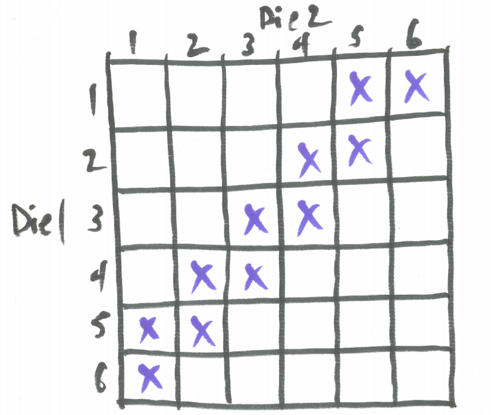
```

Thus, $P(win Hardway Six)=1/11$ and $P(lose Hardway Six)=10/11$. We find the expectation of the winnings below

$$E(X)= (+9) \cdot \frac{1}{11} + (-1) \cdot \frac{10}{11}= \frac{-1}{11}=-0.0909$$

On average, on the Hardway Six we lose about 9 cents per dollar bet for a house advantage of $9.09\%$.

## Exercises {#exercises}

### Exercise - Single Roll Bet
Find the expected value on the Aces bet, a single roll bet where double ones is a winner and everything else is a loser. This bet pays off at 30:1.

### Exercise - Multi-roll Bet
The Hardway Four bet pays off at 7:1. You win if you roll a sum of four the hardway (double two's) and you lose if you roll a sum of four any other way or roll a sum of seven. Find the expected value.

### Exercise - The Don't Pass Bet
The Don't Pass Bet has payoff odds of 1:1 is almost the opposite of the Passline Bet as described below.

* Roll a 2 or 3 on first roll and win.
* Roll a 12 on first roll and get your money back (this is called BAR 12).
*	Roll a 7 or 11 on first roll and lose.
* Roll anything else and this becomes the point.
* Roll a 7 before the point and win.
* Roll the point before 7 and lose.

Find the expected value of a $\$1$ bet on Don't Pass. Be sure to factor in that when 12 is rolled on the come out roll you get your money back and break even.

### Exercise - Free Odds
When a point is established a pass line player may place a bet equal to the original bet on the point paying off at the true odds of that point passing.  
(a) Determine true odds for each possible point - 4, 5, 6, 8, 9, 10. That is, determine the payoff odds that would result in a fair bet with expected value of 0. 
(b) Consider a $\$10$ passline bet with a $\$10$ free odds bet taken whenever possible. The expected value for a $\$10$ passline bet is -0.140. Given that the additional odds bet is a fair bet, what would the expectation be on the $\$10$ passline bet with $\$10$ free odds taken whenever possible? Explain.


## Keno {#keno}

In Keno, a player pays $1 and chooses some numbers between 1 and 80 by marking them on a Keno card.

```{r nice-fig-1715, fig.cap='Keno Card', out.width='30%', fig.asp=.75, fig.align='center', echo=FALSE}
knitr::include_graphics("01-basics-figures/keno_card.png")
```

Then the computer randomly selects 20 numbers.  Depending on how many of the player’s numbers match (“catch”) the chosen numbers, they win different amounts of money as shown in the payoff table below. 

```{r nice-fig-1716, fig.cap='Keno Payouts', out.width='30%', fig.asp=.75, fig.align='center', echo=FALSE}
knitr::include_graphics("01-basics-figures/keno_payouts.png")
```

## Analyzing a One-spot Keno Ticket

For example, on a one-spot ticket, the player pays $\$1$ and marks one number and if it is among the 20 selected by the computer, the player wins $\$3$ for a net win of $+\$2$. Keno probabilities can be found using the hypergeometric model with m=20 good numbers, n=60 bad numbers, with k=1 selected and x is the number of good ones selected.  The expected value of the winnings, X, is the sum of the payoffs times the probabilities. 

$$E(X) = -1 \cdot P(catch \ 0) + 2 \cdot P(catch \ 1)=-1 \cdot \frac{60}{80} + 2 \cdot \frac{20}{80}=-\frac{20}{80}=-0.25$$

Not such a great game from the player's vantage point as they lose on average a quarter per dollar bet for a $25\%$ house advantage.

We can use the R code below to find the expected value for a $\$1$ one-spot ticket by first creating a vector of the hypergeometric probabilities and a vector of the amounts won/lost. 

```{r}
probs_one_spot <- dhyper(x=0:1, m=20, n=60, k=1)
amounts_one_spot <- c(-1,2)
distribution_one_spot <- data.frame(probs_one_spot, amounts_one_spot)
distribution_one_spot
```

We can calculate the mean expected value by deterimining the sum of the amounts multiplied by the probs.

```{r}
expectation_one_spot <- sum(amounts_one_spot*probs_one_spot)
expectation_one_spot
```

## Analyzing a Two-spot Keno Ticket

Suppose a player buys a $\$1$ ticket marking two spots. If they catch 0 spots they lose $\$1$, if they catch one spot the get their dollar back and break even, and if they catch two spots they get $\$9$ back for a net profit of $\$8$. Determining the expected value of the winnings, X, by hand using the hypergeometric probability distribution we see

$$E(X) = -1 \cdot \frac{\dbinom{20}{0}\dbinom{60}{2}}{\dbinom{80}{2}} + 0 \cdot \frac{\dbinom{20}{1}\dbinom{60}{1}}{\dbinom{80}{2}} + 8 \cdot \frac{\dbinom{20}{2}\dbinom{60}{0}}{\dbinom{80}{2}}= \\ 
-1 \cdot 0.560 + 0 \cdot 0.380 + 8 \cdot 0.060 = -0.079 $$

With R code:

```{r}
probs_two_spot <- dhyper(x=0:2, m=20, n=60, k=2)
amounts_two_spot <- c(-1,0,8)
distribution_two_spot <- data.frame(probs_two_spot, amounts_two_spot)
distribution_two_spot
```

We calculate the mean expected value.

```{r}
expectation_two_spot <- sum(amounts_two_spot*probs_two_spot)
expectation_two_spot
```

The two-spot ticket has a much better expected value than a one-spot ticket.


## Exercises {#exercises}

### Exercise - Analyzing a Three-spot and Four-spot Keno Tickets

Find the expected value for a three-spot Keno ticket and a four-spot Keno ticket and make comparisons about which is more advantageous (or, rather, less disadvantageous) for the player.

### Exercise - Changing Perspectives

Suppose a player has marked an 5-spot Keno ticket. In the analysis above, we consider the m=20 good numbers and n=60 bad numbers and k=5 numbers selected with x representing the numbers we catch and use this hypergeometric model. For example,

$$P(catch \ 3) = \frac{\dbinom{20}{3}\dbinom{60}{2}}{\dbinom{80}{8}}=0.084$$

An alternative approach is to consider that we have m=5 good ones that we've selected and n=75 bad ones we haven't selected and then the computer chooses k=20 with x representing the number of good ones selected. Thus,

$$P(catch \ 3) = \frac{\dbinom{5}{3}\dbinom{75}{17}}{\dbinom{80}{20}}=0.084$$

For a 5-spot ticket show the probabilities of catching 0, catching 1, and catching 2 using both techniques and confirm they yield the same answers.

### Exercise (Group Project) - Complete Analysis of Keno

As a group project, find the expected values for a one-spot ticket, a two-spot ticket, and so on all the way through a 15-spot ticket and identify which bet has the worst expected value or the player and which has the best expected value.


## Case Study - Poker

```{r, message=FALSE, warning=FALSE, echo=FALSE}
library(mosaic)
set.seed(2018)
```

Poker has hit the big time with millions of players worldwide and even a World Series of Poker with professional players. There are many variations of the game with Texas Hold'em currently being the most popular but virtually all of them are ultimately decided by whoever holds the strongest five card hand. Since you are playing against other players rather than the house an understanding of human behavior is as important as an understanding of probability. Two key elements of success in poker are money management - knowing when and how much to bet - and bluff - deceptively bet and pretend your hand is stronger than it really is. 

For starters we will use our probability skills to verify the ranking of hands as shown in the diagram below.

```{r nice-fig-1717, fig.cap='Poker Hands Ranked', out.width='30%', fig.asp=.75, fig.align='center', echo=FALSE}
knitr::include_graphics("01-basics-figures/poker_hands_ranked.png")
```

Some terminology. A flush is five cards all from the same suit. A straight is five cards in sequence. An ace can be considered as either low or high.

First of all, a standard deck consists of 52 cards with four suits (clubs, diamonds, hearts, and spades) with each suit containing 13 cards (A,2,3,4,5,6,7,8,9,10,J,Q,K). 

The strength of a poker hand does not depend on the order in which the cards were received so the total number of five card hands is $\dbinom{52}{5}=2598960$. We use the `choose(n,k)` command in R to compute $\dbinom{n}{k}$.

```{r}
total <- choose(52,5)
total
```

We can take the poker hands in order and determine how many of each different hand there are and calculate the probability of obtaining such a hand. A key problem-solving tool will be to construct a verbal model of a step-by-step process to obtain such a hand. 

### The Royal Flush

A royal flush is the highest hand possible. It is the 10, J, Q, K, and A all from the same suit. A flush is all the cards from the same suit and the jack, queen, and king are royalty, hence, the name royal flush.

The counting on this one is easy. There are only four such hands, one for clubs, one for diamonds, one for hearts, and one for spades. The probability is

```{r}
prob_royal <- 4/total
prob_royal
```

### Straight Flush

This is left as an exercise.

### Four of a Kind

This is left as an exercise.

### Full House

A full house is three of one kind and two of another. The step-by-step verbal model to construct a full house proceeds but first selecting a kind for the three of a kind and choosing three of that kind, then selecting a second kind and choosing two of that kind.

```{r nice-fig-1718, fig.cap='Full House Step-by-step Verbal Model', out.width='30%', fig.asp=.75, fig.align='center', echo=FALSE}
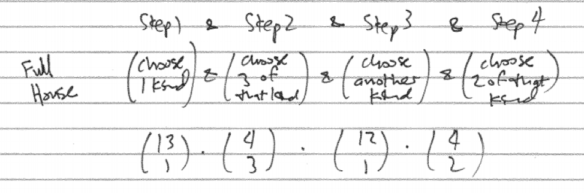
```

```{r}
count_full_house <- choose(13,1)*choose(4,2)*choose(12,1)*choose(4,2)
count_full_house
prob_full_house <- count_full_house/total
prob_full_house
```

### Flush

A flush is five cards all from the same suit. The step-by-step verbal model to construct a flush proceeds by first selecting a suit and then selecting five cards from that suit. We must then be careful to subtract off the straight flushes as they are actually a stronger hand.

```{r nice-fig-1719, fig.cap='Flush Step-by-step Verbal Model', out.width='30%', fig.asp=.75, fig.align='center', echo=FALSE}
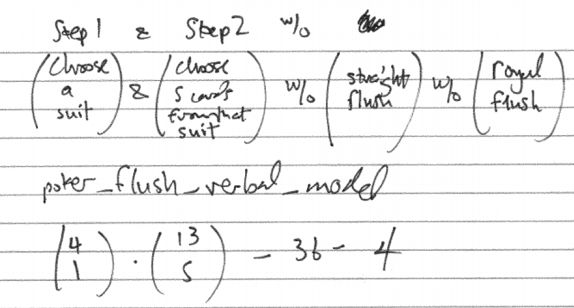
```

```{r}
count_flush <- choose(4,1)*choose(13,5) - 36 - 4
count_flush
prob_flush <- count_flush/total
prob_flush
```

### Straight

To count the number of straights we will count all straights and the subtract the straight  that are also flushes which are considered higher hands. To organize in a step-by-step verbal model, first choose a starting point for the straight. There are ten starting points for the smallest card - A,2,3,4,5,6,7,8,9, or 10. Then choose one of each of the five kinds in the straight. Lastly, we subtract off the straight flushes and royal flushes.

```{r nice-fig-1720, fig.cap='Straight Step-by-step Verbal Model', out.width='30%', fig.asp=.75, fig.align='center', echo=FALSE}
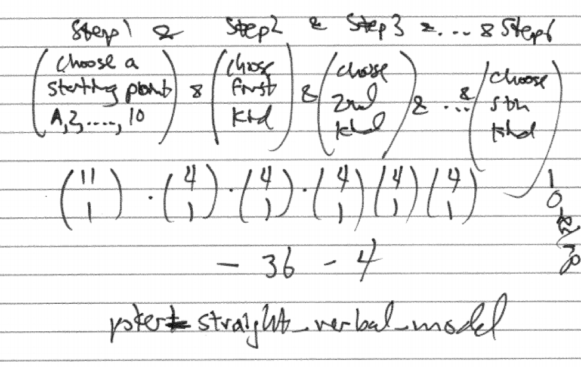
```

```{r}
count_straight <- choose(10,1)*choose(4,1)^5 - 36 - 4
count_straight
prob_straight <- count_straight/total
prob_straight
```


### Three of a Kind

One step-by-step verbal model for three of a kind is to first choose the kind, then choose three of that kind, then choose two other kinds and choose one each of those kinds.

```{r nice-fig-1721, fig.cap='Three of a Kind Verbal Model', out.width='30%', fig.asp=.75, fig.align='center', echo=FALSE}
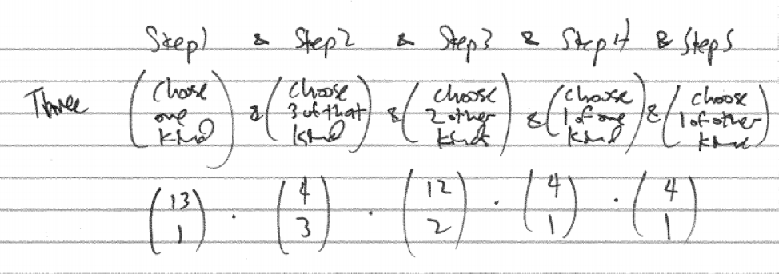
```

```{r}
count_three <- choose(13,1)*choose(4,3)*choose(12,2)*choose(4,2)*choose(4,2)
count_three
prob_three <- count_three/total
prob_three
```


### Two Pair

Correctly counting the number of two pair hands has a subtlety. It is important to select the two kinds for the two pairs rather than select them sequentially. A correct step-by-step verbal model starts with select two different kinds, then select two of each of these kinds, then select a third kind and select one of this kind.

```{r nice-fig-1722, fig.cap='Two Pair Verbal Model', out.width='30%', fig.asp=.75, fig.align='center', echo=FALSE}
knitr::include_graphics("01-basics-figures/poker_two_verbal_model.png")
```

```{r}
count_two_pair <- choose(13,2)*choose(4,2)*choose(4,2)*choose(11,1)*choose(4,1)
count_three
prob_two_pair <- count_two_pair/total
prob_two_pair
```

It is worth exploring a seemingly plausible but incorrect step-by-step verbal model. What if to create a two-pair hand we select one kind, then select two of that kind, then select a second kind, then select two of that kind, then select a third kind and select one of that kind.

```{r nice-fig-1723, fig.cap='Two Pair Competing Verbal Models', out.width='30%', fig.asp=.75, fig.align='center', echo=FALSE}
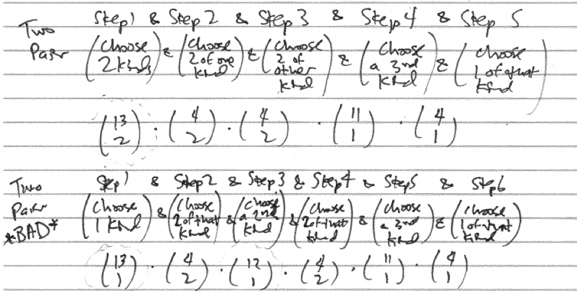
```

If we compare and contrast these two verbal models we see most pieces are the same but the correct model has `choose(13,2)` which equals $\frac{13*12}{2*1}$ while in its place the incorrect model has `choose(13,1)*choose(12,1)` which equals $13*12$. Numerically the second model is twice as big as or original model and so twice as wrong, so to speak. To see what is wrong with it, consider the following concrete examples visualized in the diagram below. They are counted as different hands in the verbal model but are really the same hand. The incorrect model imposes an inappropriate order on the two pairs. 

### One Pair

This is left as an exercise.

### High Card

This is left as an exercise.

### Summary Table

Compiling the results for all the different poker hand we have the following table:

* Hand, Number, Probability, Odds
* Royal Flush
* Straight Flush
* Four of a Kind
* Full House
* Flush
* Straight
* Three of a Kind
* Two Pair
* One Pair
* High Card

```{r nice-fig-1724, fig.cap='Poker Hands Table', out.width='30%', fig.asp=.75, fig.align='center', echo=FALSE}
knitr::include_graphics("01-basics-figures/poker_hands_table.png")
```


## Exercises {#exercises}

### Exercise - Straight Flush

How many different straight flush hands are there? If you are randomly dealt five cards, what is the probability of obtaining a straight flush? Note, make sure you are not including the royal flush hands in your count.

### Exercise - Four of a Kind

How many different four of a kind hands are there? If you are randomly dealt five cards, what is the probability of obtaining four of a kind?

### Exercise - One Pair

How many different one pair hands are there? If you are randomly dealt five cards, what is the probability of obtaining a one pair hand?

### Exercise - High Card

How many different high card hands are there? If you are randomly dealt five cards, what is the probability of obtaining nothing better than a high card hand? (Hint: Since all the other kinds of hands have been analyzed, the complement principle is one effective approach to counting this last hand type.)

### Exercise - Spot the Error

Consider this flawed step-by-step verbal model for a three of a kind hand. First choose one kind and then three of that kind, then choose a second kind and choose one of that kind, then choose a third kind and choose one of that kind. What is the subtle flaw in this step-by-step verbal model?

## Case Study - BINGO {#case_study_bingo}

```{r, message=FALSE, warning=FALSE, echo=FALSE}
library(mosaic)
set.seed(2018)
```

## Chapter Scenario - BINGO on the Fun Bus 

If the Fun Bus to Wendover is a double-decker and full there will be around 100 full seats. On the way over, to pass the time, the hostess calls a few Bingo games and the winner gets $\$1$ plus a candy bar. Of course, you have a $1/100$ chance of being a winner but how long is a Bingo game likely to go on before there is a winner. Specifically, if there are 100 players playing a regular Bingo game, how many numbers must be called for there to be a greater than $50\%$ chance of a winner? Think about it and make an estimate.

## Bingo Basics

You all know BINGO.  Get five in a row up, down, or diagonally and win. Variations of BINGO include Blackout (completely fill your card), wedding cake (completely fill top, middle, and bottom row) T (make a T shape), Z (you can figure this one out), and getting all four corners.  Bingo cards look like this:

```{r nice-fig-1725, fig.cap='BINGO Card', out.width='30%', fig.asp=.75, fig.align='center', echo=FALSE}
knitr::include_graphics("01-basics-figures/bingo_card.png")
```

BINGO is a social game and a good BINGO caller has a few choice bits to spice up calling the game. For example, "The tumor was B9." But enough of that; we are interested in the probabilities of winning.

First of all, how many cards are there? Cards consist of five columns each matching with either B, I, N, G, or O. Each column has five different numbers printed in order of size from top to bottom except the middle column which only has four numbers and a FREE spot in the middle. The B column contains five different numbers from 1 to 15, the I column five different numbers from 16  to 30, the N column a free spot and four different numbers from 31 to 45, the G column five different numbers from 46 to 60, and the O column five different numbers from 61 to 75.

```{r nice-fig-1726, fig.cap='BINGO Card Verbals Model', out.width='30%', fig.asp=.75, fig.align='center', echo=FALSE}
knitr::include_graphics("01-basics-figures/bingo_card_verbal_model.png")
```

This is a big number. We can use R to compute.

```{r}
bingo_total <- choose(15,5)^4*choose(15,4)
bingo_total
```

## Winning Bingo with m Numbers Called

Suppose you have nothing better to do and are playing BINGO. What is the probability you will win after just four numbers have been drawns. With 75 numbers there are a total of $\dbinom{74}{4}$ ways that four numbers could be drawn but only four sets of four numbers are winners for you as shown. 

```{r nice-fig-1727, fig.cap='BINGO Win with Four Numbers Drawn', out.width='30%', fig.asp=.75, fig.align='center', echo=FALSE}
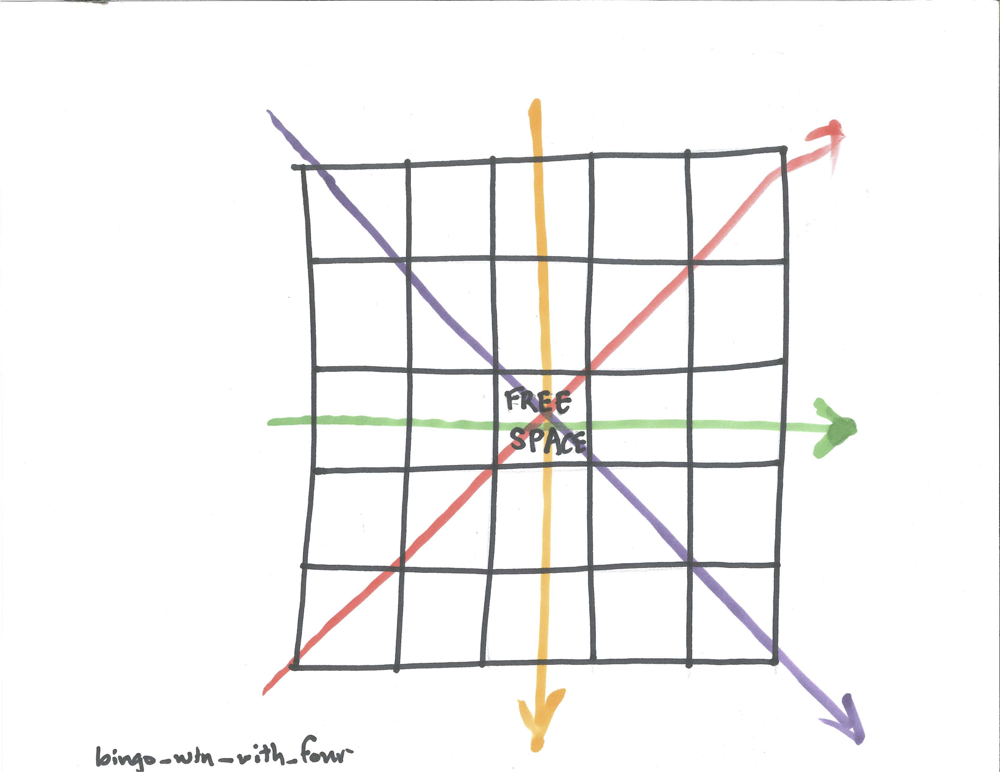
```

So not very likely.

```{r}
prob_win_4 <- 4/choose(75,4)
prob_win_4
```

What about the chance you will win after five numbers are called? There are a total of $\dbinom{75}{5}$ ways that five numbers can be drawn and there are now 12 ways to win as shown. 

```{r nice-fig-1728, fig.cap='BINGO Win with Five Numbers Drawn', out.width='30%', fig.asp=.75, fig.align='center', echo=FALSE}
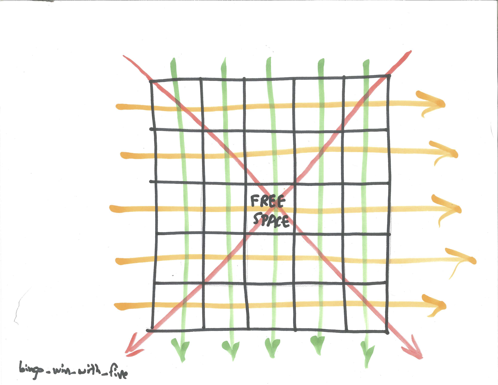
```

Winning is more complicated as shown in the verbal model. 

```{r nice-fig-1729, fig.cap='Verbal Model for BINGO Win with Five Numbers', out.width='30%', fig.asp=.75, fig.align='center', echo=FALSE}
knitr::include_graphics("01-basics-figures/bingo_win_with_five_verbal_model.png")
```

There are eight ways to win with all five numbers. There are four ways to win with four of these numbers with a fifth number that can be any of the other 71 possibilities. 

```{r}
prob_win_5 <- (8*1+4*1*71)/choose(75,5)
prob_win_5
```

Highly dubitable!

What is the probability of winning with six numbers? Six numbers can be selected a total of $\dbinom{75}{6}$. Again, there are eight ways to win with five numbers and the sixth number can be any of the other 70 possibilities. There are four ways to win with four numbers and the other two numbers can be any of the other 71 possibilities. See the verbal model below.

```{r nice-fig-1730, fig.cap='Verbal Model for BINGO Win with Six Numbers', out.width='30%', fig.asp=.75, fig.align='center', echo=FALSE}
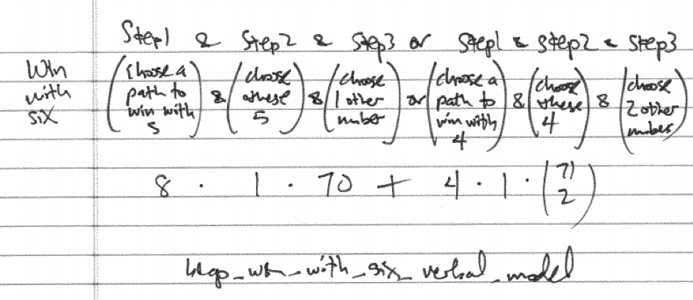
```

Computing this:

```{r}
prob_win_6 <- (8*1*70+4*1*choose(71,2))/choose(75,6)
prob_win_6
```

We can modify this approach to find the probability of winning after seven numbers are drawn and we leave this as an exercise. 

Then it gets trickier once we get above seven numbers as there is the possibility of winning in multiple ways at the same time so we need to be concerned about double-counting and subtract off any overlap. A verbal model that partially captures this idea is below though it is vague about the overlap. Suppose that $m$ numbers have been called and we want to find the probability of winning.

```{r nice-fig-1731, fig.cap='Verbal Model for BINGO Win with More than Seven Numbers', out.width='30%', fig.asp=.75, fig.align='center', echo=FALSE}
knitr::include_graphics("01-basics-figures/bingo_win_with_more_than_seven_verbal_model.png")
```

We can apply this verbal model in the case of eight numbers being called. With eight numbers called the only overlap is if two different four number Bingos are completed. Since there are four different four number Bingo paths, there are $\dbinom{4}{2}=6$ ways that two of them could be completed. 

```{r nice-fig-1732, fig.cap='Verbal Model for BINGO Win with Eight Numbers', out.width='30%', fig.asp=.75, fig.align='center', echo=FALSE}
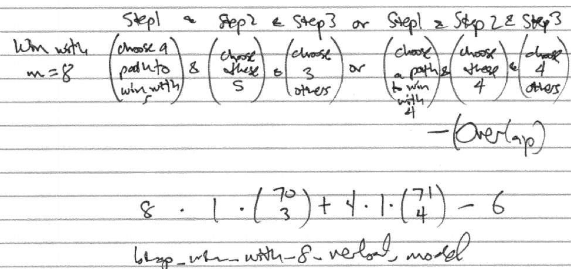
```

Computing the total minus the overlap

$$8 \cdot 1 \cdot \dbinom{70}{3}+4 \cdot 1 \cdot \dbinom{71}{4} - \dbinom{4}{2}$$

Computing this in R.

```{r}
prob_win_8 <- (8*1*choose(70,3)+4*1*choose(71,4)-choose(4,2))/choose(75,8)
prob_win_8
```

Dealing with the overlap gets trickier still as the numbers called increases. For example, with 9 numbers called there could be an overlap of two four number paths or a four number path and a five number path. Here is the verbal model for getting a BINGO with 9 numbers called. 

```{r nice-fig-1733, fig.cap='Verbal Model for BINGO Win with Nine Numbers', out.width='30%', fig.asp=.75, fig.align='center', echo=FALSE}
knitr::include_graphics("01-basics-figures/bingo_win_with_nine_verbal_model.png")
```

Computationally, 

```{r}
prob_win_9 <- (8*1*choose(70,4)+4*1*choose(71,5)-choose(4,2)*67-4*8)/choose(75,9)
prob_win_9
```

The overlap gets worse later on. With 12 numbers called there could be an overlap of two four number paths, two five number paths, a four number path and a five number path but we have overcounted because there is also the chance of three four number BINGO paths happening.

## Chapter Scenario Revisited - BINGO on the Fun Bus

Recall, we are on the Fun Bus to Wendover and 100 people are playing regular BINGO and we want to know how many numbers must be called for there to be a greater than $50\%$ chance of a winner.

The question we consider is the probability of there being a BINGO winner if m numbers have been called and we have 100 players. Let's deal with a specific case first fixing it at 8 called numbers.

As we determined above, the probability of a BINGO winner with 8 or 9 numbers is quite small. If we have 100 players, then the number of BINGO winners after m numbers are called is a binomial random variable with $n=100$ trials and probability of success we have computed. To find the probability of at least one BINGO winner we use the complement principle to find $P(\text{at least one winner})=1-P(\text{no winners})$. Letting X represent the number of winners we know $P(X \geq 1)=1-P(X=0)$. 

With $n=100$ people playing then the chance of a BINGO after 8 numbers are called can easily be computed.

```{r}
prob_win_8 <- 1 - dbinom(0, size=100, prob=prob_win_8) 
prob_win_8
```

A probability of a winner with 100 people playing and 8 numbers called is `r prob_win_8` and happens about 1 every 40 times.

We can compute the same values with 9 numbers called:

```{r}
prob_win_9 <- 1 - dbinom(0, size=100, prob=prob_win_9)
prob_win_9
```

The probability of a winner with $n=100$ people with $m=9$ numbers called jumps to `r prob_win_9` nearly doubling with this additional number.

We need to consider having a couple more numbers drawn and try it again. The cases are more involved but here are the probabilities of getting a BINGO after 10, 11, 12, and 13 numbers are called.

```{r}
prob_win_10 <- (8*1*choose(70,5)+4*1*choose(71,6)-choose(4,2)*choose(67,2)-choose(8,2)-4*8*66)/choose(75,10)
prob_win_11 <- (8*1*choose(70,6)+4*1*choose(71,7)-choose(4,2)*choose(67,3)-choose(8,2)*choose(65,1)-4*8*choose(66,2))/choose(75,11)
prob_win_12 <- (8*1*choose(70,7)+4*1*choose(71,8)-choose(4,2)*choose(67,4)-choose(8,2)*choose(65,2)-4*8*choose(66,3)+choose(4,3))/choose(75,12)
prob_win_13 <- (8*1*choose(70,8)+4*1*choose(71,9)-choose(4,2)*choose(67,5)-choose(8,2)*choose(65,3)-4*8*choose(66,4)+choose(4,3)*choose(63,1)+choose(4,2)*choose(8,1))/choose(75,13)
```

Determining the chance of a winner with 10, 11, 12. and 13 numbers called for 100 people playing:

```{r}
prob_win_10 <- 1 - dbinom(0, size=100, prob=prob_win_10)
prob_win_10
prob_win_11 <- 1 - dbinom(0, size=100, prob=prob_win_11)
prob_win_11
prob_win_12 <- 1 - dbinom(0, size=100, prob=prob_win_12)
prob_win_12
prob_win_13 <- 1 - dbinom(0, size=100, prob=prob_win_13)
prob_win_13
```

We are getting there. Slowly!

If we ignore the overlap, which is relatively small, we can facilitate the computation by creating a function to estimate the probability of a win with m numbers called.

```{r}
prob_win <- function(m) {
  (8*choose(70,m-5)+4*choose(71,m-4))/choose(75,m)
}
```

Test this out.

```{r}
prob_win(10)
prob_win(11)
prob_win(12)
prob_win(13)
```

These are very close to the true probabilities computed. In addition, we can compute a number of them at once:

```{r}
prob_win(10:13)
```

Let's solve this puppy. Dropping `prob_win(1:20)` into the binomial probability of a winner with 100 people playing we see if we hit the $50\%$ mark:

```{r}
prob_win_vector <- prob_win(1:20)
prob_win_100 <- 1 - dbinom(0, size=100, prob=prob_win_vector)
prob_win_100
```

That's cool. We see that the probability tips over the $50\%$ mark when 16 numbers are called and tips over the $90\%$ mark when 20 numbers are called. Can you just feel the tension in the room building.

## Exercises {#exercises}

### Exercise - Unique BINGO Cards

There are 7.6 billion people on earth and there are more BINGO cards than this so everyone could have their own unique card. In fact, how many unique cards could each person have?

### Exercise - Win with Seven

What is the probability of a BINGO card being a winner after exactly seven numbers are called?


## Case Study - The Powerball Lottery

```{r, message=FALSE, warning=FALSE, echo=FALSE}
library(mosaic)
set.seed(2018)
```

```{r nice-fig-1734, fig.cap='Powerball Logo', out.width='30%', fig.asp=.75, fig.align='center', echo=FALSE}
knitr::include_graphics("01-basics-figures/powerball_logo.png")
```

The Powerball Lottery is a multi-state lottery held twice a week. Most states participate (except Alabama, Alaska, Hawaii, Louisiana, Nevada, and Utah). A ticket costs two dollars. The player selects five different numbers from 1 to 69 for the white balls and one number from 1 to 26 for the red Powerball. If your five numbers match the five winning numbers and your Powerball matches the winning Powerball, then you can buy everything you want. The Powerball selected can be the same as one of the white balls selected. There are nine ways to win as shown in the graphic below.

```{r nice-fig-1735, fig.cap='Ways to Win Powerball', out.width='30%', fig.asp=.75, fig.align='center', echo=FALSE}
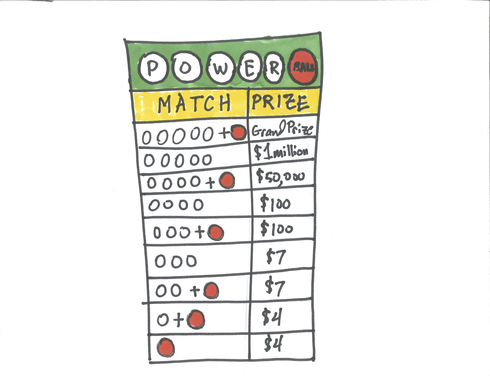
```

To determine the probability of being a winner we need to determine how many different Powerball combinations there are. We create a step-by-step verbal model by first choosing five numbers from 69 and then choosing one number from 26.

$$Total = \dbinom{69}{5} \cdot \dbinom{26}{1}=292201338$$

There is only one Grand Prize winning combination so the probability of winning is 

$$P(Grand Prize)=\frac{1}{\dbinom{69}{5} \cdot \dbinom{26}{1}}=\frac{1}{292201338}=0.000000003422298$$

There are other winning combinations.

### Winning Powerball with Five White

A step-by-step verbal model to win with five white balls is to first choose all five of the five winning white balls and then to choose one one the non-winning 25 Powerballs.

$$P(\text{Five White Balls})=\frac{\dbinom{5}{5} \cdot \dbinom{25}{1}}{292201338}=0.00000008555745$$

### Winning Powerball with Four White + Powerball

A step-by-step verbal model to win with four white balls plus the Powerball is to first choose four of the five winning white balls, then choose one of the 64 non-winning white balls and then to choose the one right Powerballs.

$$P(\text{Four White Balls + Powerball})=\frac{\dbinom{5}{4} \cdot \dbinom{64}{1} \cdot \dbinom{1}{1}}{292201338}=0.000001095135$$

### Winning Powerball with Four White

A step-by-step verbal model to win with four white balls is to first choose four of the five winning white balls, then choose one of the 64 non-winning white balls and then to choose one of the 25 non-winning Powerballs.

$$P(\text{Four White Balls})=\frac{\dbinom{5}{4} \cdot \dbinom{64}{1} \cdot \dbinom{25}{1}}{292201338}=0.00002737838$$

### Winning Powerball with Three White + Powerball

Left as an exercise.

### Winning Powerball with Three White

Left as an exercise.

### Winning Powerball with Two White + Powerball

Left as an exercise.

### Winning Powerball with One White + Powerball

Left as an exercise.

### Winning Powerball with Powerball Only

There is one winning Powerball number out of 26 total so your chance of getting the Powerball right is $1/26$ but to get the Powerball only you must have losers for all five white. The step-by-step verbal model is to first choose all five white numbers wrong and then choose the Powerball number right.

$$P(\text{Powerball Only})=\frac{\dbinom{64}{5} \cdot 1}{292201338}=0.02609335$$

## The Expected Value of Powerball

To find the expected value for the winnings, X, on a $\$2$ Powerball ticket we need to find the weighted average of the different payoffs weighted by their probabilities. We will assume the Grand Prize is $\$40$ million which is the minimum. We need a vector of the different winning amounts.

```{r}
winnings <- c(-2,2,2,5,5,98,98,49998, 999998, 39999998)
```

Although some of the above probabilities are left as exercises we include their answers in the function below to compute the probability of matching m=0,1,2,3,4,5 white balls and n=0,1 powerballs.

```{r}
powerball_prob <- function(m,n) {
  choose(5,m)*choose(64,5-m)*choose(25,1-n)/(choose(69,5)*26)
}
probs <- c(powerball_prob(0,0), powerball_prob(0,1), powerball_prob(1,1), powerball_prob(2,1), powerball_prob(3,0), powerball_prob(3,1), powerball_prob(4,0), powerball_prob(4,1), powerball_prob(5,0), powerball_prob(5,1))
```

The expectation is the sum of the winnings multiplied by the probabilities.

```{r}
expectation_powerball <- sum(winnings*probs)
expectation_powerball
```

How does this look? Good investment? Maybe the most likely payoff is a psychological one.

## Looking for a Winner

As we have seen, the probability that a Powerball ticket wins the Grand Prize is $\frac{1}{292201338}$ and the probability of not winning is $\frac{292201337}{292201338}$. Only 1 in almost 300 million tickets is the Grand Prize winner. How many tickets must be sold for there to be a good chance of there being a winner? This is like an urn model where there are almost 300 million balls and only one of them is the winner.

If each ticket was unique the situation would match drawing balls from the urn without replacement and the answer would be straight forward. After about 150 million balls are drawn, the probability the winning combination was drawn would be about 0.50.

But each individual independently chooses their own ticket so the situation matches more closely drawing from the urn with replacement. Because there could be multiple winners, to find the probability of at least one winner, the complement principle is needed.

$$P(\text{at least one winner})=1-P(\text{no winners})$$

What if 1 million people buy tickets?

$$P(\text{at least one winner})=1-P(\text{no winners})=1-(\frac{292201337}{292201338})^{1000000}=0.003416$$

What if 10 million people buy tickets?

$$P(\text{at least one winner})=1-P(\text{no winners})=1-(\frac{292201337}{292201338})^{10000000}=0.033644$$

What if 100 million people buy tickets?

$$P(\text{at least one winner})=1-P(\text{no winners})=1-(\frac{292201337}{292201338})^{100000000}=0.289815$$

Now, it's getting hot. There is a good chance someone might win.

We could turn this formula around using algebra. In general, the probability of a winner with n tickets sold is 

$$P(\text{at least one winner})=1-P(\text{no winners})=1-(\frac{292201337}{292201338})^{n}$$

Letting `p` represent the probability of at least one winner and solving for n, 

$$n=\frac{log(1-p)}{log(\frac{292201337}{292201338})}$$

We can create a function to find n for a desired value of p. The `ceiling` function rounds the decimal up to the next whole number.

```{r}
inverse_powerball <- function(p){
  if (p<0 | p>1) stop("p must be between 0 and 1")
  ceiling(log(1-p)/log(292201337/292201338))
}
```

How many tickets need to be sold for there to be a $10\%$ chance of a winner?

```{r}
inverse_powerball(0.1)
```

How many tickets need to be sold for there to be a $50\%$ chance of a winner?

```{r}
inverse_powerball(0.5)
```

Over 200 million tickets need to be sold for there to be a $50\%$ chance of someone winning the Grand Prize.

## Exercises

### Exercise - Ways to Win Powerball

Find the probability of winning Powerball in each of the following ways.
(a) Win with Three White Balls + Powerball
(b) Win with Three White Balls
(c) Win with Two White Balls + Powerball
(d) Win with Two White Balls

### Exercise - Can I Get a Winner?

How many people need to buy tickets for the probability of a winner to be at least 0.90?

### Exercise - Think Positive Expectation

How big would the Grand Prize need to be in order for the expected value to turn positive? (Ignore the possibility that there is more than one winner.)
