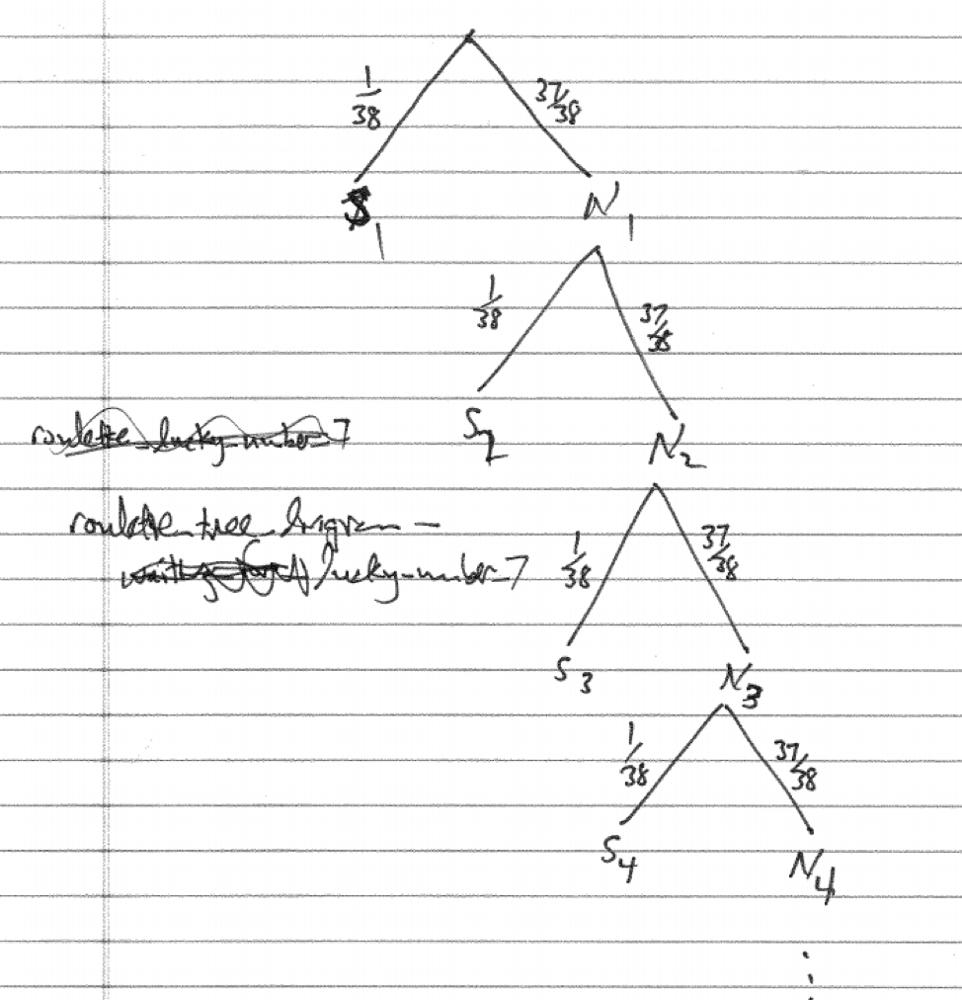
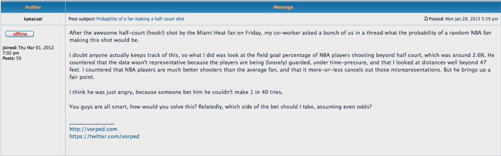

# The Geometric Distribution {#geometric_distribution}

```{r, message=FALSE, warning=FALSE, echo=FALSE}
library(mosaic)
set.seed(2018)
```

## Introduction {#introduction}

We have learned about important discrete random variables such as the binomial and about important continuous random variables such as the normal. In this chapter we add to our repertoire the geometric random variable. 

## Chapter Scenario - Lovin' the Airport {#chapter_scenario_lovin_the_airport}

Suppose a domestic flight leaves at 5:00pm and has 50 passengers who show up independently at the airport at uniformly random times between 3:15pm and 4:30pm. How many passengers can we expect to have arrived at the airport by 4:00pm, one hour before takeoff? How confident can we be in this answer?


## Example - Waiting for Lucky Number 7

Suppose you are playing roulette betting on the single number seven and you are going to stay at the table until a seven occurs. How long should you expect to wait? How variable is the waiting time? If you follow this strategy, what is the probability you will leave a winner? An understanding of what is called a geometric random variable is helpful to answer these questions. 

Since the roulette wheel has 38 slots we know the probability of getting a seven is $1/38$ and the probability of not getting a seven is $37/38$. Letting S represent the event of getting a seven and N represent the event of not getting a seven we have $P(S)=1/38$ and $P(N)=37/38. Using subscripts to keep track of the first, second, third spin and so on we can visualize the experiment of waiting for the first seven in a tree diagram. 

```{r nice-fig-1701, fig.cap='Tree Diagram - Waiting for Lucky Number 7', out.width='70%', fig.asp=.75, fig.align='center', echo=FALSE}

```

What we are really interested in is how long it takes to get our first number seven. To help us think about this distribution, let X count the number of rolls needed to get our first seven. Building up one step at a time we can find the probability X = 1, 2, 3, ... and find the general pattern. We can calculate a few probabilities to get a feel.

$$P(\text{get first 7 on first spin})=P(X=1)=\frac{1}{38}$$
$$P(\text{get first 7 on second spin})=P(X=2)=\frac{37}{38} \cdot \frac{1}{38}$$

$$P(\text{get first 7 on third spin})=P(X=3)=\frac{37}{38} \cdot \frac{37}{38} \cdot \frac{1}{38}$$

In general, for the first seven to occur on the $x^{th}$ spin, we need $x-1$ failures and then success. Finding an expression to represent the probability that $x$ spins are needed yields

$$P(X=x)=(\frac{37}{38})^{x-1} \cdot \frac{1}{38}$$ 

In this situation, we have independent trials and the same probability of success on each trial and we are interested in how long it takes to get our first success. We call this situation a geometric random variable.

### The Geometric Distribution

Given independent trials with a constant probability of success, p, on each trial the number failures before the first success, X, is a geometric random variable, $X \sim GEOM(p)$, with probability density function

$$\text{For all positive integers n}, P(X=x)=(1-p)^{x-1} \cdot p$$

To determine the expected value of the geometric random variable requires an infinite sum and some calculus but we will examine it intuitively. 

When spinning the roulette wheel and counting the number of trials until our first seven occurs, this is a geometric random variable with probability of success $p=1/38$, $X \sim GEOM(1/38)$. Getting the lucky number seven happens 1 out of every 38 spins on average so, intuitively, we anticpate the expected number of trials until our first success is 38. And we would be right. It turns out the expected number of trials for the first success is the reciprocal of the probability since $1/(1/38)=38$.

In general, for a geometric random variable X with probability of success p, the expectation, that is, the expected number of trials until the first success is $E(X)=1/p$. The variance is $Var(X)=\frac{1-p}{p^{2}}$ and standard deviation $SD(X)=\sqrt{\frac{1-p}{p^{2}}}$.

### The Geometric Random Variable in R

Assume we have a geometric random variable with probability of success parameter p. We can use R functions from the `mosaic` package but there is a wrinkle. These functions count the number of failures before the first success, not the total number of trials. Consequently, we need to adjust the input by adjusting by 1. It is a little tricky.

To find the individual probability of x trials needed to obtain the first success, $P(X=x)$, use `dgeom(x-1, prob)`.

To find the cumulative probability of less than or equal to x trials needed to obtain the first success, $P(X \leq x)$, use `pgeom(q=x-1, prob=p, lower.tail = TRUE)`.

To visualize the cumulative probability $P(X \leq x)$ use `pdist(dist="geom", prob=p, q=x-1)`.

To find the inverse probability, that is the value of x such that $P(X \leq x) = p$ use `qgeom(p, prob=p, lower.tail = TRUE)+1`.

To generate a random sample of size n from this geometric random variable use `rgeom(n, prob=p)+1`.

For example, in waiting in roulette for our lucky number seven, the probability of getting a seven on any spin is $p=1/38$ and, as we have seen, the number of rolls needed is a geometric random variable.

To find the probability exactly 20 spins are needed:

```{r}
dgeom(x=19, prob=1/38)
```

While the `dgeom()` command provides individual probabilities, one may input multiple values in a vector and see all of their individual probabilities. For example, the code below shows all the probabilities for X=1,2,3,...,20 by inputing the vector `0:19`:

```{r}
dgeom(x=0:19, prob=1/38)
```

Note the last value in the list, `r dgeom(x=19, prob=1/38)`, matches the probability that exactly 20 spins are needed.

To find the cumulative probability twenty or fewer rolls are needed:

```{r}
pgeom(q=19, prob=1/38, lower.tail = TRUE)
```

To visualize the cumulative probability twenty or fewer rolls are needed:

```{r}
pdist(dist="geom", prob=1/38, q=19)
```

To find the probability more than twenty rolls are needed we use the complement principle or change the lower.tail value:

```{r}
1 - pgeom(q=19, prob=1/38, lower.tail = TRUE)
pgeom(q=19, prob=1/38, lower.tail = FALSE)
```

To find the number of trials needed to insure a 90% chance of obtaining a seven:

```{r}
qgeom(p=0.90, prob=1/38, lower.tail = TRUE)+1
```

To generate a random sample of 100 such experiments waiting for the first seven:

```{r}
rgeom(n=20, prob=1/38)+1
```

The important thing to remember is that these R commands count the number of failures before the first success instead of the total number of trials including the first success. 


## Exercises {#exercises}

### Exercise - The Geometric Dice Game

Two players, called Alpha and Beta, play against each other in what we'll call the Geometric Dice Game. The players each choose a different number from 1 to 6. The die is then rolled until one of these two numbers comes up. The player whose number comes up first is the winner. Fun, huh! First, let's think about each player's chances. What is the probability Alpha will win? What is the probability Beta will win? Suppose we are interested in how long we would expect this game to go on. On average, how many rolls do you think are needed to resolve this game? What is the probability it will take five or more rolls to resolve this game?

### Exercise - NBA Halfcourt Shot

In the following web posting (http://apbr.org/metrics/viewtopic.php?f=2&t=8167) it is claimed NBA players make 2.6% of shots beyond half court. Assuming this claim is true, on average how many shots would it take from beyond half court to make one? If an NBA player was ready to take a shot from beyond half court and a buddy offers you 20 to 1 odds on the player making it would this be a better bet for your buddy or for you? Explain. (Note, if the shot is made you win $\$20$ and if the shot is not made you lose $\$1$.)

```{r nice-fig-1702, fig.cap='NBA Blog Posting', out.width='100%', fig.asp=.75, fig.align='center', echo=FALSE}

```

### Exercise - The Chevalier de Mere Revisited

In one of the games the Chevalier was interested, a die is tossed and the player has four chances to roll a six. If she does, she is a winner. If she doesn't, she is a loser. Let geometric random variable X represent the number of rolls needed to roll a six. 
(a) Use the probability we found earlier when solving this game with the complement principle?
(b) On average, how long does it take to roll a six?

