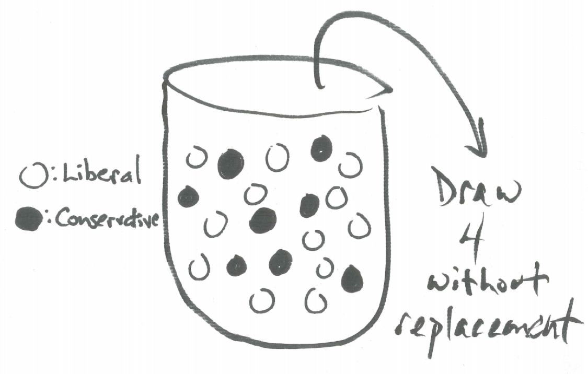

# The Hypergeometric Distribution {#hypergeometric_distribution}

```{r, message=FALSE, warning=FALSE, echo=FALSE}
library(mosaic)
set.seed(2018)
```

## Introduction {#introduction}

We have learned about important discrete random variables such as the binomial and about important continuous random variables such as the normal. In this chapter we add to our repertoire the hypergeometric discrete random variable. 

## The Hypergeometric Random Variable {#hypergeometric_random_variable}

### Example - A Class Controversy

A political science class has 12 liberal students and 8 conservative students. Four students are selected at random to organize a class debate on the presidential election. It so happens that three of the individuals are liberal and only one of the students is conservative. Some students cry foul. A relevant question is how likely is the committee to have such a composition. Which committee composition is more likely - a committee with two liberal and two conservative students or a committee with three liberal and one conservative?

We can envision a class with 12 liberal students and 8 conservative students in an urn model. Imagine 20 balls in an urn that are otherwise identical except that 12 balls are white representing liberal students and 8 balls are black representing conservative students. Concerning the political leanings of four students selected at random from the class, drawing four balls without replacement from this urn is equivalent. 

```{r nice-fig-1801, fig.cap='Urn Model for Class Composition', out.width='70%', fig.asp=.75, fig.align='center', echo=FALSE}

```

We can determine the probability of any particular committee composition. For example, to find the probability all four are liberal we note there are $\binom{12}{4}$ ways to select four liberals compared with $\dbinom{20}{4}$ ways total to select four committee members.

$$P(\text{4 are liberal and 0 are conservative})=\frac{\dbinom{12}{4} \cdot \dbinom{8}{0}}{\dbinom{20}{4}}=0.102$$ 

The number of ways to select three liberals and select one conservative is $\dbinom{12}{3} \cdot \dbinom{8}{1}$ yielding the following probability.

$$P(\text{3 are liberal and 1 is conservative})=\frac{\dbinom{12}{3} \cdot \dbinom{8}{1}}{\dbinom{20}{4}}=0.363$$ 

Following similar thinking, 

$$P(\text{2 are liberal and 2 are conservative})=\frac{\dbinom{12}{2} \cdot \dbinom{8}{2}}{\dbinom{20}{4}}=0.381$$ 

$$P(\text{1 is liberal and 3 are conservative})=\frac{\dbinom{12}{1} \cdot \dbinom{8}{3}}{\dbinom{20}{4}}=0.139$$ 

$$P(\text{0 are liberal and 4 are conservative})=\frac{\dbinom{12}{0} \cdot \dbinom{8}{4}}{\dbinom{20}{4}}=0.014$$ 

Comparing these probabilities we see the probability of randomly selecting three liberals and one conservative is 0.363 while the probability of selecting two liberals and two conservatives is 0.381. While the second possibility has a slightly higher probability, they occur at very close to the same rate and it is not at all unusual for the committee to be composed of three liberals and one conservative. In fact, $13.9\%$ of the time the committee would consist of only one liberal and three conservatives.

Situations similar to this which we can understand as equivalent to having an urn with two different color balls and selecting a random sample of them without replacement is called a hypergeometric distribution.

### The Hypergeometric Distribution

Drawing a sample without replacement from a population and counting the number of successes is modeled by the hypergeometric distribution. Such a situation can be conceived as drawing without replacement $k$ balls from an urn containing $m$ white balls and $n$ black balls where the hypergeometric random variable $X \sim HYP(m,n,k)$ counts the number of white balls selected. The total number of balls we call $N$ and $N=m+n$. If $k$ balls total are selected and $x$ of them are white then $k-x$ of them are black. $X$ can take on values from $0$ to the minimum of $k$ and $m$ and has the following probability distribution

$$P(X=x)=\frac{\dbinom{m}{x} \cdot \dbinom{n}{k-x}}{\dbinom{m+n}{k}}$$

For a hypergeometric random variable, since the proportion of white balls is $m/N$ and $k$ are selected, the expectation of the number of white balls selected is $E(X)=(m \cdot k)/N$. The variance is $Var(X)=\frac{N-k}{N-1} \cdot n \cdot p \cdot (1-p)$ and the standard deviation is the square root of the variance.

Note, that when the sample is large, the hypergeometric distribution is approximated by a binomial distribution.


### The Hypergeometric Random Variable in R

We can use R to calculate probabilities for the hypergeometric random variable $X \sim HYP(m,n,k)$ representing the number of white balls drawn given the following parameters:

* m: the number of white balls in the urn
* n: the number of black balls in the urn
* k: the number of balls drawn without replacement

To find the individual probability of x white balls, $P(X=x)$, use `dhyper(x, m, n, k)`.

To find the cumulative probability of less than or equal to x successes, $P(X \leq x)$, use `phyper(q=x, m, n, k, lower.tail = TRUE)`.

To find the inverse probability, that is the value of x such that $P(X \leq x) = p$ use `qhyper(p, m, n, k, lower.tail = TRUE)`.

To generate a random sample of size nn from a poisson random variable use `rhyper(nn, m, n, k)`.

Illustrating these commands with the situation above we note the following:

* X: the number of liberal students selected (or white balls selected)
* m=12: the number of liberals in class (or white balls in urn)
* n=8: the number of conservatives in class (or black balls in urn)
* k=4: the number of students selected (or balls drawn without replacement)

We describe the distribution of liberal students selected as $X \sim HYP(12,8,4)$. Here, we find the probability of three liberal students (and one conservative) being selected is `r dhyper(x=3, m=12, n=8, k=4)`:

```{r}
dhyper(x=3, m=12, n=8, k=4)
```

Now, the probability of two liberal (and two conservative) students being selected is `r dhyper(x=2, m=12, n=8, k=4)`:

```{r}
dhyper(x=2, m=12, n=8, k=4)
```

The probability of two or fewer liberal students being selected is `r phyper(q=2, m=12, n=8, k=4, lower.tail = TRUE)`:

```{r}
phyper(q=2, m=12, n=8, k=4, lower.tail = TRUE)
```

The probability of more than two liberal students being selected can be found in different ways.

First, using the complement principle:

```{r}
1 - phyper(q=2, m=12, n=8, k=4, lower.tail = TRUE)
```

Second, adding up separate individual probabilities:

```{r}
dhyper(x=3, m=12, n=8, k=4) + dhyper(x=4, m=12, n=8, k=4)
```

Third, changing the command to pick up the upper tail of the distribution:

```{r}
phyper(q=2, m=12, n=8, k=4, lower.tail = FALSE)
```

We see all three computations are equal showing that the probability of more than two liberal students being selected is `r 1-phyper(q=2, m=12, n=8, k=4, lower.tail = FALSE)`.

To find a particular quartile, such as the 50th percentile:

```{r}
qhyper(p=0.50, m=12, n=8, k=4, lower.tail = TRUE)
```

We can conclude that at least 50% of the time, two or fewer liberal students will be selected.

To generate a random sample of 10 such selections from this hypergeometric distribution:

```{r}
rhyper(nn=10, m=12, n=8, k=4)
```

Drawing from an urn without selection is a model that usefully describes many real-world situations and the hypergeometric random variable captures the key features of this situation.


## Exercises {#exercises}


