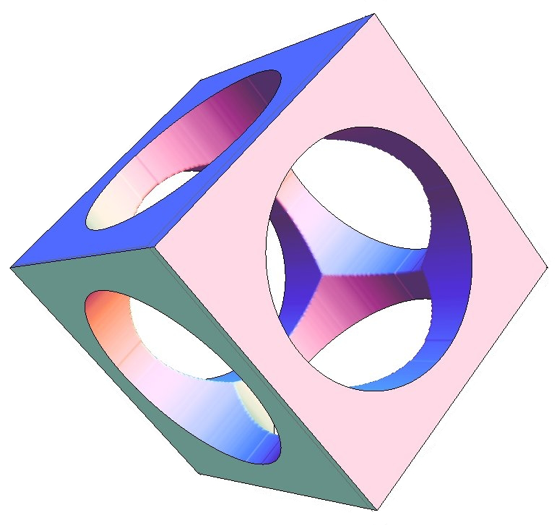
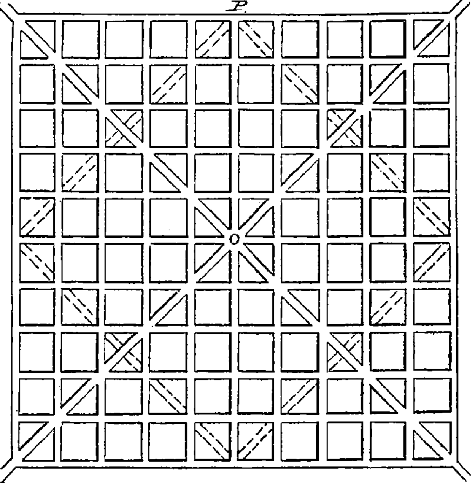

# Monte Carlo Simulation {#monte_carlo_simulation}

```{r, message=FALSE, warning=FALSE, echo=FALSE}
library(mosaic)
set.seed(2018)
```

## Introduction {#introduction}

Simulation can give you (apparent) superpowers! It does this by leveraging experience. Rather than spend all day flipping coins (and developing rare condition of flipper's thumbitis) we run a simulation. Financial analysts, meteorologists, astronauts, and geneticists also use simulation to test out their theories and models. In this chapter we look at random number generation in R and introduce the Monte Carlo simulation method.

## Chapter Scenario - Random Darts {#chapter_scenario_random_darts}

The standard dart board is known as the clock board and has an 18 inch diameter, that is, a 9 inch radius. Suppose that a bunch of darts are thrown and hit the board at random locations. What do you think the average distance from the center is? Would the average distance from the center be closest to 0, 1, 3, 4.5, 6, 8, or 9 inches?

## About Random Number Generators

The `runif(n,min=0,max=1)` command with default minimum of 0 and maximum of 1 generates n random numbers between 0 and 1 from a uniform or flat distribution where the number is as likely to be any one section as in any other equally sized section. If we take a look at 1000 of these numbers and plot in a histogram we can see their distribution which should be approximately uniform or flat.

```{r}
sim <- runif(n=1000)
sim_df <- data.frame(sim)
ggplot(data=sim_df, aes(x=sim))+geom_histogram()
```

It looks a little like the New York skyline at night and not perfectly uniform because random samples vary. 

The `min` and `max` parameters can be adjusted. For example, if at a particular intersection (choose your least favorite) the traffic light had a three minute long red light and we assume cars show up at the red light at random we could model the wait time of 1000 cars with `runif(n=1000, min=0, max=3)`. 

We can model random points in the plane by using `runif()` to select the x and y coordinates. For example, given the region in the xy-coordinate plane with x between -1 and 1 and y between -1 and 1, we can choose 1000 points at random in this region.

```{r}
x <- runif(n=1000, min=-1, max=1)
y <- runif(n=1000, min=-1, max=1)
plane <- data.frame(x,y)
ggplot(data=plane, aes(x=x, y=y)) + geom_point()
```

We might think we see patterns but this is what random points look like.

## Chapter Scenario Revisited - Random Darts {#chapter_scenario_revisited_random_darts}

Darts are thrown at random and hit a round 18 inch diameter dart board. To estimate the average distance from the center we can generate a number of random points in a region representing the dart board, determine each point's distance from the center, and find the average of these distances. 

Let's start by generating points in a square region of the plane with x and y both between -9 and 9.

```{r}
x <- runif(n=1000, min=-9, max=9)
y <- runif(n=1000, min=-9, max=9)
plane <- data.frame(x,y)
ggplot(data=plane, aes(x=x, y=y)) + geom_point() + 
  coord_fixed(ratio = 1)
```

We need to select only these points that would be on a circular dartboard of radius 9. The equation of a circle of radius 9 centered at the origin is $x^{2}+y^{2}=9^{2}$ and the interior of the circle is all points such that $x^{2}+y^{2} < 9^{2}$ and we can select all of these rows from the dataframe `plane` and call it `dartboard`. 

```{r}
dartboard <- plane[plane$x^2+plane$y^2 < 81,]
ggplot(data=dartboard, aes(x=x, y=y)) + geom_point() + coord_fixed(ratio = 1)
```

Nice, random darts! Now we can create a new variable `distance` using the Pythagorean Theorem distance formula.

```{r}
dartboard$distance <- sqrt(dartboard$x^2 + dartboard$y^2)
head(dartboard)
```

We can visualize these distances.

```{r}
ggplot(data=dartboard, aes(x=distance)) + geom_histogram()
```

Running summary statistics.

```{r}
favstats(dartboard$distance)
```

We see the mean distance is 5.90 inches, close to 6 inches, about 2/3 of the radius. The median is a little bigger at 6.23 inches, consistent with a negatively skewed distance data.


## Example - The Holey Cube

Monte Carlo Simulation is the data equivalent of throwing a large number of random darts towards a target to estimate to estimate a proportion of successes. 

Here is our challenge: Imagine a cube with sides all of length four centimeters which has cylindrical holes bored out from the center of each face clear through the cube where each cylinder has a diameter of three centimeters. Check out the picture below. Since the volume of the resulting solid cannot be determined using the analytical methods of calculus, we use the Monte Carlo method to estimate the volume of the resulting solid.

```{r nice-fig-1751, fig.cap='The Holey Cube', out.width='50%', fig.asp=.75, fig.align='center', echo=FALSE}

```

## Simulating The Cube
Assume the cube has its center of mass on the origin of a three dimensional coordinate system. We simulate 10000 (x,y,z) points in the cube using the `runif` and `matrix` commands.

```{r}
x <- runif(n=10000, min=-2, max=2)
y <- runif(n=10000, min=-2, max=2)
z <- runif(n=10000, min=-2, max=2)
points <- data.frame(x,y,z)
head(points)
```

Points not in the drilled out cylinders are now identified as ones not in either of the three circles. The circle in the xy-plane is $x^{2}+y^{2}=1$, the circle in the xz-plane is $x^{2}+z^{2}=1$ and the circle in the yz-plane is $y^{2}+z^{2}=1$. By replacing equality with > we identify points not in the removed circles with the *and* logical connective.

```{r}
points$holey_cube <- points$x^2+points$y^2>1 & 
                     points$x^2+points$z^2>1 &
                     points$y^2+points$z^2>1
head(points, n=10)
```

Since `points` is a logical variable with $1=TRUE$ we can sum the `points` variable to see how many and what proportion of the 10,000 points are left. 

```{r}
sum(points$holey_cube)
```

In our simulation, `r sum(points$holey_cube)` of the 10000 points still remain after the holes are drilled, or `r sum(points$holey_cube)/100` $\%$ of the points.

```{r}
prob_holey_cube <- sum(points$holey_cube)/10000
prob_holey_cube
```

Since the original cube was of volume $4^{3}=64$ cubic centimeters the remaining volume is `r 100*prob_holey_cube` percent of 64.

```{r}
volume <- prob_holey_cube * 64
volume
```

The holey cube has a volume of `r volume` cubic centimeters.

## Exercises {#exercises}

### Exercise - City Grid

In 1877, Lewis Haupt, Professor of Civic Engineering at the University of Pennsylvania, laid out his ideas for urban planning including the street design below.

```{r nice-fig-1752, fig.cap='Haupt Urban Planning Model', out.width='60%', fig.asp=.75, fig.align='center', echo=FALSE}

```

If the city grid was one mile square mile, use the Monte Carlo method to determine the average distance from the center.

Sources: http://urbanplanning.library.cornell.edu/DOCS/haupt_77.htm 
http://urbanplanning.library.cornell.edu/DOCS/haupt_95.htm#hauptbio

### Exercise - A Big Bead

Imagine a bead with a cylindrical hole drilled out of it. If the bead was a sphere of diameter 12 inches and the hole was a cylinder of diameter 3 inches, how much of the sphere was removed and how much was left?
