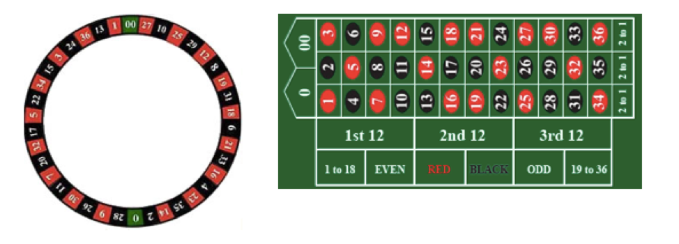
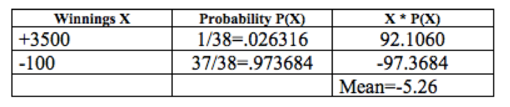

# Case Study - Roulette {#case_study_roulette}

```{r, message=FALSE, warning=FALSE, echo=FALSE}
library(mosaic)
set.seed(2018)
```


## Chapter Scenario - Conservative or Playa? {#chapter_scenario_conservative_or_playa}

Suppose that you have $100 to make one bet. Would you make an even money bet, like a bet on red that pays 1 to 1 or a single number bet, say on the lucky number 7, that pays off at 35 to 1 if a seven comes up? Discuss which bet appeals most to you and why.

## The Rules of Roulette {#the_rules_of_roulette}

To play roulette you place a bet and spin the wheel. If the wheel matches your bet you win; if not, you lose. Remember that a roulette wheel contains slots numbered 1 through 36, half of them red, half black and green 0 and 00 slots.  The table layout and payout schedule are below.

```{r nice-fig-171, fig.cap='American Roulette Wheel and Layout', out.width='70%', fig.asp=.75, fig.align='center', echo=FALSE}

```

For fun, view a simulation of roulette at 
http://www.flash-game.net/game/534/flash-roulette.html 

Note that European roulette as played in Monte Carlo only has the green zero and not the green double zero and thus the probabilities and expectations are different. There are also some minor differences in the rules. See the exercise at the end of the chapter. 

The payoff odds vary depending on your bet. The harder it is to win your bet, the greater the payoff odds. The payoff odds are shown in the table 

```{r nice-fig-172, fig.cap='Roulette Payoff Odds', out.width='80%', fig.asp=.75, fig.align='center', echo=FALSE}
knitr::include_graphics("01-basics-figures/roulette_payoff_odds.png")
```

Each player at the table will have different color chips and may make several bets at once by placing their chips in the right location as shown below.

```{r nice-fig-173, fig.cap='Roulette Bet Positions', out.width='30%', fig.asp=.75, fig.align='center', echo=FALSE}
knitr::include_graphics("01-basics-figures/roulette_bet_positions.png")
```

## Analyzing the Even-Money Bets {#analyzing_the_even_money_bets}

First, examine an even money bet, such as a $\$100$ bet on Red. The payout for Red bet is 1 to 1 meaning if you win you win $\$1$ for every $\$1$ bet. The probability distribution describing this bet is as follows. Since there are 18 red slots on the wheel the probability of winning a red bet is 18/38 while the probability of winning a single number bet is 1/38. If we let X represent the winnings the list of all the possible outcomes matched with their associated probabilities P(X) is called the probability distribution.

```{r nice-fig-174, fig.cap='Roulette Even Money Disribution', out.width='70%', fig.asp=.75, fig.align='center', echo=FALSE}
knitr::include_graphics("01-basics-figures/roulette_even_money_distribution.png")
```

The sum of the X*P(X) is  - 5.26 thus the expected payoff for a $100 bet on Red is to lose about five dollars and a quarter.

## Roulette Simulation {#roulette_simulation}

Considering a $\$100$ even-money roulette bet, such as a red bet, we can simulate a large number of trials noting the two outcomes or $-\$100$ or $+\$100$ with probabilities $20/38$ and $18/38$, respectively.

```{r}
red_bet <- sample(x=c(-100,100), prob=c(20/38,18/38),size=10000, replace = TRUE)
red_bet_df <- data.frame(red_bet)
head(red_bet)
```

We can examine the histogram.

```{r nice-fig-175, fig.cap='Histogram for Tossing One Die', out.width='80%', fig.asp=.75, fig.align='center'}
ggplot(data=red_bet_df, aes(x=red_bet)) + geom_histogram(aes(y=..density..), binwidth = 10)
```

It is not very interesting but we can identify whether we won more often or lost more often. In this case, we lost more often than we won and summary statistics can tell us the average amount lost.

```{r}
favstats(red_bet, data=red_bet_df)
```

For our simulation of 10,000 trials of $\$100$ red bet, our mean was $-\$6.52$, a little worse than our theoretical expectation of $-\$5.26$. Note also the standard deviation is $99.79$ which makes sense given the typical deviation on either side of the mean is around $100$.

## Analyzing the Single Number Bet {#analyzing_the_single_number_bet}

Consider a long shot single number bet, such as a $\$100$ bet on the number 7. The single number bet (called a “straight”) has a payout of 35 to 1 meaning if you win you win $\$35$ for every $\$1$ bet. There is only one way to win so the probability of winning is 1/38. We complete the table below to find the probability distribution and expected value for $\$100$ bet on a single number.

```{r nice-fig-176, fig.cap='Roulette Single Number Disribution', out.width='70%', fig.asp=.75, fig.align='center', echo=FALSE}

```

The expectation is $-\$5.26$. Let's see how a simulation compares modifying the distribution values and probabilities. 

```{r}
single_bet <- sample(x=c(-100,3500), prob=c(37/38,1/38),size=10000, replace = TRUE)
single_bet_df <- data.frame(single_bet)
head(single_bet)
```

Examining the histogram we see that wins are few and far between (but remember the payoff is awesome when it happens).

```{r nice-fig-177, fig.cap='Histogram for Tossing One Die', out.width='80%', fig.asp=.75, fig.align='center'}
ggplot(data=single_bet_df, aes(x=single_bet)) + geom_histogram(aes(y=..density..), binwidth = 50)
```

We really need to run summary statistics to find the mean amount won or lost in our simulation

```{r}
favstats(single_bet, data=single_bet_df)
```

For our simulation of 10,000 trials of $\$100$ bet on a single number, our mean was $+\$8.36$. Wow. We came out a winner and actually won $10000 \cdot 8.63=86,300$ dollars though may not be as lucky next time. Note, also the standard deviation is $615.14$ which is more than six times larger than the standard deviation for a $\$100$ even-money bet.


## Exercises {#exercises}

### Exercise - Four and Five Number Bets

(a) Determine the expectation for a $\$100$ bet on four numbers.
(b) Determine the expectation for a $\$100$ bet on five numbers.
(c) Which of these bets has the more favorable expectation?

### Exercise - Simulating a Roulette Bet
Select one of the roulette bets not yet analyzed and consider a $\$100$ bet. 
(a) Determine the expectation for this bet.
(b) Run a simulation of at least 1000 trials of this bet, visualize the results with a histogram, and find the mean amount won/lost.
(c) How similar or different was the theoretical expectation from the simulated mean?


### Exercise - The Rule of 36
One nice rule for determining the roulette payoffs is the following formula we’ll call the Rule of 36: **The payoff ratio plus one all multiplied by the number of ways you can win the bet always equals 36.**

(a) Write the Rule of 36 symbolically letting N be the number of ways to win your bet and X being the payoff ratio.
(b) Use the Rule of 36 to confirm the payoff odds for following bets - single number (straight up), two number (split), three number (street), four number (corner), five number (basket) NB: round down!, six number (line), and twelve number (column, dozen). 


### Exercise - European Roulette
European roulette as played in Monte Carlo, for example, is different than American roulette. In European roulette there is only a single zero…no double zero. In addition, in an even money bet such as a bet on red, if the ball lands on the green 0 on the first spin, then your bet is put “in prison” and gets to stay there one more round. In such a case, on the second round, if one of your spots comes up, instead of losing you get your bet back and on any other spot you lose. Here we examine the difference the single zero and the “in prison” rule has on the expectation.

```{r nice-fig-178, fig.cap='European Roulette Wheel and Layout', out.width='60%', fig.asp=.75, fig.align='center', echo=FALSE}
knitr::include_graphics("01-basics-figures/roulette_european_layout.png")
```

(a) Suppose that you have $\$100$ to make one bet. Calculate the expected value for a $\$100$ bet on Red on a single-zero wheel with the “in prison” rule. To do so, you need to find the probabilities associated with three possible outcomes - you lose $\$100$ if you get black, you break even if you get 0 and then a red, you win $\$100$ if you get red.
(b) Recall the expected payoff on an even-money bet American double-zero wheel is $-\$5.26$. Is the expectation on a European single-zero wheel the same, more negative, or less negative? 
(c) Determine the expectation for one of the other bets (there is no in prison rule for the non-even-money bets). Is it the same, more negative, or less negative than the corresponding bet in American roulette?
