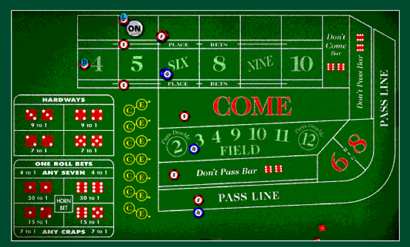
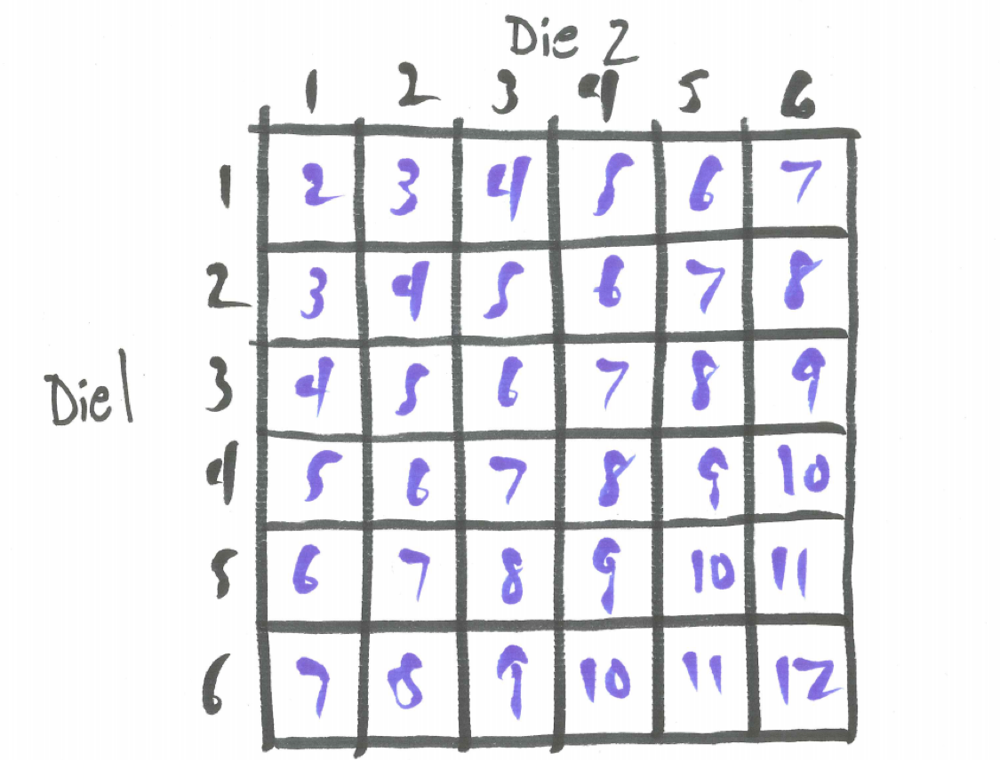

# Case Study - Craps {#case_study_craps}

```{r, message=FALSE, warning=FALSE, echo=FALSE}
library(mosaic)
set.seed(2018)
```

## Chapter Scenario - Getting Six the Hard Way {#chapter_scenario_getting_six_the_hard_way}

In the game of craps, players can make a plethora of bets on the outcome of two dice. See the craps layout below.

```{r nice-fig-179, fig.cap='Craps Layout', out.width='70%', fig.asp=.75, fig.align='center', echo=FALSE}

```

Some bets are single-roll bets, resolved with one toss of the dice, and others are multi-roll bets, where it may take many rolls before the bet is decided. One of the multi-roll bets is the Hardway 6. To win this bet you have to roll a sum of six the hard way, that is, with double-threes, before rolling a sum of six the easy way (1,5 or 2,4) or before rolling a sum of seven. This bet has a payoff of 9:1. What is the probability of winning this bet and what is the expectation?

## Single Roll Craps Bets {#single_roll_craps_bets}

Some craps bets are single roll bets, resolved in one toss of the dice. For example, one can make the Eleven or Five Six bet. If a sum of 11 comes up you win. Otherwise, you lose. The payoff is 15:1. Examining the sample space for dice there are 2 ways to win and 34 ways to lose, thus, $P(win \ eleven \ bet)=2/36$ and $P(lose \ eleven \ bet)=34/36$. We can calculate the expectation of winnings on the eleven bet, X, assuming a $\$1$ bet.

$$E(X)= 15 \cdot \frac{2}{36}+(-1) \cdot \frac{34}{36}=\frac{-4}{36}=-0.111$$

Thus, we expect to lose 11.1 cents on average for every 1 dollar bet on the eleven bet, an $11.1\%$ house advantage.

## The Craps Passline Bet Explained {#the_craps_passline_bet_explained}

The heart of craps is the passline bet. The player rolling the dice must make this bet and other players around the table may join her (or, to be contrary, may bet against her). The passline bet pays off at even money, 1:1, and is potentially a multi-roll bet. The first roll of the dice on the passline bet is called the come out roll and you win on this first roll if you roll a sum of 7 or 11 (this is called a natural) and you lose on the first roll if you roll a sum of 2, 3, or 12 (this is called craps). It helps to have an image of the sample space for rolling two dice handy. 

```{r nice-fig-1710, fig.cap='Sample Space for Two Dice', out.width='60%', fig.asp=.75, fig.align='center', echo=FALSE}

```

$$P(natural)=P(7 \ or \ 11)=P(7)+P(11)=6/36+2/36=8/36$$
$$P(craps)=P(2 \ or \ 3 \ or \ 12)=P(2)+P(3)+P(12)=1/36+2/36+1/36=4/36$$
You are twice as likely to win on the come out roll as to lose but notice most of the time (1-8/36-4/36=24/36) you neither win nor lose. In these cases, the sum you roll on the come out roll is established as the "point", thus, the sum you roll (4, 5, 6, 8, 9, or 10) is the point and now to win you must roll this sum again before rolling a sum of seven. If you do, this is called passing. If you roll the sum of seven before you roll your first sum again, then you lose.

We need to determine the probability of winning (ie., passing) in all of these different cases. Let's start with the case you roll a sum of 4. In the original two dice sample space below we have circled the outcomes that resolve this bet. 

```{r nice-fig-1711, fig.cap='Sample Space for Two Dice for a Point of Four', out.width='60%', fig.asp=.75, fig.align='center', echo=FALSE}

```

Since these 9 outcomes are the only ones that resolve the bet, we will ignore all occurrences of other sums and use these 9 outcomes as our new sample space as shown below. 

```{r nice-fig-1712, fig.cap='Sample Space for a Point of Four', out.width='60%', fig.asp=.75, fig.align='center', echo=FALSE}

```

Since there are three ways to win and six ways to lose, 

$$P(passing \mid point \ of \ four) = 3/9$$ 
and 
$$P(not \ passing \mid point \ of \ four) = 6/9$$

With a similar analysis, we can determine the probability of passing and of not passing for points of 5, 6, 8, 9, and 10. These values are shown in the table below.

```{r nice-fig-1713, fig.cap='Passing and Not Passing for Different Points', out.width='50%', fig.asp=.75, fig.align='center', echo=FALSE}

```

To find the probability of winning on a passline bet we need to examine all of these cases. Here is how we can partition winning on the passline bet.

$$P(win \ passline)=P(natural)+P(4 \ and \ pass) + P(5 \ and \ pass)+ \\ 
P(6 \ and \ pass)+P(8 \ and\ pass)+P(9 \ and \ pass)+p(10 \ and \ pass)= \\
P(natural)+P(4)P(pass \mid 4)+P(5)P(pass \mid 5)+P(6)P(pass \mid 6) \\ +P(8)P(pass \mid 8)+P(9)P(pass \mid 9)+P(10)P(pass \mid 10) = \\
4/36+(3/36)(3/36)+(4/36)(4/10)+(5/36)(5/11)+(5/36)(5/11)+(4/36)(4/10)+(3/36)(3/36)$$

It is now easy to determine the probability of losing the passline bet.

$$P(losing \ passline) = 1 - P(winning \ passline) = 1 - 0.493=0.507$$

We are now in position to find the expectation of the winnings, X. Let's assume $\$1$ is bet on the passline. Note, there are no casinos allowing this small of a bet. Often the minimum is $\$5$.

$$E(X)= (+1) \cdot 0.493 + (-1) \cdot 0.507 = -0.0140$$
This means that we lose about 1.4 cents for each dollar bet on the passline. This is a $1.4\%$ house advantage.

## Chapter Scenario Revisited - Getting Six the Hard Way {#chapter_scenario_revisited_getting_six_the_hard_way}

Recall, we win a Hardway Six bet by rolling six the hard way with double threes before rolling a six any other way or rolling a seven. The payoff is 9:1. Out of the eleven different ways this bet is resolved as shown in the image below, there is only one way to win. 

```{r nice-fig-1714, fig.cap='The Hardway Six Sample Space', out.width='60%', fig.asp=.75, fig.align='center', echo=FALSE}
knitr::include_graphics("01-basics-figures/craps_hardway_six_sample_space.png")
```

Thus, $P(win Hardway Six)=1/11$ and $P(lose Hardway Six)=10/11$. We find the expectation of the winnings below

$$E(X)= (+9) \cdot \frac{1}{11} + (-1) \cdot \frac{10}{11}= \frac{-1}{11}=-0.0909$$

On average, on the Hardway Six we lose about 9 cents per dollar bet for a house advantage of $9.09\%$.

## Exercises {#exercises}

### Exercise - Single Roll Bet
Find the expected value on the Aces bet, a single roll bet where double ones is a winner and everything else is a loser. This bet pays off at 30:1.

### Exercise - Multi-roll Bet
The Hardway Four bet pays off at 7:1. You win if you roll a sum of four the hardway (double two's) and you lose if you roll a sum of four any other way or roll a sum of seven. Find the expected value.

### Exercise - The Don't Pass Bet
The Don't Pass Bet has payoff odds of 1:1 is almost the opposite of the Passline Bet as described below.

* Roll a 2 or 3 on first roll and win.
* Roll a 12 on first roll and get your money back (this is called BAR 12).
*	Roll a 7 or 11 on first roll and lose.
* Roll anything else and this becomes the point.
* Roll a 7 before the point and win.
* Roll the point before 7 and lose.

Find the expected value of a $\$1$ bet on Don't Pass. Be sure to factor in that when 12 is rolled on the come out roll you get your money back and break even.

### Exercise - Free Odds
When a point is established a pass line player may place a bet equal to the original bet on the point paying off at the true odds of that point passing.  
(a) Determine true odds for each possible point - 4, 5, 6, 8, 9, 10. That is, determine the payoff odds that would result in a fair bet with expected value of 0. 
(b) Consider a $\$10$ passline bet with a $\$10$ free odds bet taken whenever possible. The expected value for a $\$10$ passline bet is -0.140. Given that the additional odds bet is a fair bet, what would the expectation be on the $\$10$ passline bet with $\$10$ free odds taken whenever possible? Explain.

