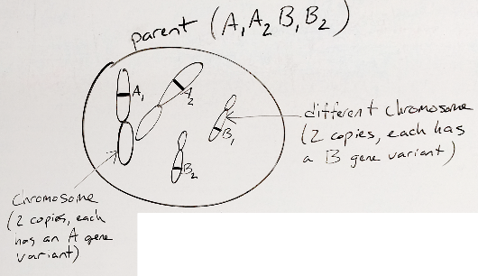
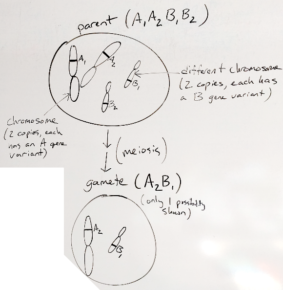
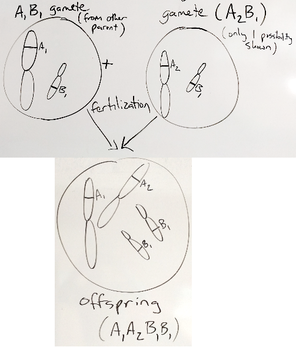
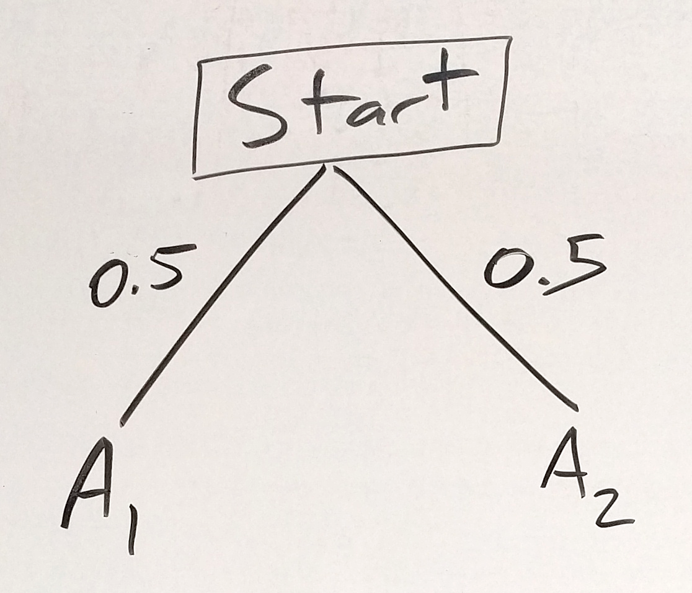

# Genetics {#genetics}

Placeholder chapter for draft genetics content

```{r, message=FALSE, warning=FALSE, echo=FALSE}
library(mosaic)
set.seed(2018)
```

## Appendix 1: Genetics Examples  

In this appendix, you are introduced to the absolute basic terminology of genetics and how the principles of probability that you learned in chapter 1 can be applied to genetics.  
We are going to adapt the examples from the main part of chapter 1 to genetics. We'll look at some of the same tree diagrams and simulations but within a simple genetics framework (rather than coin flips and urns).  

### Genetics Terminology  

For now, we are going to use the minimum of genetic lingo to get going:  

**trait**: a characteristic, something you can see or measure (e.g. height, Huntington's disease)  

**gene**: the DNA that controls a trait (e.g. hemoglobin beta gene) usually shown with a letter or letters (e.g. Hb)  

**variant**: one of several versions of a gene (e.g. HbS variant in hemoglobin beta that can cause Sickle Cell Anemia but there are other variants of the same gene (HbC, HbE, etc.), a.k.a. allele)  

**chromosome**: long, continuous stretch of DNA that contains many genes (humans have 2 copies of each of 22 numbered chromosomes and either 2 X chromosomes for females or an X and a Y for males)  

**gamete**: specialized cell that has only 1 copy of each chromosome that is used during sexual reproduction (e.g. egg or sperm)

### Genetics Basics

#### intro to chromosomal genetics  

* humans have 2 copies of every gene (can be same variant or different)
* **meiosis** is the process of making gametes with only 1 copy of all of the genes
* **fertilization** fuses two gametes each with 1 copy back into a cell/organism with 2 copies (1 from each parent/gamete)

To summarize the important points about **meiosis**, parents each make gametes that contain only one of their 2 possible copies of each chromosome. Then the gametes can fuse together by fertilization to make the offspring (next generation) that again has 2 copies of each chromosome (one from each of their parents).

Below are some cartoons of meiosis starting with an example cell that has 2 chromosomes (one with the A gene and a second with the B gene) and this organism has 2 copies of each chromosome.  

```{r gen-fig-151, fig.cap='cartoon example cell', out.width='75%', fig.asp=.75, fig.align='center', echo=FALSE}

```

Notice that the chromosomes have different variants.  

When that cell goes through meiosis, it produces gametes that have one copy of each of the 2 different chromosomes.  

```{r gen-fig-152, fig.cap='making gametes', out.width='75%', fig.asp=.75, fig.align='center', echo=FALSE}

```

Compare the original/parent and gamete and convince yourself that this gamete has one of each of the different chromosomes in the original/parent organism. Notice that the figure below says that the gamete shown is only one of the possibilities. If you like to think ahead, what are the other possibilities? If you're not up for it yet, don't worry, we'll get there.  

To make an offspring, 2 gametes fuse by fertilization.

```{r gen-fig-153, fig.cap='fertilization', out.width='75%', fig.asp=.75, fig.align='center', echo=FALSE}

```

Since each gamete has only 1 copy of each chromosome, when 2 gametes fuse, there are again 2 copies of each chromosome (one from each of their parents). So, new humans have 2 chromosomes, one from each parent.   

#### thinking probilitisically  

To wrap this back around to probability and tree diagrams, you can think of each parent as having a coin for each chromosome, and each chromosome-coin has 2 sides - H and T for a coin, one for each copy of the chromosome (A1 or A2). The chromosome version is equally likely to fall on the A1 or A2 "side" (as long as we only consider one gene on each chromosome, which we will do for now). So, our tree diagram looks like this:  

```{r gen-fig-154, fig.cap='one chromosome tree - first parent', out.width='50%', fig.asp=.75, fig.align='center', echo=FALSE}

```

Now if we think of the gametes from the second parent as a second "coin" with A1 and A2 "sides", our tree diagram looks like this:  

```{r gen-fig-155, fig.cap='one chromosome tree - second parent', out.width='70%', fig.asp=.75, fig.align='center', echo=FALSE}
knitr::include_graphics("01-basics-figures/1csome_tree2.png")
```

Then we can use the multiplication rule to find the probabilities of the different offspring as seen below:  

```{r gen-fig-156, fig.cap='one chromosome tree - offspring', out.width='90%', fig.asp=.75, fig.align='center', echo=FALSE}
knitr::include_graphics("01-basics-figures/1csome_tree3.png")
```

We can also use the addition rule to clean up our prediction a bit since most of the time it doesn't matter which parent you get an allele from, so A1A2 and A2A1 are equivalent and we can add their probabilities together to get a combined $p(A1A2)=0.5$.  

Also notice that in the tree diagrams and in parentheses in the meiosis drawings that we often just write the gene/variant shorthand. This shorthand is called the **genotype** and is pretty useful since it can save you from drawing a lot of chromosomes, but if you need the chromosomes to be sure you understand what's going on, feel free to sketch away.

#### intro to DNA

There are 4 main DNA letters (a.k.a. *bases*) - A, T, C, G - that make up genes, which can be thought of as DNA "words". While it's not my favorite analogy, it works reasonably well - genes are collections of DNA information. There are variants (different versions) of genes that change the letters, and many of those change the information the gene contains, and can change the organism.

#### genetic "notation"  
Geneticists (a lot like mathematicians) use abbreviations as short cuts a lot.  They are first introduced above in the *Genetics Terminology* section, and again discussed at the end of the *Thinking Probabilistically* section but we'll lay it out more here.  

Every gene has an abbreviated name (like a nickname) that makes it easier to write. For example, the hemoglobin beta gene goes by **Hb**. We use that as a base, then we add other letters to modify this name to show that we are talking about specific variants like the **HbS** variant in hemoglobin beta that can cause sickle cell anemia. Just to break that down, the **Hb** part tells us the gene, and the **S** part tells us which variant.  

Sometimes we will use numbers, such as A1 and A2 to mean the 1 and 2 variants of the A gene, or for other genes we'll use lowercase and uppercase, such as B and b, to mean different variants of the same gene.  

And as a review, writing just the letter shorthand for all of the genes and variants together is the **genotype** of an organism.

### Genetics Simulation  

Now we'll use R to simulate the same situation shown in the tree diagram above. This version takes the long way around, but it conceptually models meiosis (gamete formation) and fertilization for 1000 offspring.  

Our first set of parents have the genotypes below:  
parent 1: A1/A1  
parent 2: A2/A2  

The code below simulates meiosis and fertilization of 1000 offspring, makes a table, and graphs the results.  

```{r}
# set up the different variants that each parent has
parent1_variants <- c('A1','A1')
parent2_variants <- c('A2','A2')

# list of 1000 gametes from each parent, probability of each is equal by default
parent1_gametes <- sample(parent1_variants, 1000, replace = TRUE)
parent2_gametes <- sample(parent2_variants, 1000, replace = TRUE)

# put gametes together to make 1000 offspring
cross_x1 <- paste(parent1_gametes, parent2_gametes, sep="/")
offspring1 <- data.frame(table(cross_x1))

# table
knitr::kable(offspring1, caption = 'A1xA2 parent cross simulation', booktabs = TRUE)

# makes a bar graph of the frequency of genotypes
ggplot(offspring1, aes(x=cross_x1, y=Freq)) + geom_bar(stat="identity")
```

Now that we have the results for that set of offspring (all have the A1/A2 genotype), we can look at these offspring as parents for a new generation of offspring. Now the parents are:  
parent 1: A1/A2  
parent 2: A1/A2  

The code below simulates meiosis and fertilization of 1000 offspring, makes a table, and graphs the results.  

```{r}
# set up the different variants that each parent has
parent3_variants <- c('A1','A2')
parent4_variants <- c('A1','A2')

# list of 1000 gametes from each parent, probability of each is equal by default
parent3_gametes <- sample(parent3_variants, 1000, replace = TRUE)
parent4_gametes <- sample(parent4_variants, 1000, replace = TRUE)

# put gametes together to make 1000 offspring
cross_x2 <- paste(parent3_gametes, parent4_gametes, sep="/")
cross_x2 <- gsub("A2/A1", "A1/A2", cross_x2) # order doesn't matter
offspring2 <- data.frame(table(cross_x2))

# table
knitr::kable(offspring2, caption = 'A1/A2 inter-cross simulation', booktabs = TRUE)

# makes a bar graph of the frequency of genotypes
ggplot(offspring2, aes(x=cross_x2, y=Freq)) + geom_bar(stat="identity")
```

How does this compare to our predicted probabilities from the tree diagram?  
Remember that they were:  
$p(A1/A1) = 0.25$  
$p(A1/A2) = 0.5$  
$p(A2/A2) = 0.25$  

Should be reasonably close.  

Just as an additional example, the same code adapted to use B and b variants of the B gene:  

```{r}
parent1_variants <- c('B','B')
parent2_variants <- c('b','b')

parent1_gametes <- sample(parent1_variants, 1000, replace = TRUE)
parent2_gametes <- sample(parent2_variants, 1000, replace = TRUE)

cross_x1 <- paste(parent1_gametes, parent2_gametes, sep="")

offspring1 <- data.frame(table(cross_x1))
knitr::kable(offspring1, caption = 'BBxbb parent cross simulation', booktabs = TRUE)

ggplot(offspring1, aes(x=cross_x1, y=Freq)) + geom_bar(stat="identity")
```

Now intercross the offspring from the first cross, each is Bb:  

```{r}
parent3_variants <- c('B','b')
parent4_variants <- c('B','b')

parent3_gametes <- sample(parent3_variants, 1000, replace = TRUE)
parent4_gametes <- sample(parent4_variants, 1000, replace = TRUE)

cross_x2 <- paste(parent3_gametes, parent4_gametes, sep="")
cross_x2 <- gsub("bB", "Bb", cross_x2)
offspring2 <- data.frame(table(cross_x2))
knitr::kable(offspring2, caption = 'Bb inter-cross simulation', booktabs = TRUE)

ggplot(offspring2, aes(x=cross_x2, y=Freq)) + geom_bar(stat="identity")
```


