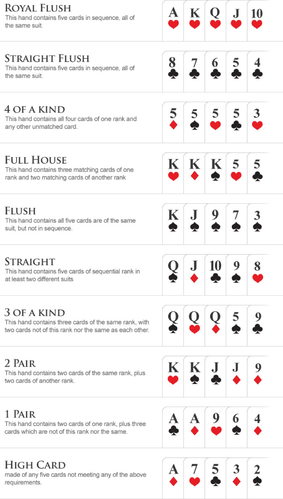
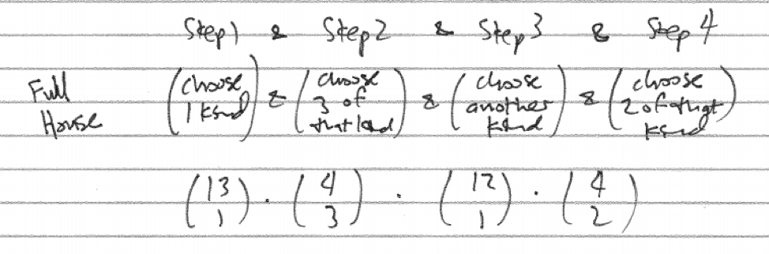
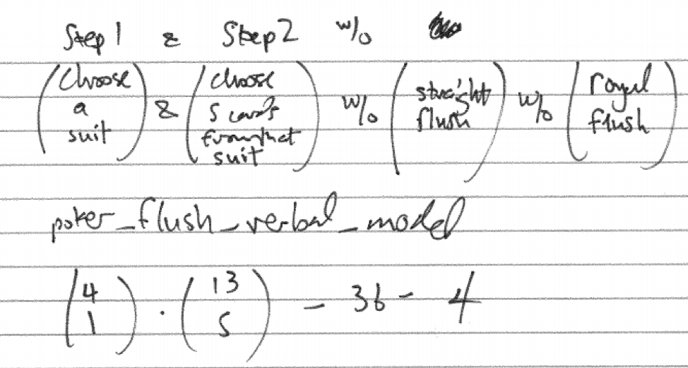
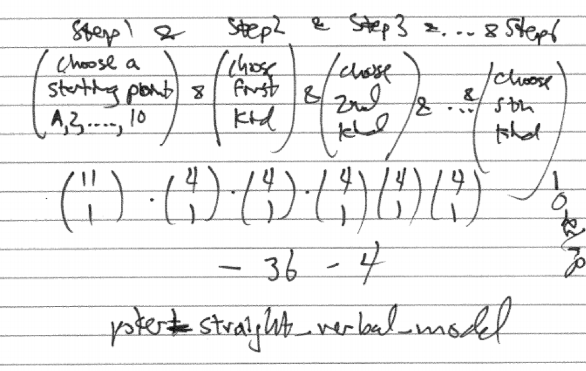
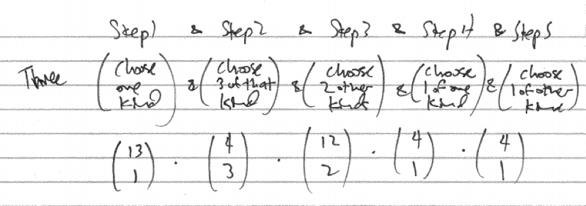
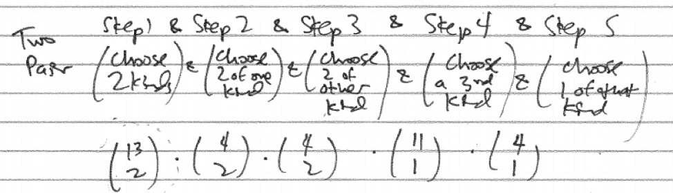
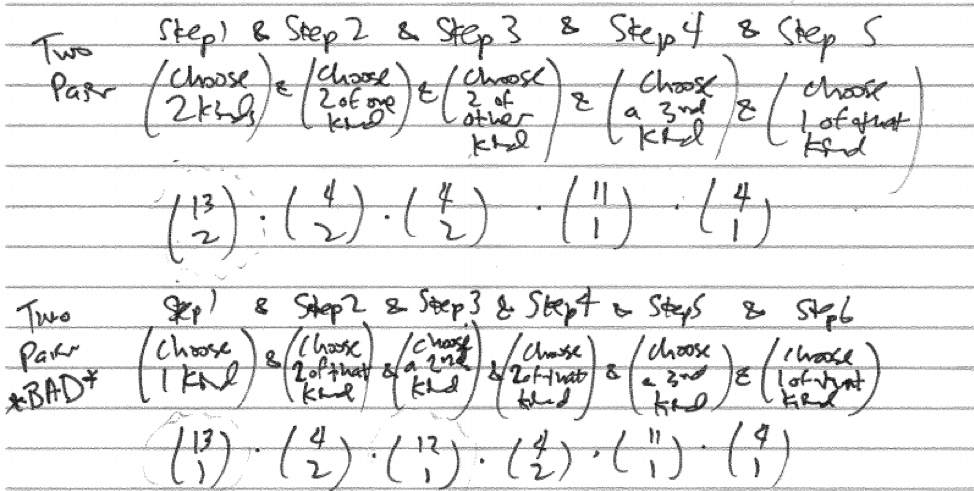
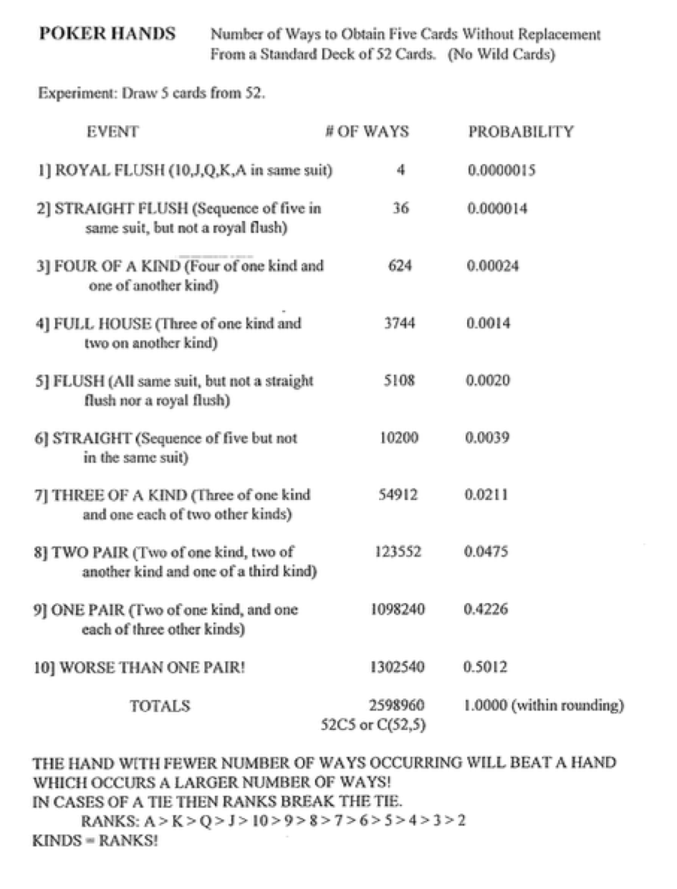

# Case Study - Poker {#case_study_poker}

```{r, message=FALSE, warning=FALSE, echo=FALSE}
library(mosaic)
set.seed(2018)
```

## Introduction {#introduction}

Poker has hit the big time with millions of players worldwide and even a World Series of Poker with professional players. There are many variations of the game with Texas Hold'em currently being the most popular but virtually all of them are ultimately decided by whoever holds the strongest five card hand. Since you are playing against other players rather than the house an understanding of human behavior is as important as an understanding of probability. Two key elements of success in poker are money management - knowing when and how much to bet - and bluff - deceptively bet and pretend your hand is stronger than it really is. 

For starters we will use our probability skills to verify the ranking of hands as shown in the diagram below.

```{r nice-fig-1717, fig.cap='Poker Hands Ranked', out.width='70%', fig.asp=.75, fig.align='center', echo=FALSE}

```

Some terminology. A flush is five cards all from the same suit. A straight is five cards in sequence. An ace can be considered as either low or high.

First of all, a standard deck consists of 52 cards with four suits (clubs, diamonds, hearts, and spades) with each suit containing 13 cards (A,2,3,4,5,6,7,8,9,10,J,Q,K). 

The strength of a poker hand does not depend on the order in which the cards were received so the total number of five card hands is $\dbinom{52}{5}=2598960$. We use the `choose(n,k)` command in R to compute $\dbinom{n}{k}$.

```{r}
total <- choose(52,5)
total
```

We can take the poker hands in order and determine how many of each different hand there are and calculate the probability of obtaining such a hand. A key problem-solving tool will be to construct a verbal model of a step-by-step process to obtain such a hand. 

### The Royal Flush

A royal flush is the highest hand possible. It is the 10, J, Q, K, and A all from the same suit. A flush is all the cards from the same suit and the jack, queen, and king are royalty, hence, the name royal flush.

The counting on this one is easy. There are only four such hands, one for clubs, one for diamonds, one for hearts, and one for spades. The probability is

```{r}
prob_royal <- 4/total
prob_royal
```

### Straight Flush

This is left as an exercise.

### Four of a Kind

This is left as an exercise.

### Full House

A full house is three of one kind and two of another. The step-by-step verbal model to construct a full house proceeds but first selecting a kind for the three of a kind and choosing three of that kind, then selecting a second kind and choosing two of that kind.

```{r nice-fig-1718, fig.cap='Full House Step-by-step Verbal Model', out.width='90%', fig.asp=.75, fig.align='center', echo=FALSE}

```

```{r}
count_full_house <- choose(13,1)*choose(4,2)*choose(12,1)*choose(4,2)
count_full_house
prob_full_house <- count_full_house/total
prob_full_house
```

### Flush

A flush is five cards all from the same suit. The step-by-step verbal model to construct a flush proceeds by first selecting a suit and then selecting five cards from that suit. We must then be careful to subtract off the straight flushes as they are actually a stronger hand.

```{r nice-fig-1719, fig.cap='Flush Step-by-step Verbal Model', out.width='90%', fig.asp=.75, fig.align='center', echo=FALSE}

```

```{r}
count_flush <- choose(4,1)*choose(13,5) - 36 - 4
count_flush
prob_flush <- count_flush/total
prob_flush
```

### Straight

To count the number of straights we will count all straights and the subtract the straight  that are also flushes which are considered higher hands. To organize in a step-by-step verbal model, first choose a starting point for the straight. There are ten starting points for the smallest card - A,2,3,4,5,6,7,8,9, or 10. Then choose one of each of the five kinds in the straight. Lastly, we subtract off the straight flushes and royal flushes.

```{r nice-fig-1720, fig.cap='Straight Step-by-step Verbal Model', out.width='90%', fig.asp=.75, fig.align='center', echo=FALSE}

```

```{r}
count_straight <- choose(10,1)*choose(4,1)^5 - 36 - 4
count_straight
prob_straight <- count_straight/total
prob_straight
```


### Three of a Kind

One step-by-step verbal model for three of a kind is to first choose the kind, then choose three of that kind, then choose two other kinds and choose one each of those kinds.

```{r nice-fig-1721, fig.cap='Three of a Kind Verbal Model', out.width='90%', fig.asp=.75, fig.align='center', echo=FALSE}

```

```{r}
count_three <- choose(13,1)*choose(4,3)*choose(12,2)*choose(4,2)*choose(4,2)
count_three
prob_three <- count_three/total
prob_three
```


### Two Pair

Correctly counting the number of two pair hands has a subtlety. It is important to select the two kinds for the two pairs rather than select them sequentially. A correct step-by-step verbal model starts with select two different kinds, then select two of each of these kinds, then select a third kind and select one of this kind.

```{r nice-fig-1722, fig.cap='Two Pair Verbal Model', out.width='90%', fig.asp=.75, fig.align='center', echo=FALSE}

```

```{r}
count_two_pair <- choose(13,2)*choose(4,2)*choose(4,2)*choose(11,1)*choose(4,1)
count_three
prob_two_pair <- count_two_pair/total
prob_two_pair
```

It is worth exploring a seemingly plausible but incorrect step-by-step verbal model. What if to create a two-pair hand we select one kind, then select two of that kind, then select a second kind, then select two of that kind, then select a third kind and select one of that kind.

```{r nice-fig-1723, fig.cap='Two Pair Competing Verbal Models', out.width='90%', fig.asp=.75, fig.align='center', echo=FALSE}

```

If we compare and contrast these two verbal models we see most pieces are the same but the correct model has `choose(13,2)` which equals $\frac{13*12}{2*1}$ while in its place the incorrect model has `choose(13,1)*choose(12,1)` which equals $13*12$. Numerically the second model is twice as big as or original model and so twice as wrong, so to speak. To see what is wrong with it, consider the following concrete examples visualized in the diagram below. They are counted as different hands in the verbal model but are really the same hand. The incorrect model imposes an inappropriate order on the two pairs. 

### One Pair

This is left as an exercise.

### High Card

This is left as an exercise.

### Summary Table

Compiling the results for all the different poker hand we have the following table:

* Hand, Number, Probability, Odds
* Royal Flush
* Straight Flush
* Four of a Kind
* Full House
* Flush
* Straight
* Three of a Kind
* Two Pair
* One Pair
* High Card

```{r nice-fig-1724, fig.cap='Poker Hands Table', out.width='70%', fig.asp=.75, fig.align='center', echo=FALSE}

```


## Exercises {#exercises}

### Exercise - Straight Flush

How many different straight flush hands are there? If you are randomly dealt five cards, what is the probability of obtaining a straight flush? Note, make sure you are not including the royal flush hands in your count.

### Exercise - Four of a Kind

How many different four of a kind hands are there? If you are randomly dealt five cards, what is the probability of obtaining four of a kind?

### Exercise - One Pair

How many different one pair hands are there? If you are randomly dealt five cards, what is the probability of obtaining a one pair hand?

### Exercise - High Card

How many different high card hands are there? If you are randomly dealt five cards, what is the probability of obtaining nothing better than a high card hand? (Hint: Since all the other kinds of hands have been analyzed, the complement principle is one effective approach to counting this last hand type.)

### Exercise - Spot the Error

Consider this flawed step-by-step verbal model for a three of a kind hand. First choose one kind and then three of that kind, then choose a second kind and choose one of that kind, then choose a third kind and choose one of that kind. What is the subtle flaw in this step-by-step verbal model?
