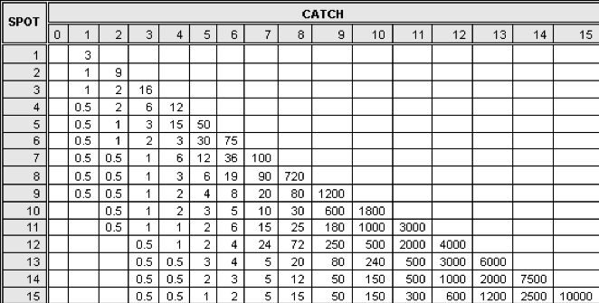

# Case Study - Keno {#case_study_keno}

In Keno, a player pays $1 and chooses some numbers between 1 and 80 by marking them on a Keno card.

```{r nice-fig-1715, fig.cap='Keno Card', out.width='70%', fig.asp=.75, fig.align='center', echo=FALSE}

```

Then the computer randomly selects 20 numbers.  Depending on how many of the player’s numbers match (“catch”) the chosen numbers, they win different amounts of money as shown in the payoff table below. 

```{r nice-fig-1716, fig.cap='Keno Payouts', out.width='90%', fig.asp=.75, fig.align='center', echo=FALSE}

```

## Analyzing a One-spot Keno Ticket {#analyzing_a_onespot_keno_ticket}

For example, on a one-spot ticket, the player pays $\$1$ and marks one number and if it is among the 20 selected by the computer, the player wins $\$3$ for a net win of $+\$2$. Keno probabilities can be found using the hypergeometric model with m=20 good numbers, n=60 bad numbers, with k=1 selected and x is the number of good ones selected.  The expected value of the winnings, X, is the sum of the payoffs times the probabilities. 

$$E(X) = -1 \cdot P(catch \ 0) + 2 \cdot P(catch \ 1)=-1 \cdot \frac{60}{80} + 2 \cdot \frac{20}{80}=-\frac{20}{80}=-0.25$$

Not such a great game from the player's vantage point as they lose on average a quarter per dollar bet for a $25\%$ house advantage.

We can use the R code below to find the expected value for a $\$1$ one-spot ticket by first creating a vector of the hypergeometric probabilities and a vector of the amounts won/lost. 

```{r}
probs_one_spot <- dhyper(x=0:1, m=20, n=60, k=1)
amounts_one_spot <- c(-1,2)
distribution_one_spot <- data.frame(probs_one_spot, amounts_one_spot)
distribution_one_spot
```

We can calculate the mean expected value by deterimining the sum of the amounts multiplied by the probs.

```{r}
expectation_one_spot <- sum(amounts_one_spot*probs_one_spot)
expectation_one_spot
```

## Analyzing a Two-spot Keno Ticket {#analyzing_a_twospot_keno_ticket}

Suppose a player buys a $\$1$ ticket marking two spots. If they catch 0 spots they lose $\$1$, if they catch one spot the get their dollar back and break even, and if they catch two spots they get $\$9$ back for a net profit of $\$8$. Determining the expected value of the winnings, X, by hand using the hypergeometric probability distribution we see

$$E(X) = -1 \cdot \frac{\dbinom{20}{0}\dbinom{60}{2}}{\dbinom{80}{2}} + 0 \cdot \frac{\dbinom{20}{1}\dbinom{60}{1}}{\dbinom{80}{2}} + 8 \cdot \frac{\dbinom{20}{2}\dbinom{60}{0}}{\dbinom{80}{2}}= \\ 
-1 \cdot 0.560 + 0 \cdot 0.380 + 8 \cdot 0.060 = -0.079 $$

With R code:

```{r}
probs_two_spot <- dhyper(x=0:2, m=20, n=60, k=2)
amounts_two_spot <- c(-1,0,8)
distribution_two_spot <- data.frame(probs_two_spot, amounts_two_spot)
distribution_two_spot
```

We calculate the mean expected value.

```{r}
expectation_two_spot <- sum(amounts_two_spot*probs_two_spot)
expectation_two_spot
```

The two-spot ticket has a much better expected value than a one-spot ticket.


## Exercises {#exercises}

### Exercise - Analyzing a Three-spot and Four-spot Keno Tickets

Find the expected value for a three-spot Keno ticket and a four-spot Keno ticket and make comparisons about which is more advantageous (or, rather, less disadvantageous) for the player.

### Exercise - Changing Perspectives

Suppose a player has marked an 5-spot Keno ticket. In the analysis above, we consider the m=20 good numbers and n=60 bad numbers and k=5 numbers selected with x representing the numbers we catch and use this hypergeometric model. For example,

$$P(catch \ 3) = \frac{\dbinom{20}{3}\dbinom{60}{2}}{\dbinom{80}{8}}=0.084$$

An alternative approach is to consider that we have m=5 good ones that we've selected and n=75 bad ones we haven't selected and then the computer chooses k=20 with x representing the number of good ones selected. Thus,

$$P(catch \ 3) = \frac{\dbinom{5}{3}\dbinom{75}{17}}{\dbinom{80}{20}}=0.084$$

For a 5-spot ticket show the probabilities of catching 0, catching 1, and catching 2 using both techniques and confirm they yield the same answers.

### Exercise (Group Project) - Complete Analysis of Keno

As a group project, find the expected values for a one-spot ticket, a two-spot ticket, and so on all the way through a 15-spot ticket and identify which bet has the worst expected value or the player and which has the best expected value.

