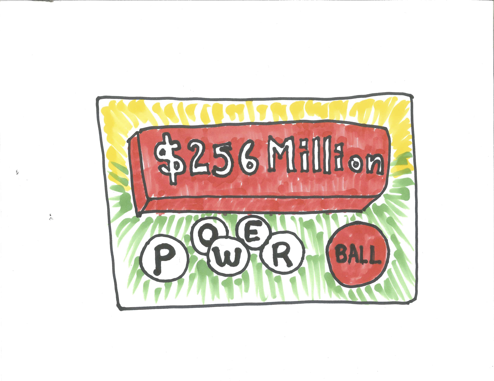
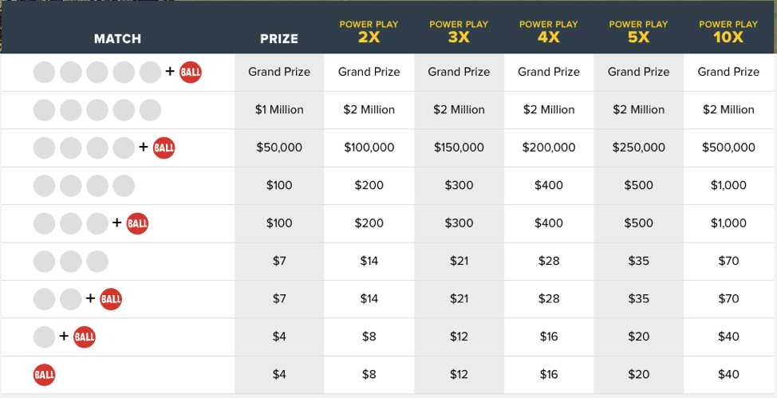

# Case Study - Powerball Lottery {#case_study_powerball_lottery}

```{r, message=FALSE, warning=FALSE, echo=FALSE}
library(mosaic)
set.seed(2018)
```

```{r nice-fig-1734, fig.cap='Powerball Logo', out.width='80%', fig.asp=.75, fig.align='center', echo=FALSE}

```

## Introduction {#introduction}

The Powerball Lottery is a multi-state lottery held twice a week. Most states participate (except Alabama, Alaska, Hawaii, Louisiana, Nevada, and Utah). A ticket costs two dollars. The player selects five different numbers from 1 to 69 for the white balls and one number from 1 to 26 for the red Powerball. If your five numbers match the five winning numbers and your Powerball matches the winning Powerball, then you can buy everything you want. The Powerball selected can be the same as one of the white balls selected. There are nine ways to win as shown in the graphic below.

```{r nice-fig-1735, fig.cap='Ways to Win Powerball', out.width='100%', fig.asp=.75, fig.align='center', echo=FALSE}

```

## Ways to Win Powerball {#ways_to_win_powerball}

To determine the probability of being a winner we need to determine how many different Powerball combinations there are. We create a step-by-step verbal model by first choosing five numbers from 69 and then choosing one number from 26.

$$Total = \dbinom{69}{5} \cdot \dbinom{26}{1}=292201338$$

There is only one Grand Prize winning combination so the probability of winning is 

$$P(Grand Prize)=\frac{1}{\dbinom{69}{5} \cdot \dbinom{26}{1}}=\frac{1}{292201338}=0.000000003422298$$

There are other winning combinations.

### Winning Powerball with Five White 

A step-by-step verbal model to win with five white balls is to first choose all five of the five winning white balls and then to choose one one the non-winning 25 Powerballs.

$$P(\text{Five White Balls})=\frac{\dbinom{5}{5} \cdot \dbinom{25}{1}}{292201338}=0.00000008555745$$

### Winning Powerball with Four White + Powerball

A step-by-step verbal model to win with four white balls plus the Powerball is to first choose four of the five winning white balls, then choose one of the 64 non-winning white balls and then to choose the one right Powerballs.

$$P(\text{Four White Balls + Powerball})=\frac{\dbinom{5}{4} \cdot \dbinom{64}{1} \cdot \dbinom{1}{1}}{292201338}=0.000001095135$$

### Winning Powerball with Four White

A step-by-step verbal model to win with four white balls is to first choose four of the five winning white balls, then choose one of the 64 non-winning white balls and then to choose one of the 25 non-winning Powerballs.

$$P(\text{Four White Balls})=\frac{\dbinom{5}{4} \cdot \dbinom{64}{1} \cdot \dbinom{25}{1}}{292201338}=0.00002737838$$

### Winning Powerball with Three White + Powerball

Left as an exercise.

### Winning Powerball with Three White

Left as an exercise.

### Winning Powerball with Two White + Powerball

Left as an exercise.

### Winning Powerball with One White + Powerball

Left as an exercise.

### Winning Powerball with Powerball Only

There is one winning Powerball number out of 26 total so your chance of getting the Powerball right is $1/26$ but to get the Powerball only you must have losers for all five white. The step-by-step verbal model is to first choose all five white numbers wrong and then choose the Powerball number right.

$$P(\text{Powerball Only})=\frac{\dbinom{64}{5} \cdot 1}{292201338}=0.02609335$$

## The Expected Value of Powerball

To find the expected value for the winnings, X, on a $\$2$ Powerball ticket we need to find the weighted average of the different payoffs weighted by their probabilities. We will assume the Grand Prize is $\$40$ million which is the minimum. We need a vector of the different winning amounts.

```{r}
winnings <- c(-2,2,2,5,5,98,98,49998, 999998, 39999998)
```

Although some of the above probabilities are left as exercises we include their answers in the function below to compute the probability of matching m=0,1,2,3,4,5 white balls and n=0,1 powerballs.

```{r}
powerball_prob <- function(m,n) {
  choose(5,m)*choose(64,5-m)*choose(25,1-n)/(choose(69,5)*26)
}
probs <- c(powerball_prob(0,0), powerball_prob(0,1), powerball_prob(1,1), powerball_prob(2,1), powerball_prob(3,0), powerball_prob(3,1), powerball_prob(4,0), powerball_prob(4,1), powerball_prob(5,0), powerball_prob(5,1))
```

The expectation is the sum of the winnings multiplied by the probabilities.

```{r}
expectation_powerball <- sum(winnings*probs)
expectation_powerball
```

How does this look? Good investment? Maybe the most likely payoff is a psychological one.

## Looking for a Winner {#looking_for_a_winner}

As we have seen, the probability that a Powerball ticket wins the Grand Prize is $\frac{1}{292201338}$ and the probability of not winning is $\frac{292201337}{292201338}$. Only 1 in almost 300 million tickets is the Grand Prize winner. How many tickets must be sold for there to be a good chance of there being a winner? This is like an urn model where there are almost 300 million balls and only one of them is the winner.

If each ticket was unique the situation would match drawing balls from the urn without replacement and the answer would be straight forward. After about 150 million balls are drawn, the probability the winning combination was drawn would be about 0.50.

But each individual independently chooses their own ticket so the situation matches more closely drawing from the urn with replacement. Because there could be multiple winners, to find the probability of at least one winner, the complement principle is needed.

$$P(\text{at least one winner})=1-P(\text{no winners})$$

What if 1 million people buy tickets?

$$P(\text{at least one winner})=1-P(\text{no winners})=1-(\frac{292201337}{292201338})^{1000000}=0.003416$$

What if 10 million people buy tickets?

$$P(\text{at least one winner})=1-P(\text{no winners})=1-(\frac{292201337}{292201338})^{10000000}=0.033644$$

What if 100 million people buy tickets?

$$P(\text{at least one winner})=1-P(\text{no winners})=1-(\frac{292201337}{292201338})^{100000000}=0.289815$$

Now, it's getting hot. There is a good chance someone might win.

We could turn this formula around using algebra. In general, the probability of a winner with n tickets sold is 

$$P(\text{at least one winner})=1-P(\text{no winners})=1-(\frac{292201337}{292201338})^{n}$$

Letting `p` represent the probability of at least one winner and solving for n, 

$$n=\frac{log(1-p)}{log(\frac{292201337}{292201338})}$$

We can create a function to find n for a desired value of p. The `ceiling` function rounds the decimal up to the next whole number.

```{r}
inverse_powerball <- function(p){
  if (p<0 | p>1) stop("p must be between 0 and 1")
  ceiling(log(1-p)/log(292201337/292201338))
}
```

How many tickets need to be sold for there to be a $10\%$ chance of a winner?

```{r}
inverse_powerball(0.1)
```

How many tickets need to be sold for there to be a $50\%$ chance of a winner?

```{r}
inverse_powerball(0.5)
```

Over 200 million tickets need to be sold for there to be a $50\%$ chance of someone winning the Grand Prize.

## Exercises {#exercises}

### Exercise - Ways to Win Powerball

Find the probability of winning Powerball in each of the following ways.
(a) Win with Three White Balls + Powerball
(b) Win with Three White Balls
(c) Win with Two White Balls + Powerball
(d) Win with Two White Balls

### Exercise - Can I Get a Winner?

How many people need to buy tickets for the probability of a winner to be at least 0.90?

### Exercise - Today: 522 Million Dollar Jackpot

As reported on NBC Evening News with Lester Holt on July 24, 2018, the Powerball jackpot topped $\$522$ million. What is the expected value of a $\$2$ ticket?

### Exercise - Think Positive Expectation

How big would the Grand Prize need to be in order for the expected value to turn positive? (Ignore the possibility that there is more than one winner.) Would this mean that spending a chunk of your money on Powerball is a good investment? Explain.

### Exercise - Thinking about Dependencies

When finding the probability of at least one winner if n tickets were sold we assumed that each individual independently chooses their own ticket. If this was not the case and there were patterns in the selection of tickets where some patterns were more likely to be chosen than others, would this increase or decrease the probability of at least one winner if n tickets were sold? Explain.
