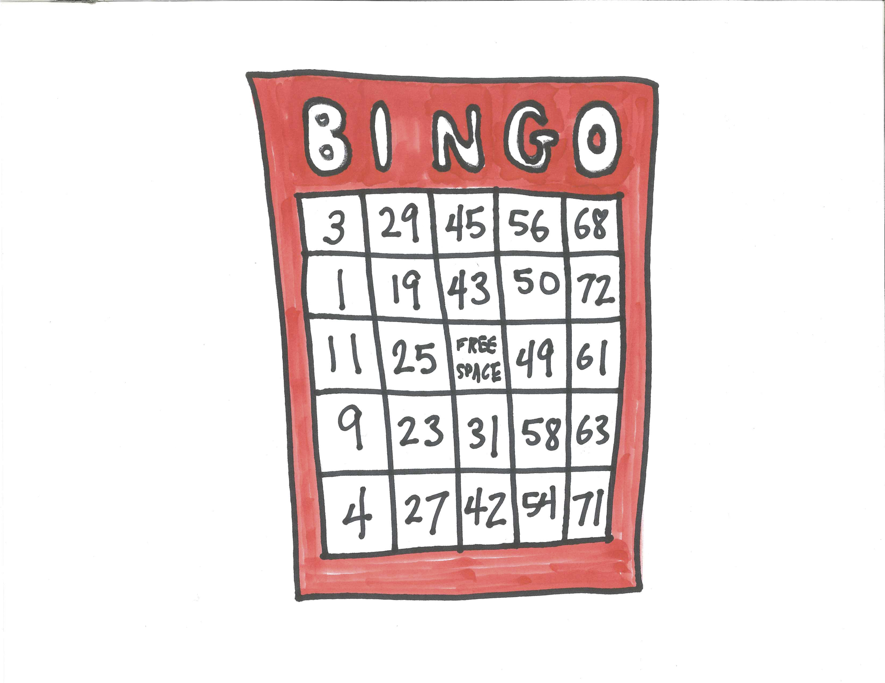
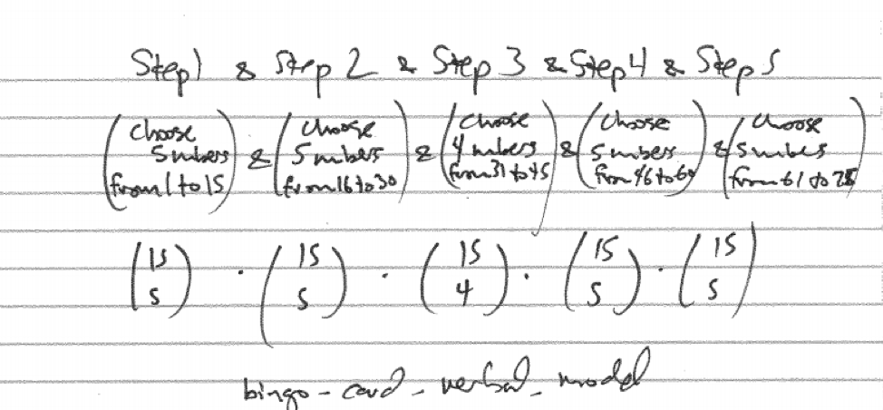
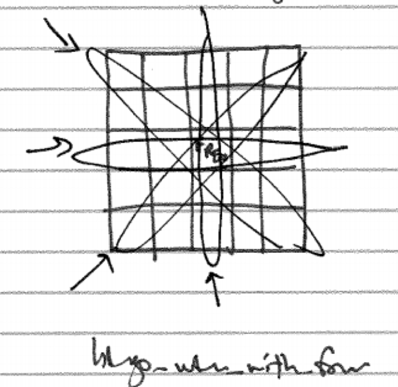
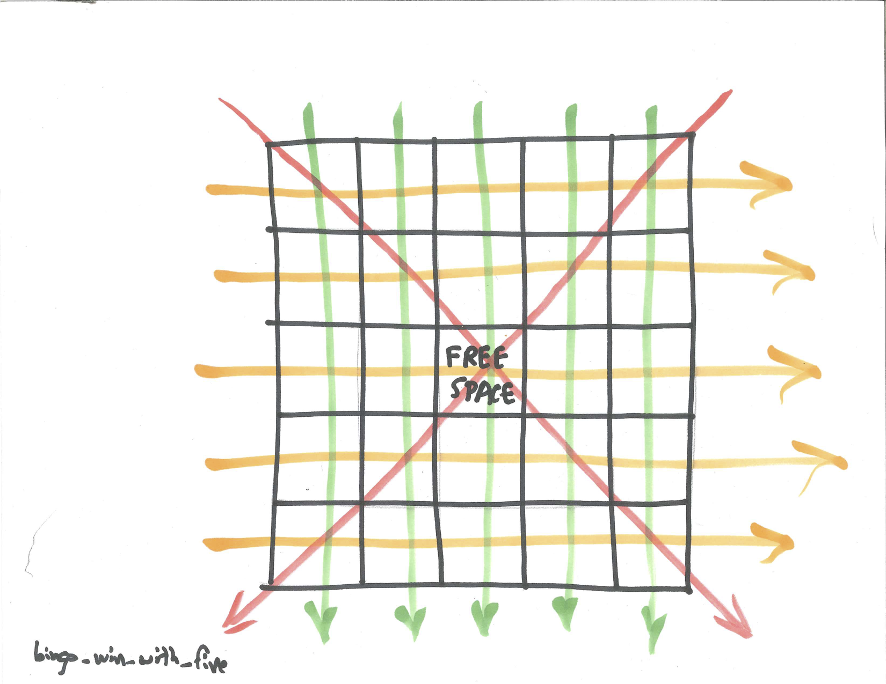
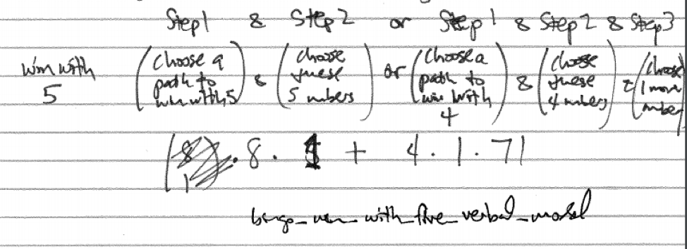
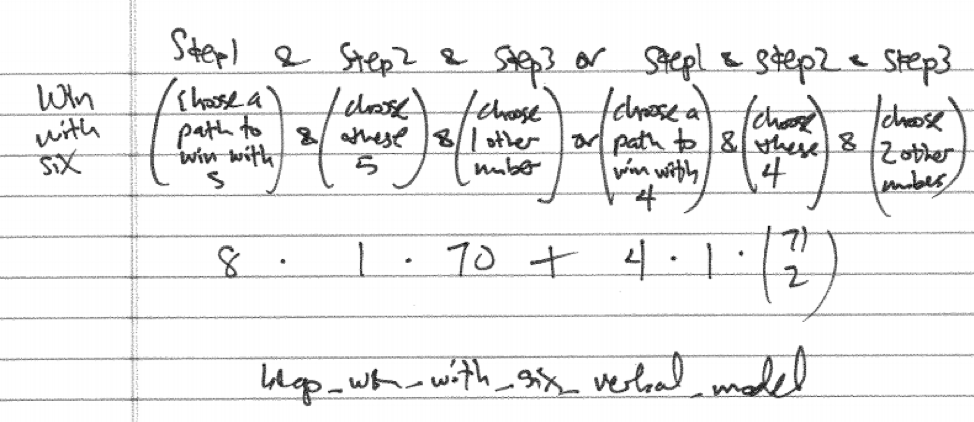
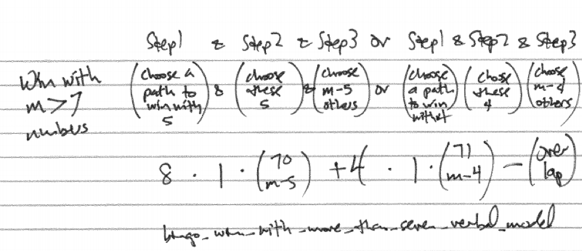
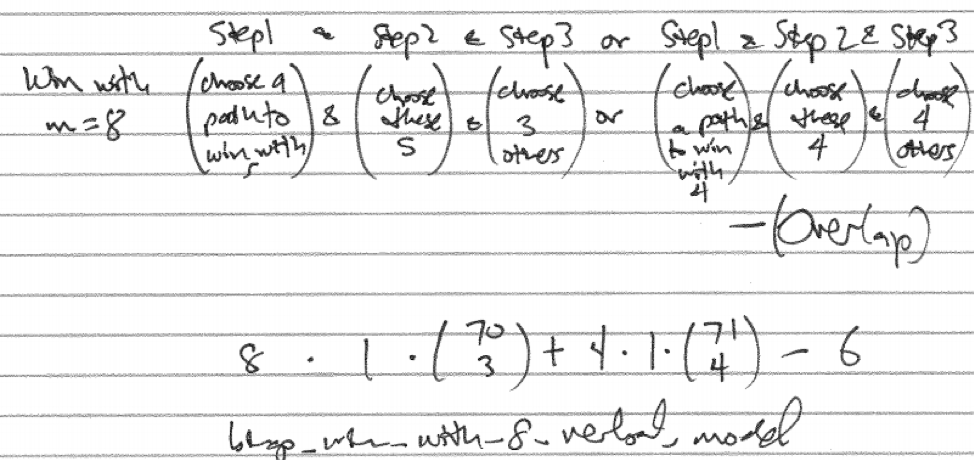
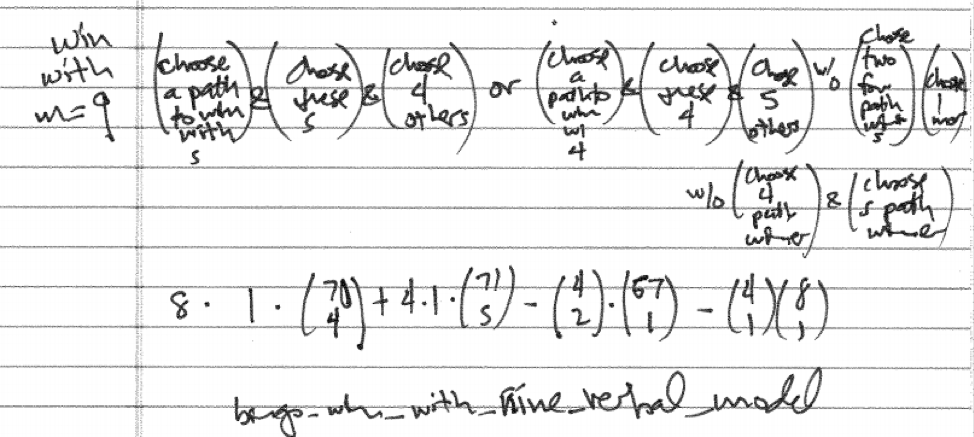

# Case Study - BINGO {#case_study_bingo}

```{r, message=FALSE, warning=FALSE, echo=FALSE}
library(mosaic)
set.seed(2018)
```

## Chapter Scenario - BINGO on the Fun Bus {#chapter_scenario_bingo_on_the_fun_bus}

If the Fun Bus to Wendover is a double-decker and full there will be around 100 full seats. On the way over, to pass the time, the hostess calls a few Bingo games and the winner gets $\$1$ plus a candy bar. Of course, you have a $1/100$ chance of being a winner but how long is a Bingo game likely to go on before there is a winner. Specifically, if there are 100 players playing a regular Bingo game, how many numbers must be called for there to be a greater than $50\%$ chance of a winner? Think about it and make an estimate.

## Bingo Basics {#bingo_basics}

You all know BINGO.  Get five in a row up, down, or diagonally and win. Variations of BINGO include Blackout (completely fill your card), wedding cake (completely fill top, middle, and bottom row) T (make a T shape), Z (you can figure this one out), and getting all four corners.  Bingo cards look like this:

```{r nice-fig-1725, fig.cap='BINGO Card', out.width='80%', fig.asp=.75, fig.align='center', echo=FALSE}

```

BINGO is a social game and a good BINGO caller has a few choice bits to spice up calling the game. For example, "The tumor was B9." But enough of that; we are interested in the probabilities of winning.

First of all, how many cards are there? Cards consist of five columns each matching with either B, I, N, G, or O. Each column has five different numbers printed in order of size from top to bottom except the middle column which only has four numbers and a FREE spot in the middle. The B column contains five different numbers from 1 to 15, the I column five different numbers from 16  to 30, the N column a free spot and four different numbers from 31 to 45, the G column five different numbers from 46 to 60, and the O column five different numbers from 61 to 75.

```{r nice-fig-1726, fig.cap='BINGO Card Verbals Model', out.width='90%', fig.asp=.75, fig.align='center', echo=FALSE}

```

This is a big number. We can use R to compute.

```{r}
bingo_total <- choose(15,5)^4*choose(15,4)
bingo_total
```

## Winning Bingo with m Numbers Called {#winning_bingo_with_m_numbers_called}

Suppose you have nothing better to do and are playing BINGO. What is the probability you will win after just four numbers have been drawns. With 75 numbers there are a total of $\dbinom{74}{4}$ ways that four numbers could be drawn but only four sets of four numbers are winners for you as shown. 

```{r nice-fig-1727, fig.cap='BINGO Win with Four Numbers Drawn', out.width='80%', fig.asp=.75, fig.align='center', echo=FALSE}

```

So not very likely.

```{r}
prob_win_4 <- 4/choose(75,4)
prob_win_4
```

What about the chance you will win after five numbers are called? There are a total of $\dbinom{75}{5}$ ways that five numbers can be drawn and there are now 12 ways to win as shown. 

```{r nice-fig-1728, fig.cap='BINGO Win with Five Numbers Drawn', out.width='80%', fig.asp=.75, fig.align='center', echo=FALSE}

```

Winning is more complicated as shown in the verbal model. 

```{r nice-fig-1729, fig.cap='Verbal Model for BINGO Win with Five Numbers', out.width='90%', fig.asp=.75, fig.align='center', echo=FALSE}

```

There are eight ways to win with all five numbers. There are four ways to win with four of these numbers with a fifth number that can be any of the other 71 possibilities. 

```{r}
prob_win_5 <- (8*1+4*1*71)/choose(75,5)
prob_win_5
```

Highly dubitable!

What is the probability of winning with six numbers? Six numbers can be selected a total of $\dbinom{75}{6}$. Again, there are eight ways to win with five numbers and the sixth number can be any of the other 70 possibilities. There are four ways to win with four numbers and the other two numbers can be any of the other 71 possibilities. See the verbal model below.

```{r nice-fig-1730, fig.cap='Verbal Model for BINGO Win with Six Numbers', out.width='90%', fig.asp=.75, fig.align='center', echo=FALSE}

```

Computing this:

```{r}
prob_win_6 <- (8*1*70+4*1*choose(71,2))/choose(75,6)
prob_win_6
```

We can modify this approach to find the probability of winning after seven numbers are drawn and we leave this as an exercise. 

Then it gets trickier once we get above seven numbers as there is the possibility of winning in multiple ways at the same time so we need to be concerned about double-counting and subtract off any overlap. A verbal model that partially captures this idea is below though it is vague about the overlap. Suppose that $m$ numbers have been called and we want to find the probability of winning.

```{r nice-fig-1731, fig.cap='Verbal Model for BINGO Win with More than Seven Numbers', out.width='90%', fig.asp=.75, fig.align='center', echo=FALSE}

```

We can apply this verbal model in the case of eight numbers being called. With eight numbers called the only overlap is if two different four number Bingos are completed. Since there are four different four number Bingo paths, there are $\dbinom{4}{2}=6$ ways that two of them could be completed. 

```{r nice-fig-1732, fig.cap='Verbal Model for BINGO Win with Eight Numbers', out.width='90%', fig.asp=.75, fig.align='center', echo=FALSE}

```

Computing the total minus the overlap

$$8 \cdot 1 \cdot \dbinom{70}{3}+4 \cdot 1 \cdot \dbinom{71}{4} - \dbinom{4}{2}$$

Computing this in R.

```{r}
prob_win_8 <- (8*1*choose(70,3)+4*1*choose(71,4)-choose(4,2))/choose(75,8)
prob_win_8
```

Dealing with the overlap gets trickier still as the numbers called increases. For example, with 9 numbers called there could be an overlap of two four number paths or a four number path and a five number path. Here is the verbal model for getting a BINGO with 9 numbers called. 

```{r nice-fig-1733, fig.cap='Verbal Model for BINGO Win with Nine Numbers', out.width='90%', fig.asp=.75, fig.align='center', echo=FALSE}

```

Computationally, 

```{r}
prob_win_9 <- (8*1*choose(70,4)+4*1*choose(71,5)-choose(4,2)*67-4*8)/choose(75,9)
prob_win_9
```

The overlap gets worse later on. With 12 numbers called there could be an overlap of two four number paths, two five number paths, a four number path and a five number path but we have overcounted because there is also the chance of three four number BINGO paths happening.

## Chapter Scenario Revisited - BINGO on the Fun Bus {#chapter_scenario_revisited_bingo_on_the_fun_bus}

Recall, we are on the Fun Bus to Wendover and 100 people are playing regular BINGO and we want to know how many numbers must be called for there to be a greater than $50\%$ chance of a winner.

The question we consider is the probability of there being a BINGO winner if m numbers have been called and we have 100 players. Let's deal with a specific case first fixing it at 8 called numbers.

As we determined above, the probability of a BINGO winner with 8 or 9 numbers is quite small. If we have 100 players, then the number of BINGO winners after m numbers are called is a binomial random variable with $n=100$ trials and probability of success we have computed. To find the probability of at least one BINGO winner we use the complement principle to find $P(\text{at least one winner})=1-P(\text{no winners})$. Letting X represent the number of winners we know $P(X \geq 1)=1-P(X=0)$. 

With $n=100$ people playing then the chance of a BINGO after 8 numbers are called can easily be computed.

```{r}
prob_win_8 <- 1 - dbinom(0, size=100, prob=prob_win_8) 
prob_win_8
```

A probability of a winner with 100 people playing and 8 numbers called is `r prob_win_8` and happens about 1 every 40 times.

We can compute the same values with 9 numbers called:

```{r}
prob_win_9 <- 1 - dbinom(0, size=100, prob=prob_win_9)
prob_win_9
```

The probability of a winner with $n=100$ people with $m=9$ numbers called jumps to `r prob_win_9` nearly doubling with this additional number.

We need to consider having a couple more numbers drawn and try it again. The cases are more involved but here are the probabilities of getting a BINGO after 10, 11, 12, and 13 numbers are called.

```{r}
prob_win_10 <- (8*1*choose(70,5)+4*1*choose(71,6)-choose(4,2)*choose(67,2)-choose(8,2)-4*8*66)/choose(75,10)
prob_win_11 <- (8*1*choose(70,6)+4*1*choose(71,7)-choose(4,2)*choose(67,3)-choose(8,2)*choose(65,1)-4*8*choose(66,2))/choose(75,11)
prob_win_12 <- (8*1*choose(70,7)+4*1*choose(71,8)-choose(4,2)*choose(67,4)-choose(8,2)*choose(65,2)-4*8*choose(66,3)+choose(4,3))/choose(75,12)
prob_win_13 <- (8*1*choose(70,8)+4*1*choose(71,9)-choose(4,2)*choose(67,5)-choose(8,2)*choose(65,3)-4*8*choose(66,4)+choose(4,3)*choose(63,1)+choose(4,2)*choose(8,1))/choose(75,13)
```

Determining the chance of a winner with 10, 11, 12. and 13 numbers called for 100 people playing:

```{r}
prob_win_10 <- 1 - dbinom(0, size=100, prob=prob_win_10)
prob_win_10
prob_win_11 <- 1 - dbinom(0, size=100, prob=prob_win_11)
prob_win_11
prob_win_12 <- 1 - dbinom(0, size=100, prob=prob_win_12)
prob_win_12
prob_win_13 <- 1 - dbinom(0, size=100, prob=prob_win_13)
prob_win_13
```

We are getting there. Slowly!

If we ignore the overlap, which is relatively small, we can facilitate the computation by creating a function to estimate the probability of a win with m numbers called.

```{r}
prob_win <- function(m) {
  (8*choose(70,m-5)+4*choose(71,m-4))/choose(75,m)
}
```

Test this out.

```{r}
prob_win(10)
prob_win(11)
prob_win(12)
prob_win(13)
```

These are very close to the true probabilities computed. In addition, we can compute a number of them at once:

```{r}
prob_win(10:13)
```

Let's solve this puppy. Dropping `prob_win(1:20)` into the binomial probability of a winner with 100 people playing we see if we hit the $50\%$ mark:

```{r}
prob_win_vector <- prob_win(1:20)
prob_win_100 <- 1 - dbinom(0, size=100, prob=prob_win_vector)
prob_win_100
```

That's cool. We see that the probability tips over the $50\%$ mark when 16 numbers are called and tips over the $90\%$ mark when 20 numbers are called. Can you just feel the tension in the room building.

## Exercises {#exercises}

### Exercise - Unique BINGO Cards

There are 7.6 billion people on earth and there are more BINGO cards than this so everyone could have their own unique card. In fact, how many unique cards could each person have?

### Exercise - Win with Seven

What is the probability of a BINGO card being a winner after exactly seven numbers are called?

